# 基于 TensorFlow 2.0 的 LSTM 多类文本分类

> 原文：<https://towardsdatascience.com/multi-class-text-classification-with-lstm-using-tensorflow-2-0-d88627c10a35?source=collection_archive---------0----------------------->


## 递归神经网络，长短期记忆

NLP 的许多创新是如何将上下文添加到单词向量中。一种常见的方法是使用[循环神经网络](https://en.wikipedia.org/wiki/Recurrent_neural_network)。以下是[递归神经网络](https://en.wikipedia.org/wiki/Recurrent_neural_network)的概念:

*   他们利用连续的信息。
*   他们有一种记忆，可以捕捉到目前为止已经计算过的内容，也就是说，我上一次讲的内容会影响我接下来要讲的内容。
*   rnn 是文本和语音分析的理想选择。
*   最常用的 rnn 是 LSTMs。

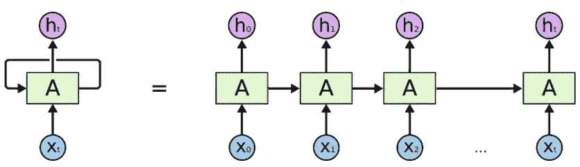

Source: [https://colah.github.io/posts/2015-08-Understanding-LSTMs/](https://colah.github.io/posts/2015-08-Understanding-LSTMs/)

以上是[递归神经网络](https://en.wikipedia.org/wiki/Recurrent_neural_network)的架构。

*   “A”是一层[前馈神经网络](https://en.wikipedia.org/wiki/Feedforward_neural_network)。
*   如果我们只看右边，它确实循环地通过每个序列的元素。
*   如果我们打开左边，它看起来会和右边一模一样。

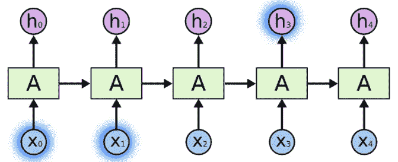

Source: [https://colah.github.io/posts/2015-08-Understanding-LSTMs](https://colah.github.io/posts/2015-08-Understanding-LSTMs/)

假设我们正在解决一个新闻文章数据集的文档分类问题。

*   我们输入每个单词，单词在某些方面相互关联。
*   当我们看到文章中的所有单词时，我们在文章的结尾进行预测。
*   rnn 通过从最后一个输出传递输入，能够保留信息，并能够在最后利用所有信息进行预测。


[https://colah.github.io/posts/2015-08-Understanding-LSTMs](https://colah.github.io/posts/2015-08-Understanding-LSTMs/)

*   这对短句很有效，当我们处理一篇长文章时，会有一个长期依赖的问题。

因此，我们一般不使用普通的 RNNs，而是使用[长短期记忆](https://en.wikipedia.org/wiki/Long_short-term_memory)。LSTM 是一种可以解决这种长期依赖问题的 RNNs。

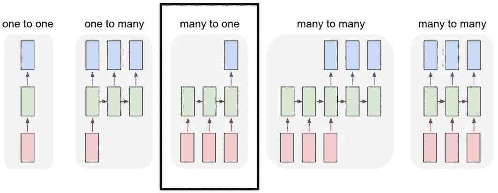

在我们的新闻文章文档分类示例中，我们有这种多对一的关系。输入是单词序列，输出是一个单独的类或标签。

现在，我们将使用[tensor flow 2.0](https://blog.tensorflow.org/2019/09/tensorflow-20-is-now-available.html)&[Keras](https://keras.io/)解决 LSTM 的 BBC 新闻文档分类问题。数据集可以在这里找到[。](https://raw.githubusercontent.com/susanli2016/PyCon-Canada-2019-NLP-Tutorial/master/bbc-text.csv)

*   首先，我们导入库并确保 TensorFlow 是正确的版本。

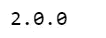

*   像这样把超参数放在顶部，这样更容易修改和编辑。
*   当我们到达那里时，我们将解释每个超参数是如何工作的。

hyperparameter.py

*   定义两个包含文章和标签的列表。同时，我们删除停用词。

articles_labels.py

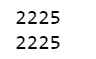

数据中有 2，225 篇新闻文章，我们把它们分成训练集和验证集，根据我们之前设置的参数，80%用于训练，20%用于验证。

train_valid.py

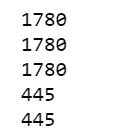

Tokenizer 为我们做了所有繁重的工作。在我们的文章中，它是令牌化的，它将需要 5000 个最常见的单词。`oov_token`就是遇到看不见的词的时候放一个特殊值进去。这意味着我们希望`<OOV>`用于不在`word_index`中的单词。`fit_on_text`将遍历所有文本并创建如下词典:

tokenize.py

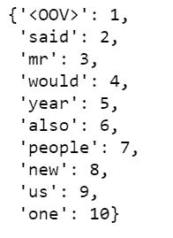

我们可以看到“<oov>”是我们语料库中最常见的标记，其次是“said”，再其次是“mr”等等。</oov>

在标记化之后，下一步是将这些标记转换成序列列表。下面是训练数据中已经变成序列的第 11 条。

```
train_sequences = tokenizer.texts_to_sequences(train_articles)
print(train_sequences[10])
```

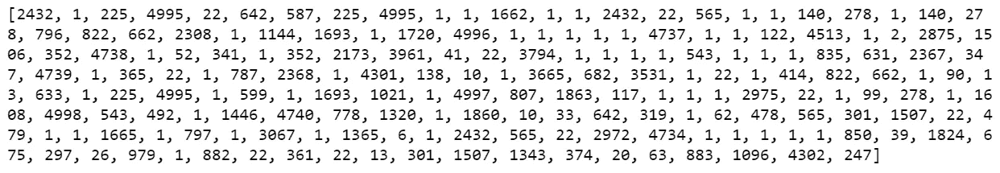

Figure 1

当我们为 NLP 训练神经网络时，我们需要序列大小相同，这就是为什么我们使用填充。如果你向上看，我们的`max_length`是 200，所以我们使用`pad_sequences`使我们所有的文章长度相同，都是 200。结果，你会看到第一篇文章的长度是 426，变成了 200，第二篇文章的长度是 192，变成了 200，依此类推。

```
train_padded = pad_sequences(train_sequences, maxlen=max_length, padding=padding_type, truncating=trunc_type)print(len(train_sequences[0]))
print(len(train_padded[0]))

print(len(train_sequences[1]))
print(len(train_padded[1]))

print(len(train_sequences[10]))
print(len(train_padded[10]))
```

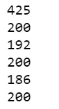

另外，还有`padding_type`和`truncating_type`，都是`post`，意思是比如第 11 条，长度是 186，我们填充到 200，我们填充到最后，也就是加了 14 个零。

```
print(train_padded[10])
```

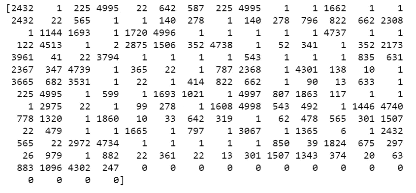

Figure 2

对于第一篇文章，它的长度是 426，我们将其截断为 200，并且我们在结尾也进行了截断。

然后我们对验证序列做同样的事情。

val_tok.py

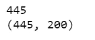

现在我们来看看标签。因为我们的标签是文本，所以我们将对它们进行标记，在训练时，标签应该是 numpy 数组。因此，我们将把标签列表转换成 numpy 数组，如下所示:

```
label_tokenizer = Tokenizer()
label_tokenizer.fit_on_texts(labels)

training_label_seq = np.array(label_tokenizer.texts_to_sequences(train_labels))
validation_label_seq = np.array(label_tokenizer.texts_to_sequences(validation_labels))print(training_label_seq[0])
print(training_label_seq[1])
print(training_label_seq[2])
print(training_label_seq.shape)

print(validation_label_seq[0])
print(validation_label_seq[1])
print(validation_label_seq[2])
print(validation_label_seq.shape)
```


在训练深度神经网络之前，我们要探索自己的原始文章和填充后的文章是什么样子的。运行下面的代码，我们浏览第 11 篇文章，我们可以看到一些单词变成了“<oov>”，因为它们没有进入前 5000 名。</oov>

```
reverse_word_index = dict([(value, key) **for** (key, value) **in** word_index.items()])

**def** decode_article(text):
    **return** ' '.join([reverse_word_index.get(i, '?') **for** i **in** text])
print(decode_article(train_padded[10]))
print('---')
print(train_articles[10])
```


Figure 3

现在是实施 LSTM 的时候了。

*   我们构建一个`tf.keras.Sequential`模型，从嵌入层开始。嵌入层为每个单词存储一个向量。当被调用时，它将单词索引序列转换成向量序列。经过训练，意思相近的单词往往有相似的向量。
*   双向包装器与 LSTM 层一起使用，它通过 LSTM 层向前和向后传播输入，然后连接输出。这有助于 LSTM 了解长期依赖。然后，我们将它与密集的神经网络相匹配，以进行分类。
*   我们用`relu`代替`tahn`函数，因为它们是很好的替代物。
*   我们添加一个有 6 个单位的密集层和`softmax`激活。当我们有多个输出时，`softmax`将输出层转换成一个概率分布。

lstm_model.py

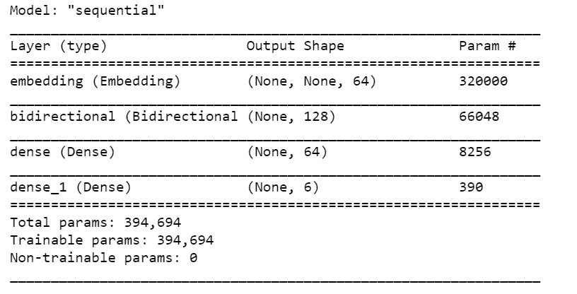

Figure 4

在我们的模型摘要中，我们有我们的嵌入，我们的双向包含 LSTM，后面是两个密集层。双向的输出是 128，因为它是我们在 LSTM 的两倍。我们也可以堆叠 LSTM 层，但我发现结果更糟。

```
print(set(labels))
```

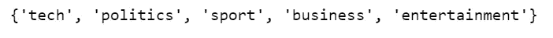

我们总共有 5 个标签，但是因为我们没有一次性编码标签，我们必须使用`sparse_categorical_crossentropy`作为损失函数，它似乎认为 0 也是一个可能的标签，而 tokenizer 对象从整数 1 开始标记，而不是整数 0。结果，最后的密集层需要标签 0、1、2、3、4、5 的输出，尽管 0 从未被使用过。

如果希望最后一个密集层为 5，则需要从训练和验证标签中减去 1。我决定让它保持原样。

我决定训练 10 个纪元，你会看到很多纪元。

```
model.compile(loss='sparse_categorical_crossentropy', optimizer='adam', metrics=['accuracy'])num_epochs = 10
history = model.fit(train_padded, training_label_seq, epochs=num_epochs, validation_data=(validation_padded, validation_label_seq), verbose=2)
```

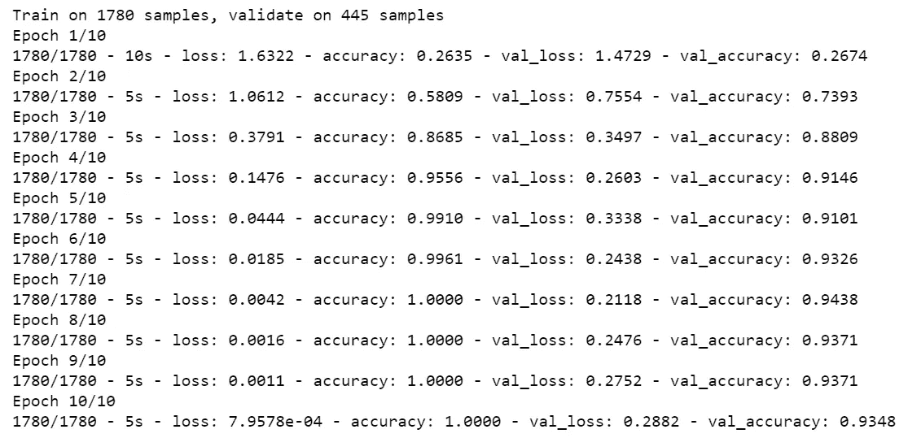

Figure 5

```
def plot_graphs(history, string):
  plt.plot(history.history[string])
  plt.plot(history.history['val_'+string])
  plt.xlabel("Epochs")
  plt.ylabel(string)
  plt.legend([string, 'val_'+string])
  plt.show()

plot_graphs(history, "accuracy")
plot_graphs(history, "loss")
```

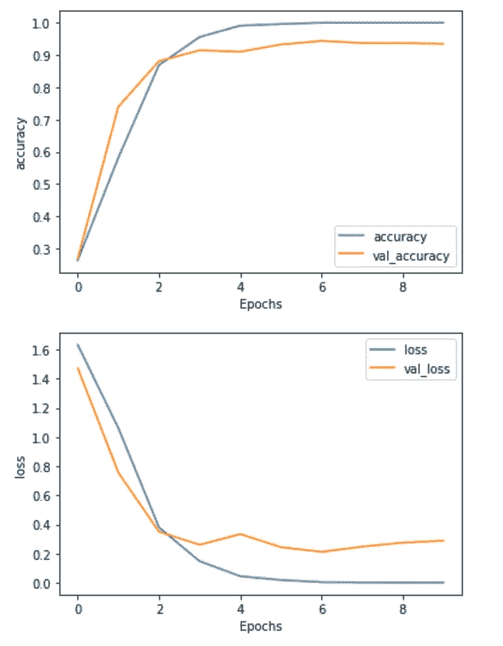

Figure 6

我们可能只需要 3 或 4 个纪元。在训练结束时，我们可以看到有一点点过度适应。

在以后的文章中，我们将致力于改进这个模型。

[Jupyter 笔记本](https://github.com/susanli2016/PyCon-Canada-2019-NLP-Tutorial/blob/master/BBC%20News_LSTM.ipynb)可以在 [Github](https://github.com/susanli2016/PyCon-Canada-2019-NLP-Tutorial/blob/master/BBC%20News_LSTM.ipynb) 上找到。享受余下的周末吧！

参考资料:

[](https://www.coursera.org/learn/natural-language-processing-tensorflow/home/welcome) [## Coursera |顶尖大学的在线课程。免费加入

### 斯坦福和耶鲁等学校的 1000 多门课程——无需申请。培养数据科学方面的职业技能…

www.coursera.org](https://www.coursera.org/learn/natural-language-processing-tensorflow/home/welcome) [](https://learning.oreilly.com/videos/oreilly-strata-data/9781492050681/9781492050681-video327451) [## 纽约州纽约市 2019 年奥莱利地层数据会议

### 选自 2019 年纽约奥莱利地层数据会议[视频]

learning.oreilly.co](https://learning.oreilly.com/videos/oreilly-strata-data/9781492050681/9781492050681-video327451)