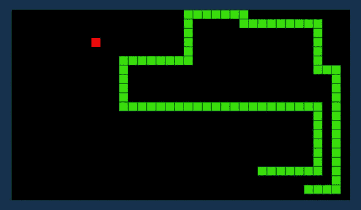
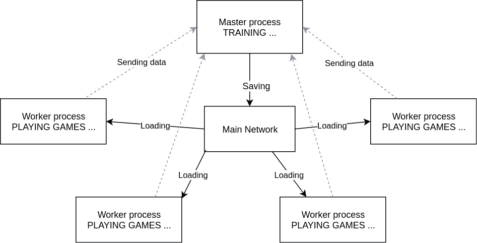

# 采用 Tensorflow 的多 GPU、多进程

> 原文：<https://towardsdatascience.com/multi-gpu-multi-process-with-tensorflow-ba4cc2fe3ab7?source=collection_archive---------13----------------------->

## 如何加快你学习算法的速度

Tensorflow 是一个实验深度学习算法的巨大工具。但是，要利用深度学习的力量，你需要利用它的计算能力和良好的工程技术。您最终将需要使用多个 GPU，甚至可能是多个进程来达到您的目标。推荐你先看看 TensorFlow 关于 GPU 的[官方教程](https://www.tensorflow.org/guide/using_gpu)。

# 一个进程，多个 GPU

这是最常见的情况，因为大多数深度学习社区正在进行监督学习，有一个大数据集(图像、文本、声音……)和许多参数。这也是最困难的一点:您需要在多个计算单元上并行化反向传播。

Jonathan Hui 在 2017 年就此贴了一篇[的优秀文章](https://jhui.github.io/2017/03/07/TensorFlow-GPU/)，大家可以直接看。这不是本文的重点。

# 多个进程，多个 GPU

这才是本文真正的看点。如果你正在进行强化学习，或者“奇特”类型的学习，比如遗传算法或水库计算，你可能会注意到拥有多个过程是必不可少的。

## 实验

我们将尝试以解决贪吃蛇游戏为例。蛇是一串方块，目标是吃格子上的水果。吃一个水果，蛇长增长一，格子上随机出现一个新的水果。蛇(不小心)吃了自己的尾巴就输了。

Snake game, the red dot is the fruit

我们将让多个代理同时进行游戏，以加速学习过程。

## 代理人

我们将使用一个简单的卷积神经网络，但您可以使用任何您想要的模型。例如，我们也可以使用密集神经网络或决策树。

这个博弈不是“动态的”:代理人需要采取的策略只取决于最后一帧。因此，网络被输入最后一帧，在我开发的 python 版本中是一个 10x10 的图像。我使用 100 个 4x4 过滤器，然后是 200 个 3x3 过滤器。我最后展平卷积，添加一个 200 的密集层，最后输出层的长度为 4，用于 4 个可能的动作(上，右，左，下)。

## 学习

我们就不赘述了，因为这不是这里的重点。例如，您可以使用**策略梯度**，其中输出层包含每个动作的概率，算法的思想是根据动作导致的分数“提升”动作。推荐你看[这篇文章](https://medium.com/@jonathan_hui/rl-policy-gradients-explained-9b13b688b146)。

也可以使用 **Q-learning，**其中输出层包含指定状态(输入帧)下每个动作的平均分数，取这些分数的 argmax 来选择一个动作。我推荐你阅读[这篇文章](/how-to-teach-an-ai-to-play-games-deep-reinforcement-learning-28f9b920440a)。

最后，你还可以使用一种**遗传算法**，这种算法的思想是在参数(这里是网络的权重)中加入噪声，只保留最好的代理。推荐你看[这篇文章](https://blog.coast.ai/lets-evolve-a-neural-network-with-a-genetic-algorithm-code-included-8809bece164)。

## **让我们多重处理它**

好了，现在我们可以(终于！)说说多重处理。总的来说，这不是一项容易的任务。这里我不谈论多线程，它更简单，但功能也更弱。

多重处理意味着多核。您需要与您想要启动的进程一样多的内核(有时内核可以处理多个“线程”，所以这是您最终关心的数字)。

我们将使用来自 AWS 的实例 p3.8xlarge，提供 32 个 vCores 和 4 个 V100 显卡。AWS 以大约 12 美元/小时的价格租赁它，而这台设备的投资大约为 4.5 万美元，加上运行它所需的能源成本。

因此，我们可以同时运行 32 个不同的代理，每个代理在一个单独的进程中运行。我们将使用 python 中的“多重处理”包。这个包允许我们启动进程并创建与它们通信的管道。这是我们架构的拓扑结构:

Graph of multiprocessing

我们有 32 个工作进程和 1 个主进程。工作进程只是玩游戏来收集数据并将其发送给主进程，主进程将根据这些数据进行训练，并将新网络保存在一个文件中。然后，工作人员收到消息以加载新网络，加载它，并再次玩 N 个游戏。因此，我们需要从主流程启动 32 个流程，并在主流程和每个流程之间创建一个管道(即 32 个管道)。我们还需要在主进程中创建线程来异步监听管道。下面是它的代码:

如您所见，我们在开始时创建了流程和管道，然后初始化字典来存储最后的分数和数据批次(键是流程 id)。然后我们创建线程来监听代理并启动它们。通信协议非常简单，只有一个词的消息，像“保存”或“train_with_batchs”。进程间的通信并不容易，因为你只需要传递可序列化的对象，所以基本上是容易解析的数据。例如，您不能直接传递 Tensorflow 会话。最后，我们玩游戏，同时将分数的移动平均值存储在一个文件中。

现在我们来看看 AgentProcess 类，它非常简单:

代理正在创建它的人工智能模型，并使用它来玩游戏。评分方法不是我在这里的重点，但你可以检查它，并调整自己，以获得更好的表现。“数据”是一个三元组(状态、动作、奖励)。相当简单，对吧？

## GPU 分配和内存

默认情况下，Tensorflow 会为您的模型选择第一个可用的 GPU，并在设备上为您的进程分配全部内存。我们两个都不要！我们希望我们的工作进程共享一个模型，但分配他们自己的 GPU 集部分供他们自己使用。

共享模型非常困难，因为 Tensorflow 不允许在多个进程之间轻松共享图形或会话。我目前正在深入 Tensorflow，看看有没有可能，提高性能。目前，我得到的唯一解决方案是在每个进程中实例化一个新的 Tensorflow 核心，也就是说在 AgentProcess 类中调用“import tensorflow”。每个流程都有自己的图形和会话。

对于 GPU 分配，我们有 32 个进程，4 个 GPU，每个 16GB 内存。**增加每个进程的内存会提高运行模型的进程的速度**。但是内存是有限的，所以我们必须手动进行非常严格的优化…训练是由主进程完成的，需要大量内存，所以我为它分配了几乎一整个 GPU。

最终分配是[3，10，10，10](每个 GPU 的进程数，其中第一个也包含主处理器)。要限制内存，您可以使用 per _ process _ GPU _ memory _ fraction 或 gpu_options.allow_growth 手动限制每个进程的比例，这将为您管理内存(不在初始化时分配所有内存，仅在需要时增加内存)。我用的是后者。代码如下:

为了强制进程使用特定的 GPU，我使用了环境变量 CUDA_VISIBLE_DEVICES，它独立于派生工作进程的主进程。

很明显，增加流程的数量可以提高性能，这仅仅是因为处理了更多的批次。

# 结论

可以使用 Tensorflow 在“相当”强大的机器上进行多重处理和真正的强化学习。记住，机器学习不是如何想象一个算法，主要是如何高效地构建它。

这里是整个 [github 回购](https://github.com/fazega/snake-rl)。