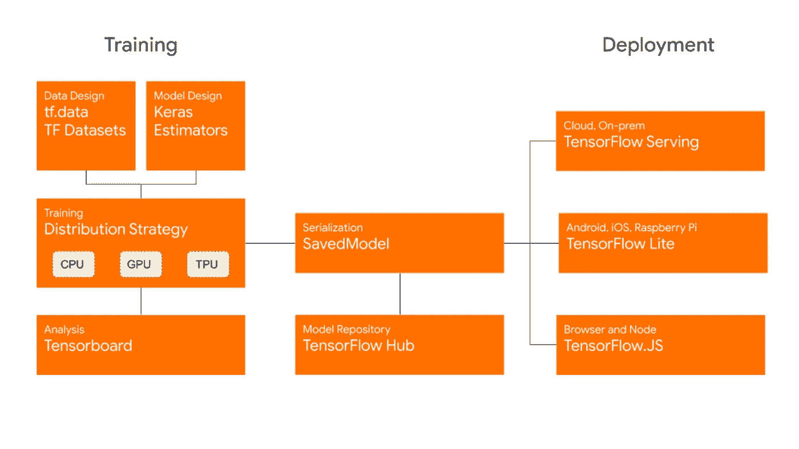
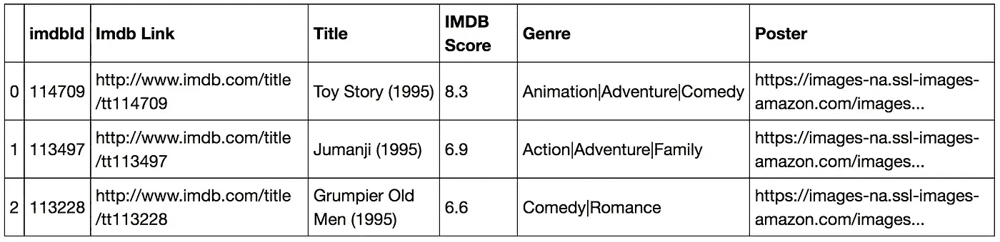
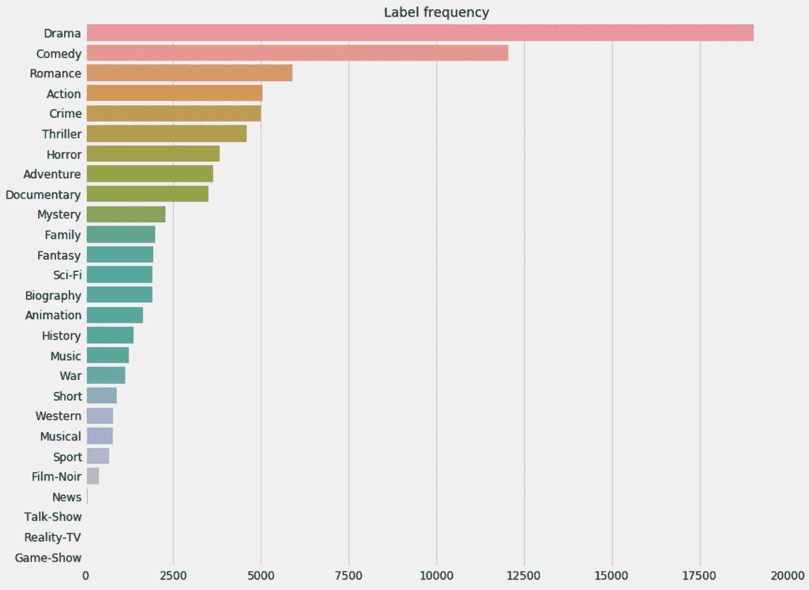
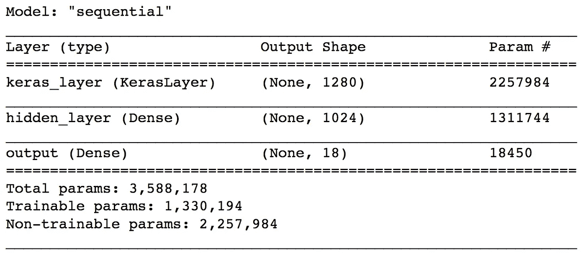
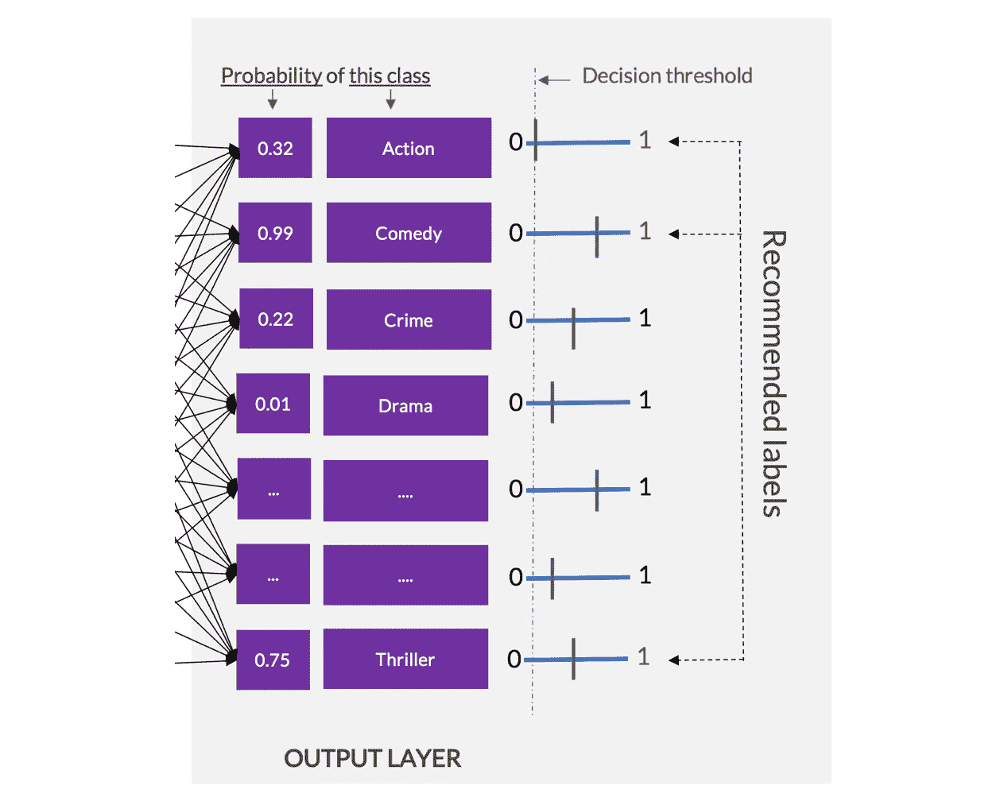
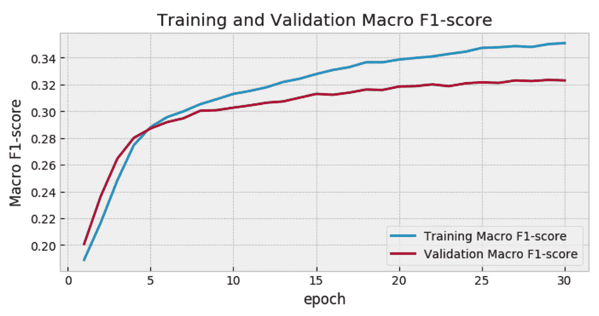
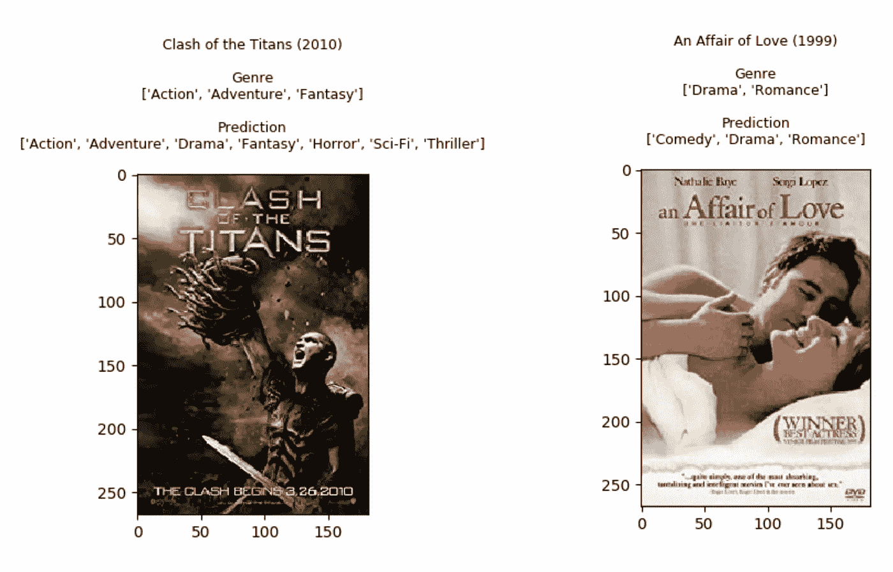

# TensorFlow 2.0 中的多标签图像分类

> 原文：<https://towardsdatascience.com/multi-label-image-classification-in-tensorflow-2-0-7d4cf8a4bc72?source=collection_archive---------1----------------------->

## 了解如何从海报中预测电影的类型。

你想用 AI 建造令人惊叹的东西吗？你可以学到很多东西。新发布的 TensorFlow 2.0 通过集成更多高级 API，使深度学习开发变得更加容易。如果你已经是一个 ML 从业者，但仍然没有加入 TF 世界，你没有借口了！门票几乎免费。

在这篇博文中，我将描述一些在训练多标签图像分类器时你可能会感兴趣的概念和工具。完整的代码可以在 [**GitHub**](https://github.com/ashrefm/multi-label-soft-f1) 上找到。所以，你可以坐下来动手了！

## 目录

*   了解多标签分类
*   TensorFlow 2.0 有什么有趣的地方
*   数据集(海报中的电影类型)
*   构建快速输入管道
*   用 TF 迁移学习。中心
*   模型训练和评估
*   导出 Keras 模型

# 了解多标签分类

近年来，机器学习在解决复杂的预测任务方面取得了巨大的成功，其规模是我们以前无法想象的。开始利用信息技术转变业务的最简单方法是，确定简单的二元分类任务，获取足够数量的历史数据，并训练一个好的分类器，以便在现实世界中很好地进行归纳。总有一些方法可以把一个预测性的商业问题变成一个是/否的问题。客户会流失吗？广告印象会产生点击吗？一次点击会产生转化吗？如果你收集有标签的数据，所有这些二元问题都可以用监督学习来解决。


我们还可以设计更复杂的监督学习系统来解决非二进制分类任务:

*   **多类分类:**有两个以上的类，每个观测值属于且仅属于一个类。例如，一家电子商务公司希望根据品牌(三星、华为、苹果、小米、索尼或其他)对智能手机等产品进行分类。
*   **多标签分类:**有两个或两个以上的类别，每个观察值同时属于一个或多个类别。应用的例子是医疗诊断，其中我们需要根据病人的体征和症状给病人开一个或多个治疗处方。
    以此类推，我们可以设计一个用于汽车诊断的多标签分类器。它将所有电子测量、错误、症状、里程作为输入，并预测汽车发生事故时需要更换的零件。

多标签分类在计算机视觉应用中也很常见。我们人类在看一部新电影的海报时，会用本能和印象去猜测它的内容(动作？戏剧？喜剧？等等。).你可能在地铁站遇到过这种情况，你想从墙上的海报中猜出电影的类型。如果我们假设在你的推理过程中，你正在使用海报的颜色信息，饱和度，色调，图像的纹理，演员的身体或面部表情以及任何使流派可识别的形状或设计，那么也许有一种数字方法可以从海报中提取那些重要的模式，并以类似的方式从它们中学习。如何建立一个学习预测电影流派的深度学习模型？让我们来看看你可以在 TensorFlow 2.0 中使用的一些技术！


# TensorFlow 2.0 有什么有趣的地方

当 TensorFlow 在 2015 年由谷歌首次发布时，它迅速成为世界上最受欢迎的开源机器学习库——“一个全面的工具生态系统，面向希望推动机器学习的最新发展并构建可扩展的 ML 驱动的应用程序的开发者、企业和研究人员。”谷歌宣布在今年 9 月底正式发布 TensorFlow 2.0。新版本增加了主要功能和改进:

*   默认情况下，Keras 与急切执行完全集成
*   使用 [tf.function](https://www.tensorflow.org/tutorials/customization/performance) 执行更多的 Pythonic 函数，这使得张量流图很好地优化了并行计算
*   通过 [TensorFlow 数据集](https://www.tensorflow.org/guide/data)实现更快的输入管道，以非常高效的方式传递训练和验证数据
*   使用 [TensorFlow 服务](https://www.tensorflow.org/tfx/guide/serving)、 [TensorFlow Lite](https://www.tensorflow.org/lite) 和 [TensorFlow.js](https://www.tensorflow.org/js) 在服务器、设备和网络浏览器上实现更强大的生产部署

> 就个人而言，我喜欢在 TensorFlow 1.x 中构建定制的估算器，因为它们提供了高度的灵活性。所以，我很高兴看到[估算器 API](https://www.tensorflow.org/guide/estimator) 被扩展。我们现在可以通过转换现有的 Keras 模型来创建估计量。



[TensorFlow 2.0 is now available!](https://medium.com/tensorflow/tensorflow-2-0-is-now-available-57d706c2a9ab)

# 数据集(海报中的电影类型)

这个数据集托管在 [Kaggle](https://www.kaggle.com/neha1703/movie-genre-from-its-poster) 上，包含来自 [IMDB 网站](https://www.imdb.com/)的电影海报。可以下载一个 csv 文件`MovieGenre.csv`。它包含每部电影的以下信息:IMDB Id、IMDB 链接、标题、IMDB 分数、类型和下载电影海报的链接。在这个数据集中，每个电影海报可以属于至少一个流派，最多可以分配 3 个标签。海报总数在 40K 左右。



需要注意的重要一点是，所有电影类型的数量并不相同。它们中的一些可能非常罕见，这可能对任何 ML 算法都是一个严峻的挑战。您可以决定忽略所有少于 1000 条评论的标签(短片、西部、音乐、体育、黑色电影、新闻、脱口秀、真人秀、游戏节目)。这意味着，由于缺少对这些标签的观察，模型将不会被训练来预测这些标签。



# 构建快速输入管道

如果你熟悉 [keras .预处理](https://www.tensorflow.org/api_docs/python/tf/keras/preprocessing)，你可能知道图像数据迭代器(例如 [ImageDataGenerator](https://www.tensorflow.org/api_docs/python/tf/keras/preprocessing/image/ImageDataGenerator) ， [DirectoryIterator](https://www.tensorflow.org/api_docs/python/tf/keras/preprocessing/image/DirectoryIterator) )。这些迭代器对于多类分类很方便，其中图像目录包含每个类的一个子目录。但是，在多标签分类的情况下，拥有一个遵循这种结构的图像目录是不可能的，因为一个观察可以同时属于多个类。

这就是 [tf.data](https://www.tensorflow.org/guide/data) API 占上风的地方。

*   它更快
*   它提供了细粒度的控制
*   它与 TensorFlow 的其余部分集成得很好

首先需要编写一些函数来解析图像文件，并生成一个表示特征的张量和一个表示标签的张量。

*   在解析功能中，您可以调整图像的大小，以适应模型所期望的输入。
*   您也可以将像素值缩放到 0 到 1 之间。这是一种常见的做法，有助于加快训练的衔接。如果您将每个像素视为一个特征，您会希望这些特征具有相似的范围，以便梯度不会失去控制，并且您只需要一个全局学习率乘数。

```
IMG_SIZE = 224 # Specify height and width of image to match the input format of the modelCHANNELS = 3 # Keep RGB color channels to match the input format of the model
```

要在我们的数据集上训练模型，您希望数据是:

*   洗得很好
*   成批的
*   尽快提供批次。

使用 [tf.data.Dataset](https://www.tensorflow.org/api_docs/python/tf/data) 抽象可以很容易地添加这些特性。

```
BATCH_SIZE = 256 # Big enough to measure an F1-scoreAUTOTUNE = tf.data.experimental.AUTOTUNE # Adapt preprocessing and prefetching dynamically to reduce GPU and CPU idle timeSHUFFLE_BUFFER_SIZE = 1024 # Shuffle the training data by a chunck of 1024 observations
```

`AUTOTUNE`将使预处理和预取工作负载适应模型训练和批量消费。要预取的元素数量应该等于(或者可能大于)单个训练步骤消耗的批次数量。`AUTOTUNE`会提示 tf.data 运行时在运行时动态调优值。

现在，您可以创建一个为 TensorFlow 生成训练和验证数据集的函数。

```
train_ds = create_dataset(X_train, y_train_bin)
val_ds = create_dataset(X_val, y_val_bin)
```

每个批处理将是一对数组(一个保存特性，另一个保存标签)。特征阵列将具有包含缩放像素的形状(批量大小、IMG 大小、IMG 大小、通道)。标签数组的形状为(BATCH_SIZE，N_LABELS ),其中 N_LABELS 是目标标签的最大数量，每个值表示电影中是否有特定的流派(0 或 1 值)。

# 用 TF 迁移学习。中心

你可以在一个叫做迁移学习的过程中使用一个预先训练好的模型，而不是从头开始建立和训练一个新的模型。视觉应用的大多数预训练模型都是在 [ImageNet](http://www.image-net.org/) 上训练的，ImageNet 是一个大型图像数据库，拥有超过 1400 万张图像，分为 2 万多个类别。迁移学习背后的想法是，由于这些模型是在大型和一般分类任务的背景下训练的，因此可以通过提取和迁移先前学习的有意义的特征来处理更具体的任务。你所需要做的就是获得一个预先训练好的模型，并简单地在其上添加一个新的分类器。新的分类负责人将从头开始接受培训，以便您将目标重新用于多标签分类任务。

> TensorFlow 核心团队在分享预训练模型和如何使用`tf.keras` API 的教程方面做得非常好。
> [用 hub 转移学习](https://www.tensorflow.org/tutorials/images/transfer_learning_with_hub)
> [用 Franç ois Chollet 转移学习](https://www.tensorflow.org/tutorials/images/transfer_learning)

## 什么是 TensorFlow Hub？

软件开发中的一个基本概念是重用通过库获得的代码。库使开发速度更快，效率更高。对于从事计算机视觉或 NLP 任务的机器学习工程师来说，我们知道从零开始训练复杂的神经网络架构需要多长时间。 [TensorFlow Hub](https://www.tensorflow.org/hub/) 是一个允许发布和重用预制 ML 组件的库。使用 TF。Hub 中，重新训练预训练模型的顶层以识别新数据集中的类变得很简单。TensorFlow Hub 还分发没有顶级分类层的模型。这些可以用来轻松地执行迁移学习。

## 下载一个无头模型

任何来自 tfhub.dev 的 [Tensorflow 2 兼容的图像特征向量 URL](https://tfhub.dev/s?module-type=image-feature-vector&q=tf2) 都可能对我们的数据集感兴趣。唯一的条件是确保我们准备的数据集中影像要素的形状与您想要重复使用的模型的预期输入形状相匹配。

首先，让我们准备特征提取器。我们将使用预训练的 MobileNet V2 实例，深度乘数为 1.0，输入大小为 224x224。MobileNet V2 实际上是一个大型的神经网络架构家族，主要用于加速设备上的推理。根据深度乘数(隐藏卷积层中的特征数量)和输入图像的大小，它们有不同的大小。

我们在这里使用的特征提取器接受 shape (224，224，3)的图像，并为每个图像返回一个 1280 长度的向量。

您应该冻结特征提取器图层中的变量，以便训练仅修改新的分类图层。通常，当处理的数据集与训练特征提取器的原始数据集相比非常小时，这是一种很好的做法。

```
feature_extractor_layer.trainable = False
```

> 只有当训练数据集很大并且与原始 ImageNet 数据集非常相似时，才建议微调特征提取器。

## 附上分类标题

现在，您可以将特征提取层包装在一个`tf.keras.Sequential`模型中，并在上面添加新的层。

模型摘要如下所示:



MobileNet 中的 2.2M 参数被冻结，但在密集层中有 1.3K 可训练参数。你需要在最终的神经元中应用 sigmoid 激活函数，以输出每种流派的概率分数。通过这样做，你依靠多个[逻辑回归](https://en.wikipedia.org/wiki/Logistic_regression)在同一个模型中同时训练。每个最终神经元将作为一个单独类别的单独的二元分类器，即使所提取的特征对于所有最终神经元是共同的。

> 当使用此模型生成预测时，您应该期望每个流派有一个独立的概率分数，并且所有概率分数的总和不一定等于 1。这与在多类别分类中使用 [softmax 图层](https://developers.google.com/machine-learning/crash-course/multi-class-neural-networks/softmax)不同，在多类别分类中，输出中的概率得分之和等于 1。



# 模型训练和评估

在准备数据集并通过在预训练模型上附加多标签神经网络分类器来构建模型之后，您可以继续进行训练和评估，但首先您需要定义两个主要函数:

*   **一个损失函数:**你需要它来衡量批次上的模型误差(成本)。它必须是可微分的，以便[反向传播](https://en.wikipedia.org/wiki/Backpropagation)神经网络中的误差并更新权重。
*   **一个评价函数:**它应该代表你真正关心的最终评价指标。与损失函数不同，它必须更加直观，以便理解模型在现实世界中的表现。

假设你想用**宏 F1-score @ threshold 0.5** 来评估模型的性能。它是将每个标签的概率阈值固定为 0.5 时获得的所有 [F1 得分](https://en.wikipedia.org/wiki/F1_score)的平均值。如果所有标签在多标签分类任务中具有相同的重要性，则对所有标签取平均值是非常合理的。我在这里提供了这个度量在 TensorFlow 中的一批观测上的实现。

> 这个度量是不可微的，因此不能用作损失函数。相反，你可以把它转化成一个可以最小化的可微版本。我们将把结果损失函数**称为宏软 F1 损失！**

> 通常，通过使用传统的**二元交叉熵**来优化模型是很好的，但是宏软 F1 损失带来了非常重要的好处，我决定在一些用例中利用这些好处。如果你有兴趣了解更多细节背后的动机实施这一自定义损失，你可以阅读我的博客文章: [**“未知的好处使用软-F1 损失在分类系统”**](https://medium.com/@ashrefm/the-unknown-benefits-of-using-a-soft-f1-loss-in-classification-systems-753902c0105d) 。

## 使用宏软 F1 损失训练模型

指定学习率和训练时期数(整个数据集的循环数)。

```
LR = 1e-5 # Keep it small when transfer learning
EPOCHS = 30
```

编译模型以配置培训流程。

```
model.compile(
  optimizer=tf.keras.optimizers.Adam(learning_rate=LR),
  loss=macro_soft_f1,
  metrics=[macro_f1])
```

现在，您可以传递(要素、标注)的训练数据集来拟合模型，并指示单独的数据集进行验证。将在每个时期后测量验证集的性能。

```
history = model.fit(train_ds,
  epochs=EPOCHS,
  validation_data=create_dataset(X_val, y_val_bin))
```

30 个时期后，您可能会观察到验证集的收敛。



## 显示预测

让我们看看当在验证集中的一些已知电影的海报上使用我们的模型时，预测是什么样子的。



我们注意到这个模型可以得到“浪漫”的权利。是因为《风流韵事》海报上的红色标题吗？

为《诸神之战》建议新标签的模型怎么样？“科幻”的标签似乎非常准确，与这部电影有关。请记住，在原始数据集中，每个海报最多有 3 个标签。或许，通过使用我们的模型可以推荐更多有用的标签！

# 导出 Keras 模型

训练和评估模型后，可以将其导出为 TensorFlow 保存的模型以供将来使用。

您可以稍后重新加载 tf.keras 模型，方法是指定包含。pb 文件。

> 请注意 custom_objects 字典中的“KerasLayer”对象。这就是 TF。用于构建模型的中心模块。

# 摘要

*   **多标签分类:**当一个观察值的可能标签数大于 1 时，应该依靠多元逻辑回归来解决许多独立的二元分类问题。使用神经网络的好处是你可以在同一个模型中同时解决这么多问题。小批量学习有助于降低训练时的记忆复杂度。
*   **TensorFlow 数据 API** : tf.data 使构建训练和评估 TensorFlow 模型的快速输入管道成为可能。使用 tf.data.Dataset 抽象，您可以收集观察值作为一对表示图像及其标签的张量分量，并行地对它们进行预处理，并以非常简单和优化的方式进行必要的混洗和批处理。
*   **TensorFlow Hub** :迁移学习从来没有这么简单。
    TF。Hub 提供来自大型预训练 ML 模型的可重用组件。您可以加载包装为 keras 层的 MobileNet 要素提取器，并在其上附加您自己的完全连接的层。可以冻结预训练模型，只有分类图层的权重会在训练过程中更新。
*   **直接为宏 F1** 优化:通过引入宏软 F1 损失，您可以训练模型直接增加您关心的指标:宏 F1 得分@阈值 0.5。在应用这个定制的损失函数时，您可能会发现有趣的好处。我邀请您查看这篇 [***文章***](https://medium.com/@ashrefm/the-unknown-benefits-of-using-a-soft-f1-loss-in-classification-systems-753902c0105d) 以了解更多信息。