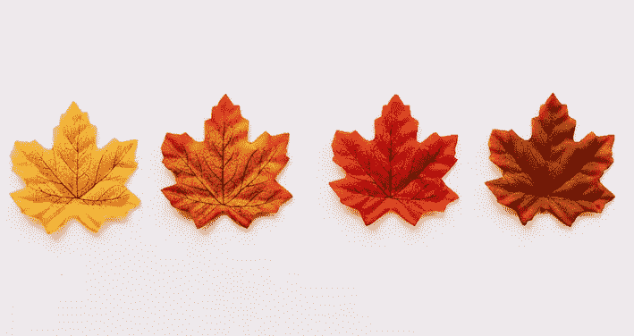
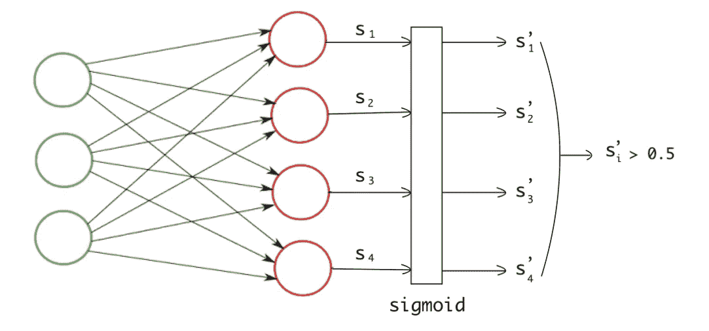
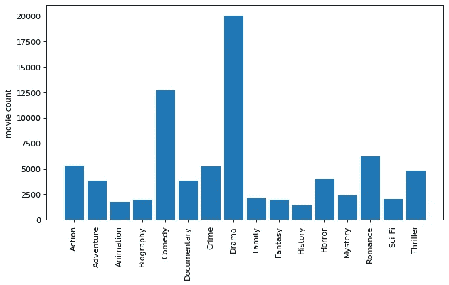

# 基于神经网络的多标签图像分类

> 原文：<https://towardsdatascience.com/multi-label-image-classification-with-neural-network-keras-ddc1ab1afede?source=collection_archive---------3----------------------->



Image by [besthqwallpapers](https://besthqwallpapers.com)

在本指南中，我们将介绍**多标签**分类以及我们在实施时可能面临的**挑战**。在**多标签**分类中，一个数据样本可以属于多个类别(标签)。其中在**多类**分类中，一个数据样本只能属于一个类。

## 例子

*   根据`animal image`预测`animal`类是多类分类的一个例子，其中每种动物只能属于一个类别。
*   从`movie poster`预测`movie genre`是多标签分类的一个例子，一部电影可以有多种类型。

在转向多标签之前，让我们先了解一下**多类**分类，因为两者有一些相似之处。

# 多类分类

在多类别分类中，神经网络的输出节点数与类别数相同。每个输出节点属于某个类，并输出该类的分数。


Multi-Class Classification (4 classes)

来自最后一层的分数通过一个 **softmax** 层。softmax 层将分数转换成**概率**值。最后，数据被分类到具有最高概率值的相应类别中。下面是 softmax 函数的代码片段。

```
def softmax(scores): exp = np.exp(scores)
    scores = exp / np.sum(exp)
    return scoressoftmax([5, 7, 4, 6])> [0.0871 0.6439 0.0320  0.2368]
```

## 损失函数

*   我们一般用`categorical_crossentropy`损失进行多类分类。

## 目标向量

*   我们必须向神经网络输入一个`one-hot`编码向量作为目标。例如，如果数据属于类别 2，我们的目标向量如下。

```
[0 1 0 0]
```

我们可以在 Keras 中建立一个用于多类分类的神经网络，如下所示。

Network for Multi-Class Classification

这就是我们如何做一个多类分类。现在让我们跳到多标签分类。

# 多标签分类

唯一的区别是一个数据样本可以属于多个类。在多标签分类中，我们必须以不同的方式处理一些事情。

## 激活功能

*   每门课的最终分数应该是相互独立的。因此，我们不能应用 **softmax** 激活，因为 softmax 将分数转换为考虑其他分数的概率。
*   最终得分独立的原因显而易见。如果电影类型是`action`，那么它不应该影响电影是否也是`thriller`。
*   我们在最后一层使用 **sigmoid** 激活函数。Sigmoid 将最终节点的每个分数在 0 到 1 之间转换，而与其他分数无关。
*   如果某一类的得分超过 0.5，则该数据被归入该类。并且可以有多个独立的得分超过 0.5 的类别。因此，数据可以分为多个类别。以下是 sigmoid 激活的代码片段。

```
def sigmoid(scores):

    scores = np.negative(scores)
    exp = np.exp(scores)
    scores = 1 / (1 + exp)
    return scoressigmoid([2, -1, .15, 3]))> [0.8807 0.2689 0.5374 0.9525]
```

## 损失函数

*   由于我们使用了一个`sigmoid`激活函数，我们不得不使用`binary_crossentropy`损失。

## 目标向量

*   这里我们也必须输入一个`one-hot`编码的向量，但是可能有多个。例如，如果数据属于类别 2 和类别 4，我们的目标向量如下。

```
[0 1 0 1]
```

下图说明了多标签分类。



Multi-Label Classification (4 classes)

我们可以在 Keras 中为多标签分类建立如下的神经网络。

Network for Multi-Label Classification

这些都是我们必须为多标签分类做出的重要改变。现在，让我们来探讨一下在多标签分类中可能面临的挑战。

# 多标签分类中的数据不平衡

多标签分类的主要挑战是数据不平衡。我们不能像在多类分类中那样简单地使用抽样技术。

数据不平衡是机器学习中众所周知的问题。其中数据集中的一些类比其他类更频繁，神经网络只是学习预测频繁的类。

例如，如果数据集包含 100 幅猫和 900 幅狗的图像。如果我们根据这些数据训练神经网络，它每次都会学习预测狗。在这种情况下，我们可以使用采样技术轻松平衡数据。

*   通过移除一些狗的例子(下采样)
*   通过使用图像增强或任何其他方法创建更多的 cat 示例(上采样)。

然而，当我们有多标签数据时，这个问题就变得很现实。让我们看看下面的[电影类型](https://www.kaggle.com/neha1703/movie-genre-from-its-poster)数据集(40K 样本)，其中我们必须从一部电影`poster`中预测电影`genre`。一部电影可以属于多个类型。总共有 16 种类型的体裁。



Movie Genre Count

## 缩减采样挑战

*   在这个数据中，标签`drama`和`comedy`出现的频率非常高。但是我们不能简单地丢弃带有多数标签的数据样本，因为这些数据样本也可能与其他标签相关联。丢弃这些样本也会导致其他标签的丢失。

## 上采样挑战

*   如果我们用少数类产生相似的例子，那么将会有多个具有相似模式的标签。这将增加过度拟合的机会。

即使我们有一个理想的电影类型数据集(40K 样本)，其中所有类型在数量上是相等的。每部电影平均有两种类型。那么每个流派会出现(40000*2)/16 = 5000 次左右。我们仍然有一个不平衡的数据集，因为网络只看到每个流派的 12.5%的时间。在这种情况下，网络只是学习预测根本没有流派。

为了更好地理解，下面是一步一步的计算。

```
Total samples => 40000Total genre => 16Avg genre in one sample => 2Occurance of one genre in all samples => (40000*2)/16 => 5000Percentage of one genre per sample => 5000/40000 => 0.125 => 12.5%
```

为了解决多标签分类中的数据不平衡问题，已经做了大量的研究。以下是几篇关于多标签分类和数据不平衡的论文。

*   [用神经网络改进多标记](https://www.ntu.edu.sg/home/elpwang/PDF_web/08_PPSN.pdf)
*   [大规模多标签文本分类](https://link.springer.com/chapter/10.1007/978-3-662-44851-9_28)
*   [逆随机欠采样](https://www.sciencedirect.com/science/article/abs/pii/S0031320312001471)
*   [使用 SMOTE 管理数据不平衡](https://link.springer.com/content/pdf/10.1007/978-3-642-41822-8_42.pdf)

> 在我的下一篇博客中，我将会从海报项目中做**电影类型预测** **。即多标签分类项目。在此之前，请保持联系，并准备好您的 GPU。**

## 更多来自作者

[](https://shiva-verma.medium.com/understanding-self-supervised-learning-with-examples-d6c92768fafb) [## 理解自我监督学习，并举例说明

### 迈向艾将军的一步？

shiva-verma.medium.com](https://shiva-verma.medium.com/understanding-self-supervised-learning-with-examples-d6c92768fafb)