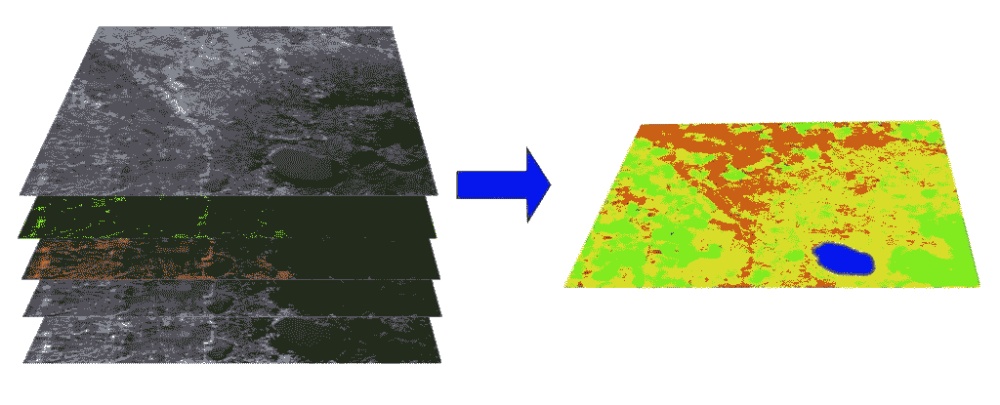
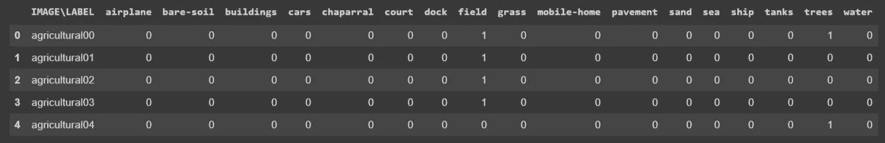
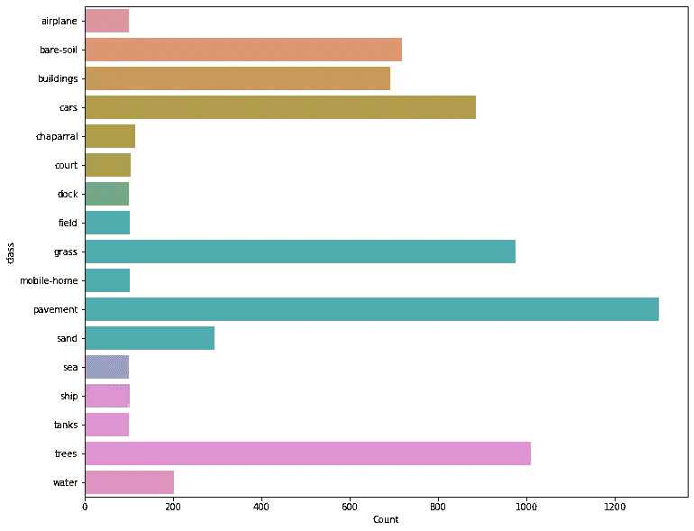
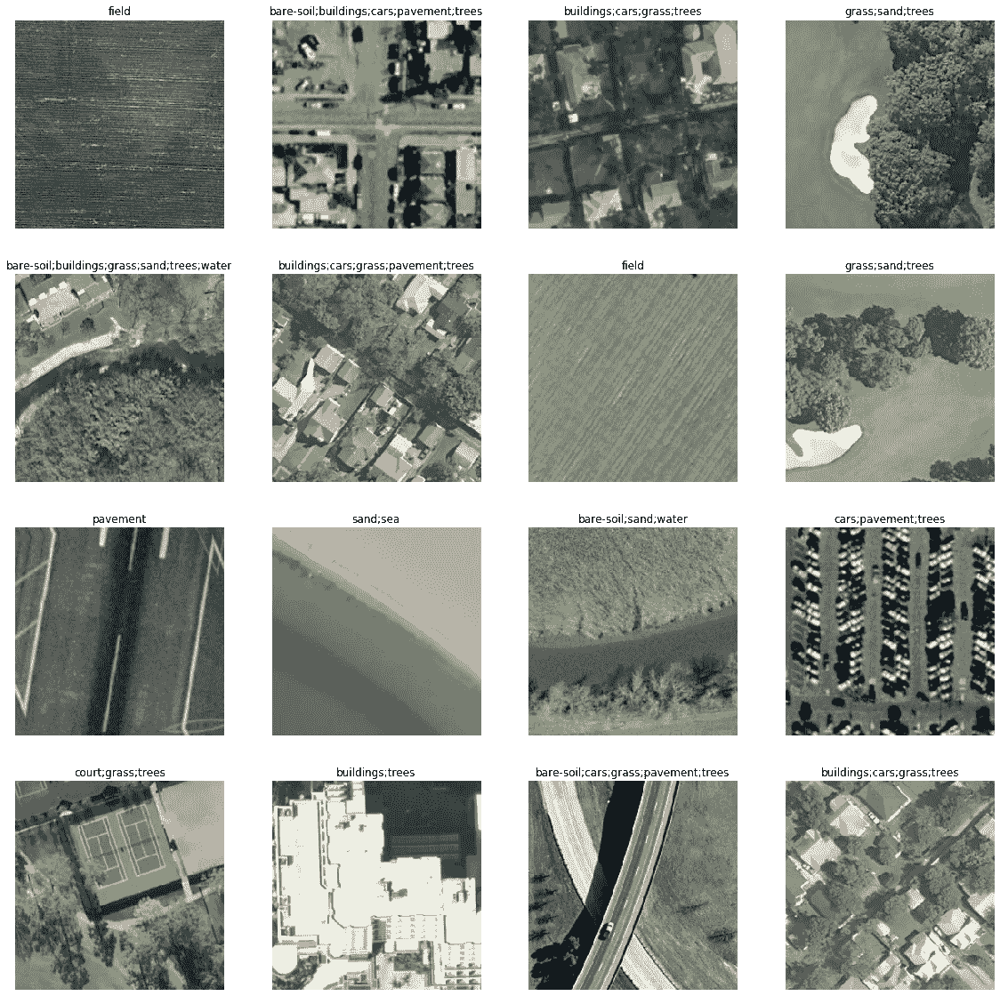
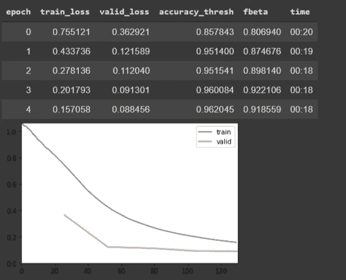
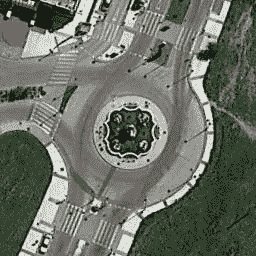

# 基于深度学习的多标签土地覆盖分类

> 原文：<https://towardsdatascience.com/multi-label-land-cover-classification-with-deep-learning-d39ce2944a3d?source=collection_archive---------15----------------------->

## 使用深度神经网络进行多标签土地覆盖分类的分步指南



Multi-label Land Cover Classification — [Source](https://semiautomaticclassificationmanual.readthedocs.io/en/latest/remote_sensing.html)

与单标签分类相比，对多标签土地覆盖分类的探索较少。相比之下，多标签分类更现实，因为我们总是在每个图像中找到多个土地覆盖。然而，通过深度学习应用和卷积神经网络，我们可以解决多标签分类的挑战。

在本教程中，我们使用重新设计的多标签 UC Merced 数据集和 17 个土地覆盖类。加州大学 Merced 土地利用数据集最初是作为最早的计算机视觉卫星数据集之一推出的。UC Merced 数据集被认为是卫星图像数据集的 MNIST。原始数据集由 21 类单标签分类组成。

在下一节中，我们将获取数据并研究数据集中的类和类不平衡。接下来，我们使用深度神经网络训练我们的模型，最后，我们使用外部图像测试我们的模型以进行推断。

## 获取数据

我们可以从以下网址使用 WGET 软件包直接访问 Jupyter 笔记本/Google Colab 中的数据。

```
!wget [https://www.dropbox.com/s/u83ae1efaah2w9o/UCMercedLanduse.zip](https://www.dropbox.com/s/u83ae1efaah2w9o/UCMercedLanduse.zip)!unzip UCMercedLanduse.zip
```

一旦我们获得数据并解压缩，我们就准备好探索它了。让我们从标签开始。我们阅读熊猫的标签。

```
df = pd.read_csv(“UCMerced/multilabels.txt”, sep=”\t”)df.head()
```

这是前五行的标签。正如您所看到的，数据是一个热编码格式。每个图像有 17 个标签，其中“0”表示该标签在特定图像中不存在，而“1”表示该标签在图像中存在。我们总共有 2100 张图片。



UC Merced Multi-labels DataFrame

在我们继续使用神经网络和深度学习对任务进行分类之前，我们可以看看数据集中类的分布。检查数据集的分布是检查数据集中数据不平衡的重要步骤。我们首先创建一个新的数据框来存储类及其计数。

```
# Create Class count dataframe
class_count = pd.DataFrame(df.sum(axis=0)).reset_index()
class_count.columns = [“class”, “Count”]
class_count.drop(class_count.index[0], inplace=True)# Visualize class distribution as Barchartfig, ax= plt.subplots(figsize=(12,10))
sns.barplot(y="class", x="Count",  data=class_count, ax=ax);
```

以下可视化显示了数据集中的类别不平衡。我们有超过 1200 个图像的路面类，而飞机类有 100 个图像。



Class Distribution — UC Merced Multi-label dataset

在下一节中，我们开始用 Fastai 库训练数据集。Fastai 是一个用户友好的库，构建在 Pytorch 之上，提供了许多易于使用的功能。

## 培养

我们需要为训练准备数据。我们的数据标签是一个热点编码格式，我认为这将是一个挑战。幸运的是，浏览了一下 Fastai 论坛，我发现 Fastai 中有一个本机函数，可以使用一键编码格式处理多标签。当我们给数据集加标签时，我们需要传递列名，还需要指明数据是多类别数据集。

```
path = Path(“UCMerced”)data_src = (ImageList.from_df(df=df, path=path, folder=’images’,    suffix=”.tif”)
      .split_by_rand_pct(0.2)
      .label_from_df(cols=list(class_count[‘class’]),  label_cls=MultiCategoryList, one_hot=True))
```

一旦我们创建了数据源，我们就可以通过 Fastai 中的 data bunch API 来传递它。我们还执行一些数据扩充。

```
tfms = get_transforms(flip_vert=True, max_lighting=0.1, max_zoom=1.05, max_warp=0.)data = (data_src.transform(tfms, size=256).databunch().normalize(imagenet_stats))data.show_batch(4)
```

这里有一些随机图像，它们的标签用 Fastai 可视化。



Random images and labels — UC Merced dataset

接下来，我们创建一个学习器，在那里我们传递我们创建的数据串、模型的选择(在本例中，我们使用 resnet34)和指标(accuracy_thresh 和 F Score)。

```
f_score = partial(fbeta, thresh=0.45)learn = cnn_learner(data, models.resnet34, metrics=[accuracy_thresh, f_score], callback_fns=[CSVLogger,ShowGraph, SaveModelCallback])
```

我们也可以通过 Fastai 中的 lr_find 作图，得到适合训练数据集的学习率。

```
learn.lr_find()learn.recorder.plot()
```

现在，我们可以开始用数据训练我们的模型。我们使用 fit_one_cycle 函数，这是一个强大的函数，使用一个循环技术结合了最先进的技术。

```
learn.fit_one_cycle(5, 1e-2)
```

一旦训练开始，Fastai 就显示与每个时期的训练和验证损失和时间一起提供的度量



Training

我们的最终历元记录了 95.53 的准确度阈值和 90.84 的 F 分数，这对于仅仅五个历元来说是相当准确的。我们可以进一步训练，提高我们的指标。为此，我们可以冻结一些层，并从头开始训练其他层。

```
learn.freeze()
lr = 1e-3learn.fit_one_cycle(5, slice(lr))
```

我们最终的模型得分是 91.39 F 分，相比之前的训练有了一点点的提升。我们可以通过使用更多的纪元或增加深度神经网络的架构来进行更多的训练。你可以尝试一下，看看是否有助于改进模型。在下一节中，我们将使用外部图像作为模型的推论。

## 不同数据集的预测

为了测试该模型，我们从外部来源预测几幅图像，并观察该模型的表现。

```
!wget [https://www.dropbox.com/s/6tt0t61uq2w1n3s/test.zip](https://www.dropbox.com/s/6tt0t61uq2w1n3s/test.zip)!unzip test.zipimg = open_image(“/content/test/roundabout_086.jpg”)img
```

测试数据集中的第一幅图像如下所示。



让我们看看这个模型预测了什么:

```
MultiCategory bare-soil;buildings;cars;grass;pavement
```

嗯，这就是模型产生的结果，我认为从我们在训练数据集中使用的类来看，它是准确的。我们的预测已经预测了图像中存在的大多数类(至少从我的眼睛中可以看到)。

让我们用另一个图像来测试。


这个模型预测

```
MultiCategory airplane;cars;pavement
```

飞机和人行道，是的，但是我没看见任何汽车。

## 结论

在本教程中，我们使用深度神经网络训练了一个多标签类别分类模型。我们还用其他图像对模型进行了推论。

本教程的代码和 Google Colab 笔记本可以在这个 Github 资源库中找到。

[](https://github.com/shakasom/multilabel-landcover-deeplearning) [## shaka som/多标签-土地覆盖-深度学习

### 与单标签分类相比，对多标签土地覆盖分类的探索较少。相比之下…

github.com](https://github.com/shakasom/multilabel-landcover-deeplearning) 

你可以通过这个链接直接访问 Google Colab 笔记本

[](https://github.com/shakasom/multilabel-landcover-deeplearning/blob/master/Multi_label_Land_Cover_Classification.ipynb) [## shaka som/多标签-土地覆盖-深度学习

### 此时您不能执行该操作。您已使用另一个标签页或窗口登录。您已在另一个选项卡中注销，或者…

github.com](https://github.com/shakasom/multilabel-landcover-deeplearning/blob/master/Multi_label_Land_Cover_Classification.ipynb)