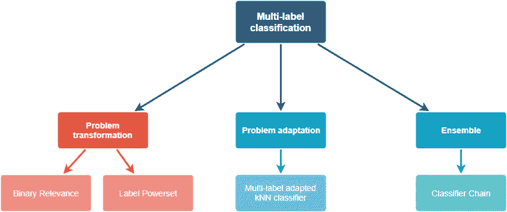
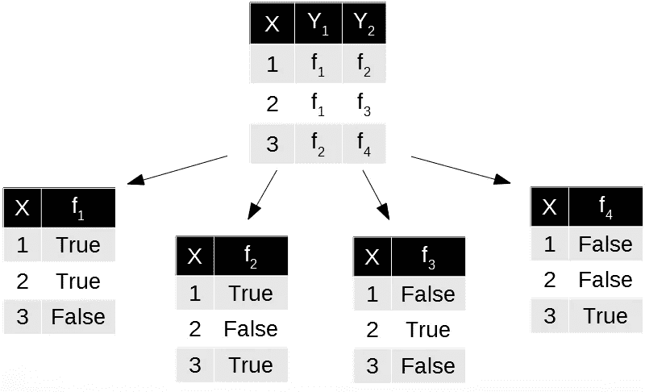
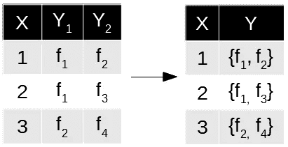
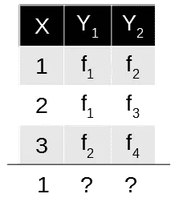
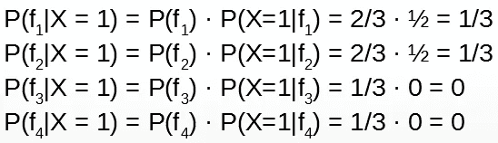
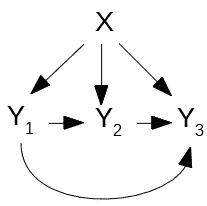
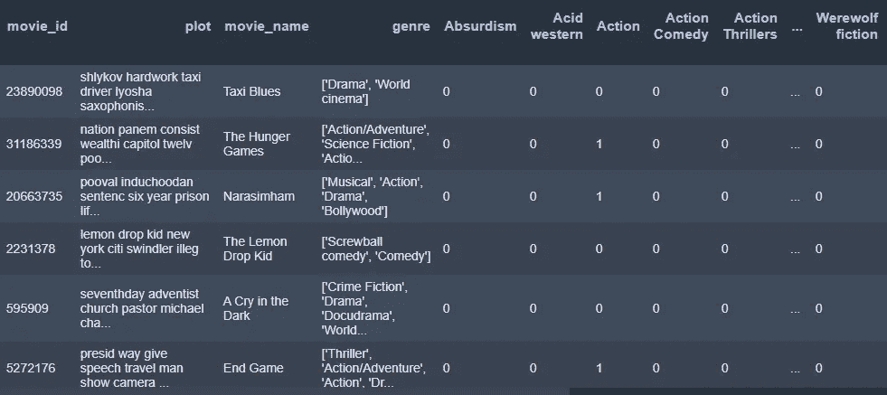
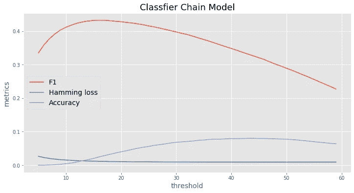

# 多标签文本分类

> 原文：<https://towardsdatascience.com/multi-label-text-classification-5c505fdedca8?source=collection_archive---------2----------------------->

## 根据描述给电影分配标签

# 介绍


[Unsplash](https://unsplash.com?utm_source=medium&utm_medium=referral)

要了解各种分类类型，我们来考虑上图。

```
┌──────────────┬────────────────────┬──────────────────────┐
│ Is it a hen? │    Which label?    │    Which labels?     │
├──────────────┼────────────────────┼──────────────────────┤
│ **Yes**/No       │ harmony/**hen**/nature │ **harmony, hen, nature** │
│ **BINARY**       │ **MULTICLASS**         │ **MULTI-LABEL **         │
└──────────────┴────────────────────┴──────────────────────┘
```

在**二元分类**的情况下，我们只问一个是/否类型的问题。如果有多个可能的答案，并且只能选择一个，那么就是**多类分类**。在我们的例子中，我们不能只选择一个标签，我认为所有的标签都与照片匹配。**多标签分类**的目标是为单个实例分配一组相关的标签。然而，大多数广为人知的算法都是针对单标签分类问题而设计的。本文描述了 *scikit-multilearn* 库中可用的四种多标签分类方法，并介绍了样本分析。

# 多标签分类方法

1.  **问题转化方法**将多标签问题分成一个或多个常规的单标签问题。
2.  **问题自适应方法**将单标签算法一般化，直接处理多标签数据。
3.  **集成方法**结合了前两种方法的优点

在接下来的部分中，我将描述下图所示的方法。



Fig. 1 Multi-label classification methods

# 二元相关性

在二元相关性的情况下，单标签二元分类器的集合在原始数据集上被独立地训练，以预测每个类的成员资格，如图 2 所示。



Fig. 2 Binary Relevance example

```
┌─────────────────────┬─────────────────────────────────────────┐
│     **Advantages  **    │              **Disadvantages **             │
├─────────────────────┼─────────────────────────────────────────┤
│ - linear complexity │ - ignoring correlation between labels   │
│ - simplicity        │   by treating each label independently  │
└─────────────────────┴─────────────────────────────────────────┘
```

# 标签电源集

这种方法将标签的每个组合映射到单个标签中，并训练单个标签分类器(图 3)。



Fig. 3 Label Powerset example

```
┌────────────────┬───────────────────────────────────┐
│   **Advantages **  │           **Disadvantages **          │
├────────────────┼───────────────────────────────────┤
│ - taking label │ - high computational complexity   │
│   correlations │ - can lead to imbalanced dataset  │
│   into account │  with multiple classes associated │
│                │  with few examples                │
└────────────────┴───────────────────────────────────┘
```

# MLkNN

对于测试集中的每个实例，识别其在训练集中的 K 个最近邻。对于 Y 中的每个类 Y，属于 Y 的相邻实例的数量用于计算测试实例属于或不属于 Y 的后验概率。基于这些概率中哪个更大，我们决定是否将类 Y 分配给测试实例。

为了更好地理解，假设下面的样本是在测试实例 X = 1 的训练集中找到的邻居。



现在，我们必须为测试实例 X = 1 计算每个类别的先验和后验概率



f1 和 f2 获得了最大值。因此，我们将测试实例分配给这两个类。

```
┌─────────────────────────┬───────────────────────────────────────┐
│       **Advantages **       │            ** Disadvantages **            │
├─────────────────────────┼───────────────────────────────────────┤
│ - better accuracy than  │ - with the binary relevance strategy, │
│   the previous methods  │   the ratio estimation                │
│ - correlations between  │   may not be accurate                 │
│   labels are considered │ - data distributions for some labels  │
│                         │   are imbalanced                      │
└─────────────────────────┴───────────────────────────────────────┘
```

# 分类器链

分类器链模型像二进制相关方法一样学习分类器。然而，所有的分类器都是连锁的。



Fig. 4 Classifier Chain rule

1.  首先，所有的特征(X1，X2，…，Xm)被用来预测 y1。
2.  然后，所有的特征(X1，X2，…，Xm，y1)被用来预测 y2
3.  最后，应用(X1，X2，…，Xm，y1，y2)来预测 y3

标签的预测顺序对结果有很大的影响。

```
┌────────────────────────────┬──────────────────────────┐
│         **Advantages **        │      **Disadvantages **      │
├────────────────────────────┼──────────────────────────┤
│ - label correlation taken  │ - accuracy heavily       │
│   into consideration       │   depends on the order   │
│ - acceptable computational │ - for n labels there     │
│   complexity               │   are n! possible orders │
└────────────────────────────┴──────────────────────────┘
```

# 资料组

我们将为我们的项目使用 [CMU 电影摘要语料库](http://www.cs.cmu.edu/~ark/personas/)开放数据集。**你可以直接从这个** [**链接**](http://www.cs.cmu.edu/~ark/personas/data/MovieSummaries.tar.gz) **下载数据集。**

该数据集包含多个文件，但我们只需要其中的两个:

*   **movie . Metadata . tsv:**81，741 部电影的元数据，从 2012 年 11 月 4 日的 Freebase 转储中提取。该文件中提供了电影类型标签
*   **plot_summaries.txt:** 从 2012 年 11 月 2 日的英文维基百科转储中提取的 42，306 部电影的情节摘要。每一行都包含维基百科电影 ID(索引到 *movie.metadata.tsv* )和情节摘要

# 代码示例

我们将创建一个表格，包含分配给电影的多种类型和描述。基于这样的描述，我们将尝试给每部电影分配合适的类型。

让我们从导入必要的库开始。对于上述方法，我们将使用 *skmultilearn* 模块。

现在是时候清理文本中的特殊符号了，去掉停用词，打上戳记，并将类型变量放入单独的二进制列中。



当数据准备好了，我们可以把它分成训练集和测试集，并转换成一个 TF-IDF 特征矩阵。我们将根据语料库中的词频(由于计算的复杂性)对其中的前 10000 个进行排序。请注意，最大长度为 3 的 N 元文法在这里被认为是潜在的特征。由于 **n_gram_range** 和 **max_features** 在精度上是必不可少的参数，推荐大家自己玩:)

让我们应用上述模型并比较结果。为了选择我们将测量的最佳模型:

1.  **准确性** —准确性是最常见的衡量标准。然而，这在很大程度上是由我们在这种情况下以及在大多数商业案例中所拥有的大量真正的负面因素造成的。
2.  **F1 分数** —如果我们需要在精确度和召回率之间寻求平衡，并且存在不均匀的类别分布(大量实际否定)，F1 分数可能是一个更好的衡量标准
3.  **汉明损失** —被错误预测的标签的比例。在不平衡数据集的情况下带来额外的信息。

准确度= 0.004，F1 得分= 0.222，汉明损失= 0.033

准确度= 0.090，F1 得分= 0.261，汉明损失= 0.009

准确度= 0.052，F1 得分= 0.235，汉明损失= 0.01

如您所见，由于数据集严重失衡，所有情况下的准确性都非常低。标签 Powerset 模型获得了最好的结果。然而，我们仍然要应用分类器链。我将在这里预测每个类的概率赋值，然后用**阈值**参数玩一会儿(默认情况下它等于 **0.5** )。上面说了如何区分 0/1 标签赋值。你会发现它的价值对于型号的选择是至关重要的。



该图显示最佳阈值约为 0.2。这是 F1 分数接近最大值 0.43、准确度增加且汉明损失低的点。

# 结论

总之，描述了流行的多标记分类方法，并在实际例子中进行了比较。分类器链方法通过修改最小阈值获得了最好的结果，基于此我们在二分类问题中指定 1。在未来的工作中，标签的顺序可能会被打乱和测试，这是一个耗时的过程。

在下一篇文章中，我将使用深度学习方法解决相同的问题。这是自然语言处理中发展最快和最重要的子领域，可以获得最好的结果。

感谢阅读！