# 基于 XLNet 的多标签文本分类

> 原文：<https://towardsdatascience.com/multi-label-text-classification-with-xlnet-b5f5755302df?source=collection_archive---------3----------------------->

## *使用 XLNet 实现最先进的多标签和多类别文本分类*

Photo by [Christopher Gower](https://unsplash.com/@cgower) on [Unsplash](https://unsplash.com/photos/m_HRfLhgABo)

在 2019 年 6 月 19 日发表时，XLNet 在 18 项任务上取得了最先进的结果，包括文本分类、问答、自然语言推理、情感分析和文档排名。

它甚至在 20 个任务上超过了 BERT！

由卡耐基梅隆大学和谷歌大脑开发的 [XLNet](https://arxiv.org/abs/1906.08237) 是一个基于排列的自回归语言模型。

我们不会过多地探究模型的内部工作原理，因为有很多很好的资源可以用于这个目的。相反，本文将集中讨论 XLNet 在多标签和多类文本分类问题上的应用。

# 介绍

让我们快速回顾一下。在多类分类问题中，有多个类，但是任何给定的文本样本将被分配一个类。

另一方面，在多标签文本分类问题中，一个文本样本可以被分配给多个类别。

我们将使用由 HuggingFace 开发的[变形金刚](https://github.com/huggingface/transformers)库。Transformers 库提供了许多先进语言模型的易用实现:BERT、XLNet、GPT-2、RoBERTa、CTRL 等。

此外，我还想对 [Kaushal Trivedi](https://medium.com/@kaushaltrivedi) 表示感谢，他在 BERT 上关于多标签分类的惊人的[教程](https://medium.com/huggingface/multi-label-text-classification-using-bert-the-mighty-transformer-69714fa3fb3d)是这里代码的基础。

我们将应对 Kaggle 的[毒性评论分类挑战，](https://www.kaggle.com/c/jigsaw-toxic-comment-classification-challenge/overview)我们需要预测在线评论的六种可能的评论毒性类别的概率。

快速说明一下，XLNet 有一个基础版本和一个大版本:

*   XLNet 库:12 层，768 个隐藏单元，12 个注意头，110M 参数。
*   XLNet Large: 24 层，768 个隐藏单元，16 个注意头，340M 参数

我们将在 Google Colab 上训练我们的模型，Google Colab 免费提供 16 GB 的特斯拉 P100！

由于特斯拉 P100 的 GPU 内存限制，我们将使用 XLNet 基础为我们的任务。

我们不会从头开始训练模型，而是对预训练的模型进行微调。这个概念被称为迁移学习。

没有别的事了，我们开始吧！

# 密码

点击[此处](https://colab.research.google.com/drive/1o3cv-YSPGiKftCvFnCiMcygARqdaxrM7)获取本文附带的 Colab 笔记本。

首先，让我们安装必要的库，实际上只是变压器。

接下来，我们导入必要的库。

检查 GPU 是否可用。

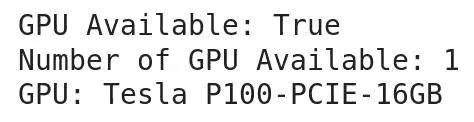

将你的 google drive 安装到你的 Colab 笔记本上。

对于我们的例子，我们将在 google drive 中创建一个`Data`文件夹，并将数据集放在那里。

读取`.csv`文件。

让我们来看看数据集。

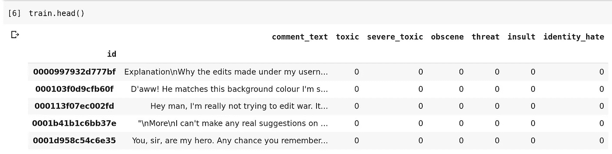

Train dataset

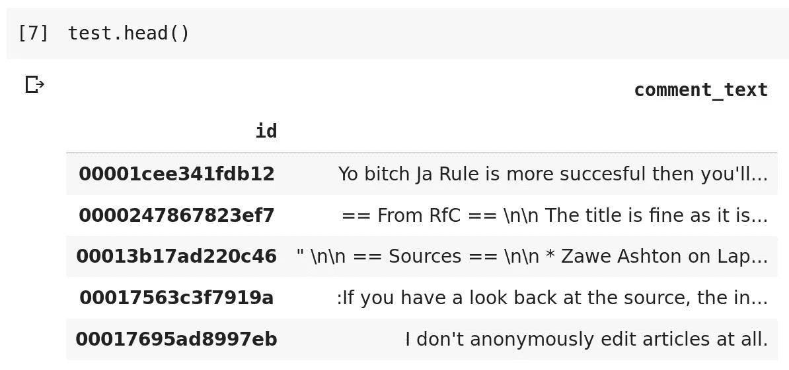

Test dataset

让我们做一些快速 EDA。分析标签的分布，我们注意到标签是不平衡的。

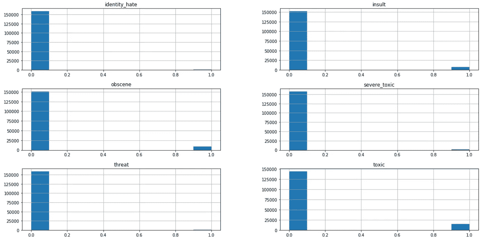

Distribution of labels in the training data

在将一段文本输入模型之前，必须将文本标记成适当的子词。为此，我们可以使用 HuggingFace 的`XLNetTokenizer`。

理论上，基于 XLNet 的模型能够处理多达 512 个子字的序列。然而，为了减少训练时间，也考虑到有限的 GPU 内存，我们将选择一个较小的序列大小。

我们可以分析评论的子词数量的分布。

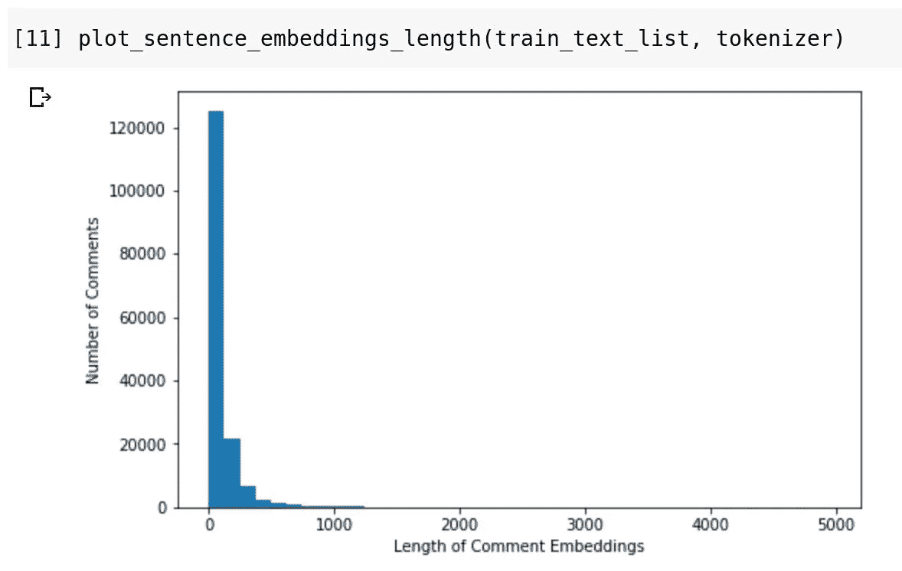

Distribution of the number of sub-word tokens in the training data

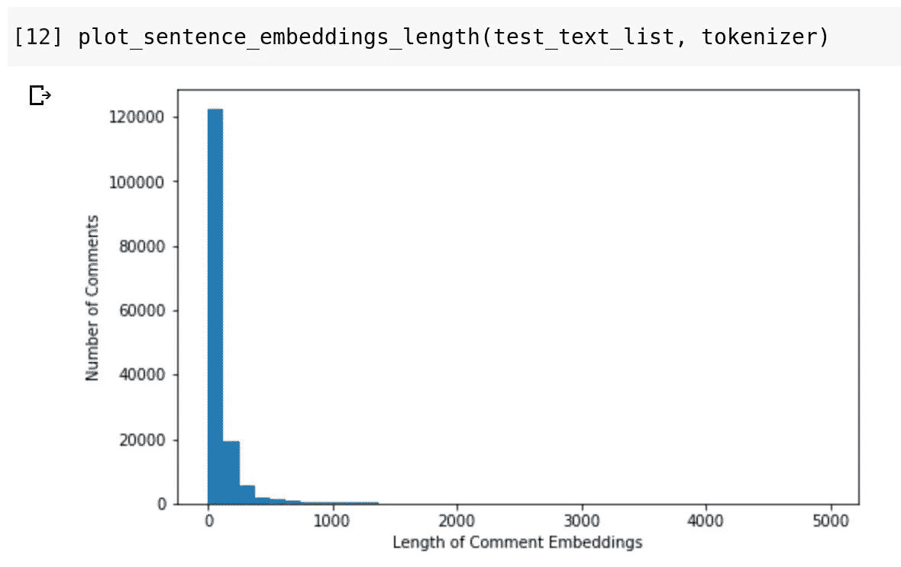

Distribution of the number of sub-word tokens in the testing data

由于大多数评论的子词少于 250 个，我们可以将所有评论截断或填充到 250 个子词。

将输入文本序列转换成适当的数字标记 id。

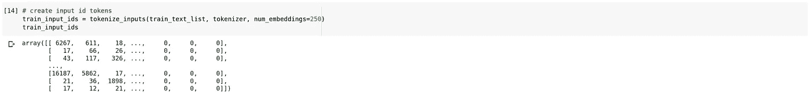

Example of the processed tokenized inputs

接下来，我们将创建注意屏蔽，它指示模型在适当的令牌上执行注意。目的是防止我们的模型对填充标记进行关注。

将标记化的数字输入和注意屏蔽附加到数据帧。

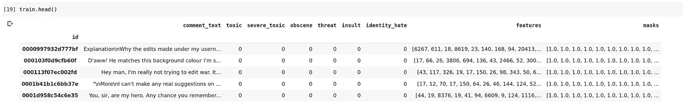

Train dataframe

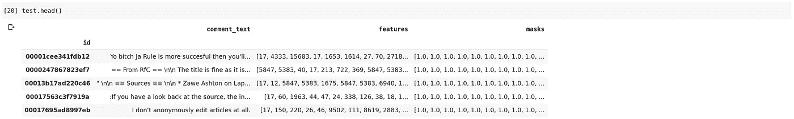

Test dataframe

出于交叉验证的目的，我们将执行培训和验证分割。

创建特征、遮罩和标签数组，并将其转换为火炬张量。

接下来，为训练集和验证集创建`Dataloaders`。我们将使用 32 的批量大小。

如果 Colab 为您的运行时分配 12 GB Tesla K80，您可能会考虑将批处理大小减少到 16，以避免耗尽 GPU 内存。

让我们定义我们的 XLNet 分类模型。

由于输入序列有 250 个记号，XLNet 将产生 250 个输出向量，每个向量的维数为 768。我们将对输出向量进行平均汇集，并生成一个维数为 768 的向量。该向量将成为全连接层的输入，该层将预测 6 个注释毒性标签。

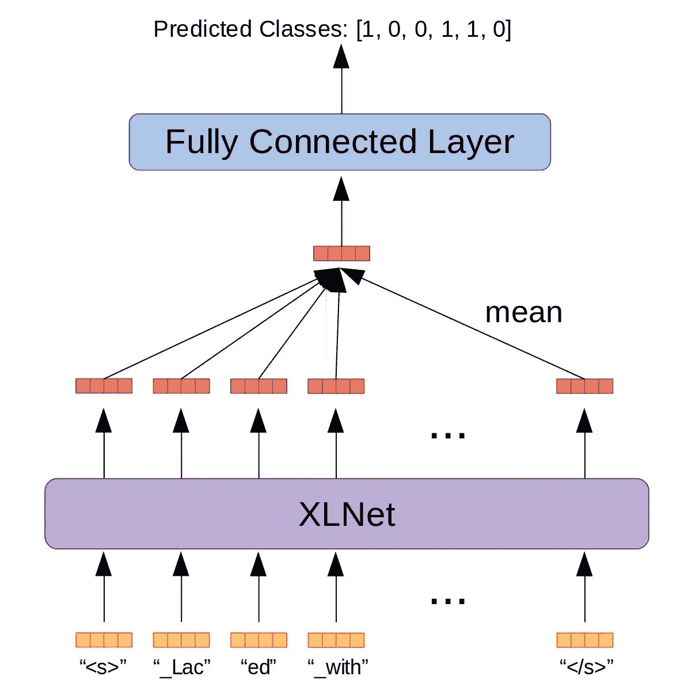

Mean pooling the output vectors into a single vector

您肯定可以探索其他方法来汇集输出，比如将输出连接成一个大的向量，或者甚至使用 XLNet 最后几个隐藏层的输出。

接下来，我们初始化优化器。我们将使用`AdamW`优化器。如果需要，您还可以设置学习率计划。

我们现在将定义训练函数。在训练期间，该函数将在达到最低验证损失时保存模型。

在特斯拉 P100 上，一次训练大约需要 1 小时 30 分钟。

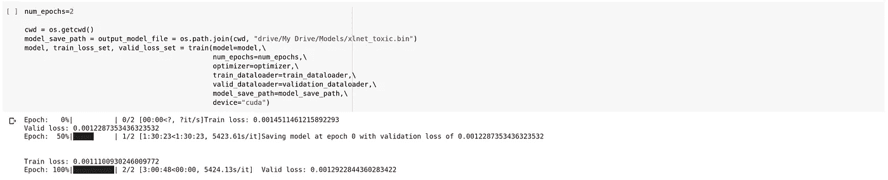

在我们的模型被训练之后，我们可以为 153，164 个测试示例生成预测。

如果我们试图一次性预测所有测试示例的标签，我们的 GPU 很可能会耗尽内存。对此的解决方案是为每 32 个测试实例生成预测，并将它们连接在一起。

当然，32 的批量大小可以根据 GPU 内存的多少而改变。

将结果提交给 Kaggle，经过一个时期的微调训练，我们获得了 0.98182 的公共分数和 0.98323 的私有分数。不算太寒酸！

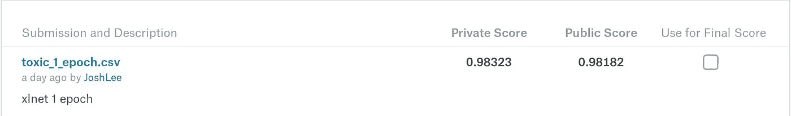

请注意，我们没有执行任何参数调整或功能工程。

如果您想要预测的硬标签而不是软概率，只需将软概率四舍五入到最接近的整数(0 或 1)。

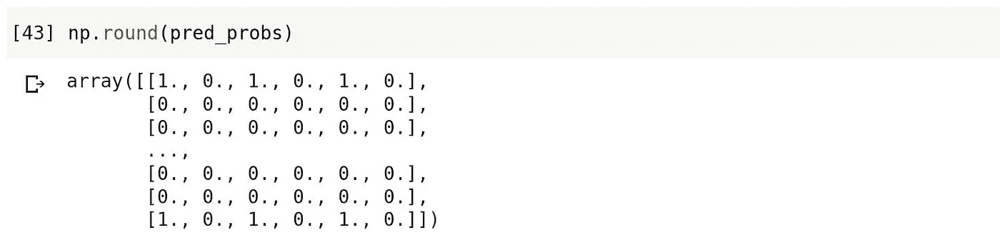

就是这样！Colab 笔记本的链接可以在[这里](https://colab.research.google.com/drive/1o3cv-YSPGiKftCvFnCiMcygARqdaxrM7)找到。

*感谢您阅读这篇文章！如果你有任何想法或反馈，请在下面留下评论或给我发电子邮件到 leexinjie@gmail.com。我很想收到你的来信！*