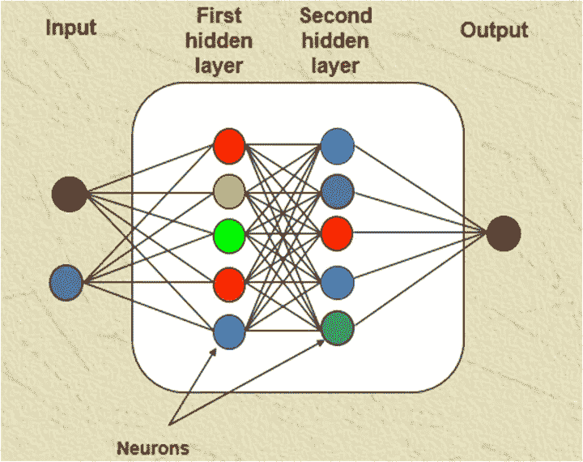
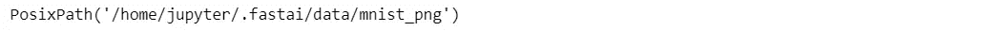
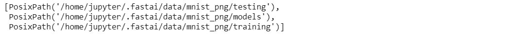
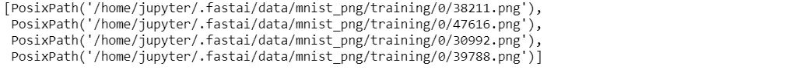
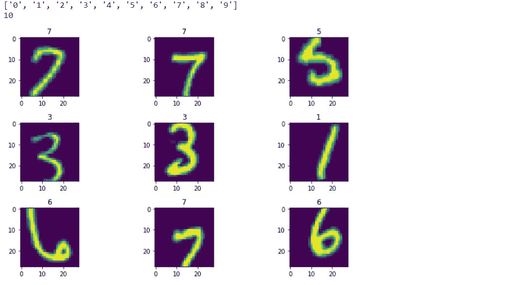
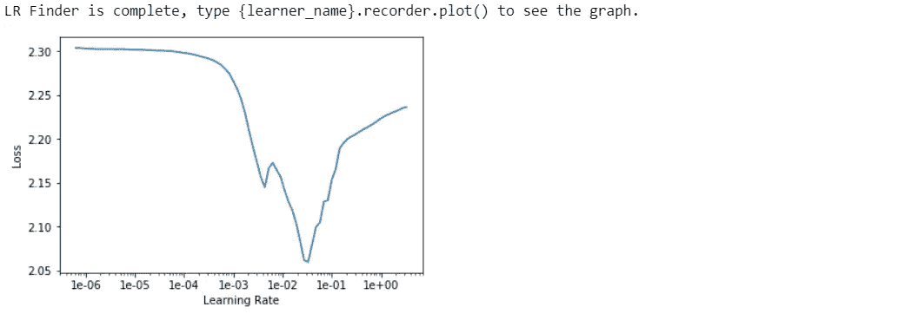
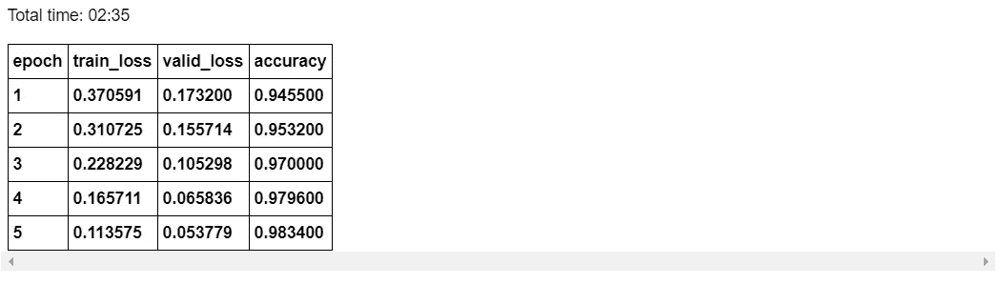
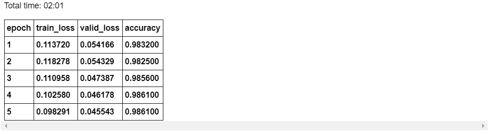

# 使用 FastAI 和 PyTorch 的多层感知器

> 原文：<https://towardsdatascience.com/multi-layer-perceptron-usingfastai-and-pytorch-9e401dd288b8?source=collection_archive---------17----------------------->

## 使用 FastAI 和 Pytorch 对多层感知器的温和介绍。



Multi-Layer Perceptron network. *Image credit=http://pubs.sciepub.com/ajmm/3/3/1/figure/2s*

在这篇博客中，我将向您展示如何使用 FastAI v1 和 Pytorch 构建一个神经网络(多层感知器)，并成功训练它识别图像中的数字。 [Pytorch](https://pytorch.org/) 是脸书发布的一个非常流行的深度学习框架， [FastAI v1](https://docs.fast.ai/) 是一个库，它使用现代最佳实践简化了训练快速准确的神经网络。它基于在 [fast.ai](https://www.fast.ai/) 进行的深度学习最佳实践的研究，包括对视觉、文本、表格和 collab(协作过滤)模型的“开箱即用”支持。如果你正在寻找源代码，请前往 GitHub 上的 [fastai repo](https://github.com/fastai/fastai) 。这个笔记本将指导用这个库建立一个神经网络。如果你想了解什么是多层感知器，你可以看看我的[以前的博客](https://medium.com/@aayushmnit/building-neural-network-from-scratch-9c88535bf8e9)，在那里我使用 numpy 从头构建了一个多层感知器，以及[另一个博客](https://medium.com/@aayushmnit/multi-layer-perceptron-using-tensorflow-9f3e218a4809)，在那里我使用 TensorFlow 构建了相同的模型。正如你所注意到的，编写这款笔记本所需的代码量比以前的笔记本少得多，这都要归功于 fastai 库，它让我们能够将更多的精力放在解决问题上，而不是编写代码。这个博客也可以在我的 Github 上作为 Jupyter 笔记本使用。

# 样板命令

标准做法是用下面三行开始笔记本；它们确保您对库所做的任何编辑都会自动重新加载到此处，并且显示的任何图表或图像都会显示在此笔记本中。

```
%reload_ext autoreload
%autoreload 2
%matplotlib inline
```

# 导入快速人工智能库

让我们导入 fastai 库，并将 batch_size 参数定义为 128。通常，图像数据库非常庞大，因此我们需要使用批处理将这些图像送入 GPU，批处理大小 128 意味着我们将一次送入 128 幅图像，以更新我们深度学习模型的参数。如果由于 GPU RAM 较小而导致内存不足，可以将批处理大小减少到 64 或 32。

```
**from** **fastai.vision** **import** *
bs=128
```

# 下载数据集

我们将从从 [fastai 数据集](https://course.fast.ai/datasets)页面下载 MNIST 手写数据集开始。MNIST 是小型(28x28)手写灰度数字的标准数据集，开发于 20 世纪 90 年代，用于测试当时最复杂的模型；今天，经常被用作介绍深度学习的基本“hello world”。这个 fast.ai datasets 版本使用标准的 PNG 格式，而不是原来的特殊二进制格式，这样你就可以在大多数库中使用常规的数据管道；如果您想像原始通道一样只使用一个输入通道，只需从通道轴中选取一个切片。

```
path = untar_data(URLs.MNIST);
path
```



通过运行上面的命令，数据被下载并存储在上面显示的路径中。让我们看看数据目录是如何设置的，因为我们必须从这些目录导入数据。让我们从查看路径目录开始，我们可以在下面看到我们的数据已经有了培训和测试文件夹。

```
path.ls()
```



让我们看看培训文件夹。数据在不同的文件夹中按数字 1 到 9 分割。

```
(path/'training').ls()
```


在每个数字文件夹中，我们都有图像。

```
(path/'training/0').ls()[1:5]
```



# 导入数据

现在我们已经了解了我们的数据目录是如何建立的；我们将使用 FastAI amazing [数据块 API](https://docs.fast.ai/data_block.html) 导入数据，使用 FastAI [图像转换函数](https://docs.fast.ai/vision.transform.html)进行数据扩充。让我们从定义我们想要做什么样的转换开始。

```
ds_tfms = get_transforms(do_flip=**False**, flip_vert=**False**, max_rotate= 15,max_zoom=1.1, max_lighting=0.2, max_warp=0.2)
```

在 **get_transforms** 函数中，我们可以定义所有我们想要做的转换。FastAI 使数据扩充变得非常容易，因为所有的转换都可以在一个函数中传递，并且使用了非常快速的实现。让我们看看函数中给出的每个参数。

*   *do_flip=False，flip_vert=False* :我们不想在垂直和水平方向翻转数字，因为这对于数字数据来说不是一个好主意。
*   *max_rotate= 15* :在顺时针和逆时针最大旋转 15 度的同时，随机旋转图像
*   *max_zoom=1.1* :将图像放大/缩小原始图像的 10%
*   *max_lighting=0.2* :将应用由 max_lighting 控制的随机闪电和对比度变化
*   *max_warp=0.2* :以概率 p_affine 应用大小在-max_warp 和+max_warp 之间的随机对称变形，在这种情况下默认为 0.75。

既然我们已经定义了我们想要在输入图像上做什么样的转换，那么让我们开始定义 FastAI 称之为 data batches 或 databunch。图像数据集规模庞大，因此我们从不希望将整个数据集导入内存，相反，我们定义了一个 databunch，它将允许我们加载批量数据并即时进行所需的转换。

```
data = (ImageItemList.from_folder(path, convert_mode='L')
        .split_by_folder(train='training', valid='testing')
        .label_from_folder()
        .transform(tfms=ds_tfms, size=28)
        .databunch(bs=bs))
```

杰瑞米·霍华德称上述步骤为**标签工程**，因为大部分时间和精力都花在正确导入数据上。FastAI 的[数据块 API](https://docs.fast.ai/data_block.html) 使用类似 API 的 R ggplots *【图形语法】*来定义我们想要如何导入我们的数据变得非常容易，在这里你可以不断地链接不同的函数，直到你准备好你的数据束。让我们了解一下上面的代码在做什么-

*   *image item list . from _ folder(path，convert_mode='L')* —根据扩展名中带有后缀的文件名在路径中创建项目列表。Convert_mode='L '帮助我们定义要导入的图像是灰度/单通道图像，默认为“RGB ”,这意味着 3 通道图像。FastAI 使用 PIL 库，所以 [convert](https://pillow.readthedocs.io/en/3.1.x/reference/Image.html#PIL.Image.Image.convert) 实际上是一个 PIL 功能
*   *split _ by _ folder(train = ' training '，valid='testing'):* 此函数通知 databunch，我们在路径目录的' training '和' testing '子文件夹中有训练和测试数据
*   *label_from_folder()* —此函数通知 databunch 从文件夹名称中提取数字标签
*   *transform(tfms=ds_tfms，size=28)* —该函数通知 databunch 将 *ds_tfms* 变量中定义的变换应用于每幅图像
*   *databunch(bs=bs)* —此函数将此 databunch 转换为 FastAI 的 ImageDataBunch 类，批量大小在 bs 变量中定义，即本例中为 128。

现在我们已经定义了我们的数据，让我们看一看我们的数据。如下图所示，您可以看到数字是使用 *show_batch* 函数导入并可视化的，注意这些图像应用了我们定义的转换。

```
print(data.classes) *## Prints class labels*
print(data.c) *## Prints number of classes*
data.show_batch(rows=3, figsize=(10,6), hide_axis=**False**) *## Show sample data*
```



# 用 Pytorch 定义多层感知器

现在我们已经定义了我们的数据集群。让我们用 Pytorch 来定义我们的多层感知器模型。对于完全连接的层，我们使用 nn。线性函数，为了应用非线性，我们使用 ReLU 变换。在 Pytorch 中，我们只需要定义*前进*函数，而*后退*函数是使用自动签名自动定义的。如果您是 Pytorch 的新手，他们会提供优秀的文档和教程。我建议你通过 PYTORCH 完成这个[深度学习:60 分钟闪电战](https://pytorch.org/tutorials/beginner/deep_learning_60min_blitz.html)教程，它将涵盖理解下面发生的事情所需的所有基础知识。

```
**class** **Mnist_NN**(nn.Module):
    **def** __init__(self):
        super().__init__()
        self.lin1 = nn.Linear(784, 512, bias=**True**) 
        self.lin2 = nn.Linear(512, 256, bias=**True**)
        self.lin3 = nn.Linear(256, 10, bias=**True**)

    **def** forward(self, xb):
        x = xb.view(-1,784) 
        x = F.relu(self.lin1(x))
        x = F.relu(self.lin2(x))
        **return** self.lin3(x)
```

# 训练模型

现在我们已经定义了我们的模型，我们需要训练它。我们可以使用 FastAI 的*学习器*功能，它可以更容易地利用优化方法中的现代增强功能和许多其他巧妙的技巧，如 Leslie Smith 的论文中强调的[单周期风格训练，以实现更快的收敛。让我们定义一下我们的学习者类别-](https://arxiv.org/pdf/1803.09820.pdf)

```
*## Defining the learner*
mlp_learner = Learner(data=data, model=Mnist_NN(), loss_func=nn.CrossEntropyLoss(),metrics=accuracy)
```

让我们通过上面的论证来理解发生了什么

*   *data=data* —传递我们的 Databunch 函数
*   *model=Mnist_NN()* —传递我们定义的 MLP 模型 Mnist_NN
*   *损失函数=nn。CrossEntropyLoss()* —定义损失函数进行优化，在本例中，我们使用[交叉熵损失](https://pytorch.org/docs/stable/nn.html?highlight=loss%20crossentropy#torch.nn.CrossEntropyLoss)
*   *metrics=accuracy* —这只是为了培训时的打印目的，此论点与培训无关

*Learner* class 提供了一个很棒的功能，可以在训练你的深度学习模型的时候，找到理想的学习速率作为起点。让我们试着找到理想的学习速度。

```
*## Finidng Ideal learning late*
mlp_learner.lr_find()
mlp_learner.recorder.plot()
```



理想情况下，我们希望找到斜率最大的点。在这种情况下，指针是 1e-2。因此，我们将从 1e-2 开始作为我们的学习速率，并使用 *fit_one_cycle* 函数进行五个时期，该函数使用了 [Leslie Smith 的论文](https://arxiv.org/pdf/1803.09820.pdf)中强调的单周期风格训练方法，以实现更快的收敛。此外，FastAI 在训练时显示' [tqdm](https://tqdm.github.io/) 风格的进度条，在训练结束时，它开始显示表格，该表格显示我们在验证数据上定义的损失函数和度量的进度。

```
mlp_learner.fit_one_cycle(5,1e-2)
```



让我们通过降低学习率来进一步降低学习率，并对模型进行更多的训练。

```
mlp_learner.fit_one_cycle(5,1e-3)
```



```
mlp_learner.recorder.plot_losses()
```

正如我们所看到的，仅仅通过使用简单的多层感知器，我们就达到了 98.6%的准确率。


# 结论

Fast.ai 是由[杰瑞米·霍华德](https://twitter.com/jeremyphoward)和他的团队提出的一个很好的倡议，我相信 fastai library 可以通过让构建深度学习模型变得超级简单来真正实现将深度学习民主化的动机。

我希望你喜欢阅读，并随时使用我的代码来尝试它为您的目的。此外，如果对代码或博客有任何反馈，请随时联系 aayushmnit@gmail.com 的 [LinkedIn](https://www.linkedin.com/in/aayushmnit/) 或给我发电子邮件。