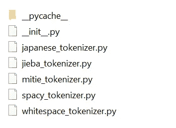
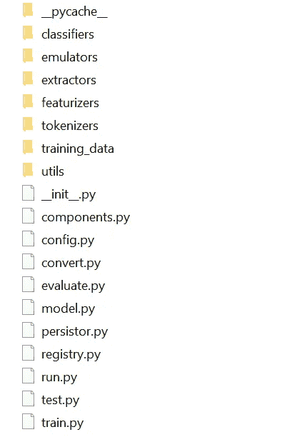
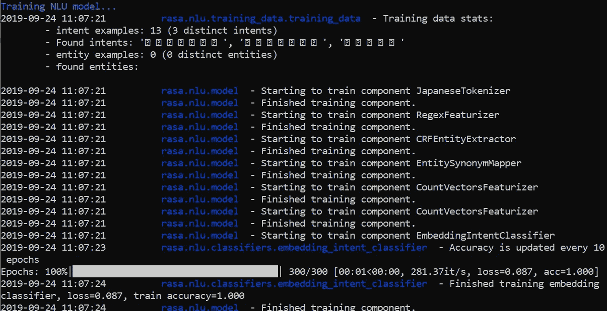

# 使用 Rasa 和自定义标记器的多语言聊天机器人

> 原文：<https://towardsdatascience.com/multi-lingual-chatbot-using-rasa-and-custom-tokenizer-7aeb2346e36b?source=collection_archive---------11----------------------->

使用您自己的多语言聊天机器人自定义标记器来增强 Rasa NLU 管道的提示和技巧。


Photo by [Alex Knight](https://unsplash.com/@agkdesign?utm_source=unsplash&utm_medium=referral&utm_content=creditCopyText) on [Unsplash](https://unsplash.com/s/photos/bot?utm_source=unsplash&utm_medium=referral&utm_content=creditCopyText)

在之前的[教程](/a-beginners-guide-to-rasa-nlu-for-intent-classification-and-named-entity-recognition-a4f0f76b2a96)中，我已经介绍了为意图分类和命名实体识别创建你自己的 Rasa NLU 服务器的基本指南。在本文中，我们将查看向 Rasa NLU 管道添加自定义标记器的必要步骤。本文由 5 个部分组成:

1.  设置
2.  标记器
3.  注册表文件
4.  培训和测试
5.  结论

# 1.设置

默认情况下，Rasa 框架为我们提供了四个内置的标记器:

*   空白符号化器
*   街霸分词器(中文)
*   Mitie Tokenizer
*   空间记号化器

## 内置标记器

如果您在中文语言上测试它，您可以简单地将 config.yml 文件中的标记器名称更改为以下内容，就可以开始了。

```
language: zh
pipeline:
  - name: "JiebaTokenizer"
  - name: "RegexFeaturizer"
  - name: "CRFEntityExtractor"
  - name: "EntitySynonymMapper"
  - name: "CountVectorsFeaturizer"
  - name: "CountVectorsFeaturizer"
    analyzer: "char_wb"
    min_ngram: 1
    max_ngram: 4
  - name: "EmbeddingIntentClassifier"
```

如果您注意到 CountVectorsFeaturizer 有两个实例，请不要惊慌。根据官方[网站:](https://rasa.com/docs/rasa/nlu/choosing-a-pipeline/)

> 管道使用了`*CountVectorsFeaturizer*`的两个实例。第一种基于单词来特征化文本。第二种方法基于字符 n 元语法来描述文本，保留单词边界。根据经验，我们发现第二个特征更加强大，但是我们决定保留第一个特征，使特征更加健壮。

## 自定义标记器

对于其他语言，我们需要修改一些东西。您可以在任何分词器上测试它，但我将使用一个名为 SudachiPy 的日本分词器。我在之前的[文章](/sudachipy-a-japanese-morphological-analyzer-in-python-5f1f8fc0c807)中也提到过这个 python 模块。请随意查看。使用 Rasa NLU 服务器的必要模块设置虚拟环境。完成后，转到下面的[链接](https://github.com/WorksApplications/SudachiPy)并根据给出的说明安装 SudaichiPy。然后，修改 config.yml 文件。

```
language: ja
pipeline:
  - name: "JapaneseTokenizer"
  - name: "RegexFeaturizer"
  - name: "CRFEntityExtractor"
  - name: "EntitySynonymMapper"
  - name: "CountVectorsFeaturizer"
  - name: "CountVectorsFeaturizer"
    analyzer: "char_wb"
    min_ngram: 1
    max_ngram: 4
  - name: "EmbeddingIntentClassifier"
```

我只修改了记号赋予器的名字和语言。你可以给它起任何你喜欢的名字，但是你必须保持它的一致性。稍后我们将修改其他文件。确保使用相同的名称。您需要通过运行以下代码来测试它:

您应该能够看到以下结果:

```
['国家', '公務', '員']
```

# 2.标记器

我们需要创建一个标记器 python 文件。转到虚拟环境的目录，找到以下目录:

```
Lib/site-packages/rasa/nlu/tokenizer/
```

您应该能够看到以下文件(不包括 japanese_tokenizer.py)



创建一个新的 py 文件，并根据自己的喜好命名(我将其命名为 japanese_tokenizer.py)。从版本 1.6.0 开始，tokenizer 的结构发生了一些变化。从 1.7.0 开始，进行了以下更改:

*   添加了 ConveRT 标记器
*   从所有记号赋予器中移除选项`use_cls_token`。令牌化者现在默认添加 CLS 令牌。
*   从特征者中移除选项`return_sequence`。默认情况下，特征返回序列。CLS 表征的特征向量包含完整话语的特征。
*   在`Tokenizer`类中实现了标记化器的`train`和`process`。子类只需要实现`tokenize`。

相应地修改文件。打开它并添加以下代码:

## Rasa 1.6.0 之前

```
import re
from typing import Any, Dict, List, Textfrom rasa.nlu.components import Component          
from rasa.nlu.config import RasaNLUModelConfig
from rasa.nlu.tokenizers import Token, Tokenizer
from rasa.nlu.training_data import Message, TrainingData
```

## Rasa 1.6.0 之后

```
import re
from typing import Any, Dict, List, Textfrom rasa.nlu.config import RasaNLUModelConfig
from rasa.nlu.tokenizers.tokenizer import Token, Tokenizer
from rasa.nlu.training_data import Message, TrainingData
from rasa.nlu.constants import (
    INTENT_ATTRIBUTE,
    TEXT_ATTRIBUTE,
    TOKENS_NAMES,
    MESSAGE_ATTRIBUTES,
)
```

## Rasa 1.7.0 之后

```
import re
from typing import Any, Dict, List, Textfrom rasa.nlu.tokenizers.tokenizer import Token, Tokenizer
from rasa.nlu.training_data import Messagefrom rasa.nlu.constants import TOKENS_NAMES, MESSAGE_ATTRIBUTES
```

除了 regex 之外，所有的导入都很重要。让我们继续创建主类(JapaneseTokenizer)。

## Rasa 1.6.0 之前

```
class JapaneseTokenizer(Tokenizer, Component):
```

## Rasa 1.6.0 和 1.7.0 之后

```
class SudachiTokenizer(Tokenizer):
```

在这个类中，您将需要以下类:

*   __init__
*   火车
*   标记化

您实际上可以复制任何现有的文件，并根据您的需要修改它。标记化应该基于您拥有的语言和模块。需要注意的一点是，您需要返回一个令牌列表。token 类由标记化单词和单词偏移量组成。请参考 JiebaTokenizer.py 和 WhiteSpaceTokenizer.py 以获得更多关于结构 Tokenizer 类的信息。

我的最终代码如下所示:

## Rasa 1.6.0 之前

## Rasa 1.6.0 之后

## Rasa 1.7.0 之后

# 3.注册表文件

下一步是修改所有的配置文件。每次升级或降级 rasa 版本时，您都必须这样做。转到虚拟环境的目录，找到以下目录:

```
Lib/site-packages/rasa/nlu/
```

您应该有以下文件夹和文件



打开 registry.py 文件并开始编辑内容。在导入区域，添加以下代码:

```
from rasa.nlu.tokenizers.japanese_tokenizer import JapaneseTokenizer
```

*   **Japanese _ tokenizer**:py 文件的名称。
*   **JapaneseTokenizer** :类的名称。您必须确保该名称与 config.yml 和 component_classes 中使用的名称完全相同。

在同一个 registry.py 文件中，找到 component_classes 列表并向其中添加 JapaneseTokenizer(根据您自己的类名修改它)。

```
component_classes = [
    # utils
    SpacyNLP,
    MitieNLP,
    # tokenizers
    JapaneseTokenizer,
    MitieTokenizer,
    SpacyTokenizer,
    WhitespaceTokenizer,
    JiebaTokenizer,
...
```

保存文件，我们现在准备测试它。

# 4.培训和测试

在虚拟环境中打开一个终端，并将其指向 config.yml 文件的基目录(我们在第一节中修改过的那个目录)。确保您有一个包含培训数据的数据文件夹。运行以下代码:

```
rasa train nlu
```

培训可能需要一些时间，这取决于您的意向数量。您应该能够看到以下输出:



一旦完成，你应该在模型文件夹中有一个 tar.gz 文件。运行以下命令进行测试(相应地修改模型的名称):

```
rasa shell -m models/nlu-20190924-144445.tar.gz
```

它将在终端内部运行交互式 shell 模式。你可以输入你的句子来测试结果。

# 5.结论

让我们回顾一下为 Rasa NLU 设置日语分词器的基本步骤。首先，我们需要修改 config.yml 文件并安装 SudachiPy 模块。

然后，我们创建了一个 japanese_tokenizer.py 文件，其中包含初始化、训练和标记化所需的代码。

我们继续修改 registry.py 文件，将导入代码和 JapaneseTokenizer 引用添加到 component_class 列表中。

最后，我们通过 rasa 提供的交互式 shell 模式对模型进行训练和测试。

希望你喜欢这篇文章，下次再见！

# 参考

1.  [https://towards data science . com/a-初学者指南-rasa-nlu-for-intent-class ification-and-named-entity-recognition-a4f 0f 76 B2 a96](/a-beginners-guide-to-rasa-nlu-for-intent-classification-and-named-entity-recognition-a4f0f76b2a96)
2.  [https://towards data science . com/Suda chipy-a-Japanese-morphological-analyzer-in-python-5 f1 F8 fc 0 c 807](/sudachipy-a-japanese-morphological-analyzer-in-python-5f1f8fc0c807)
3.  [https://gist . github . com/wfng 92/831 b 47 df 29 de 687 c8ea 3264 FFB 9134 ee](https://gist.github.com/wfng92/831b47df29de687c8ea3264ffb9134ee)
4.  [https://github.com/WorksApplications/SudachiPy](https://github.com/WorksApplications/SudachiPy)
5.  [https://rasa.com/docs/rasa/nlu/choosing-a-pipeline/](https://rasa.com/docs/rasa/nlu/choosing-a-pipeline/)