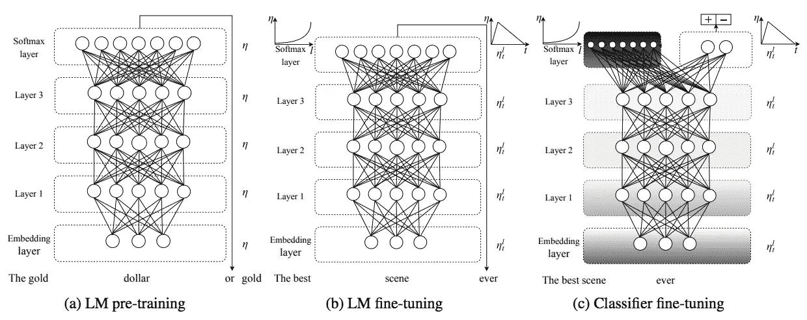
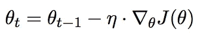
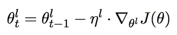
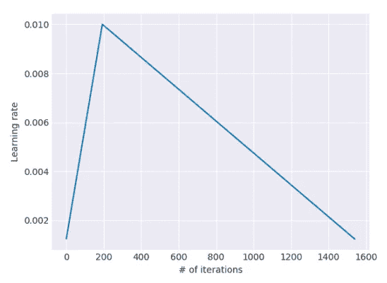
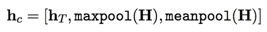
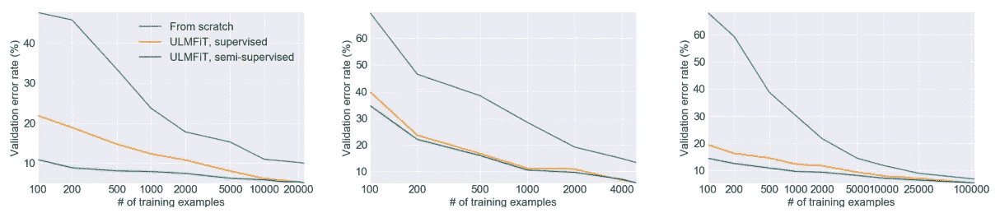
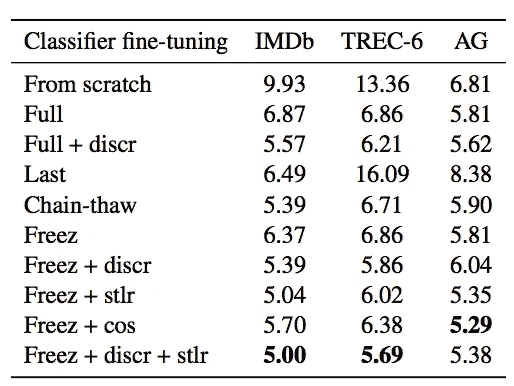
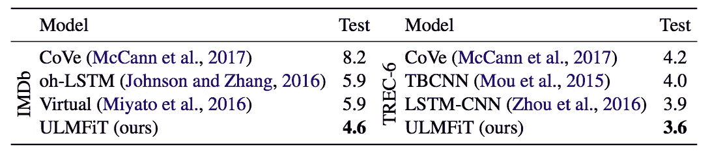
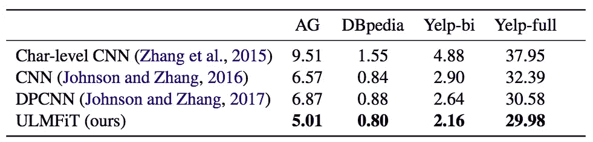

# 文本分类语言模型中的多任务学习

> 原文：<https://towardsdatascience.com/multi-task-learning-in-language-model-for-text-classification-c3acc1fedd89?source=collection_archive---------20----------------------->

## 用于文本分类的通用语言模型微调

Photo by [Jeremy Thomas](https://unsplash.com/@jeremythomasphoto?utm_source=medium&utm_medium=referral) on [Unsplash](https://unsplash.com?utm_source=medium&utm_medium=referral)

Howard 和 Ruder 提出了一种新的方法，通过使用预训练嵌入、LM 微调和分类微调来实现任何 NLP 任务的鲁棒迁移学习。具有相同超参数但不同下降的样本 3 层 LSTM 架构展示了用于 6 个下游 NLPS 任务的超越和稳健的模型。他们将其命名为通用语言模型微调(ULMFiT)。

本故事将讨论关于[文本分类的通用语言模型微调](https://arxiv.org/pdf/1801.06146.pdf) (Howard 和 Ruder，2018)，并将涵盖以下内容:

*   体系结构
*   实验
*   履行

# 体系结构

如前所述，ULMFiT 有 3 个阶段。第一阶段是使用通用领域数据来建立 LM 预训练模型。第二阶段是对目标数据集 LM 进行微调，第三阶段是对目标数据集分类进行微调。语言模型(LM)是平均随机梯度下降权重下降长短期记忆(AWD-LSTM)。它不使用变压器，而是使用具有各种调谐压差超参数的常规 LSTM。

Flow of ULMFiT (Howard and Ruder, 2018)

## 通用域 LM 预训练

这是一个不受领域限制的问题，因此我们可以利用任何数据来训练模型。换句话说，数据量可能非常非常大。例如，它可以使用维基百科或 reddit 内容的全部内容。这样做的目的是获取一般特征来处理不同类型的下游问题。大量的实验表明迁移学习对自然语言处理有显著的改善。

## 目标任务 LM 微调

有一个通用的向量，它可能不会直接在特定的问题上表现很好，因为它太一般了。所以微调是必须的动作。首先，模型将通过语言模型(LM)问题进行微调。理论上，它比一般领域的 LM 训练收敛得更快，因为它只需要学习目标任务的单源特性。使用了一些技巧来提高 ULMFiT 的性能。他们是`discriminative fine-tuning`和`slanted triangular learning rates`。D

***区别性微调*** 提出对不同层使用不同的学习速率。从实验中，Howard 和 Ruder 发现只选择最后一层的学习速率。最后 2 层的学习率是最后一层/ 2.6，并且使用相同的公式来设置较低层的学习率。

Stochastic Gradient Descent (SGD). η is learning rate while ∇θJ(θ) is the gradient of objective function. (Howard and Ruder, 2018)

SGD with discriminate fine-tuning. η l is learning rate of l-th layer. (Howard and Ruder, 2018)

***【斜三角形学习率(STLR)*** 是另一种使用动态学习率的方法，它在开始时线性增加，然后线性衰减，从而形成一个三角形。

STLR Formula. T is number of training iteration. cut_frac is the fraction of increasing learning rate. cut is the iteration switching from increasing to decreasing. p is the fraction of the number of iterations which increase or decreased. (Howard and Ruder, 2018)

Slanted triangular learning rate schedule used for ULMFiT (Howard and Ruder, 2018)

## 目标任务分类器微调

该分类器层中的参数是从零开始学习的。由于强信号可以存在于任何地方，但不限于序列中的最后一个字，Howard 和 Ruder 建议通过最大轮询和平均轮询来连接所有层。

Concatenate layers. hT is the hidden state at the last time step. (Howard and Ruder, 2018)

除了将最后一个隐藏状态与最大池和平均轮询连接起来，在这个阶段还应用了一些技巧来提高性能。招数有`gradual unfreezing`、`BPTT for Text Classification (BPT3C)`和`bidirectional language mode`。

***逐步解冻*** 是在第一个历元中冻结除最后一层以外的所有层，只微调最后一层。在下一个时期，最后冻结层将被解冻，并微调所有未冻结层。在未来时代，越来越多的地层将被解冻。

***用于文本分类的 BPTT(BPT3C)***如果输入序列很大，启用梯度传播。一个大的输入序列(假设是一个文档)将被分成固定长度的批。每一批的初始隐藏状态是前一批的最终状态。如前所述，最大池和平均轮询被跟踪和反向传播。

***双向语言模型*** 利用正向和反向 LM 从输入中学习特征。

# 实验

从 IMDb，TREC-6 和 AG 数据集，你可以注意到，如果目标数据集很小，它获得了很大的好处。

Validation errors for IMDb, TREC-6, and AG (Howard and Ruder, 2018)

霍华德和鲁德提出了许多提高性能的技巧。下图展示了技巧组合的结果。

*   完整:微调完整模型
*   discr:应用区别性微调。
*   最后:仅微调最后一层
*   解冻链:文本分类的 BPTT
*   Freez:逐渐解冻
*   stlr:倾斜三角形学习率
*   cos:积极的余弦退火计划

Comparison result among different tracks. (Howard and Ruder, 2018)

IMDb Comparison Result (Howard and Ruder, 2018)

AG, DBpedia, Yelp-bi and Yelp-full Comparison Result (Howard and Ruder, 2018)

# 履行

fast.ai 提供了一个来自 [github](https://github.com/fastai/fastai/blob/master/examples/text.ipynb) 的样本代码。

# 拿走

*   本文提出了几种新颖的微调技术。
*   展示了自然语言处理中迁移学习的能力。

# 关于我

我是湾区的数据科学家。专注于数据科学、人工智能，尤其是 NLP 和平台相关领域的最新发展。你可以在 LinkedIn[和我联系，或者在 Medium](https://www.linkedin.com/in/edwardma1026) 或 Github 上关注我。

# 参考

J.霍华德和史路德。[文本分类通用语言模型微调](https://arxiv.org/pdf/1801.06146.pdf)。2018