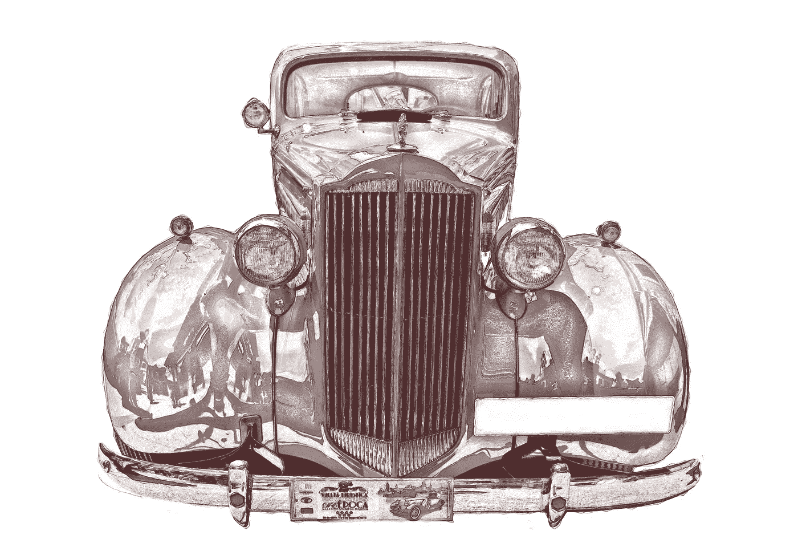
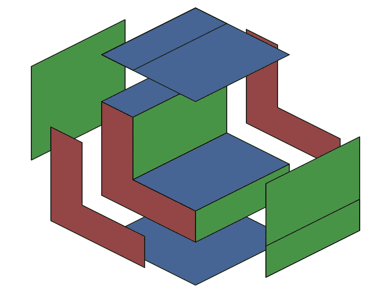
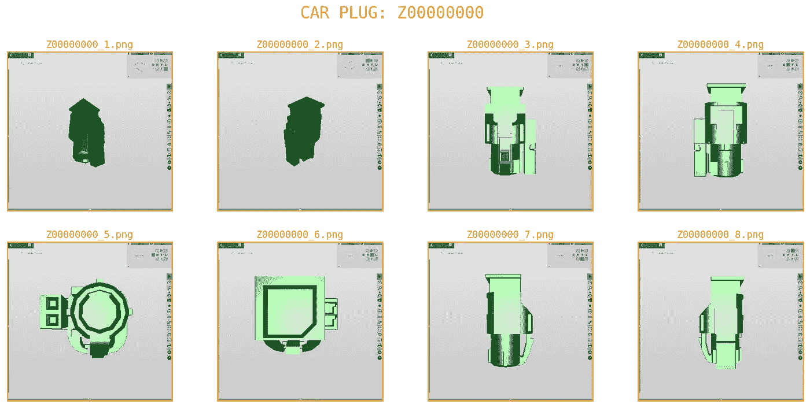
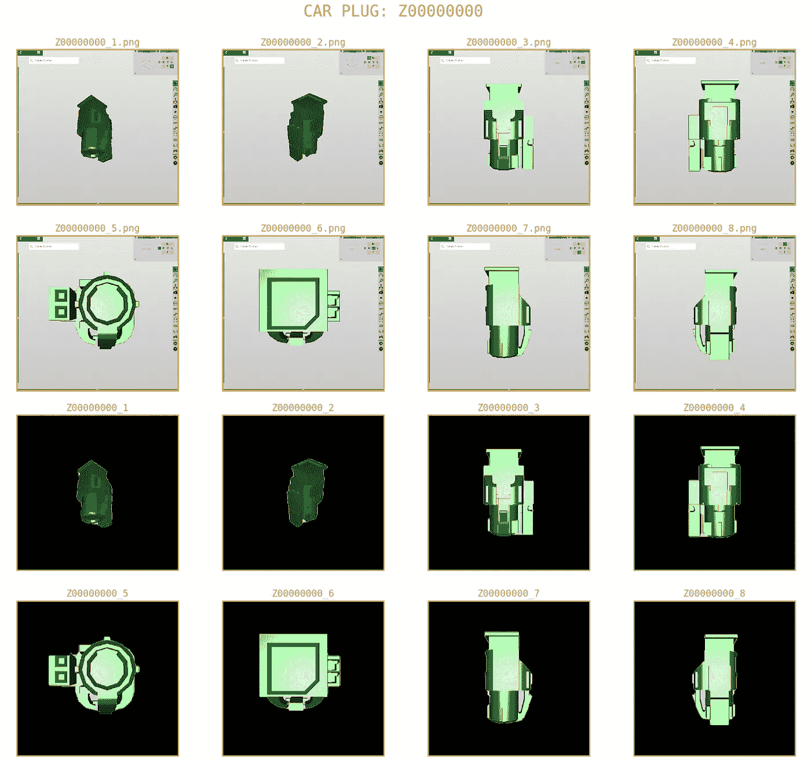
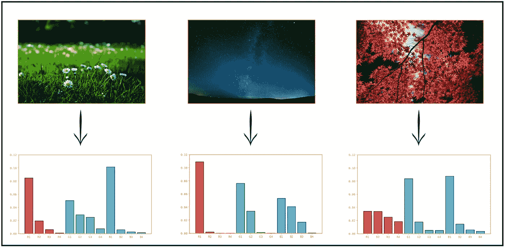
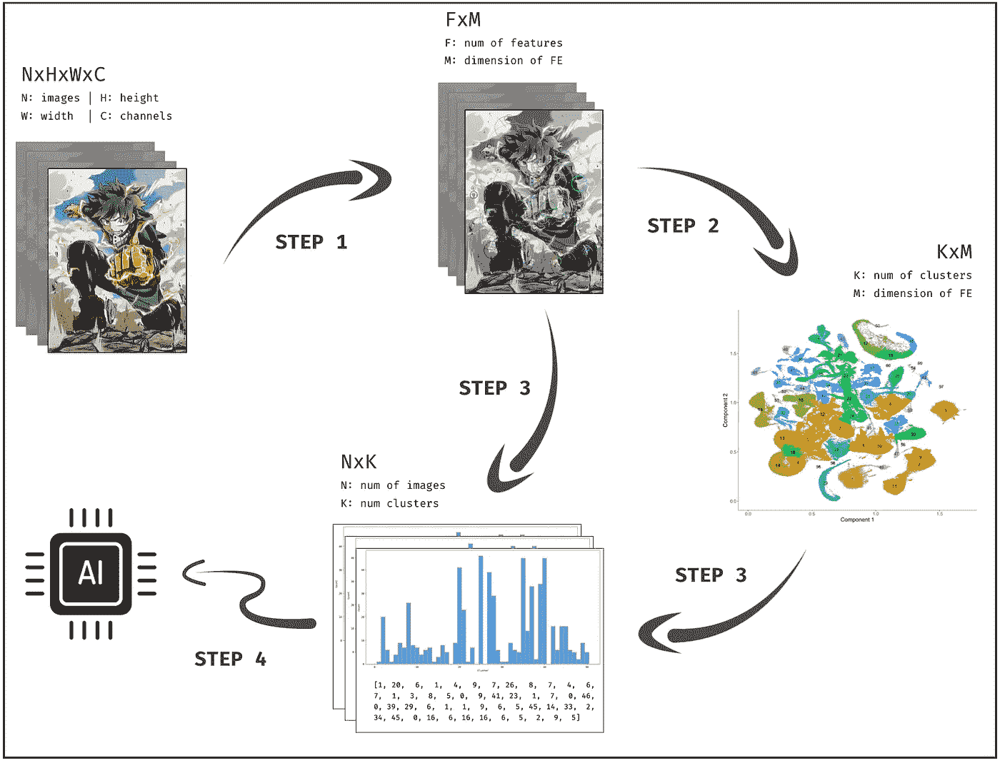
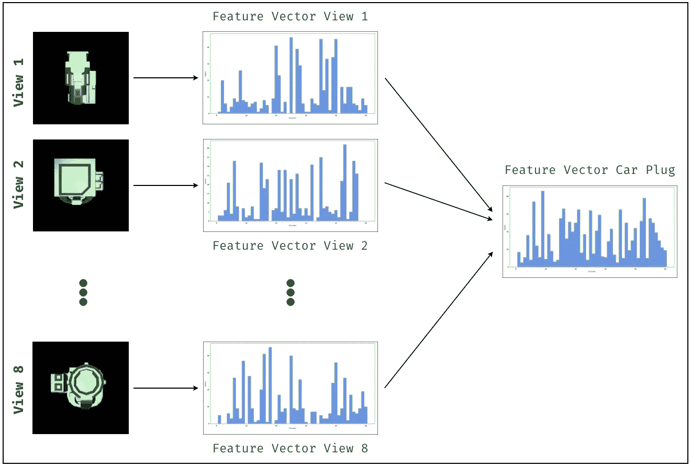
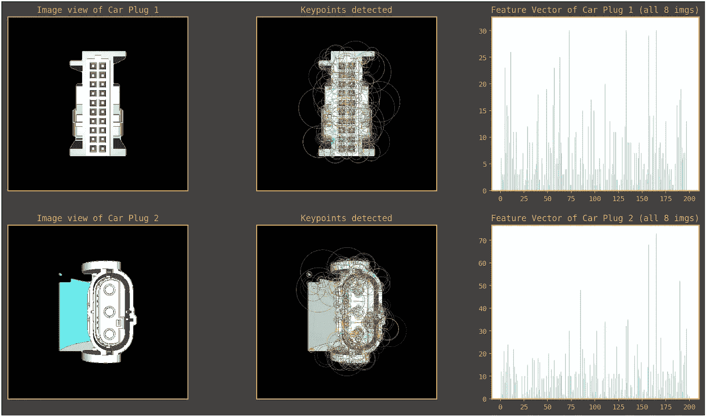
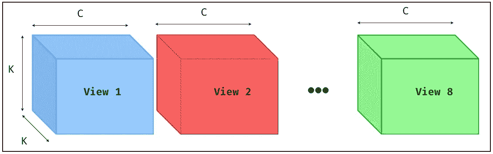
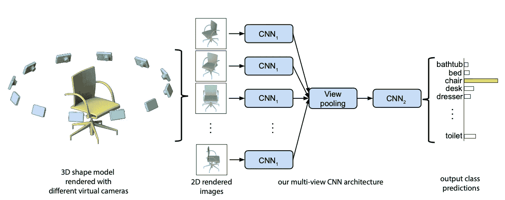

# 多视角图像分类

> 原文：<https://towardsdatascience.com/multi-view-image-classification-427c69720f30?source=collection_archive---------5----------------------->

## 从逻辑回归到多视图卷积神经网络

Vintage Car Design. Credit © Publicdomainphotos | [Link](https://www.stockfreeimages.com/121708322/Motor-Vehicle-Car-Automotive-Design-Vintage-Car.html#)

# 介绍

不久前，我参加了戴姆勒-奔驰主办的机器学习黑客马拉松。我们面临的问题相当有趣，并不常见。所以我决定写一篇关于它的文章，以防我的方法可以帮助其他面临类似任务的人。

在本文的第一章，我将尝试展示我的成功方法，向您展示我的思考过程，证明一些设计选择的合理性，并阐述一些有趣的概念。另一方面，第二章将致力于一个更复杂的基于神经网络的解决方案，它天生适合于这类问题。在页面的底部，你可以找到我的 Github 库的链接，我在那里分享了支持本文信息的代码。

我们要解决的问题是根据 2D 视觉信息，将汽车插头的 3D 模型分为五类。解决这一任务非常有价值，尤其是在汽车制造装配过程的自主规划的背景下。

该问题最有趣的方面是每个汽车插头有 8 个图像，其中 6 个对应于物体的正交投影(即不同的视图:顶视图、底视图、前视图、后视图、左视图和右视图)，而另外 2 个是随机的等轴投影。下面的图 1 显示了一个正交投影的例子。

Figure 1 : Orthographic Projections.

# 挑战

在这场比赛中有三个主要的挑战，得分取决于识别这些障碍并正确解决它们。第一个，可能是最明显的一个，是类不平衡的情况，其中两个类在数据集中比其他三个类更不常见。考虑到这一点很重要，因为竞赛中使用的性能指标是一个极不均匀的加权准确度，它考虑了类别的分布(即，稀有类别对于正确分类相对更重要，有时是 80 倍)。第二个挑战是，我们有五个小时的时间来编写所有代码，不能访问云或任何其他加速计算的方式(除非我们的个人笔记本电脑配备了 Nvidia GPUs，但大多数都没有)。最后，对每个物体进行分类的多幅图像的可用性提出了一个问题，即如何将从所有 8 幅图像中收集的视觉信息结合起来，以便做出充分知情的预测。这最后一个挑战是这篇文章背后的主要动机。

对于类不平衡的问题，重采样技术不是一个好的选择。事实上，下采样实际上是不可能的，因为我们总共只有 833 个汽车插头(总共 833x8 = 6664 个图像),并且稀有类的样本数量非常少。此外，使用数据扩充，虽然在技术上是可能的，但对我来说似乎不是一个好主意，因为产生图像视图的正交投影是一种具有严格规则集的工程制图。因此，应用任何类型的几何变换都会产生不属于原始数据分布的图像:使用这些图像进行训练基本上就像推动模型学习如何预测它永远不会面对的图像，从而不必要地增加了问题的复杂性。同样值得注意的是，颜色在我们的图像中没有任何意义。为了更好地理解这一点，下面的图 2 提供了一个汽车插头的不同原始图像的例子。

Figure 2 : Different views of a Car Plug (code name anonymized)

我决定解决班级不平衡问题的方法是通过成本敏感学习，这基本上意味着通过引入一组权重来修改机器学习算法的成本函数，以便为“重要”班级中发生的错误分配更重的惩罚。这种变化有助于引导模型训练以潜在的犯更多“更便宜”的错误为代价，减少那些代价高昂的错误。为了进一步说明这一点，假设我们有 50 个数据点，49 个属于 A 类，1 个属于 b 类。为了简单起见，我们还假设 0–1 损失(0 表示正确预测，1 表示不正确预测)而不是普遍的交叉熵损失。在正常情况下，所有类别的权重都是 1，模型将尝试学习如何正确预测大多数数据点，而不考虑它们的类别。但是，如果我们假设对 B 类样本的错误分类承担了 A 类样本的 x100 的成本，并且我们修改了成本函数以考虑这一点，那么模型将最终选择正确地对 B 类的一个数据点进行分类，即使这意味着对所有其他 49 个数据点的预测失败，因为这是使总成本最小化的设置:49*1 + 0*100= 49。相反，如果我们在 B 类数据点中犯了一个错误，并且我们得到了所有其他 A 类样本，则成本将是:49*0 + 1*100 = 100，这仍然远远高于前一种情况。在实践中使用成本敏感学习就像将一个权重字典传递给算法构造器(至少那些支持它的构造器)一样简单。

由于时间限制和缺乏合适的计算资源，我决定远离任何基于神经网络的方法，原因很简单，因为在 CPU 上正确配置和训练需要太多时间。相反，我选择了更传统的计算机视觉解决方案，将流行的手工设计的特征提取器与经典的机器学习算法结合起来。伙计们，这是一个关于逻辑回归如何赢得计算机视觉黑客马拉松第一名的故事。

首先，我们将介绍我在黑客马拉松中使用的方法。然后，我们将提出一个基于神经网络架构的潜在更好的替代方案，它可以固有地处理多视图问题。在竞赛期间，我也想到了第二个解决方案，但是我知道，由于时间和资源的限制，我无法实现它。不过后来我试了一下，果然提供了比较好的效果。

# 图像处理

正如我们在图 2 中看到的，在将这些图像或它们的矢量表示提供给任何机器学习算法之前，我们需要处理几个问题。首先，我们需要去掉右侧和顶部不必要的视觉效果(搜索栏、菜单等)。).第二，我们需要去除背景中的灰色阴影，这将通过降低数据中的噪声水平来显著加快训练速度。

事实证明，我们可以使用一个简单的过程来做这两件事:我们首先使用 **Canny 边缘检测器**来检测边缘，然后我们应用两个连续的形态学操作:**膨胀**来使边缘变大，并连接边缘检测后断开的部分，然后我们使用**腐蚀**来使边缘变薄恢复正常(膨胀后的腐蚀通常被称为**闭合**，并用于填充比这些操作的内核尺寸更小的孔洞)。之后，只需找到所有轮廓并保留最大的轮廓，该轮廓将与中间的汽车插头相对应。这样，我们也丢弃了边界周围所有多余的工件。下面的图 3 显示了这个过程前后汽车插头的图像。

Figure 3 : Preprocessing of images : Canny edge detection followed by two morphological operations (Dilation and Erosion), followed by a contour detection to isolate the object in the middle.

此时，我们可能会想，既然颜色没有任何有意义的价值，我们不妨将这些图像转换成灰度。在基于经典机器学习算法的第一种方法中，我们将做到这一点。但是对于下面的基于神经网络的一个，我们保留 3 个通道，因为我们将利用迁移学习。

# 方法 1:特征提取和机器学习

在深度学习时代之前，研究人员曾经手工制作特征提取器来表征图像。但是我们所说的特征提取器到底是什么意思呢？本质上，它是一个提取图像或其一部分的数字表示的函数，并且被设计来捕捉它的一些区别特征。假设我们有一个 RGB 图像，每个颜色通道由三个 2D 矩阵组成，值在 0 到 255 之间。我们可以将每个矩阵量化为 4 个区间(0–63，64–127，128–191，192–255)，每个区间包含相关范围内的像素值。通过这种方式，我们可以用 4 个数值(x_1，x_2，x_3，x_4)的向量来表示 2D 矩阵，其中每个 x_k 是矩阵中落在面元号 k 内的值的数量。我们可以对 RGB 图像的 3 个通道重复这一过程，并且在连接之后，我们将以表示该图像的大小为 12 (4 个面元* 3 个通道)的向量结束。我们刚刚创建了一个简单的特征提取器来捕获图像的颜色信息。虽然本质上很简单，但实际上你可以在颜色是最能提供信息的因素的任务中使用这种技术。图 4 显示了这个特征提取器的运行情况。请注意，在特征向量中，每个图像的主色的较高的面元是如何被更好地区分的。这种表现明确地抓住了三个图像之间的差异。

Figure 4 : Example of a color feature extractor.

多年来，学术界提出了各种手动设计的用于不同目的的特征提取器。几个重要的是 HOG(梯度方向直方图)，SIFT(尺度不变特征变换)，SURF(加速鲁棒特征)，LBP(局部二进制模式)等。这些提取器的设计过程的主要焦点是确保对图像的某些属性的鲁棒性:比例、照明、部分遮挡、旋转、失真等。这些方法是传统计算机视觉的核心支柱，一直持续到深度学习的出现，在深度学习中，它们基本上被神经网络所取代，神经网络可以学习自己的特征提取机制，与他们需要以端到端的方式解决的任务相关。不出所料，这有助于他们取得优异的总体成绩。

好了，聊够了！那么我们如何使用这些特征提取器来解决我们的问题呢？首先，我们将讨论它们传统上是如何被用来解决标准图像分类问题的，然后我们将介绍我是如何将这一过程应用于多视图任务的。

大多数特征提取器首先检测图像中感兴趣的关键点，然后为每个关键点产生矢量描述。描述符通常是固定大小的数字向量。

来自所有图像的描述符被收集，然后被聚类以得出一组原型(即质心)，这些原型充当“视觉单词的词汇表”。然后，我们执行图像量化:我们在每个图像中找到视觉单词，并创建计数特征向量，类似于我们在文本分类任务中通常遇到的单词袋方法中所做的。该过程的步骤详述如下:

1.  在将所有“训练”图像(每个图像可能有许多特征)转换成灰度之后，从所有“训练”图像中提取所有特征，转换成形状为 FxM 的矩阵，其中 F 是找到的特征的数量，M 是特征提取器的维数(通常为 64 或 128)。
2.  使用聚类算法(例如 K-means)对 FxM 矩阵进行聚类，其中 K(聚类数)将表示我们在整个数据集中找到的视觉单词的词汇表。每个簇都是一个视觉单词。
3.  对于每幅图像，提取所有特征，预测它们的聚类，并计算每个聚类下有多少特征。换句话说，我们统计词汇表(也称为码本)的每个视觉单词在图像中的出现次数。结果是表示图像的大小为(1，K)的特征向量。应用于数据集中的所有图像，我们最终得到形状(N，K)的矩阵，其中 N 是图像的数量，K 是词汇的大小(即聚类的数量)。换句话说，一个矩阵，其中行代表我们的图像(数据点)，列代表属性或特征。该矩阵的每个单元表示在行图像中找到的属于列聚类的特征的数量。
4.  对该矩阵使用任何经典的机器学习算法进行分类:逻辑回归、SVM、随机森林、MLP 等。也就是说，在这种情况下应该避免使用基于树的方法，因为这个问题很可能是线性的，就像大多数文本分类任务中的情况一样。

因为一张图胜过千言万语，所以让我们通过一个简单的流程图来进一步解释这个过程。请注意步骤 1 后在灰度图像上检测到的关键点(彩色圆圈)。

Figure 5 : Flow diagram of the process of converting a set of images into a feature matrix where each row is an image and each column is an attribute or feature.

有了这些知识，我们就可以想出一种方法来使这种方法适应我们的多视图分类问题。我们需要引入的变化实际上非常简单，发生在步骤 3:我们将从所有 8 幅图像中提取特征，然后将它们转化为代表汽车插头的单一特征向量，而不是从图像中提取特征并将其转化为一袋单词特征向量。如果我们将相同的方法应用于多视图文本分类任务(其中由多个文本组成的概念需要被分类)，这将相当于组合在与给定概念相关的所有文本中找到的单词，然后构建单词出现特征向量。图 6 显示了这个过程。

Figure 6 : Combining features extracted from all 8 view images into a single feature vector for the Car Plug.

好了，现在让我们谈谈一些实际问题。我的大多数决定都是为了优化时间和性能。就特征提取器而言，SIFT 是一个非常可靠的选择，但我实际上使用了 SURF，它基本上是 SIFT 的一个更快的版本，具有相对相似的性能。对于 SURF 特性的维度，我选择 64 而不是 128，主要是为了加速任何进一步的训练。我希望 128 能提供稍微好一点的性能。得到的矩阵具有大小为 64 的大约 800K 个特征。选择 K-means 中的聚类数 K 是下一个重要的决定。这是因为 K 代表将构成最终特征矩阵的列的视觉单词的数量。通常在这种情况下，值越高越好，但是收益递减法则适用，超过某个点后，边际改进将不值得复杂性增加。在我的例子中，我选择 K=200，但是高达 800 的值是标准的，应该进行试验。在这一点上，我只是创建了大小为 833x200(汽车插头数量 x 集群数量)的最终特征矩阵。图 7 显示了特征向量的两个例子和每个插头的一个随机选择的图像视图。

Figure 7 : Two examples of key-point detection on a single view and the final feature vector of the associated Car Plug.

在训练了一个逻辑回归模型后，我得到了平均 87%的加权准确率(未加权的准确率很容易在 90–95%的范围内)。这是一个相当不错的分数，但我们能做得更好吗？我们绝对可以试试！

# 方法 2:多视图卷积神经网络

本节将专门介绍一种用于处理多视图问题的定制神经网络架构。如果我们退后一步，花一秒钟来思考这个问题，我们将如何使用神经网络来将我们的输入映射到它们的类别？嗯，在一个标准的图像分类问题中，我们会选择一个流行的 CNN 架构(ResNet，Inception，VGG 等)的基础。)作为特征提取器，然后在其上添加一个分类器块，由一个或多个稠密层组成，作为迁移学习的一种形式。如果我们试图在我们的多视图图像任务中使用类似的原理，我们可以想象多次创建网络的基础块(特征提取器)，每个图像视图一个。这样，我们使用迁移学习分别从所有 8 幅图像中提取特征。然而，我们仍然会遇到与之前相同的问题:我们没有在开始时组合来自图像的信息，而是推迟了此事，现在我们必须组合来自多组特征地图(即代表由基本 CNN 产生的每个视图的特征地图)的信息。处理这个问题的一个方法是将这些特征地图堆叠在一起。例如，如果每个视图的特征图具有 KxKxC 的形状，我们可以将它们中的 8 个沿着通道的维度堆叠成一大组 KxKx8C 形状的特征图。图 8 展示了这个过程。

Figure 8 : Combining views’ features maps by stacking them across the channel dimension.

无论我们如何选择堆栈，这种方法的问题在于它假设图像视图是有序的，而实际上并不存在。如果我们首先堆叠俯视图的特征图，最后堆叠仰视图的特征图，那么我们应该对每个汽车插头做同样的事情。然而，没有参考指定什么是汽车插头的顶部，什么是底部，我们可以认为任何观点是任何一方。或者说，如果我们拿两个汽车插头，第一个插头的一个视图，没有办法在第二个汽车插头中找到“等价”的视图。因此，应该避免任何基于顺序的假设。

我们还有第二种选择，即寻找一种将来自多个值的信息组合成一个值的操作。事实证明，在 CNN 中有一个这样的功能，我们称之为池化。我们可以在视图的维度上使用某种形式的池，将 8 组特征图组合成一个相同的形状，从而组合来自所有图像视图的信息。这一切都很好，但到目前为止这只是一个理论上的想法，有任何证据表明这实际上可以工作吗？在文本分类中可以找到一个这样的证明，例如，我们通过取所有嵌入的平均值，将文本中每个单词的单词嵌入组合成单个嵌入。我们正在尝试为我们的图像视图做一些类似的事情。但也许，更好的证明是找到一篇尝试这种方法的论文，并提供支持它的实验结果。快速谷歌搜索会发现有一篇这样的论文(虽然不是唯一的)，它被方便地称为:用于 3D 形状识别的多视图卷积神经网络。图 9 显示了论文中提出的架构，这几乎正是我们上面解释的。

Figure 9 : Each object view is fed to the same CNN1 base, then we apply a pooling operation across the view dimension. The pooled view is then fed into a second CNN2 before being classified. The authors use the second CNN in order to learn a compact representation for the 3D shape, which they use for both classification and retrieval. For a simple classification, we can do away with it [1].

我在 PyTorch 中实现了这个 MVCNN 架构，并为 CNN1 使用了一个 *ResNet34 Base* 。在一个*平均视图池*层之后，我在上面添加了一个块，由一系列*密集*层和*去除*正则化组成，我称之为*分类器块*。为了训练，我最初固定了基本的 CNN1，并且只训练了*分类器块*:这在迁移学习中通常被称为**特征提取。然后，我解冻整个网络中的所有权值，把学习率降到一个很低的值，对整个 MVCNN 进行端到端的训练:这在迁移学习中被称为**微调**。最终，我的加权准确率达到了 98%……非常令人印象深刻，是吧？实际上没有那么多。除了怪异的性能指标和类别不平衡，高分应该是意料之中的，因为这项任务对机器学习来说可能不是很有挑战性。**

是的，是的，我知道你可能只是为了密码而来，我很乐意效劳！你会在这个 github repo 里找到你需要的一切:[代码](https://github.com/SAMY-ER/Multi-View-Image-Classification)。笔记本评论很好，但遗憾的是，我不能分享数据。如果您热衷于试验这里提出的技术，并且您没有合适的数据集，可以考虑使用多视图图像分类的基准: [ModelNet40](https://modelnet.cs.princeton.edu) 。如果您对第一种方法更感兴趣，任何普通的影像分类数据集都可以。

这就是我的乡亲，我希望你学到了一两件事。如果你喜欢这些内容，不要犹豫回来，我很快会推出更多的文章。

直到那时，再见~

# 参考

[1]苏，杭，等.用于三维形状识别的多视角卷积神经网络."*IEEE 计算机视觉国际会议论文集*。2015.