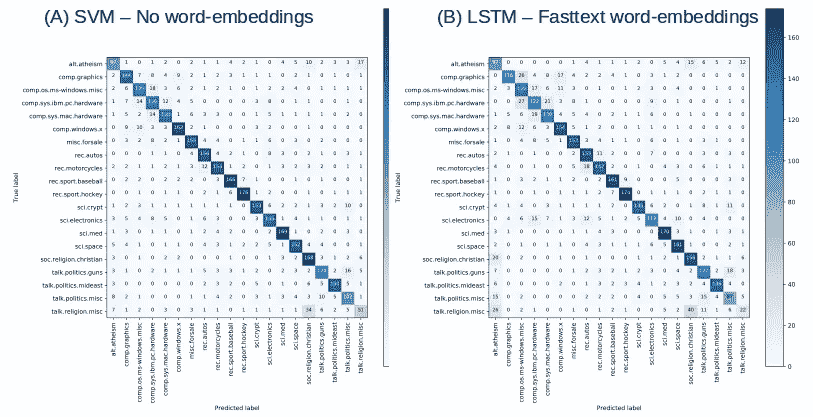
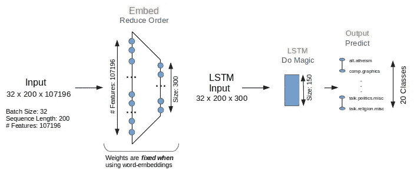
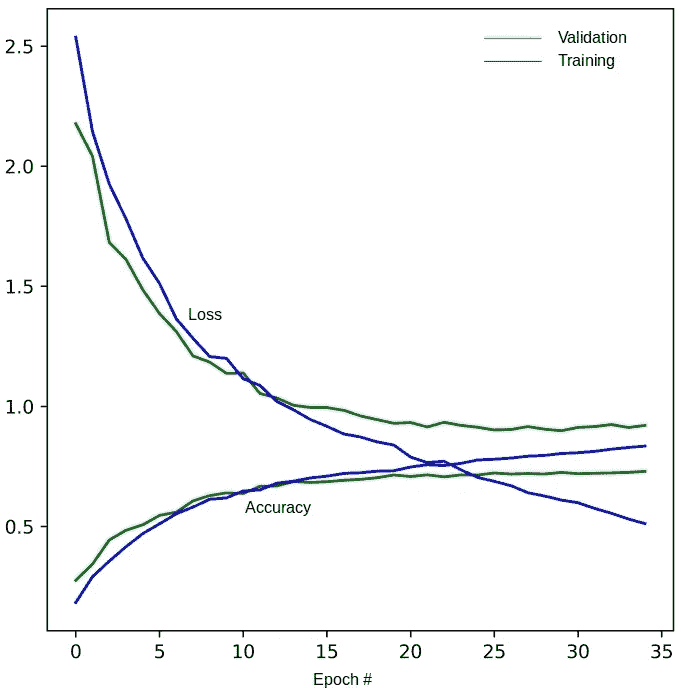
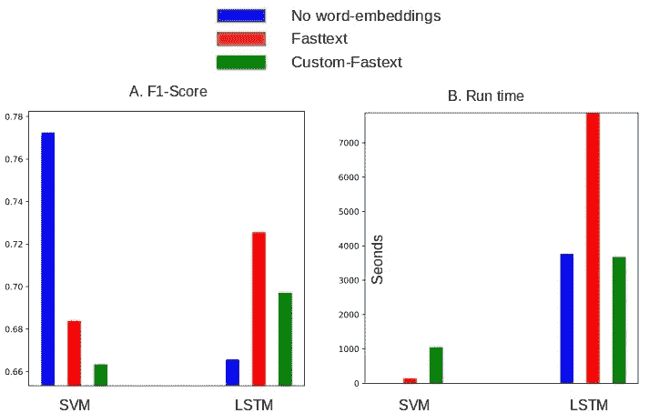

# 基于单词包和单词序列的多类分类

> 原文：<https://towardsdatascience.com/multiclass-classification-with-word-bags-and-word-sequences-4fffd4d62e0c?source=collection_archive---------12----------------------->

## 使用 tf-idf 向量的 SVM 在分类 20 个新闻组文本语料库的质量和性能上超过了 LSTM。



文档是一个特定的单词序列。但并不是所有的单词序列都是文档。将两者的区别传授给算法是一项艰巨的任务。在文本分析中考虑单词序列通常计算量很大。LSTM 等深度学习方法允许我们将文档建模为一串单词，最近他们确实在 NLP 任务中取得了一些成功。

另一方面，当我们[撕碎文件并按单词制作袋子](http://xplordat.com/2018/01/23/stacks-of-documents-and-bags-of-words/)时，我们最终得到这些单词的权重/数量的向量。从文档到这个向量的映射可以是多对一的，因为所有可能的单词序列都产生相同的向量。所以对原始文件含义的破译(更不用说复活它了！)，从这个向量是不可能的。然而，这种用几十年的旧词汇来建模文档的方法一直是 NLP 任务的主要支柱。

当单词的顺序对于确定文档的类别很重要时，单词串方法将胜过单词包。我们已经用[的合成文档](http://xplordat.com/2019/01/13/word-bags-vs-word-sequences-for-text-classification/)证明了这一点，在那里，LSTM 打败了单词袋方法(使用 tf-idf 向量的朴素贝叶斯方法)进行分类。但是对于针对[二元情感分类](http://xplordat.com/2019/01/28/sentiment-analysis-with-word-bags-and-word-sequences/)的电影评论的真实文本语料库，我们已经表明 LSTM 和 SVM(具有 tf-idf 向量)在质量上是可比的，即使前者花费的时间长得多。

这篇文章的目的是进一步评估“袋子和绳子”在多种情况下的区别。我们将使用从 [scikit-learn api](https://scikit-learn.org/0.19/datasets/twenty_newsgroups.html#) 获得的 20 个新闻组文本语料库。我们还将看看使用单词嵌入的影响——包括预先训练的和定制的。我们在这里浏览一些代码片段，但是完整的代码可以从 [github](https://github.com/ashokc/Multiclass-classification-with-word-bags-and-word-strings) 下载。[late expage]

# 1.对 20 个新闻语料库进行标记

这个语料库由 20 个新闻组的帖子组成，因此它们都有很好的标签。有超过 18000 个帖子差不多均匀地分布在 20 个主题上。在下面的代码片段中，我们获取这些帖子，清理并标记它们，为分类做准备。

*   第 7–9 行。符号化。删除所有标点符号和 NLTK 停用词。确保所有单词/标记都以字母开头。并且只保留长度在 3 到 15 个字符之间的单词。
*   第 13 行:使用 scikit-learn api 来获取帖子，但要确保删除关于给定帖子属于什么主题的“泄露”线索。
*   第 22 行:记下每个文档中的字数有助于我们稍后为 LSTM 选择合理的序列长度。nTokens 上的百分位数统计显示，超过 92%的文档都少于 200 个单词。

# 2.单词嵌入

[单词嵌入](http://xplordat.com/2018/09/27/word-embeddings-and-document-vectors-part-1-similarity/)很短(长度 *p* 比词汇的大小短得多 *nWords* )单词的数字向量表示。它们允许我们将单词空间的维度从语料库词汇的长度(这里大约 107，000)减少到更短的长度，比如这里使用的 300。[下载预先训练好的 fasttext](https://s3-us-west-1.amazonaws.com/fasttext-vectors/crawl-300d-2M.vec.zip) 单词向量，通过 [Gensim](https://radimrehurek.com/gensim/index.html) 离线[生成电影语料库的自定义 fasttext。在这两种情况下，一旦拿到手，它们就被简单地从磁盘上读取。](http://xplordat.com/2018/10/09/word-embeddings-and-document-vectors-part-2-classification/)

*   第 6–7 行:我们在 json 文件中有定制的 Gensim 生成的单词向量，其结构为{*word*:*vector*，..}所以我们干脆把它当字典来读
*   第 8–21 行:在预训练向量的情况下，我们读取下载的文件，并进行一些错误检查。
*   第 25–27 行:准备 *nWords x 300* 嵌入矩阵，其中每一行代表对应单词的 300 长数值向量。

最终结果是一个矩阵，其中每行代表一个单词的 300 长的向量。字/行按照 *word_index* 字典— *{word:index}* 中的整数索引排序。在 Keras 的情况下，单词是根据它们的频率排序的。在 tf-idf 矢量器的情况下，一个单词根据它在词汇表中的字母顺序得到它的索引。只是记账，没什么复杂的。

# 3.打包行李和序列

LSTM 使用单词序列作为输入，而传统的分类器使用单词包，如 tf-idf 向量。手里有了每个文档作为令牌列表，我们就可以做好准备。

## 3.1 SVM 的 Tf-Idf 矢量

我们使用 scikit-learn [Tf-Idf 矢量器](https://scikit-learn.org/stable/modules/generated/sklearn.feature_extraction.text.TfidfVectorizer.html)从令牌构建词汇表(下面第 6 行的 *word_index* dict 变量)和文档向量(第 7 行)。

*Xencoded* 是一个稀疏的 *nDocs x nWords* 矩阵。当使用单词嵌入时，我们通过乘以我们在第 2 节中计算的嵌入矩阵，将其转换为密集的 *nDocs x 300* 矩阵。然后对这些较短的 300 长的密集载体进行分类。


## 3.2 的序列

Keras 中的 text [处理器](https://keras.io/preprocessing/text/)将每个文档转换成一个整数序列/字符串，其中的整数值表示相同处理生成的 *{word:index}* 字典中的实际单词。索引值从 1 开始，跳过为填充保留的 0。我们使用 200 长的序列，因为令牌上的统计数据显示，超过 92%的文档少于 200 个单词。在下面代码的第 7 行中，少于 200 个单词的文档用索引值 0 进行“post”填充，该值被嵌入层忽略(在第 4 节的嵌入层定义中设置了 *mask_zero=True* )。

# 4.模型

[LSTM](https://keras.io/layers/recurrent/) 通过 Keras 实现，而 [SVM](https://scikit-learn.org/stable/modules/generated/sklearn.svm.LinearSVC.html#sklearn.svm.LinearSVC) 通过 scikit-learn 实现。两者都使用相同的训练/测试分割，因此比较是公平的。整个语料库的百分之二十(即 3660 个文档)被留出用于测试，同时对剩余的 14636 个文档进行训练。

## 4.1 LSTM

在本系列的早期文章中，我们使用最简单的 LSTM 模型，有一个嵌入层，一个 LSTM 层和输出层。当使用外部单词嵌入时，嵌入层将不被训练，即，权重将是我们在部分 2 中从磁盘读取的。



Figure 1\. A simple LSTM model for multiclass classification

图 1 中的嵌入层将特征的数量从 107196(语料库中唯一单词的数量)减少到 300。LSTM 图层输出一个 150 长的矢量，该矢量将被输入到输出图层进行分类。模型本身的定义非常简单。

*   第 3–7 行:仅当不使用外部单词嵌入时，才训练嵌入层。
*   第 9 行:下降域有助于防止过度拟合

训练是通过提前停止来完成的，以防止在下面代码的第 5 行过度训练。最终输出图层生成一个与标注数量一样长的矢量，该矢量的 argmax 就是预测的分类标注。

## 4.2 SVM

SVM 的模型要简单得多，因为需要决定的活动部件和参数要少得多。当然，这总是一件好事。

# 5.模拟

混淆矩阵和获得的 F1 分数是我们感兴趣的。有了来自任一方法的预测标签，我们使用 scikit-learn API 来计算它们。

虽然我们以不同的顺序浏览了一些片段，但是运行 lstm 的 *lstm-20news.py* 和运行 svm 的 *svm-20news.py* 的完整代码在 [github](https://github.com/ashokc/Multiclass-classification-with-word-bags-and-word-strings) 上。正如在早期文章中指出的，各种随机种子被初始化以获得可重复性。模拟是在下面的 shell 脚本的帮助下进行的，该脚本循环遍历我们正在考虑的变化。

## 5.1 LSTM

嵌入层应该有助于

107196 * 300 权重参数+ 300 偏差参数= 32159100 参数

这与下面第 11 行中带有外部单词嵌入的 LSTM 运行的不可训练参数的数量相匹配。

```
Layer (type)                 Output Shape              Param #   
=================================================================
embedding_1 (Embedding)      (None, 200, 300)          32159100  
_________________________________________________________________
lstm_1 (LSTM)                (None, 150)               270600    
_________________________________________________________________
dense_1 (Dense)              (None, 20)                3020      
=================================================================
Total params: 32,432,720
Trainable params: 273,620
Non-trainable params: 32,159,100
_________________________________________________________________
None
Train on 14636 samples, validate on 3660 samples
Epoch 1/50
 - 224s - loss: 2.5373 - acc: 0.1837 - val_loss: 2.1770 - val_acc: 0.2757
Epoch 2/50
 - 223s - loss: 2.1440 - acc: 0.2913 - val_loss: 2.0411 - val_acc: 0.3437
Epoch 3/50
...
...
Epoch 35/50
 - 223s - loss: 0.5122 - acc: 0.8351 - val_loss: 0.9211 - val_acc: 0.7295
Epoch 00035: early stopping
...
...
micro avg     0.7295    0.7295    0.7295      3660
macro avg     0.7209    0.7167    0.7137      3660
weighted avg  0.7300    0.7295    0.7255      3660

Time Taken: 7859.074368476868
```

运行超过 2 小时，由于提前停止标准而停止，并获得 0.73 的 F1 分数。图 2 显示了收敛速度，大约 20 个历元左右，一个好的位变平。



Figure 2 Convergence of LSTM model with fastext word-embeddings.

## 5.2 SVM

SVM 的运动部件少得多，完成速度也快得多。对于 fasttext 嵌入，它使用 18296 x 300 的密集矩阵(下面的第 7 行),并获得 0.68 的 F1 分数。

```
X, labels #classes classes 18296 (18296,) 20 ['alt.atheism', 'comp.graphics', 'comp.os.ms-windows.misc', 'comp.sys.ibm.pc.hardware', 'comp.sys.mac.hardwa
re', 'comp.windows.x', 'misc.forsale', 'rec.autos', 'rec.motorcycles', 'rec.sport.baseball', 'rec.sport.hockey', 'sci.crypt', 'sci.electronics', 'sci.med
', 'sci.space', 'soc.religion.christian', 'talk.politics.guns', 'talk.politics.mideast', 'talk.politics.misc', 'talk.religion.misc']
Vocab sparse-Xencoded 107196 (18296, 107196)
# Bad Word Vectors: 1
Dense-Xencoded (18296, 300)
...
...
               micro avg     0.6899    0.6899    0.6899      3660
               macro avg     0.6757    0.6766    0.6722      3660
            weighted avg     0.6835    0.6899    0.6839      3660

Time Taken: 140.8366870880127
```

# 6.结果

我们手头的结果不仅比较了用于多类分类的 bag 和序列，还比较了使用预训练和定制单词嵌入的影响。图 3 显示了在所有情况下获得的 F1 分数和所用的时间。具有直接 tf-idf 矢量的 SVM 在质量和性能方面做得最好。预先训练的单词嵌入帮助 LSTM 提高了 F1 分数。预计 LSTM 的运行时间会更长，这与我们在本系列的前几篇文章中看到的一致。



Figure 3\. Quality and performance comparison of bags vs strings for 20-news classification. SVM is clearly the leader in quality and performance. Word-embeddings seem to help LSTM achieve better ressults.

下面的图 4 比较了两种方法获得的最佳混淆矩阵。


Figure 4\. The diagonal dominance is observed in either case. Interestingly both approaches seem to be confused between more or less the same pairs of classes.

# 7.结论

那么，我们该如何理解这个由三部分组成的系列文章的结果呢？对于一个以序列为主的合成文本语料库，[单词串轻而易举地击败了单词包](http://xplordat.com/2019/01/13/word-bags-vs-word-sequences-for-text-classification/)。对于二进制分类任务，[的分数是偶数。](http://a%20simple%20lstm%20model%20for%20binary%20classification./)在这项多类分类任务中，天平已经向单词包倾斜。鉴于深度学习方法有如此多的旋钮，人们永远无法确定所获得的结果是否不能通过调整一些旋钮来改善(请告诉我是哪些……单位/层/批次/细胞/……以及当你在做的时候改善了多少……)。因此，这里有一些松散的评估，无论他们的价值。

*   对于一个真实的文本语料库来说，单词包是很难被击败的——尤其是在运行时间非常短的情况下
*   单词包向量并没有真正受益于单词嵌入的使用。我们在早期的文章中已经看到了这一点，比如[单词嵌入和文档向量:第 2 部分。分类](http://xplordat.com/2018/10/09/word-embeddings-and-document-vectors-part-2-classification/)
*   单词嵌入可以提高基于单词串的方法的结果质量。