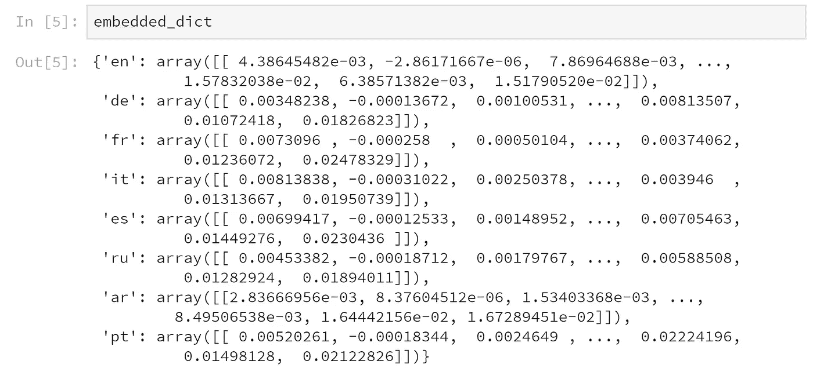
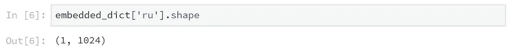
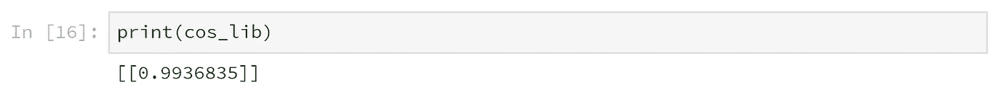

# 自然语言处理中的多语言句子模型

> 原文：<https://towardsdatascience.com/multilingual-sentence-models-in-nlp-476f1f246d2f?source=collection_archive---------15----------------------->

两种主要的多语言句子嵌入模型综述


Photo by [Dmitry Ratushny](https://unsplash.com/@ratushny?utm_source=unsplash&utm_medium=referral&utm_content=creditCopyText) on [Unsplash](https://unsplash.com/s/photos/language?utm_source=unsplash&utm_medium=referral&utm_content=creditCopyText)

# 为什么选择多语言模型

多语言模型是一种可以理解不同语言的机器学习模型。一个例子是对一段文本是否是有害评论进行分类。使用常规的机器学习模型，我们将能够只检测英语的有害评论，而不能检测西班牙语的有害评论。但是，如果我们使用多语言模型，我们将能够检测英语、西班牙语和其他多种语言的有毒评论。

那么多语言模型是如何工作的呢？一种常见的方法是将任何传入的语言转换成空间中的语言不可知向量，其中相同输入的所有语言将指向相同的区域。也就是说，任何具有相同意义的短语都会映射到潜在空间的相同区域。

今天有几种多语种嵌入可用，它们允许你用向量交换任何单词。主要的两个是脸书的[激光嵌入(*L*language-*A*gnostic*SE*ntence*R*presentations)](https://arxiv.org/pdf/1812.10464.pdf)和谷歌的[多语言使用嵌入(*U*universal*S*entence*E*ncoder)](https://arxiv.org/pdf/1907.04307.pdf)。激光嵌入涵盖 93 种主要语言，而使用仅涵盖 16 种语言。让我们更深入地了解一下激光。

## 什么是激光

LASER 的工作原理是将任何输入句子交换(嵌入)到 1024 维空间的向量中。每个句子得到一个这样的向量，

句子的激光矢量表示对于输入语言和 NLP 任务都是通用的。这是一个例子—


[Courtesy of Facebook](https://engineering.fb.com/ai-research/laser-multilingual-sentence-embeddings/)

左边是一些激光嵌入的句子。右边是嵌入德语的句子。如你所见，具有相同含义的向量位置非常接近。

这允许我们使用激光作为我们的 NLP 模型下游的输入特征，用于我们的特定任务，而不用担心输入语言。也许像激光输出嵌入的逻辑回归一样简单，突然我们有了一个语言无关的分类器，可以在任何语言上工作。

最棒的是脸书公开与世界分享代码和模型。让我们看看如何设置和运行这个令人敬畏的多语言嵌入模型。

## 在服务器上设置激光器

这里是 [Github 转激光](https://github.com/facebookresearch/LASER)。我们将通过运行以下代码在我们的机器上的 docker 中安装 LASER，以下 bash 命令也支持 docker 监听端口 8050 —

```
#!/bin/bash
git clone [https://github.com/facebookresearch/LASER](https://github.com/facebookresearch/LASER)
cd LASER
docker build --tag=laser docker
docker run -p 8050:80 -it laser python app.py
```

## 在样本文本上尝试激光嵌入

现在我们准备用火做饭。在 python 终端中，定义以下函数，用激光嵌入句子—

```
#!/bin/python
import requests
import numpy as np
def get_vect(query_in, lang = 'en', address = '127.0.0.1:8050'):
    url = "http://" + address + "/vectorize"
    params = {"q": query_in, "lang": lang}
    resp = requests.get(url=url, params=params).json()
    return resp["embedding"]
```

让我们用各种语言定义几个句子。定义下面的字典—

```
input_dict = {
    "en":"Machine learning isn't as hard as people think.",
    "de":"Maschinelles Lernen ist nicht so schwer wie die Leute denken.",
    "fr":"L'apprentissage automatique n'est pas aussi difficile qu'on le pense.",
    "it":"L'apprendimento automatico non è così difficile come la gente pensa.",
    "es":"El aprendizaje automático no es tan difícil como la gente piensa.",
    "ru":"Машинное обучение не так сложно, как думают люди.",
    "ar":"التعلم الآلي ليس صعبا كما يظن الناس.",
    "pt":"O aprendizado de máquina não é tão difícil quanto as pessoas pensam.",
}
```

现在，让我们将我们定义的字典发送给运行激光嵌入服务的 docker

```
embedded_dict = {}
for key in input_dict:
    embedded_dict[key] = np.array(get_vect(input_dict[key], lang = key))
```

这是我们嵌入的样子——



而每个嵌入是 1024 维向量。不过，有一点需要注意，LASER service 会对给定段落中的句子进行平均嵌入。因此发送 5 段文本将产生 5 个向量，每个向量 1024 dim。每个句子内部的向量都是估算的，然而，他们选择的设计平均了这些向量——



如果你注意到了，我们发给 LASER 的句子是“机器学习没有人们想象的那么难。”八种不同的语言。让我们验证相同意义的向量在同一个向量空间中的说法。为此，我们将使用两个向量的余弦相似度，相似度为 1 意味着向量是相同的

```
from sklearn.metrics.pairwise import cosine_similarity
cos_lib = cosine_similarity(embedded_dict['it'], embedded_dict['es'])
```



事实上，将意大利语句子与西班牙语句子进行比较，相似度达到 99%以上，这表明这些向量指向我们 1024 维空间中的同一个区域。

## 结论

正如我们所见，在大多数情况下，相同的句子有几乎相同的向量表示。这意味着即使例子中的语言不同，它们背后的含义是相同的，激光嵌入系统可以将这一点传送给计算机。

激光嵌入允许我们抽象出文档的语言，并直接使用向量来完成所需的任务，例如文档分类或有毒语言检测。