# 多元线性回归-初学者指南

> 原文：<https://towardsdatascience.com/multiple-linear-regression-beginners-guide-5b602d716aa3?source=collection_archive---------9----------------------->

## 用 Python 为初学者从头开始制作多元线性回归模型

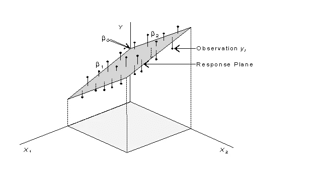

在本文中，我将重点介绍如何为初学者用 python 从头开始制作一个多元线性回归模型。我们将使用正规方程方法来使这个受监督的机器学习模型工作。线性回归在哪里使用，它如何帮助我们？

线性回归用于预测价格、天气、股票价格、商品质量、销售额等。**这是一个模型，用于找出自变量(用于进行预测)和因变量(要预测的值)**这两个因素之间的相关性。一个好的多元线性回归模型背后的关键是一个小的成本函数，我将在本文后面解释什么是成本函数。

我们将使用**美国住房数据**集。在给定平均面积收入、平均面积房龄、平均面积房间数、平均面积房间数、平均面积卧室数和面积人口等特征的情况下，我们将使用该数据集来预测房屋的价格。让我们理解这个简单算法背后的数学原理，并编写代码！

进行预测的主要等式是:

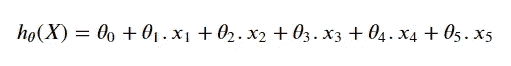

Equation of Hypothesis

这里 h(X)是得到预测值的假设或函数。θ0 是截距，θ1、θ2、θ3、θ4 和θ5 是独立特征 x1、x2、x3、x4 和 x5 的系数。按照惯例，我们将指定 x0 = 1。系数**是独立因素和非独立因素之间的关系，决定了独立因素对非独立因素**的影响。我们将使用上述方程的矩阵形式，我将在后面展示。

```
#Importing the libraries and the reading the data into a Pandas DataFrameimport numpy as np
import pandas as pd
df = pd.read_csv('USA_Housing.csv')
df.drop('Address',axis = 1,inplace = True)
df.head()
```

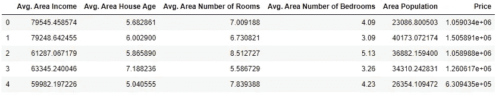

我已经删除了 address feature 列，只对这个模型使用连续的数值。数据集总共有 5000 条记录和 6 个特征列。现在，为了将我们的数据分割成训练和测试，我们将首先将其从 pandas.core.frame.DataFrame 转换成 numpy.ndarray，然后使用切片来分割它。

```
#Converting from pandas.core.frame.DataFrame to numpy.ndarray
df_to_array = df.values#Taking a look at our array
df_to_array
```

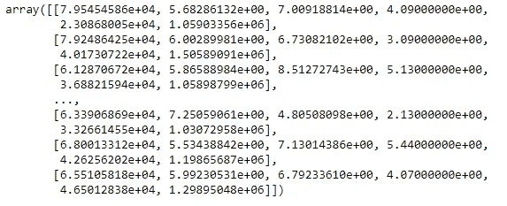

This is how the array looks for me

完成转换后，使用 numpy.random.shuffle 函数打乱数据，使其在切片前随机。对于拆分，我将使用 80%的数据(本例中为 3750 条记录)作为训练集，其余 20%(本例中为 1250 条记录)作为测试集。

```
#Shuffle the data and the slice it to split
np.random.shuffle(df_to_array)
train, test = df_to_array[:3750,:], df_to_array[3750:,:]
train
```

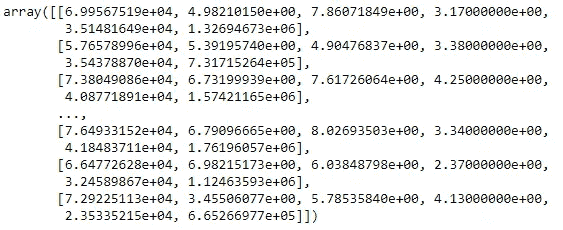

This is how the training set looks for me

```
test
```

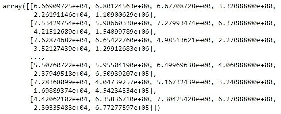

This is how the testing set looks for me

既然分割已经完成，我们需要进一步将我们的训练集和测试集分割为自变量和因变量。如您所见，数组的最后一列是价格，我们将再次对数组进行切片，将除最后一列之外的所有功能列分配给 X 训练和 X 测试，并将最后一列功能列分配给 y 训练和 y 测试，因为我们必须预测价格。

```
#Diving split data into X and y for machine learning where X will be for independent variables and y for dependent
X_train = train[:,:-1]
X_test = test[:,:-1]
y_train = train[:,-1]
y_test = test[:,-1]
```

在本文的开始，我告诉过你我们将按照惯例指定 x0 = 1，所以我们将附加一个 1 的数组作为 X 训练和 X 测试矩阵的第一个特征列。x 矩阵也称为**设计矩阵。**

```
#For training set
x_bias = np.ones((3750,1))
X_train = np.append(x_bias,X_train,axis=1)#For testing set
x_bias = np.ones((1250,1))
X_test = np.append(x_bias,X_test,axis=1)
```

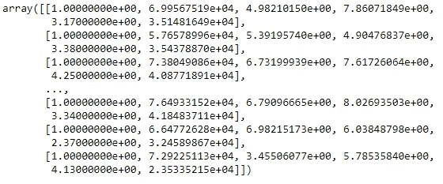

This is how the new X train array looks for me

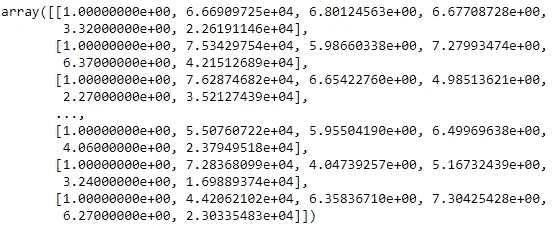

This is how the new X test array looks for me

如果你们还记得，我告诉过你们系数θ1，θ2，θ3，θ4 和θ5，以及截距θ0。我们现在将使用**法线方程**来找到θ向量，这将帮助我们确定六个值。

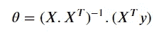

The Normal Equation

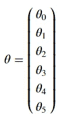

This is how the θ vector will look in our case

在正规方程中，X 是维数为 3750 x 6 或(3750，6)的 X 训练矩阵(数组)，y 是维数为 3750 x 1 或(3750，6)的 y 训练向量(数组)。合成的θ矢量的维数将为 6 x 1 或(6)。

为了计算θ矢量，我们将把正规方程分解成两部分，分别计算，一旦完成，我们将把它合并，得到总和。

```
#Solving the transpose and inverse
x_transpose = np.transpose(X_train)
x_transpose_dot_x = x_transpose.dot(X_train)
var1 = np.linalg.inv(x_transpose_dot_x)
var1
```

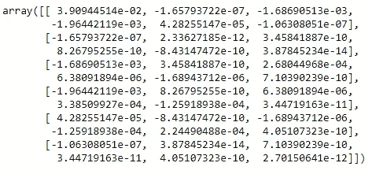

A matrix of dimension 6 x 6

var1 是等式的第一部分，即:

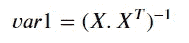

```
#X transpose dot y vector
var2 = x_transpose.dot(y_train)
var2
```

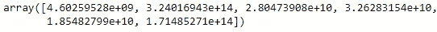

A vector of dimension 6 x 1

var2 是等式的第二部分，即:

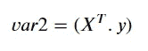

现在这两部分已经计算出来了，我们可以把它们结合起来得到θ矢量。

```
#Solving the full equation and getting our intercept andcoefficients
theta = var1.dot(var2)
theta
```

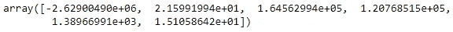

既然我们已经找到了截距和系数的值，我们将最终使用矩阵形式的假设方程(我之前已经展示过了)进行预测:

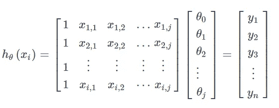

这里显示的 y 向量实际上是预测值的向量，我们将使用它来确定我们的模型表现如何。

```
predicted_values = np.dot(X_test,theta)
predicted_values
```

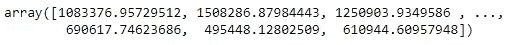

How the array/vector of predicted values of shape 1250 x 1 or (1250,) looks for me

# **成本函数**

现在，为了评估我们的模型表现如何，我们将使用均方差或成本函数进行评估。误差越小，性能越好。

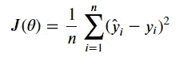

Cost Function

我刚才展示的公式是我们将在测试数据和预测值中使用和实现的公式。J(θ)中的θ是我们计算的θ向量，y 是预测值，y 是实际值，两者都在索引 I 处，其中 I 是从 I 到 n(测试样本大小=1250)。

```
#Now to calculate the mean squared error
Mean_Squared_Error = sum((predicted_values-y_test)**2)/1250
print(Mean_Squared_Error)
```

我们的均方误差是 10124760115.910074，非常好！我之所以声称它很好，是因为平方值的范围在 7286180743.499536 和 6122911662474.643 之间，比误差本身大得多，从而帮助我们做出更准确的预测。

# **R 平方得分**

对于线性回归，一个高度推荐的度量模型性能的指标是 R 平方得分。它帮助我们了解数据与拟合回归线的接近程度。R 平方分数的范围是从 0 到 1，其中 1 是可能的最佳分数，但很难达到。R 平方的公式为:

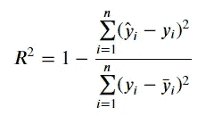

Formula for R-squared score

这里 y 是预测值，y 是实际的 y 测试值，y 条是 y 测试的平均值，n 是测试集的样本大小，在我们的例子中是 1250 条记录。

```
 R2_score = 1 - sum((predicted_values-y_test)**2)/sum((y_test-mean)**2)print(R2_score)
```

我们取得了 0.9223931240402982 的 R 平方分数，这确实很好。这意味着该模型能够解释平均值周围 92.23%的可变性，考虑到我们具有低均方误差和高 R 平方得分的因素，我们可以说我们的模型表现得非常好。

> 我希望你发现它内容丰富！如果你有任何问题或者我做错了什么，请联系我！您可以通过以下方式与我联系:

电子邮件:arnav@oberoi.co.in

领英:[https://www.linkedin.com/in/arnavoberoi/](https://www.linkedin.com/in/arnavoberoi/)

要获得这些代码和数据集，请访问我的 github 库:【https://github.com/arnavobero1/LinearRegression-fromScratch 