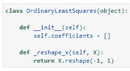
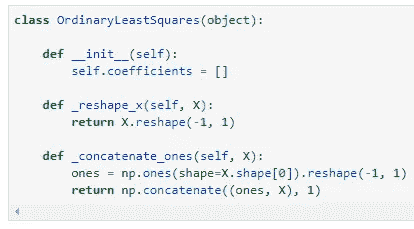
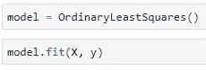
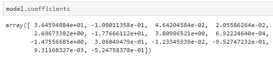

# Numpy 中从零开始的多元线性回归

> 原文：<https://towardsdatascience.com/multiple-linear-regression-from-scratch-in-numpy-36a3e8ac8014?source=collection_archive---------5----------------------->

线性回归可能是最简单的“机器学习”算法。我打赌你已经使用过很多次了，可能是通过 [Scikit-Learn](https://scikit-learn.org/) 或者任何其他为你提供开箱即用解决方案的库。

Photo by [Benjamin Davies](https://unsplash.com/@bendavisual?utm_source=medium&utm_medium=referral) on [Unsplash](https://unsplash.com?utm_source=medium&utm_medium=referral)

但是你有没有问过自己: ***模型实际上是如何在幕后工作的？***

当然，在简单线性回归的情况下(*只有一个特征*)，你可以用一个简单的公式计算斜率和截距系数，但是这些公式不能转移到多元回归。如果你对简单线性回归一无所知，可以看看这篇文章:

 [## Numpy 中从头开始的简单线性回归

### 机器学习不必复杂——如果用简单的术语解释的话。

towardsdatascience.com](/simple-linear-regression-from-scratch-in-numpy-871335e14b7a) 

今天，我将只关注多元回归，并向您展示如何计算截距和尽可能多的线性代数斜率系数。会有一点数学，但没有手工实现。你应该熟悉像**矩阵乘法、矩阵求逆和矩阵转置这样的术语。**

如果这些听起来像科幻小说，不要害怕，我再一次为你报道:

 [## Numpy 线性代数基础(第一部分)

### 学习数据科学的基本线性代数技能—第 1/2 部分

towardsdatascience.com](/linear-algebra-essentials-with-numpy-part-1-af4a867ac5ca) 

在那篇文章的底部有一个到第二部分的链接，第二部分介绍了矩阵的一些基本概念。现在让我们快速进入这篇文章的结构:

1.  数学落后
2.  进口
3.  类别定义
4.  声明助手函数
5.  声明 ***fit()*** 函数
6.  声明 ***预测()*** 函数
7.  做预测
8.  结论

我知道有很多事情要谈。我会尽量让它简短，希望你能在 10 分钟内看完整篇文章。

好吧，我们开始吧！

# 数学落后

正如我所说的，会有一些数学。但这并没有你想象的那么复杂。你会有你的特征( ***X*** )和目标( ***y*** )。这是如何表达模型的:

其中 ***y*** 为目标变量的向量， ***X*** 为特征矩阵， ***beta*** 为你要估计的参数向量，***ε***为误差项。从数据集中，您需要将特征( ***X*** )从目标(***【y】***)中分离出来，并且还需要添加一个**矢量，用于截距(*或偏差*)项的**到 *X* 。

完成后，您可以通过以下公式获得系数:

你现在可以看到，你需要了解什么是转置，什么是逆，以及如何乘矩阵。好的一面是，你不会手动操作，因为*数字*已经覆盖了你。

说到数学就差不多了。如果你敢，可以更深入地研究，但这对于本文的完成是不必要的。你现在可以进入下一部分了。

# 进口

***我已经答应你纯 Numpy 实现了对吗？*** 好吧，你也可以使用 *Pandas* ，但是只能从 CSV 文件中读取数据，其他的都可以用 *Numpy* 来完成。

我还导入了 ***警告*** 模块，这样笔记本就保持干净了:

现在让我们来看看波士顿住房数据:

这就是导入的大部分内容，接下来让我们做一些编码。

# 类别定义

我决定用 **OOP** ( ***面向对象编程*** )风格实现多元回归(*普通最小二乘回归*)。

如果你不喜欢 OOP，你可以跳过这一部分，跳到下一部分，在自己的单元格中声明每个函数，但是我建议坚持 OOP 风格。首先，让我们声明一个新类，***ordinallyeastsquares***:

它还没有做任何事情。现在我们将只声明 ***init*** 方法，其余的将在下面的章节中介绍。

我希望用户能够看到回归模型的**系数**，所以下面是解决这个问题的方法:

关于 ***init*** 方法就到此为止，你现在可以继续了。

# 声明助手函数

如果你花一点时间思考你的模型应该自动为用户做什么，你可能会得到两件事情的列表(*或更多*):

1.  如果只有一个特征，则对特征进行整形( ***X*** )
2.  将 1 的向量连接到特征矩阵

如果你不这样做，你的模型就会失败。没人喜欢那样。

第一个辅助函数非常简单，你只需要将 ***X*** 重塑成任何二维图形:

对于第二个辅助函数，您需要一个向量，其元素数量与您的特征矩阵的一列相同。使用 *numpy* 你可以生成这个向量并连接它:

如果你想知道函数名前的下划线是什么，这就是在 Python 中声明一个私有方法的方法。 ***怪异吧？***

然而，这几乎是目前的一切。

# 声明 fit()函数

这是你模型的核心。 ***fit()*** 函数将负责训练模型并进行整形和拼接操作(*调用之前声明的辅助函数*)。

如果 ***X*** 是一维的，就要进行整形。然后，二维表示应该与一的向量连接起来。

最后，您可以使用上面讨论的公式来获得系数。请注意我是如何将它们设置为 ***自系数*** 的，因为我希望最终用户可以访问它们:

只需再完成一项功能，您就可以开始了！

# 声明 predict()函数

与前一个一样， ***预测()*** 功能也将是最终用户所必需的。它将用于验证模型并做出新的预测。

让我们深入探究其背后的逻辑。本质上，您希望用户输入被格式化为列表。第一个系数代表截距或偏差项，所有其他系数需要乘以各自的值***×***。所以想法是同时迭代 new ***X*** 和所有系数(*不是截距项*)并将它们相乘，然后根据结果增加预测:

***挺整齐的吧？*** 好了，事情就是这样，你现在可以用这个类来做一个实例，然后再来做预测。

我们来看看怎么做。

# 做预测

在本文的前面，我们加载了波士顿住房数据集。现在该构造特征矩阵和目标向量了——或者说白了就是 ***X*** 和 ***y*** :

您可以像往常一样在这里进行训练测试分割，但是我决定不这样做，只是为了保持文章简洁。创建一个***ordinallyeastsquares***的实例，并使 ***X*** 和 ***y*** 符合它——就像您对***Scikit-Learn***:l

训练结束了。您可以像这样访问系数:

***甜蜜吧？*** 假设你要对第一行 ***X*** 做一个预测:

一切正常。或者如果您想对 ***X*** 中的每一行进行预测:

是的，一切看起来都很好。你现在可以去计算一些指标，比如 ***MSE*** ，但这不是本文的重点。

# 在你离开之前

尝试手工实现这个普通的最小二乘回归可能是个好主意。我是说用笔和纸。但不是用这个数据集，定义一两个特征和两三个观察值，并尝试手工计算。

这并不难，但是一旦完成，你会对为什么一切都正常运转更有信心。谢天谢地，后面的线性代数概念很简单，可以很快学会。然后，您可以使用 Python 来验证结果。

我希望一切都尽可能的干净，但是如果你有不明白的地方，请随时联系我。

喜欢这篇文章吗？成为 [*中等会员*](https://medium.com/@radecicdario/membership) *继续无限制的学习。如果你使用下面的链接，我会收到你的一部分会员费，不需要你额外付费。*

 [## 通过我的推荐链接加入 Medium-Dario rade ci

### 作为一个媒体会员，你的会员费的一部分会给你阅读的作家，你可以完全接触到每一个故事…

medium.com](https://medium.com/@radecicdario/membership)