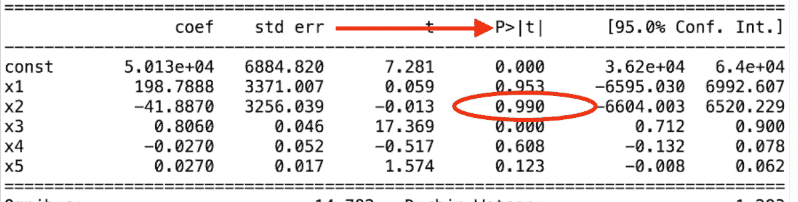
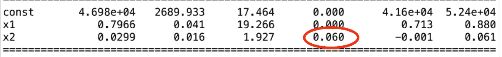
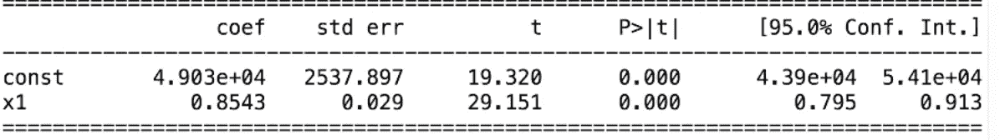

# 机器学习完全初学者指南:4 行代码中的多元线性回归！

> 原文：<https://towardsdatascience.com/multiple-linear-regression-in-four-lines-of-code-b8ba26192e84?source=collection_archive---------2----------------------->

## 征服多元线性回归的基础(和向后消除！)并用你的数据预测未来！


Photo by PublicDomainPictures via [Pixabay](http://pixabay.com)

能够预测未来真是太棒了。

你可能想根据你碰巧掌握的其他信息来预测一只股票的表现。

这可能有助于你了解你洗澡的频率和你养了多少只猫与你的寿命有关。

你可能想弄清楚一个男人和另一个男人之间是否有关系。)一天给他妈打三次以上电话，2。)称另一个男人为“老弟”，3。)从未自己洗衣服，离婚率高于平均水平。

多元线性回归可能适合你！

GIF via [GIPHY](https://giphy.com/gifs/musicchoice-love-and-hip-hop-cardi-b-3oEjI6SEda9CiPEYXm)

多元线性回归很有趣，因为它着眼于一堆信息之间的关系。除了查看**一个**事物如何与另一个事物相关(简单的线性回归)，你还可以查看许多不同事物与你想要预测的事物之间的关系。

**线性回归模型**是数据科学中经常使用的统计模型。这也是机器学习的基本组成部分之一！**多元线性回归**(MLR/多元回归)是一种统计技术。它可以使用几个变量来预测不同变量的结果。多元回归的目标是模拟自变量和因变量之间的线性关系。它着眼于多个自变量与一个因变量之间的关系。

我假设你对简单线性回归有所了解。如果你不知道，看看这篇关于构建简单线性回归的文章。它会给你一个快速(有趣)的基本步骤。

[](/simple-linear-regression-in-four-lines-of-code-d690fe4dba84) [## 机器学习完全入门指南:简单线性回归四行代码！

### 一个清晰而全面的蓝图，绝对适合任何想要构建简单机器学习模型的人

towardsdatascience.com](/simple-linear-regression-in-four-lines-of-code-d690fe4dba84) 

**简单线性回归**是当你有一个自变量和一个因变量时可以使用的。**多元线性回归**就是你有一堆不同的自变量的时候可以用的！

多元回归分析有三个主要用途。

*   你可以看看自变量对因变量的影响强度。
*   你可以用它来问如果自变量改变，因变量会改变多少。
*   你也可以用它来预测趋势和未来值。

让我们做那一个！


Image by [RondellMelling](https://pixabay.com/users/RondellMelling-57942/) via [Pixabay](http://pixabay.com)

> 我们将保持事情超级简单，以便多元线性回归作为一个整体是有意义的。我想让你知道在现实世界中事情会比这复杂得多。

## 我该如何开始？

就本文的目的而言，你现在是在为一位风险投资家工作。

恭喜你！

GIF via [GIPHY](https://giphy.com/gifs/rihanna-gifs-gif-hunt-Ngqas56VMI1uU)

事情是这样的:你面前有一个包含 50 家公司信息的数据集。您有五列，其中包含这些公司在管理、研发(R&D)和营销方面的支出，它们在各州的位置，以及它们最近一年的利润。这个数据集是匿名的，这意味着我们不知道这些公司的名称或任何其他识别信息。

你被雇来分析这些信息并创建一个模型。你需要告诉雇佣你的人，未来投资什么样的公司最有意义。简单来说，假设你的雇主想根据去年的利润做出这个决定。这意味着利润列是您的因变量。其他列是**自变量**。

所以你想根据你所拥有的其他类别的信息来了解**因变量**(利润)。

雇你的人不想投资这些特定的公司。他想用这个数据集中的信息作为样本。这个样本将帮助他了解，基于同样的信息，他所关注的公司中，哪一家未来会表现得更好。

他想投资那些在 R&D 花很多钱的公司吗？营销？他想投资伊利诺伊州的公司吗？你需要帮助他建立一套指导方针。你要帮助他能够说出这样的话，“我对一家总部位于纽约的公司感兴趣，这家公司在管理费用上花费很少，但在研发上花费很多。”

你要想出一个模型，让他能够评估他想在哪里投资，投资哪些公司，以实现利润最大化。

GIF via [GIPHY](https://giphy.com/gifs/nervous-smiling-leonardo-dicaprio-wDmXCmtDHTdLi)

> 线性回归对相关性很有用，但是请记住**相关性和因果关系不是一回事**！你不是说一件事导致另一件事，你是在发现哪些自变量与因变量密切相关。

有一些假设是绝对正确的:

*   因变量和自变量之间存在线性关系。
*   自变量之间的相关性不是很高。
*   你对因变量的观察是独立随机选择的。
*   回归残差呈正态分布。

在继续构建模型之前，您需要检查这些假设是否正确。我们完全跳过了这一步。确保如果你在现实世界中这样做，你不是盲目地跟随这个教程。在构建回归模型时，这些假设必须是正确的！

## 虚拟变量

如果您不熟悉虚拟变量的概念，请查看[这篇关于数据清理和预处理的文章](/the-complete-beginners-guide-to-data-cleaning-and-preprocessing-2070b7d4c6d)。它有一些简单的代码，我们可以继续复制并粘贴到这里。

[](/the-complete-beginners-guide-to-data-cleaning-and-preprocessing-2070b7d4c6d) [## 数据清理和预处理完全初学者指南

### 如何在几分钟内为机器学习模型成功准备数据

towardsdatascience.com](/the-complete-beginners-guide-to-data-cleaning-and-preprocessing-2070b7d4c6d) 

所以我们已经决定“利润”是我们的因变量( **y** ，其他是我们的自变量( **X** )。我们也决定了我们想要的是一个线性回归模型。那一栏国家呢？“状态”是一个分类变量，而不是一个数字变量。我们需要自变量是数字，而不是单词。我们该怎么办？


Photo by [3dman_eu](https://pixabay.com/users/3dman_eu-1553824/) via [Pixabay](http://pixabay.com)

## 让我们创建一个虚拟变量！

如果您查看 locations 列中的信息，您可能会看到所有被检查的公司都位于两个州。出于解释的目的，假设我们所有的公司都位于纽约或明尼苏达州。这意味着我们要把这一列信息变成两列 1 和 0。(如果你想了解更多关于我们为什么这样做的信息，请查看[那篇关于简单线性回归的文章](/simple-linear-regression-in-four-lines-of-code-d690fe4dba84)。它解释了为什么这是整理数据的最佳方式。)

那么我们如何填充这些列呢？基本上，我们将把每个状态转换成它自己的列。如果一家公司位于纽约，它将在“纽约”列中有一个 **1** ，在“明尼苏达州”列中有一个 **0** 。如果您使用更多的州，则在纽约列中有一个 1，例如，在“加利福尼亚”列中有一个 0，在“伊利诺伊”列中有一个 0，在阿肯色州列中有一个 0，依此类推。我们将不再使用原来的“位置”栏，因为我们不再需要它了！

这些 1 和 0 基本上就像一个电灯开关。1 表示“开”或“是”，0 表示“关”或“否”

## 小心虚拟变量陷阱

你永远不会想同时包含两个变量。

这是为什么呢？

你会复制一个变量。第一个变量(d1)始终等于 1 减去第二个变量(d2)。( **d1 = 1-d2** )当一个变量预测另一个变量时，称为**多重共线性**。因此，模型将无法区分 d1 的结果和 d2 的结果。你不能同时拥有常量和两个虚拟变量。如果你有九个变量，包括其中的八个。(如果你有两组虚拟变量，那么你必须对每一组都这样做。)

## P 值是多少？

你会想要熟悉 P 值的概念。这肯定会被提出来。

P 值是在零假设为真的情况下，获得与我们一样(或比我们更极端)的样本的概率。

**它给你的样品**的古怪程度一个值。如果你有一个大的 P 值，那么你可能不会改变对零假设的看法。一个大的值意味着如果假设是真的，得到像你这样的样本一点也不奇怪。随着 P 值变小，你可能应该开始问自己一些问题了。你可能会改变主意，甚至拒绝这个假设。

> **零假设**是指这里正在试验的主张(假设)的官方说法。这是默认的位置，在这里被测试的组之间没有关联。在每个实验中，你都在被测试的群体中寻找效果。不幸的是，各组之间总有可能没有影响(或没有差异)。这种差异的缺乏被称为零假设。
> 
> 这就像你在做一个不起作用的药物试验。在那次试验中，服用药物的那组人和其他人之间没有区别。差异将为零。
> 
> 你总是假设零假设是正确的，直到你有证据证明它不是。

## 让我们继续前进！

我们需要弄清楚哪些栏目我们想保留，哪些栏目我们想放弃。如果你只是在你的模型中加入一些东西，它就不会是一个好的模型。肯定不会靠谱！(此外，在一天结束时，你需要能够向雇佣你创建这个东西的人解释你的模型。你只会想要解释那些实际上能预测一些事情的变量！)

建立多元线性回归模型基本上有五种方法。

1.  抛开一切，抱最好的希望
2.  反向消除
3.  预选
4.  双向消除
5.  分数比较

你几乎肯定也听说过逐步回归。逐步回归最常用作双向消除的另一种说法(方法 4)。有时当人们使用这个短语时，他们指的是方法 2、3 和 4 的组合。(这也是双向消去法背后的思想。)

**方法一**(把所有东西都夹进去):好的。这不是这种方法的正式名称(但应该是)。偶尔你需要建立一个模型，你只需要把所有的变量都放进去。你可能有某种先验知识。你可能需要使用一个特定的框架。你可能已经被某个坚持要你这么做的人雇佣了。你可能想为逆向淘汰做准备。这是一个真实的选择，所以我把它包括在这里。

**方法二**(逆向淘汰):这有几个基本步骤。

1.  首先，您需要设置数据将保留在模型中的显著性水平。例如，您可能希望将显著性水平设置为 5% (SL = 0.05)。这很重要，可能会有真正的影响，所以请考虑一下。
2.  接下来，您将使用所有可能的预测值来拟合整个模型。
3.  您将考虑具有最高 P 值的预测值。如果你的 P 值大于你的显著性水平，你将进入第四步，否则，你就完了！
4.  移除具有最高 P 值预测值。
5.  在没有预测变量的情况下拟合模型。如果只是去掉变量，就需要重新改装和重建模型。系数和常数将会不同。当你移除一个，它会影响其他的。
6.  回到第 3 步，从头开始，继续这样做，直到你达到一个点，甚至最高的 P 值是< SL. Now your model is ready. All of the variables that are left are less than the significance level.

(After we go through these concepts, I’ll walk you through an example of backward elimination so you can see it in action! It’s definitely confusing, but if you really look at what’s going on, you’ll get the hang of it.)

**方法 3** (正向选择):这比仅仅反转反向淘汰要复杂得多。

1.  选择你的显著性水平(SL = 0.05)。
2.  拟合所有可能的简单回归模型，并选择 P 值最低的模型。
3.  保留这个变量，并在现有的基础上增加一个额外的预测因子来拟合所有可能的模型。如果我们选择了一个简单的一元线性回归，现在我们将选择所有的二元线性回归。这意味着所有可能的两变量线性回归。
4.  找到具有最低 P 值的预测值。如果 P < Sl, go back to step 3\. Otherwise, you’re done!

We can stop when P<sl is="" no="" longer="" true="" or="" there="" are="" more="" p-values="" that="" less="" than="" the="" significance="" level.="" it="" means="" variable="" not="" significant="" anymore.="" class="lb iu">你不会保留当前型号，T8 虽然。您将保留前一个变量，因为在最终模型中，您的变量无关紧要。</sl>

**方法三**(双向消去):这种方法结合了前面两种！

1.  选择要输入的显著性水平和要保持的显著性水平(SLENTER = 0.05，SLSTAY = 0.05)。
2.  执行向前选择的下一步，添加新变量。您需要让您的 P 值小于 SLENTER。
3.  现在执行所有的反向消除步骤。变量的 P 值必须小于 SLSTAY 才能保持不变。
4.  现在回到第二步，然后前进到第三步，依此类推，直到没有新的变量可以进入，也没有新的变量可以退出。

你完了！

**方法 4** (分数比较):在这里，你将会看到所有可能的方法。您将看到所有可能方法的分数对比。这绝对是最耗费资源的做法！

1.  选择拟合优度标准(例如，[赤池标准](https://en.wikipedia.org/wiki/Akaike_information_criterion))
2.  构建所有可能的回归模型
3.  选择具有最佳标准的一个

有趣的事实:如果你有 10 列数据，你会得到 1023 个模型。如果你打算走这条路，你最好准备好承诺！

## 嗯，什么？

如果你刚刚开始学习机器学习、统计学或数据科学，这些看起来会是数量惊人的代码。不是的！

你需要用机器学习模型做的很多事情都已经准备好了，有了令人惊叹的库。你需要做一些困难的事情，决定哪些信息是重要的，以及你想使用什么样的模型。解释结果并能够传达您所构建的内容也取决于您。然而，代码本身是非常可行的。

GIF via [GIPHY](https://giphy.com/gifs/missy-elliott-timbaland-get-your-freak-on-SZtVAR4ZcZisU)

## 让我给你看看！

逆向排除法是开始时最快也是最好的方法，所以在我们建立了快速简单的多元线性回归模型后，这就是我要带你经历的。

首先，让我们准备数据集。假设我们有一个名为“startups.csv”的. csv 文件，其中包含了我们之前讨论过的信息。我们假设它有 50 个公司和列，分别用于 R&D 支出、管理支出、营销支出、公司所在的州(比如纽约州、明尼苏达州和加利福尼亚州)，还有一列用于去年的利润。

最好立即导入您的库。

```
# Importing the libraries
import numpy as np
import matplotlib.pyplot as plt
import pandas as pd
```

现在我们可以复制并粘贴 t [hat 数据清理和准备文章](/the-complete-beginners-guide-to-data-cleaning-and-preprocessing-2070b7d4c6d)中的代码了！我们肯定要将数据集的名称改为我们的名称。我将它命名为“startups.csv”，我们还将调整几个其他的小细节。利润(y)仍然是我们的最后一列，所以我们将继续用[:，:-1]删除它。我们将做一点调整，用[:，4]来抓取我们的自变量。现在我们有一个因变量(y)的向量和一个自变量矩阵，其中包含除利润(X)之外的所有内容。我们想看看两者之间是否存在线性依赖关系！

```
dataset = pd.read_csv('startups.csv')
X = dataset.iloc[:, :-1].values
y = dataset.iloc[:, 4].values
```

现在我们需要对分类变量进行编码。我们可以使用标签编码器和一个热编码器来创建虚拟变量。(我们也可以从另一篇文章中复制并粘贴这篇文章！确保你获取了正确的信息，并且没有对因变量进行编码。)您将再次更改点[:，3]和[:，3]中列的索引，并替换一个热编码器中的索引[3]。

```
from sklearn.preprocessing import LabelEncoder, OneHotEncoder
labelencoder = LabelEncoder()
X[:, 3] = labelencoder.fit_transform(X[:, 3])
onehotencoder = OneHotEncoder(categorical_features = [3])
X = onehotencoder.fit_transform(X).toarray()
```

你已经准备好了！我们的一列信息现在是三列，每一列对应一个州！

如何避免虚拟变量陷阱？在我们的图书馆里，你实际上不需要这么做！我们选择使用的库已经为您处理好了。但是，如果您想要或需要运行该代码，这很简单！您可以在对数据进行编码后用一行代码来完成。

```
X=X[:, 1:]
```

那有什么用？它从 x 中移除第一列。将 **1** 放在那里意味着我们想要将从索引 1 开始的所有列移动到末尾。你不会走第一列。对于某些库，您需要手动删除一列，以确保数据集不包含冗余。

现在，让我们拆分我们的培训和测试数据。最常见的分割是 80/20 分割，这意味着 80%的数据将用于训练我们的模型，20%将用于测试它。我们在这里做吧！

```
from sklearn.model_selection import train_test_split
X_train, X_test, y_train, y_test = train_test_split(X, y, test_size = 0.2, random_state = 0)
```

## 特征缩放呢？

这里我们不需要做特性缩放！图书馆会帮我们处理的。


Photo by [Gift Habeshaw](https://unsplash.com/@gift?utm_source=medium&utm_medium=referral) on [Unsplash](https://unsplash.com?utm_source=medium&utm_medium=referral)

## 多元线性回归时间！

我们将从 Scikit-Learn 导入线性回归。(这有点道理吧？)

```
from sklearn.linear_model import LinearRegression
```

现在我们将介绍我们的回归变量。我们将创建一个 LinearRegression 类的对象，并使该对象适合我们的训练集。我们想把这个应用到我们的 X 列车和 y 列车上。

```
regressor = LinearRegression()
regressor.fit(X_train, y_train)
```

现在让我们测试我们的多元线性回归器的性能！

(我们不会在这里绘制图表，因为我们需要五个维度来完成。如果你对用一个简单的线性回归器绘制图表感兴趣，看看[这篇关于构建一个简单的线性回归器的文章](/simple-linear-regression-in-four-lines-of-code-d690fe4dba84)。)

我们将创建预测向量(y_pred)。我们可以使用带有预测方法的回归量来预测测试集(X_test)的观察值。

```
y_pred = regressor.predict(X_test)
```

就是这样！四行代码，你已经建立了一个多元线性回归！

GIF via [GIPHY](https://giphy.com/gifs/outkast-gWtupEAZizyFy)

现在可以看到十个预测利润了！你可以随时用简单的`print(y_pred)`打印它们。我们可以很容易地通过看一看预测，然后将它们与实际结果进行比较。如果你看一看，你会发现有些非常准确，其余的非常好。干得好！

我们的因变量和自变量之间肯定存在某种线性相关性。我们可以清楚地看到两者之间有很强的线性关系。

恭喜你！！您现在知道如何用 Python 制作多元线性回归器了！

## 想继续吗？

事情将变得更具挑战性！

如果一些变量对我们的因变量有很大的影响，而一些在统计上无关紧要，那该怎么办？我们肯定能找出哪些是对因变量影响最大的变量。我们希望找到一组变量，它们都有明确的影响，积极的或消极的。

还是用**向后淘汰**吧！

我们需要为逆向淘汰准备一些特定的东西。我们需要一个库统计模型，所以让我们导入 statsmodels.formula.api。这需要不断重新键入，时间有点长，所以我们将使用 sm 创建一个快捷方式。

```
import statsmodels.formula.api as sm
```

我们需要在自变量的特征矩阵中添加一列 1，因为它与常数一起工作。(我们的模型需要考虑我们的常数 b0。在大多数库中都包含了它，但是在我们使用的统计模型中没有。我们将添加一列 1，这样我们的统计模型将正确理解公式。)

这开始很简单。我们会用。追加是因为我们想追加。

(爱蟒❤️)

我们有特征 x 的矩阵，值参数对我们来说是完美的，因为它是一个数组。我们将输入一个 50 行 1 列的矩阵，里面有 1。我们可以用 Numpy 的 np.ones 创建它，我们需要指定我们想要的行数和列数(50，1)。我们需要将数组转换成整数类型来实现这一点，所以我们将使用。astype(int)。然后我们需要决定是添加一行还是一列(line = 0，column = 1)，所以我们说 axis = 1 表示一列！

我们希望该列位于数据集的开头。我们该怎么办？让我们把矩阵 X 加到 50 个一的列上，而不是反过来。我们可以用值= X 来实现。

```
X = np.append(arr = np.ones((50, 1)).astype(int), values = X, axis = 1)
```

## 我们开始吧！

我们想创建一个新的最优特征矩阵(X_opt)。这些特征是具有统计学意义的特征。对利润有很大影响的那些。这将是包含对利润有重大影响的最佳特性团队的矩阵。

我们需要初始化它。我们可以把统计意义不大的变量逐一剔除。我们将通过在每一步移除索引来做到这一点。首先获取 X 中所有列的索引，用逗号分隔[0，1，2，3，4，5]。

如果你回头看看前面的方法，你会发现我们首先需要选择我们的显著性水平，这是我们前面谈到的。然后我们需要符合模型！

我们不会用我们造的回归器。我们正在使用一个新的库，所以现在我们需要一个新的适合我们未来最优矩阵的库。我们将创建一个新的回归变量(上一个来自线性回归库)。我们的新类将是普通最小二乘法(OLS)。我们需要调用这个类并指定一些参数。(你可以在这里查阅[官方文档。)对于我们的参数，我们需要一个 endog(我们的因变量)和一个 exog(我们的 X_opt，它只是我们的带有截距的特征(X)矩阵，默认情况下不包括它)。为了适应它，我们将只使用一个. fit()！](https://www.statsmodels.org/dev/generated/statsmodels.regression.linear_model.OLS.html)

```
X_opt = X[:, [0, 1, 2, 3, 4, 5]]
regressor_OLS = sm.OLS(endog = y, exog = X_opt).fit()
```

现在我们已经初始化了 X_opt！

现在让我们来看看我们的 P 值！我们如何寻找具有最高 P 值的预测值？我们将获取回归对象并调用函数。总结()。

```
regressor_OLS.summary()
```

现在我们可以看到一个表格，里面有一些关于我们模型的非常有用的信息！我们可以看到调整后的 R 平方值和 P 值。p 值越低，自变量相对于因变量就越重要。在这里，我们寻找最高的一个。那很容易看出来。



现在让我们来移除它！

我们可以从上面复制并粘贴我们的代码，并删除索引 2。看起来会像这样:

```
X_opt = X[:, [0, 1, 3, 4, 5]]
regressor_OLS = sm.OLS(endog = y, exog = X_opt).fit()
regressor_OLS.summary()
```

只要继续下去，直到你没有任何 P 值高于你选择的 SL 值。请记住，您总是要查看原始矩阵，以便选择正确的索引！您使用的是原始矩阵(X)中的列，而不是 X_opt 中的列。

你可能会得到一个 P 值，非常接近你选择的 SL 值。例如，我们选择 0.050，这里是 0.060。



这是一个困难的情况，因为你选择的值可以是任何值。如果您想完全遵循您的框架，您将需要删除该索引。但是还有其他指标可以帮助我们更好地理解我们是否想要这样做。我们可以添加其他指标，比如一个标准，来帮助我们决定我们是否真的想做这个选择。这里的摘要中也有很多信息，比如 R 平方值，可以帮助我们做出决定。


假设我们逆向剔除，直到最后，我们只剩下 R&D 支出栏的指数。

```
X_opt = X[:, [0, 1, 3, 4, 5]]
regressor_OLS = sm.OLS(endog = y, exog = X_opt).fit()
regressor_OLS.summary()
X_opt = X[:, [0, 1, 3, 5]]
regressor_OLS = sm.OLS(endog = y, exog = X_opt).fit()
regressor_OLS.summary()
X_opt = X[:, [0, 3, 5]]
regressor_OLS = sm.OLS(endog = y, exog = X_opt).fit()
regressor_OLS.summary()
X_opt = X[:, [0, 3]]
regressor_OLS = sm.OLS(endog = y, exog = X_opt).fit()
regressor_OLS.summary()
```

如果我们一直小心地遵循我们的模型，这意味着我们现在知道 R&D 支出是我们因变量的一个强有力的预测器！这里的结论是，可以预测利润的影响最大的数据只由一个类别组成:R&D 支出！



你做到了！你用了多元线性回归和逆向淘汰！你发现观察 R&D 的支出会让你对一家公司的利润有最好的了解！

你太棒了！

GIF via [GIPHY](https://giphy.com/gifs/television-rupauls-drag-race-glitter-8zcg4BB5NKQ5W)

和往常一样，如果你用这些信息做了什么很酷的事情，请在下面的回复中让人们知道，或者随时在 LinkedIn 上联系！

感谢阅读！

[](https://mailchi.mp/00c59b0317a3/content-simplicity)