# 多元线性回归—使用数学和代码

> 原文：<https://towardsdatascience.com/multiple-linear-regression-with-math-and-code-c1052f3c7446?source=collection_archive---------8----------------------->


Photo by [贝莉儿 DANIST](https://unsplash.com/@danist07?utm_source=unsplash&utm_medium=referral&utm_content=creditCopyText) on [Unsplash](https://unsplash.com/s/photos/multiple-planes?utm_source=unsplash&utm_medium=referral&utm_content=creditCopyText)

线性回归是预测模型的一种形式，广泛用于许多现实世界的应用中。许多关于线性回归的文章都是基于单个解释变量，并详细解释了最小化均方误差(MSE)以优化最佳拟合参数。在本文中，多个解释变量(自变量)被用来推导 MSE 函数，最后梯度下降技术被用来估计最佳拟合回归参数。具有三个自变量和一个因变量的示例数据集用于构建多元回归模型，在本文的后面部分，提供了 R-code 来对示例数据集进行建模。

# 多元回归模型

线性回归模型的方程是众所周知的，它表示为:

***y = MX+c***

其中 ***y*** 是模型的输出，称为响应变量， ***x*** 是自变量，也称为解释变量。 ***m*** 是回归线的斜率， ***c*** 表示截距。通常我们得到 ***x*** 和 ***y*** 的测量值，并尝试通过估计 ***m*** 和 ***c*** 的最优值来建立模型，以便我们可以通过给定 ***x*** 作为输入，使用该模型对*y 进行未来预测。*

*实际上，我们处理的独立变量不止一个，在这种情况下，使用多个输入变量构建线性模型对于准确建模系统以实现更好的预测非常重要。因此，本文对多元回归分析进行了详细介绍。线性回归模型需要矩阵表示来表示多元回归模型，使其更加紧凑，同时便于计算模型参数。我相信读者对矩阵运算和线性代数有基本的了解。然而，在最后一节中，提供了回归分析中使用的矩阵规则，以更新读者的知识。*

## ***线性回归的代数形式***

*假设我们有以下数据显示一个班不同学生的分数。一年中有四次考试的分数，最后一栏是期末考试的分数。从数据中可以看出，期末考试的分数与前三次考试的成绩有某种关系。*

*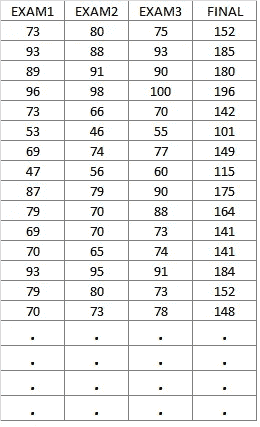*

*Source: [https://college.cengage.com/mathematics/brase/understandable_statistics/7e/students/datasets/mlr/frames/frame.html](https://college.cengage.com/mathematics/brase/understandable_statistics/7e/students/datasets/mlr/frames/frame.html)*

*这里考虑到前三次考试的分数与期末考试的分数线性相关，我们的第一次观察(表中第一行)的线性回归模型应该如下所示。*

****152 = a***×***73+b***×***80+c***×***75+d****

*其中 ***a*** ， ***b*** ， ***c*** ， ***d*** 为模型参数。*

*等式的右边是回归模型，该模型在使用适当的参数时应该产生等于 152 的输出。但是实际上没有一个模型可以完美地模仿 100%的现实。模型输出和真实观察之间总是存在误差。因此，正确的回归方程可以定义如下:*

***152 = a**×73+b×80+c×75+d×1+E1*

*其中 ***e1*** 为首次观测的预测误差。类似地，对于数据表中的其他行，等式可以写成*

***185 = a**×93+b×88+c×93+d×1**E2***

***180 = a**×89+b×91+c×90+d×1+E3*

***196 = a**×**96+b**×**98+c**×**100+d**×**1+E4***

*………………………………………………..*

*………………………………………………..*

***192 = a**×**96+b**×**93+c**×95**+d**×**1+e25***

*上述方程可以借助于下面提到的四个不同的矩阵来写。*

*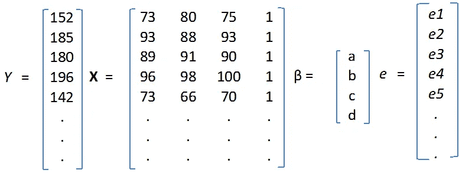*

*使用上述四个矩阵，代数形式的线性回归方程可以写成:*

***Y = xβ+e***

*为了得到等式的右边，矩阵 ***X*** 是乘以*向量，乘积加上误差向量 ***e*** 。众所周知，如果第一个矩阵的列数等于第二个矩阵的行数，则两个矩阵可以相乘。在这种情况下， ***X*** 有 4 列，*有 4 行。***

***重新排列术语，误差向量表示为:***

> *****e = Y - Xβ*****

***现在，很明显，错误， ***e*** 是参数的函数，*。在下一节中，推导矩阵形式的 MSE，并将其用作优化模型参数的目标函数。****

## *****矩阵形式的 MSE*****

***MSE 的计算方法是将所有观测值的 ***e*** 的平方和除以数据表中的观测值数量。数学上:***

**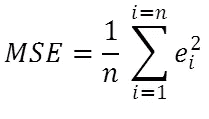****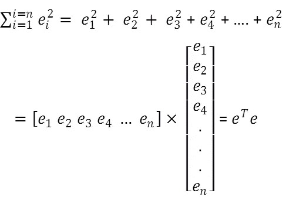**

**将方程中的 ***e*** 替换为 ***Y — Xβ*** ，MSE 改写为:**

****

**将上述等式展开如下:**

**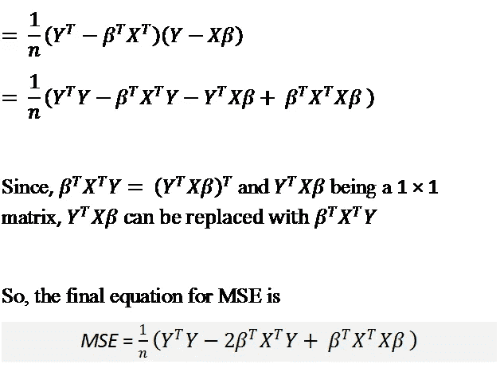**

**上述等式用作成本函数(优化问题中的目标函数)，需要最小化该函数以估计我们的回归模型中的最佳拟合参数。需要通过对参数向量*求 ***MSE*** 函数的导数来估计梯度，并用于梯度下降优化。***

## **MSE 的梯度**

**如上所述，梯度表示为:**

****

**其中， ***∇*** 是用于梯度的微分算子。使用矩阵。微分规则，我们得到以下方程。**

**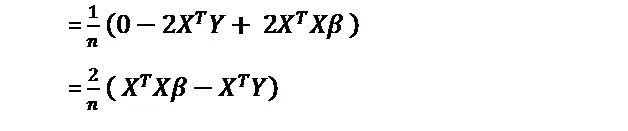**

**上述矩阵被称为 ***雅可比矩阵*** ，用于梯度下降优化以及学习率( ***lr*** )更新模型参数。**

****

## **梯度下降法**

**梯度下降法更新模型参数的公式如下所示。**

****

*****【βold】***是初始化的参数向量，在每次迭代中更新，在每次迭代结束时 ***βold*** 等同于 ***βnew*** 。 ***lr*** 是学习率，代表步长，有助于防止超过误差面的最低点。迭代过程继续，直到 ***MSE*** 值变小变平。**

**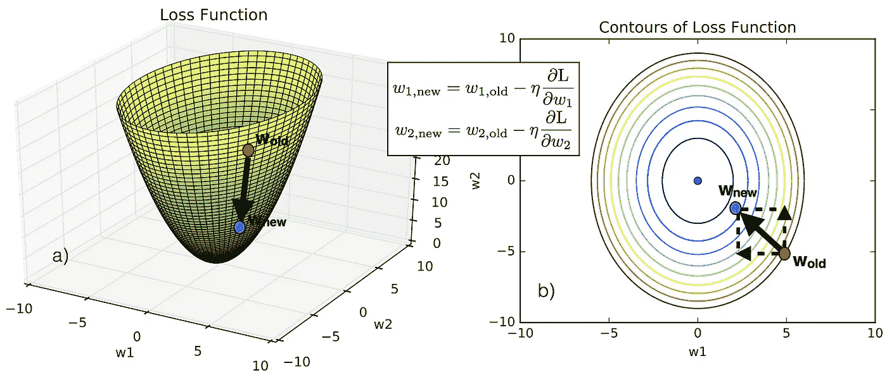**

**Illustration of gradient descent method. Source: [http://www.claudiobellei.com/2018/01/06/backprop-word2vec/](http://www.claudiobellei.com/2018/01/06/backprop-word2vec/)**

# **示例数据**

**在本节中，使用示例数据集开发了一个多元回归模型。应用梯度下降法估计模型参数***a******b******c***和 ***d*** 。矩阵的值 ***X*** 和 ***Y*** 从数据中已知，而 ***β*** 向量未知，需要估计。最初，计算*MSE 和 ***MSE*** 的梯度，然后应用梯度下降法使 ***MSE*** 最小化。***

## **r 代码**

*****读取数据并初始化β:*****

```
**dataLR <- read.csv("C:\\Users\\Niranjan\\Downloads\\mlr03.csv", header = T)
beta <- c(0,0,0,0) ## beta initialized
beta_T <- t(beta)X = matrix(NA,nrow(dataLR),ncol = 4)X[,1] <- dataLR$EXAM1
X[,2] <- dataLR$EXAM2
X[,3] <- dataLR$EXAM3
X[,4] <- 1XT <- t(X)
y <- as.vector(dataLR$FINAL)
yT <- t(y)**
```

*****计算 MSE 并更新β*****

```
**mse <- (1/nrow(dataLR))* (yT%*%y - 2 *  beta_T%*%XT%*%y + beta_T%*%XT%*%X%*%beta)
betanew <- beta - (lr *(2/nrow(dataLR)) * (XT%*%X%*%beta - XT%*%y))**
```

*****参数估计的完整代码*****

```
**##multivariate linear regression
dataLR <- read.csv("C:\\Users\\Niranjan\\Downloads\\mlr03.csv", header = T)
beta <- c(0,0,0,0)
beta_T <- t(beta)X = matrix(NA,nrow(dataLR),ncol = 4)X[,1] <- dataLR$EXAM1
X[,2] <- dataLR$EXAM2
X[,3] <- dataLR$EXAM3
X[,4] <- 1XT <- t(X)
y <- as.vector(dataLR$FINAL)
yT <- t(y)iteration <- 1
lr = 0.00001msef = NULL
while (iteration < 10) {
  mse <- (1/nrow(dataLR))* (yT%*%y - 2 *  beta_T%*%XT%*%y + beta_T%*%XT%*%X%*%beta)
  betanew <- beta - (lr *(2/nrow(dataLR)) * (XT%*%X%*%beta - XT%*%y))
  msef <- rbind(msef,mse)
  beta <- betanew
  beta_T <- t(betanew)
  iteration  <-  iteration + 1
}plot(1:length(msef), msef, type = "l", lwd = 2, col = 'red', xlab = 'Iterations', ylab = 'MSE')
grid(nx = 10, ny = 10)print(list(a = beta[1],b = beta[2], c = beta[3], d = beta[4]))**
```

*****标绘输出的代码*****

```
**library(plot3D)
ymod <- X%*%beta
scatter3D(dataLR$EXAM1,dataLR$EXAM2,dataLR$EXAM3, colvar = ymod,
          pch = 17, cex = 2,bty = "g",ticktype = "detailed",phi = 0,lwd=2.5, xlab = "Exam1", ylab = 'Exam2',zlab = 'Exam3')
scatter3D(dataLR$EXAM1,dataLR$EXAM2,dataLR$EXAM3, colvar = dataLR$FINAL,
          pch = 16, cex = 2,bty = "g",ticktype = "detailed",phi = 0,lwd=2.5, xlab = "Exam1", ylab = 'Exam2',zlab = 'Exam3',add = T)plot(dataLR$FINAL, ymod, pch = 16, cex = 2, xlab = 'Data', ylab = 'Model')
lines(ymod,ymod, lwd = 4, col = "green", lty = 6)
grid(nx = 10, ny = 10)
legend("topleft",c('Model-Data Points','Best fit line'), lty = c(NA,6), lwd = c(NA,4), col = c("black","green"), pch = c(16,NA))**
```

## **输出**

**MSE 的值急剧减小，六次迭代后，它变得几乎平坦，如下图所示。相应的模型参数是最佳拟合值。**

***最小化****MSE****:***

**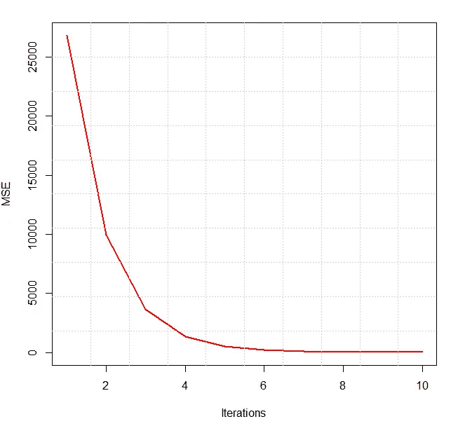**

**MSE change with iterations**

***优化后的***:****

**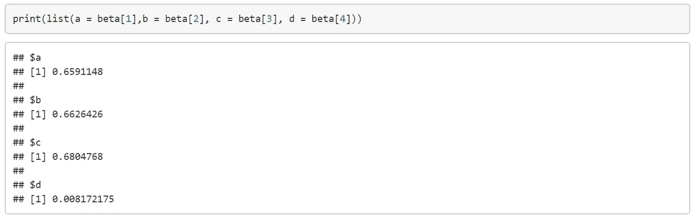**

**Optimized model parameters**

**将计算的最终分数与来自数据的最终分数进行比较。模型效率通过将模型输出与数据中的目标输出进行比较来可视化。决定系数估计为 0.978，以数值评估模型的性能。下图显示了模型和数据之间的比较，其中三个轴用于表示解释变量，如 ***示例 1、示例 2、示例 3*** ，颜色方案用于显示输出变量，即最终得分。**

***模型输出与数据中目标的比较:***

**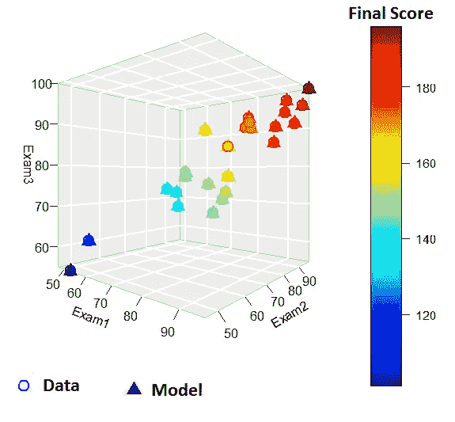**

**Visualization of model out and target in the data**

**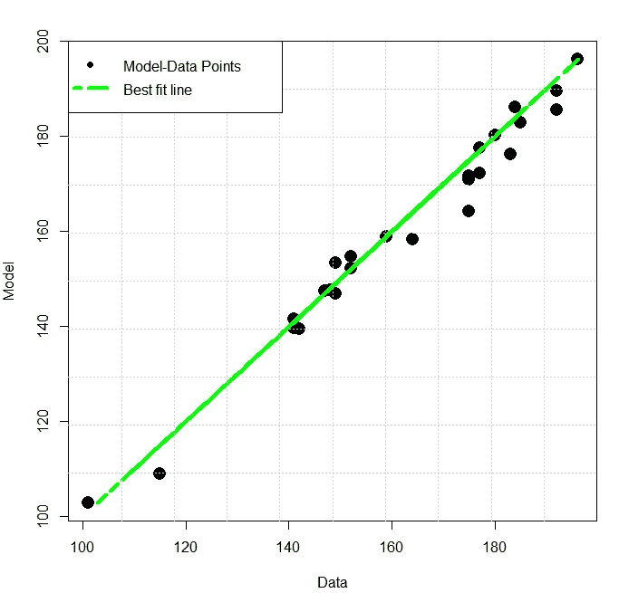**

**Comparison between model output and target in the data**

# ****基本矩阵规则****

**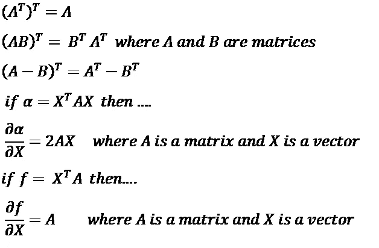**