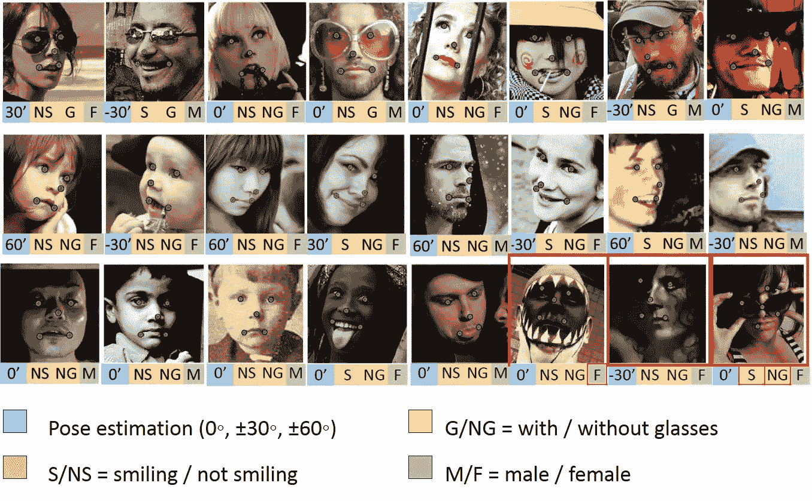
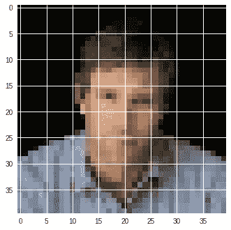
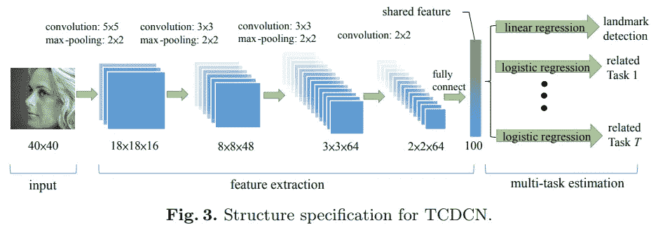
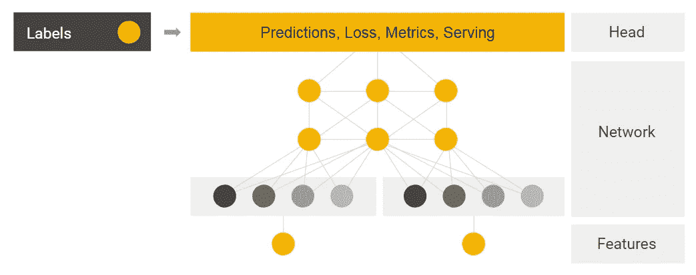
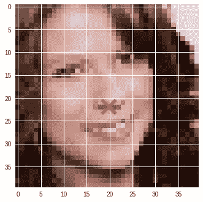
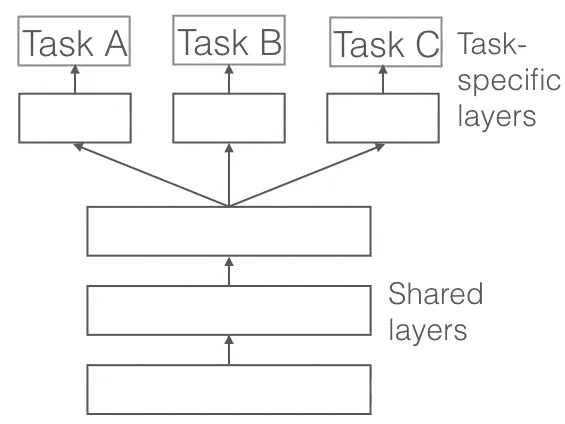
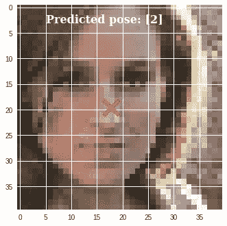

# 使用 Head API 在 TensorFlow 中进行多任务学习

> 原文：<https://towardsdatascience.com/multitask-learning-in-tensorflow-with-the-head-api-68f2717019df?source=collection_archive---------7----------------------->

## 多任务学习的自定义估计器介绍

人类学习的一个基本特征是我们同时学习许多事情。机器学习中的等价思想被称为**多任务学习(MTL)，**，它在实践中变得越来越有用，特别是对于强化学习和自然语言处理。事实上，即使在标准的*单任务*情况下，也可以设计**额外的辅助任务**并将其包含在优化过程中以[帮助学习](https://arxiv.org/abs/1611.05397)。

这篇文章通过展示如何在图像分类基准中解决一个简单的多任务问题来介绍这个领域。重点是 TensorFlow 的一个实验组件，即 [Head API](https://www.tensorflow.org/api_docs/python/tf/contrib/estimator/regression_head) ，它通过将神经网络的共享组件从特定任务的组件中分离出来，帮助设计 MTL 的定制估计器。在这个过程中，我们还将有机会讨论 TensorFlow 核心的其他特性，包括 *tf.data、tf.image* 和自定义估算器。

> 该教程的代码作为一个[完全包含的 Colab 笔记本](https://colab.research.google.com/drive/1NMB9lpi7P-GkkELkMU0h-yHtUq531D_Z)提供，请随意测试和实验！

## 内容一览

为了让教程更有趣，我们考虑一个现实的用例，通过重新实现 2014 年的一篇论文(的一部分):[通过深度多任务学习进行面部标志检测](http://mmlab.ie.cuhk.edu.hk/projects/TCDCN.html)。问题很简单:给我们一张面部图像，我们需要定位一系列的*地标*，即图像上的兴趣点(鼻子、左眼、嘴巴……)，以及*标签*，包括人的年龄和性别。每个界标/标签构成图像上的一个单独的任务，并且这些任务是明显相关的(即，想象在知道右眼在哪里的情况下预测左眼的位置)。

Sample images from the dataset ([source](http://mmlab.ie.cuhk.edu.hk/projects/TCDCN.html)). The green dots are the landmarks, and each image is also associated with some additional labels, including age and gender.

我们将实现分为三部分:(I)加载图像(使用 *tf.data* 和*TF . image*)；(ii)根据论文实现卷积网络(使用 TF 的[定制估计器](https://www.tensorflow.org/guide/custom_estimators))；(iii)添加具有头部 API 的 MTL 逻辑。很多东西要看，没时间浪费了！

## 步骤 0-加载数据集

下载数据集([链接](http://mmlab.ie.cuhk.edu.hk/projects/TCDCN/data/MTFL.zip))后，快速检查发现图像被分割在三个不同的文件夹中(AFLW、lfw_5590 和 net_7876)。通过不同的文本文件提供训练和测试分割，每行对应于图像和标签的路径:

The first image and labels from the training dataset. Blue numbers are image locations (from the top left), red numbers are classes (see below).

为简单起见，我们将使用 Pandas 加载文本文件，并将路径 URL 调整为 Unix 标准，例如，对于培训部分:

Data loading in Pandas and scikit-learn.

> 由于文本文件不是很大，在这种情况下使用 Pandas 稍微容易一些，并且提供了一点灵活性。然而，对于较大的文件，更好的选择是直接使用 tf.data 对象 [TextLineDataset](https://www.tensorflow.org/api_docs/python/tf/data/TextLineDataset) 。

## 步骤 1 —使用 tf.data 和 Dataset 对象

现在我们已经有了数据，我们可以使用 *tf.data* 来加载它，让它为估计器做好准备！在最简单的情况下，我们可以通过切取熊猫的数据帧来获得我们的批量数据:

Loading data in tf.data from a Pandas’ DataFrame.

以前，使用带有估计器的 tf.data 的一个主要问题是调试数据集相当复杂，必须通过 [tf。会话](https://www.tensorflow.org/api_docs/python/tf/Session)对象。然而，从最新版本来看，即使使用估算器，也可以调试启用了[急切执行的数据集](https://medium.com/tensorflow/building-an-iris-classifier-with-eager-execution-13c00a32adb0)。例如，我们可以使用数据集构建 8 个元素的批次，取第一批，并在屏幕上打印所有内容:

Debugging Dataset objects in eager execution.

现在是从路径开始加载图像的时候了！注意，一般来说这不是小事，因为图像可以有许多不同的扩展名、大小，有些是黑白的，等等。幸运的是，我们可以[从 TF 教程](https://www.tensorflow.org/guide/datasets#preprocessing_data_with_datasetmap)中获得灵感，利用 [tf.image](https://www.tensorflow.org/api_docs/python/tf/image) 模块中的工具构建一个简单的函数来封装所有这些逻辑:

Parsing images with the tf.image module.

该函数负责大多数解析问题:

1.  “通道”参数允许在一行中加载彩色和黑白图像；
2.  我们将所有图像的大小调整为我们想要的格式(40x40，与原纸一致)；
3.  在第 8 行，我们还标准化了我们的地标标签，以表示 0 和 1 之间的相对位置，而不是绝对位置(因为我们调整了所有图像的大小，图像可能有不同的形状)。

我们可以使用数据集的内部“映射”函数将解析函数应用于数据集的每个元素:将此与一些用于训练/测试的附加逻辑放在一起，我们获得了最终的加载函数:

Full data loading function starting from a Pandas’ DataFrame object.

A single image successfully loaded from the dataset.

## 步骤 2-使用自定义估算器构建卷积网络

下一步，我们想要复制取自原始论文的卷积神经网络(CNN ):

Source: [Facial Landmark Detection by Deep Multi-task Learning](http://mmlab.ie.cuhk.edu.hk/projects/TCDCN.html).

CNN 的逻辑由两部分组成:第一部分是整个图像的通用特征提取器(在所有任务之间共享)，而对于每个任务，我们有一个单独的、较小的模型作用于图像的最终特征嵌入。由于下面显而易见的原因，我们将这些更简单的模型中的每一个称为“头”。**通过梯度下降同时训练所有头部。**

让我们从特征提取部分开始。为此，我们利用 [tf.layers](https://www.tensorflow.org/api_docs/python/tf/layers) 对象来构建我们的主网络:

Implementation of the feature extraction part with tf.layers.

目前，我们将关注单个头部/任务，即估计图像中的鼻子位置。一种方法是使用[定制估算器](https://www.tensorflow.org/guide/custom_estimators)，允许将我们自己的模型实现与标准估算器对象的所有功能相结合。

自定义估算器的一个缺点是它们的代码非常“冗长”，因为我们需要将估算器的整个逻辑(训练、评估和预测)封装到一个函数中:

The code for our first custom estimator.

粗略地说，模型函数接收一个*模式*参数，我们可以用它来区分我们应该做什么样的操作(例如，培训)。反过来，模型函数通过另一个定制对象(一个 [EstimatorSpec](https://www.tensorflow.org/api_docs/python/tf/estimator/EstimatorSpec) )与主估算器对象交换所有信息:

Schematic formulation of custom estimators ([source](https://school.geekwall.in/p/ByF4_digQ/tensorflow-estimator-dataset-apis)).

这不仅使代码更难阅读，而且上面的大多数代码往往是“样板”代码，只取决于我们面临的特定任务，例如，使用回归问题的均方误差。Head API 是一个实验性的特性，旨在简化这种情况下的代码编写，这是我们的下一个主题。

## **步骤 3a——用 Head API 重写我们的定制估算器**

Head API 的思想是，一旦指定了几个关键项，就可以自动生成主要的预测组件(上面我们的模型函数):特征提取部分、损失和我们的优化算法:

Source: [YouTube, The Practitioner’s Guide with TF High Level APIs (TensorFlow Dev Summit 2018)](https://www.youtube.com/watch?v=4oNdaQk0Qv4&t=868s).

在某种意义上，这是一个类似于 [Keras](https://keras.io) 的高级接口的想法，但它仍然留有足够的灵活性来定义一系列更有趣的头部，我们很快就会看到。

现在，让我们重写前面的代码，这次使用“回归头”:

Same model as before, using a regression head.

实际上，这两个模型是等价的，但是后者可读性更好，更不容易出错，因为大多数特定于估算器的逻辑现在都封装在头部内部。我们可以使用估计器的“训练”界面训练这两个模型中的任何一个，并开始获得我们的预测:

Example of prediction for our single-task model.

> 请不要将 Head API(在 tf.contrib 中)与 [tf.contrib.learn.head](https://www.tensorflow.org/api_docs/python/tf/contrib/learn/Head) 混淆，后者已被弃用。

## 步骤 3b —使用多头进行多任务学习

我们终于进入了本教程更有趣的部分:MTL 逻辑。请记住，在最简单的情况下，进行 MTL 相当于在同一个特征提取部件上有“多个头部”，如下图所示:

Source: [An Overview of Multi-Task Learning in Deep Neural Networks](http://ruder.io/multi-task/) (Sebastien Ruder).

在数学上，我们可以通过最小化特定任务损失的总和来联合优化所有任务。例如，假设我们有回归部分的损失 L1(每个地标的均方误差)，和分类部分的 L2(不同的标签)，我们可以通过梯度下降最小化 L = L1 + L2。

在这个(相当长的)介绍之后，您可能不会惊讶 Head API 有一个针对这种情况的特定头，称为*多头*。根据我们之前的描述，它允许线性组合来自不同压头的多个损耗。在这一点上，我将让代码自己说话:

为了简单起见，我只考虑两个任务:鼻子位置的预测，和面部“姿态”(左侧面，左，正面，右，右侧面)。我们只需要定义两个独立的头部(一个回归头部，一个分类头部)，并将它们与 [multi_head](https://www.tensorflow.org/api_docs/python/tf/contrib/estimator/multi_head) 对象结合起来。现在添加更多的头只是几行代码的问题！

> 为了简洁起见，这里省略了对 input 函数的一点修改:您可以在 Colab 笔记本上找到它。

此时的估计量可以用标准方法训练，我们可以同时得到两个预测:

Predictions of our multitask model: node position and pose (frontal in this case).

## 结束…

我希望你喜欢这个关于 MTL 问题的小介绍:如果你感兴趣，我强烈推荐 Sebastian Ruder 的这篇内容丰富的文章来学习更多关于这个领域的知识。更一般地说，谈论 MTL 是从 TF 框架引入一些有趣概念的完美借口，尤其是 Head APIs。别忘了在 Google Colab 上玩玩[完整笔记本！](https://colab.research.google.com/drive/1NMB9lpi7P-GkkELkMU0h-yHtUq531D_Z)

> 这篇文章最初以意大利语出现在 https://iaml.it/blog/multitask-learning-tensorflow:的**意大利机器学习协会的博客上。**