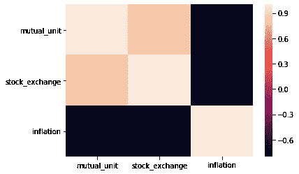
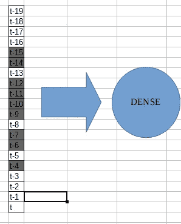

# 使用无状态神经网络的多变量时间序列预测

> 原文：<https://towardsdatascience.com/multivariable-time-series-forecasting-using-stateless-neural-networks-e88afdd5cd82?source=collection_archive---------9----------------------->

用无状态深度学习辅助目标变量的多变量预测。


Photo by [Jon Tyson](https://unsplash.com/@jontyson?utm_source=medium&utm_medium=referral) on [Unsplash](https://unsplash.com?utm_source=medium&utm_medium=referral)

# 有辅助变量的时间序列预测

输入法系列。带有时间元素的数据集。这样的数据允许我们思考时间序列的 ***2*** *属性*的组合:

1.  **季节性** —在特定时间长度内倾向于反复重复的数据模式。
2.  **趋势** —这类似于回归，我们正在捕捉系列的全局模式。
3.  数据的相关性趋向于*以* *当前时间为中心，*表示过去，接近当前时间的数据影响更大，越接近当前数据未来预测的准确性越好(熵*原理*)。


这样的组合使得时间序列变得特别。某一时间点的数据取决于之前的数据。直觉上，这是事件的*因果*本质，比如你正在阅读的单词基于之前的单词有意义。

通常情况下，机器学习只捕捉趋势，这使得训练时间序列上的典型机器学习模型非常昂贵。

# 用支持变量预测单个变量

N 通常预测一个*单变量*需要创建一个模型，该模型是以前时间数据的函数。这就是所谓的*单变量自回归。*


[1]Autoregression formula. (Wikipedia)

上图是一个自回归公式的例子。[1]

我们不会深入研究公式的细节，但请注意 ff 变量:


→ **因变量**。目前数据的价值。


→ **自变量**。注意*之前的数据*是变量的给定值。

其余的是提高模型精确度的附加参数和变量。

但是如果我们有额外的与目标变量相关的假设变量呢？这些可以通过适当的建模提高我们需要的目标变量的准确性。

# 算法和模型

W 一想到时间序列，马上想到 LSTMs、GRUs 等*递归神经网络*。但是在这种情况下，我们拒绝这样做，而是依靠*前馈神经网络*。为什么呢？让我们举例说明这两者以及我为什么选择后者:

1.  **递归神经网络—** 这些图的输出反馈到输入。随着推理的进行，网络的输出被存储为状态，准备在下一个时间步进行推理。


RNN and its states through time. Source: [https://upload.wikimedia.org/wikipedia/commons/e/ee/Unfold_through_time.png](https://upload.wikimedia.org/wikipedia/commons/e/ee/Unfold_through_time.png)

循环网络试图通过以下方式预测下一个时间步长:

1.  *在* →实际输入值在*时刻*
2.  *Xt*→RNN 或模型预测的先前状态

利用上述变量，网络通过最小化*建模数据*和*实际数据之间的误差来实现其预测能力。*但是，请注意，随着 RNN 穿过不同的时态数据，预测模型的误差会增加。


Continuous state transformation worsens the transformation through time.

LSTMs 和 GRUs 似乎解决了这个问题，因为它包含接受或忘记被认为不相关的先前数据的门。然而，这些门和数据转换不能具体控制到时序分析的一个关键方面:各种*时间状态*如何相互关联。

在下图中，时间步长变成了一个带有激活函数的单元格的向量。因此，捕获的时间步长与目标未来步长之间的关系。


Feedforward network that relates various timesteps vs the next timestep

然后，我们可以针对管道和设计的模型的具体细节，进行适当的实现。

# **实施**

完整的代码实现位于 https://github.com/arjay55/time_series_stateless.git[的 Github 上](https://github.com/arjay55/time_series_stateless.git)

**一、图书馆**

这些库主要包括 ff:

1.  **熊猫→** 进行数据准备
2.  **Scikit-learn (sklearn)和 scipy** →用于外部损失功能和缩放
3.  **seaborn →** 用于热图可视化
4.  **skopt** →包含贝叶斯优化的优化模块。我们将在训练中使用它进行超参数调整。
5.  **TensorFlow** →深度学习开源库。我们用的是最新版本， *tensorflow-beta1。*

**二。数据准备**

出于数据隐私的考虑，我们将只加载规范化的数据集。

首先，我们加载规范化的数据集。


Snip of the Dataframe. Note the missing data on ***inflation*** column

检查数据帧后，我们有 3 列
1。 **mutual_unit** →这是信托基金单位，可兑换为投资货币。它的价值越高，你的投资回报就越多。
2。这是一个公司中不同公司股票价格的综合指数。
3。**通货膨胀** →特定国家的通货膨胀率。

选择这些变量是因为它们代表了一个特定国家的财政状况。

请注意，*通货膨胀*列有许多空值或空值。一种技术是用假设值填充数据:
1。数据集的最高和最低索引中的线性插值。
2。超越最远指数的 ARIMA 外推。为什么？仅使用 2 个预测步骤来模拟外部部分更容易。

我们将文件保存到一个 csv 文件中，以供另一种编程语言 r 使用。我选择使用它，因为它的*“auto-ARIMA”*函数与 Python 的同类函数相比更流行、更成熟。

我们将有 2 个输出:
1。倒排[2]值到 ***x*** 步骤→“*倒排*”表示向后预测，或者简单地反转时间序列并执行预测。
2。预测值→y*步骤→平时预测。*

**x* 和 *y* 值由函数 **get_outernan** 确定，而 **fill_data** 用假定值填充缺失数据。*

*在 *Rstudio* 中，我们加载插值膨胀数据集并执行简单的 ARIMA:*

*   *在*预报中，*常规 ARIMA 已经完成*
*   *在*“回显”中，*注意在时间序列 *ts()* 函数之前使用 *rev()* 函数将数据转换为时间序列。*
*   *get **get_outernan** 函数返回值 *(6，15)，*，其中分别是*回测*和*预测*的步数。*

***三世。数据探索***

*既然我们已经准备好了用于分析的数据，我们就可以开始研究它们，以检查其数据质量，并使用领域专业知识简化数据。*

*首先，让我们细化我们的目标。请记住，我们打算预测一个单一的变量。那个变量就是 **mutual_unit** 。我们有 3 个变量*

*我们的目的是*借助*辅助变量*预测* ***共同 _ 单位*** *变量*，即*股票 _ 交易所*和*通货膨胀。**

*让我们画出三个变量:*

**

*Line plots of the three variables*

*在检查图表时，在互助单位和股票交易所之间可能存在一些相关性。对于通货膨胀，数值有一个支点，从*上升*到*下降*。*

*作为附加分析，让我们执行时间步长与时间步长*相关性分析。*我们将使用*热图*来查看相关性。*

*在第一次剪切( *correl.py* )时，它生成一个热图。*

**

*我们可以看到 *mutual_unit* 具有高度的相关性:*

**

*Correlation of mutual_unit to other variables*

**注:*在撰写本文时，*通货膨胀*似乎与*互助单位负相关。*这可能是该股走高，以从通胀上升中复苏。您可以尝试减少感兴趣的时间窗口，这可能会提高模型的准确性。*

*在我们的模型中，我们需要指定变量的权重。这是代码的第二部分( *correl2* )。由于我们使用*股票交易*和*通货膨胀*作为辅助变量，它们的权重将产生以下影响:*

1.  **较高的权重*意味着与目标变量的相关性较高。*
2.  **降低重量*与上述相反。如果指定了更高的权重，那么变量的噪声将会过拟合或使目标变量不太准确。*

*作为我们模型的权重。相关性的标度如下:*

*ABS(变量)/SUM(ABS(变量))*

*其中 VARIABLEx 是相关系数。除以变量的相关系数之和。注意*绝对值*是在其他计算之前获取的。*

**

*computed initial weights of the variables*

*请注意，这三者的比例大致相同，因为它们与 mutual_unit 具有相关性。*

# ***四。预测管道***

*这是我们应用机器学习进行预测的部分！当然，这并不神奇，这个过程仍然是随机的和数学的。正是它的信息处理技术使得它的预测令人印象深刻。*

*我们进行的预测类型是**回归**，我们预测的是连续值。在*回归*中，我们建模*连续值*。在*分类*中，我们对离散值进行建模。在下图中，某个指标以两种类型表示。在离散或*分类*中，数值为*轻度*、*中度*或*重度*。在右轴中，指标表示为连续的值。*

**

*Comparison between regression and classification.*

# *数据集的时间处理*

*我们的数据是一个时间序列，因此，除了它的特征值，还有一个向前移动的时间。虽然我们的数据集包含趋势和季节性，但将数据集截断到滚动窗口中是很重要的。为什么？因为使用整个历史可能会使模型过拟合。*

*在我们的案例中， *1 个月的窗口期可能就足够了，或者 4 个工作周*。这种假设意味着可以使用该窗口对大多数属性进行建模。*

*N *注:从这一点上，我将提到在下面的实现中使用的函数。**

*我们还需要定义滚动窗口的*范围。在我们的例子中，我们将假设 *3 个月的训练数据*来表征模型。**

**

*Illustration period of training scope and model scope. The right side of the illustration is the recommended dataset.*

**

*Dataset creation using rolling window. Photo credit and source from [Huaiqing Wang](https://www.researchgate.net/profile/Huaiqing_Wang), [Diagram of building up the dataset](https://www.researchgate.net/figure/Diagram-of-building-up-the-dataset-Stock-time-series-segmentation-is-made-by-20-width_fig2_276890244)*

*我们现在将分割训练和测试数据集:*

*上面的代码显示了*训练*和*测试数据集*的创建。结果是一个已经创建了滚动窗口数据集的*时间序列生成器*。*

*我们将训练/测试数据集分成 80%/20%。请注意，测试数据的批量大小只有 1，正如我们稍后将会遇到的，测试集将会 1 个*与 1 个*进行比较，以形成*验证错误。**

*训练窗口大小为 **20** 。*

# ***模型架构***

*该模型本质上是*顺序*的，意味着各层堆叠成一个*单输入/单输出*而没有任何分支。*

**

*Model architecture from **TensorBoard***

*模型从*“密集”*开始，到*“密集 _ 2”*层结束。*

1.  *第 1 层(*“dense”*)简单来说就是一个*点乘*，相当于线性*向量自回归* (VAR)，参数个数可调，增加了复杂度。它不包含随机参数。*
2.  *第二层(*“dense _ 1”*)是学习进一步非线性的附加层。*
3.  *接下来的几层分别是，
    *a. Dropout* 层——训练时随机断开某些权重的层。这有助于网络学习逻辑形式的非线性，同时减少过拟合。 *b .展平*层——将*先前的隐藏层*置换为*输出*层的层。*输出尺寸*等于*目标变量的尺寸*。*

```
*Function: train_evaluate()*
```

**

*Dropout illustration. Source: Srivastava Nitish, et. al, Dropout: [A Simple Way to Prevent Neural Networks from Overfitting](http://jmlr.org/papers/volume15/srivastava14a.old/srivastava14a.pdf) (2014), Journal of Machine Learning Research 15*

# *在输入图层上添加时态训练技术*

*回想一下*递归网络*仅模拟当前和下一个时间步。如果我们只想要一个*自回归模型*来描述*下一个时间步*与前一个时间步的特征呢？(见上图，“将不同时间步长与下一个时间步长相关联的*前馈网络”)。然后我们将一个无状态网络，因为它简化了模型。**

*另一个重要特征是*输入屏蔽*。回想一下，我们的输入形状有 20 个时间步长。我们将*不使用这些*形状作为输入层形状:*

1.  *使用所有时间步长可能会导致过度拟合。*
2.  *由于我们正在训练*滚动窗口*来捕捉季节性，我们将使用输入跳跃来捕捉不同尺度的季节性。*
3.  *更远的时间步长与现值的相关性更小。*

**

*Masking the inputs. The timesteps highlighted as **gray** are masked.*

*有了这些，我们在输入层只有 *11 个输入*。可以尝试不同的组合来面膜。*

*Code snip for code on masking. For full code, you can refer to **train_evaluate()** function.*

# *超参数调谐*

**超参数*主要是实例化或训练模型时的可调参数。*

*作为一个例子，上面的要点实例化了一个*“密集”*层。那些属于 *kwargs* 字典的是超参数:*

1.  **‘输入层’*是创建的神经元数量。调整这些将直接影响模型适应非线性(欠拟合或过拟合)的能力。*
2.  *' *uni_reg'* 将 L1 正则化应用于该层。参数值越高，调整速度越慢，降低了*过拟合*的风险。*

*以下是模型的超参数:*

*上面的要点是使用名为“ *skopt.space* ”的库创建的，您可以在其中指定要优化的范围和类别。*

*之后，我们将整个管道封装到一个函数中，并运行优化函数命令。这就是我们创建一个名为*

```
*train_evaluate(normalized_data, est_period,loss_func,param_record, **kwargs)*
```

*它包含模型创建、验证过程等。你可以随意研究。*

*现在，到超参数优化命令。*

*我们正在使用*高斯概率贝叶斯优化*来优化参数。它本质上映射了优化空间的一个*概率模型*。关于*开采*(疑似值)和*勘探*(创建真实数据点)之间的导航空间的假设[4]*

**

*Continuous improvement using Bayesian optimization. Source: Gilles Louppe, Manoj Kumar, [Bayesian optimization with](https://scikit-optimize.github.io/notebooks/bayesian-optimization.html) `[skopt](https://scikit-optimize.github.io/notebooks/bayesian-optimization.html) (2016)`*

# *测试/验证*

*测试这个自回归问题有很多组成部分:*

1.  **训练期间的测试集**

*   *这些是预测 X(t+1)处特征的测试值*

*2.*多步预测的迭代预测**

*首先，让我们提醒自己我们的目标变量，***mutual _ unit****。**

*为了验证这个变量，需要在 X(t+1)预测这 3 个变量。输入数据被推到左边，然后最新的时间步长数据被替换为预测数据。该过程被迭代以实现在*多步骤的迭代。**

**

*Process on how the model forecasts in multi-steps. **Xn** is real data point where **Hn** is a predicted value*

*做到这一点的功能是*

```
***validation()***
```

**验证*函数进行迭代预测，并与相应的测试数据进行比较。注意，只有 *mutual_unit* 才被拿出来比较。*

*A code snip on comparing the predicted(y_pred) and actual values(y_true).*

*现在，向量 *y_pred* 和 *y_true* 是未来值。随着时间步长的进一步预测，熵或不可预测性增加。因此，我们将为这些值引入一个*折现因子*。在我们的应用中，贴现因子是 *0.9。**

*Code to create the coefficients for multiplying into future data.*

*此后，计算*平均绝对误差**。*这将是衡量模型性能的主要验证指标。*

*这个 *MAE* 将作为*提前停止*的度量。*

*早期停止应用于我们的验证指标( *MAE* )以减轻*过度拟合的风险。*一旦验证误差开始*增加*时停止。然而，由于验证值被假定为*凸*，它具有不完全达到完全最优的风险，因为一旦发现误差的拐点，训练就停止。*

**

*Early stopping illustration. Source: Shubham Jain, [An Overview of Regularization Techniques in Deep Learning (with Python code)](https://www.analyticsvidhya.com/blog/2018/04/fundamentals-deep-learning-regularization-techniques/) (2018),*

*我使用了手动编码的早期停止器，而不是 TensorFlow 的 API，这是因为定制的验证计算加上它更容易编码，而不是找到合适的 API。对象名称是*

```
*class CustomEarlyStopper:
	def __init__(self, patience=3, delta=1e-4):
	...*
```

*它具有类似的参数，如*耐心*和*增量，*作为验证误差增加的容限。*

*让我们来看看预测值和实际值之间的关系。请注意，预测值在预测值之上有一个正偏移。*

**

*Comparison between the predicted(‘mutual_unit_forecast’) and actual(‘mutual_unit’)*

# *定稿*

*我们现在正在准备用于推理的模型。*

1.  *使用最终参数，我们重新优化模型，以在超参数调整期间达到相同的验证误差。这些可以通过加载优化对象来获得。*

*在笔记本中，你可以注意到 *jump()* 和 *load()* 这两个函数使*持久化*(保存到磁盘)。放置这些函数是为了便于在系统中断时使用对象。*

**注意:您可以重构代码，以便用最佳超参数优化的模型成为持久的(用户),从而避免如上所述的重新训练。**

*2.在此之后，捕捉最后一次最优训练的最后一次*训练损失*。请注意，这是要应用的**培训损失**，而不是验证损失。这种技术也可以重构。*

*3.最后，我们必须使用整个数据集来训练模型。为了降低过度拟合的风险，我们将从最后训练的模型中获得*先前训练损失*。一旦达到目标训练损失，我们将*停止*模型训练。*

**

# *结束语*

*感谢您的阅读，希望您了解了时间序列预测的基础知识，从数据准备到建模。我很高兴分享这一经历，就像在简单的时间序列预测中学习、发现和应用深度学习一样有趣。*

# *参考*

*[1] [自回归模型](https://en.wikipedia.org/wiki/Autoregressive_model#Characteristic_polynomial)，维基百科*

*[2]“罗布·J·海德曼”，[回播于 R (2014)](https://robjhyndman.com/hyndsight/backcasting/)*

*[3] [向量自回归](https://en.wikipedia.org/wiki/Vector_autoregression)，维基百科*

*[4]吉勒·卢佩，马诺奇·库马尔，[贝叶斯优化与](https://scikit-optimize.github.io/notebooks/bayesian-optimization.html) `[skopt](https://scikit-optimize.github.io/notebooks/bayesian-optimization.html) (2016)`*