# 多元微分学和最优化-第一部分

> 原文：<https://towardsdatascience.com/multivariate-differential-calculus-and-optimization-part-1-5c6b84831b27?source=collection_archive---------16----------------------->

微分学是寻找给定任务的最优解的强大工具。当我说“最优解”时，我指的是一个给定函数(称为目标函数)的优化结果。这个结果可能是最大值(即，如果你的目标函数描述了你的收入)或最小值(即，如果你的目标函数代表了你的成本)。

优化过程是数据科学中的基础:每个机器学习算法都通过一些优化标准进行优化，以便它将返回最佳结果。也就是说，如果你考虑神经网络，你可以看到最终的输出(即算法的参数集)是在反向传播阶段之后返回的，其目的是用一种称为梯度下降的技术优化系数(你可以在这里阅读关于这种技术的更多信息)。

在这里，我将详细阐述在多元环境中优化背后的数学原理。由于多元微分学涉及许多步骤和概念，我决定将这个主题分成两部分:第一部分将详细介绍一些介绍性的概念，而在第二部分，我将专注于优化过程本身。

顺便说一句，在开始第一部分之前，如果你不熟悉高维空间中的向量和平面，我建议阅读我以前的[文章](/the-geometric-interpretation-of-3d-lines-and-planes-e67b51351bfd?source=your_stories_page---------------------------)，在那里我提供了关于这方面的视觉和直观的解释。

# 方向导数和切面

正如预期的那样，我们将研究多元函数。具体来说，我们将从 R 到 R 看到这些函数:

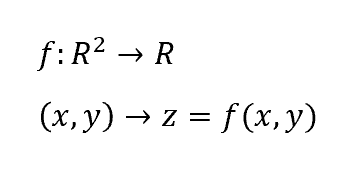

在它们的领域中，表示为如下的表面:

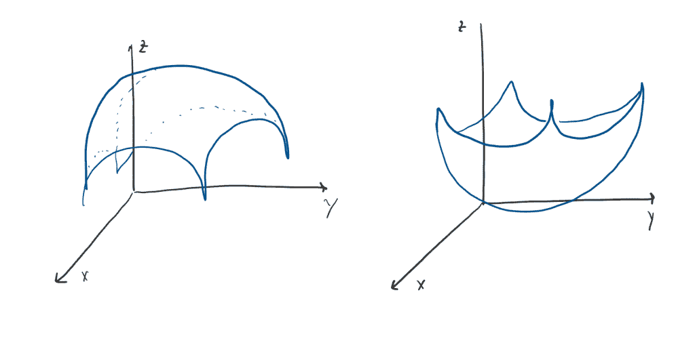

第一部分的目的是找到曲面在给定点 **p0** 的切面。这是查询该曲面的光滑性或正则性或连续性的第一步(这对于可微性是必要的，因此也是优化过程的可能性)。为此，我们将介绍以下概念:

*   方向导数
*   梯度
*   切线向量
*   切面相切平面

那我们开始吧。

从概念上讲，点 **p0** 的方向导数是函数在该点沿方向 **v** 变化的速率，其表达式如下:

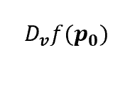

要定义它，我们先回忆一下 1 维中导数的定义:

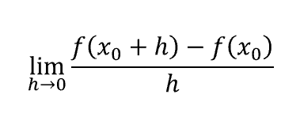

它被定义为当增量趋于零时不同商的极限。结果是计算导数的点处曲线切线的斜率。

从概念上讲，这在我们的多元环境中不会改变。这里，想法是计算不同的商，考虑表面上的一个点 **p0** 和它的增量，让我们再说一遍，表面上的 **pt** 。

让我们首先想象这两点:

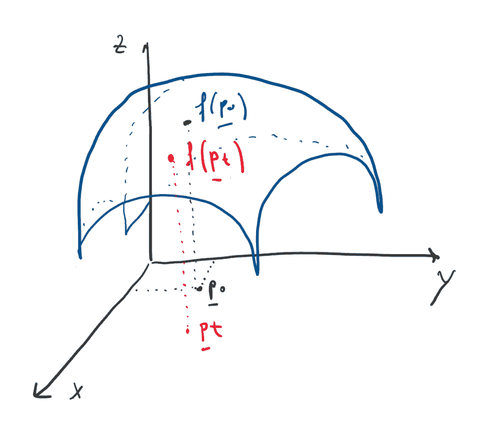

所以我们想计算:

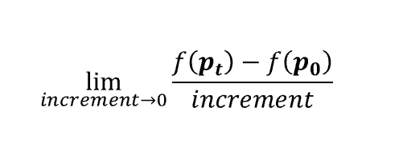

如你所见，我们需要三个要素:这两个点上的函数值，以及它们之间的增量。

为此，我们可以将曲面 f(x，y)的函数限制在穿过 **p0** 和 **pt** 的直线在曲面上的投影。

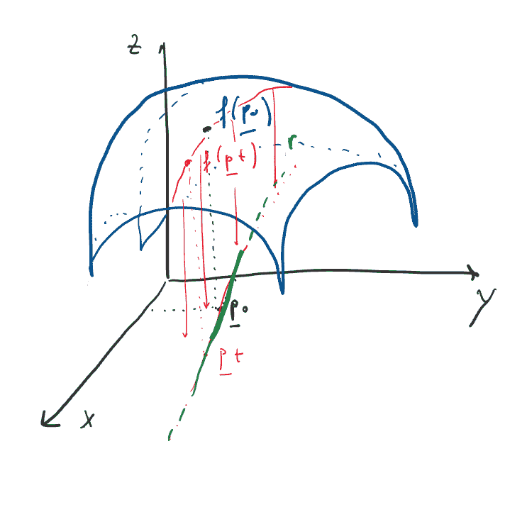

现在让我们把注意力集中在绿线上，让我们在一个 2 轴空间中检查它:

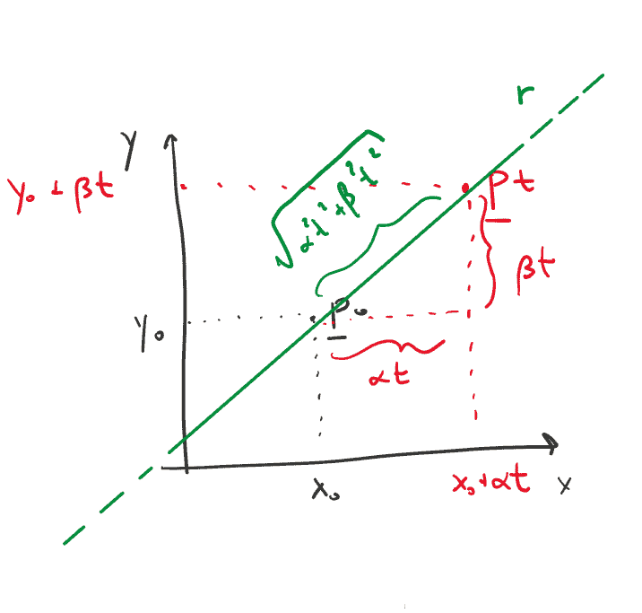

具体来说，这是一条与方向 **v** 相交 **p0** 的直线(与我们的方向导数方向相同)。我们可以很容易的计算出这条直线的参数表达式，得到 **pt** 的坐标。

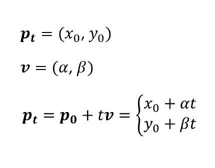

此外，我们还可以计算不同商的最后一个成分，即增量。我们可以将其计算为 **p0** 和 **pt** 之间的距离(带调整):

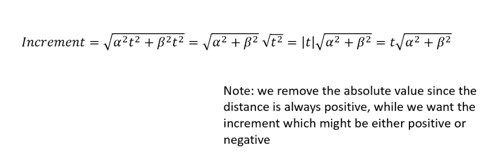

因此，方向导数的最终表达式是:

这导致仅在 *t* 中的限制，而不是多个变量。

现在让我们考虑方向导数的一个特定方向。我说的是向量 **v** ，它平行于我们的 x 轴，因此它的第二个分量是 0。为了简单起见，让我们考虑第一个分量等于 1(它可以是任何值)。在这种情况下，我们的方向导数变成:

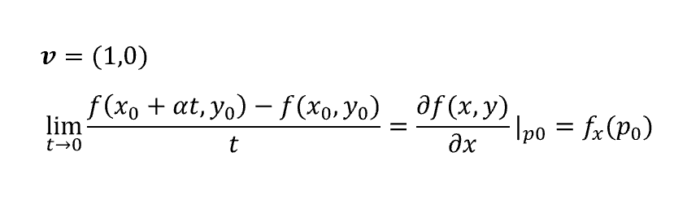

这是 f(x，y)相对于 x 的偏导数的定义。如果我们选择一个平行于 y 轴的方向向量，即 **v** =(0，1)，同样的推理成立:

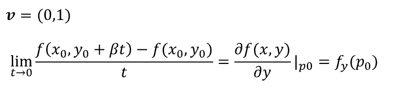

如果我们把那两个偏导数集合成一个向量，我们就得到所谓的 f(x，y)的梯度。我们可以在函数自然区域的任何一点计算梯度。然而，每一个合成向量都具有与函数的水平线正交的特性。

现在我们已经有了几乎所有寻找切面方程的成分。为此，我们将再次将我们的函数限制在两条坐标线的投影上，然后找到这些曲线的两个切向量，计算包含这两个切向量的平面的方向 **d** ，最后计算具有方向 **d** 的平面的方程。

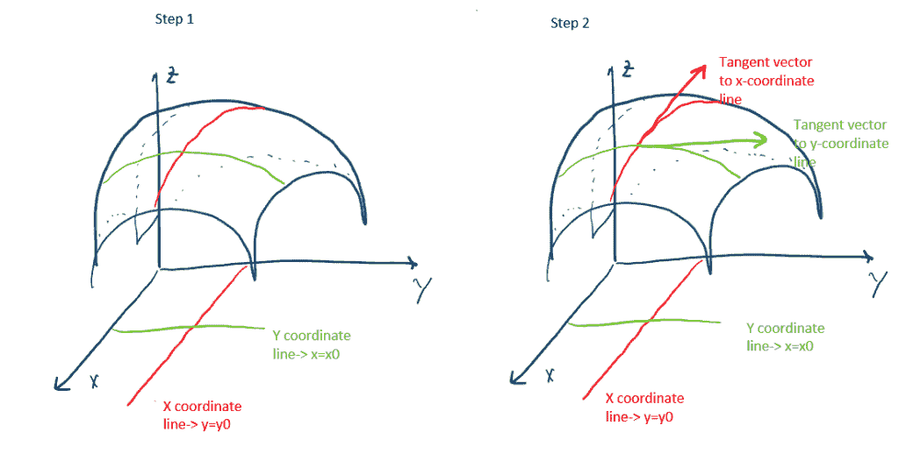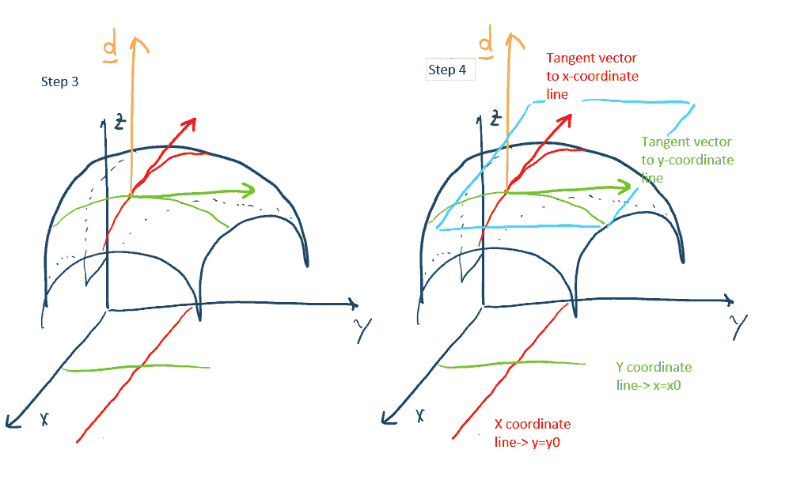

两条坐标线相交的点为 **p0** =(x0，y0):

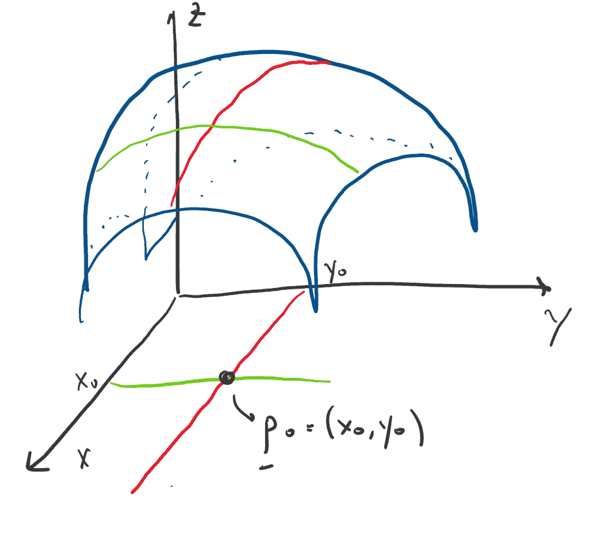

让我们一步一步来，如上图:

*   **第一步**:我们已经有了我们坐标的前两个分量(x 坐标的 x 自由和 y 固定，y 坐标的 y 自由和 x 固定)。然而，由于我们希望它们在表面上的投影，我们还需要第三个组件，它只是在坐标向量上计算的函数:

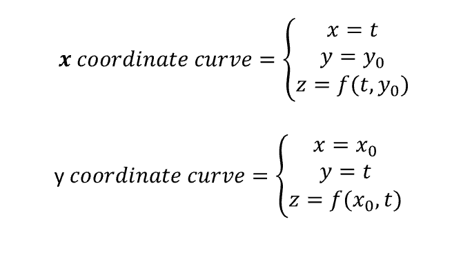

*   **第二步**:由于前面的表达式只不过是两条曲线的方程，我们可以对每个分量对参数 *t* 求导来计算切向量:

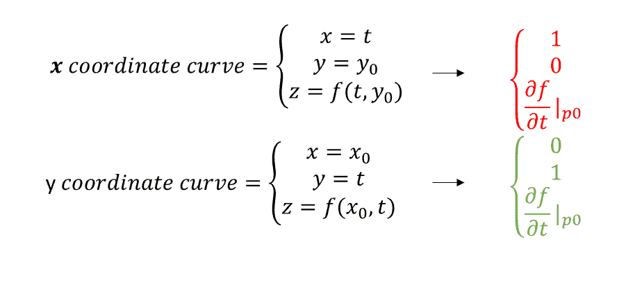

注意，第三个分量分别是 x 和 y 的偏导数(实际上，在第一个系统中 x=t，因此对 w.r.t. *t* 求微分等于对 w.r.t. x 求微分。这同样适用于第二个系统中的 y)。

*   **第三步:**我们需要计算我们的切面的方向 d。因为我们知道 d 必须正交于包含在平面中的所有点(你可以在这里阅读更多关于正交性的内容)，并且因为该平面包含上面计算的两个切向量，我们可以推导出 d 必须正交于这两个切向量，因此:

其中*伽玛*是一个参数。由于我们只需要一个向量作为方向，为了简单起见，我们可以很容易地设置 gamma=1，因此:

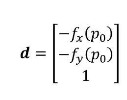

*   **步骤 4** :现在是计算我们平面的方程的时候了，这个方程可以很容易地用下面的正交条件推导出来:

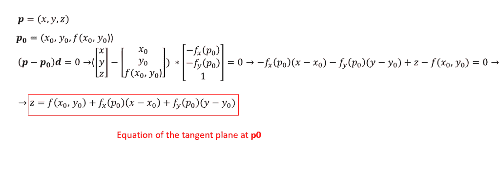

如果我们检查最后一个表达式，我们可以注意到这是一阶泰勒多项式对曲线近似的二维扩展:

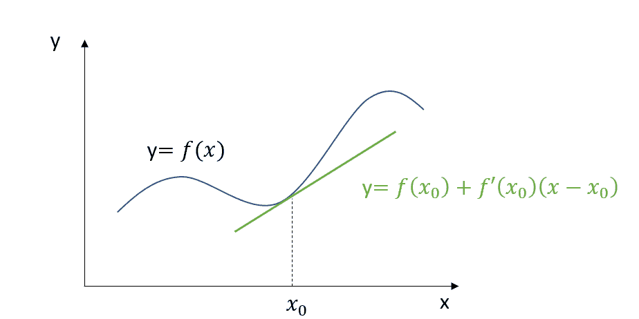

如果你想知道一个曲面的光滑度，那么在一个给定点上该曲面的切平面的存在是一个基本要素。事实上，您可以将 **p0** 处的光滑性视为通过任何方向到达 **p0** 的可能性，而不仅仅是对应于偏导数的那些(偏导数的存在不是曲面正则性的充分条件)。

我们优化任务的下一步将是检查曲面的可微性，这是任何优化问题背后的假设。敬请期待第二部！

*原载于 2019 年 9 月 1 日*[*http://datasciencechalktalk.com*](https://datasciencechalktalk.com/2019/09/01/multivariate-differential-calculus-and-optimization-part-1/)*。*