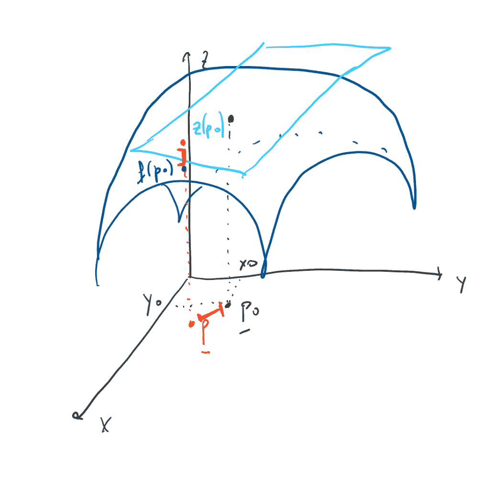
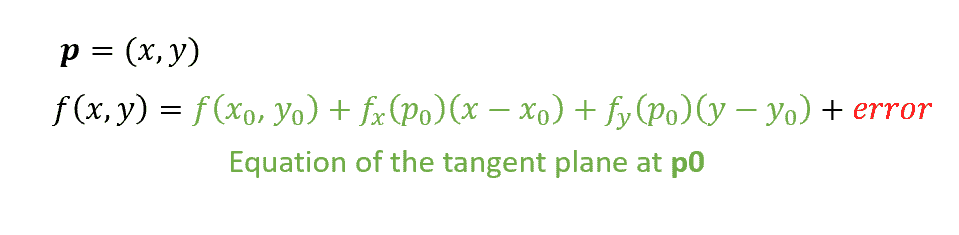
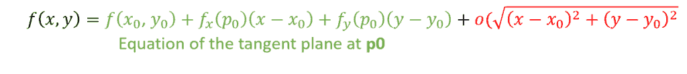
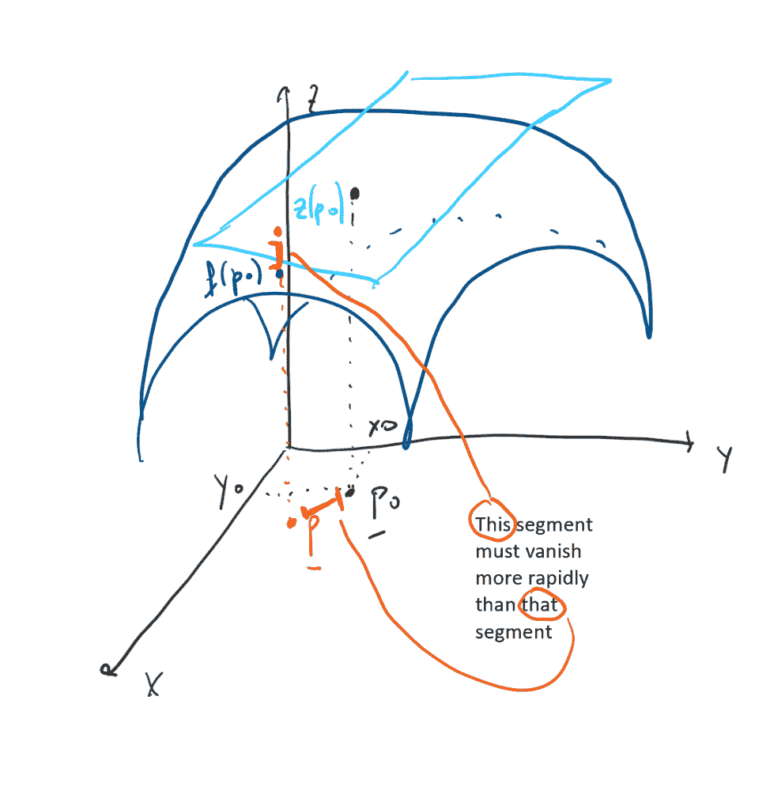
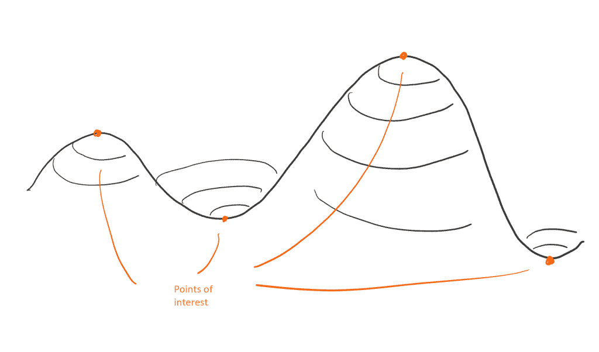
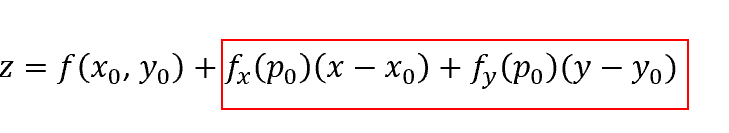
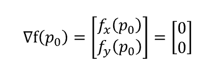
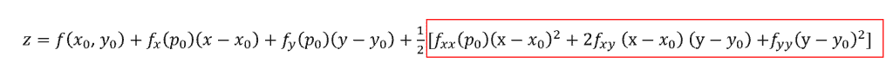
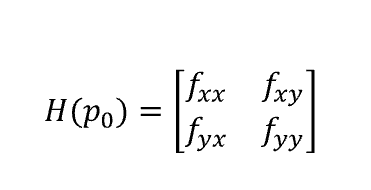
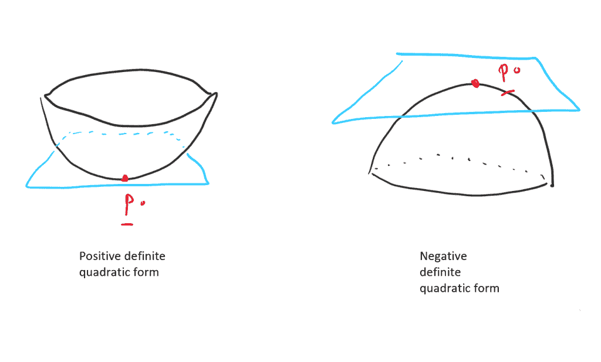

# 多元微分学和最优化-第二部分

> 原文：<https://towardsdatascience.com/multivariate-differential-calculus-and-optimization-part-2-d157af25d82d?source=collection_archive---------22----------------------->

在我之前的[文章](https://medium.com/@valentinaalto/multivariate-differential-calculus-and-optimization-part-1-5c6b84831b27)中，我介绍了一些概念，如果我们想在多元环境中设置一个优化问题，这些概念是必要的。

在这里，我们将首先讨论如何检查曲面的平滑度(这是部署优化任务的主要假设)，然后我们将了解如何在多元环境中寻找局部/全局最大值/最小值。

# 光滑性和可微性

用一种非常直观的方式，我们可以说一个曲面是光滑的，如果它既没有洞，也没有角，也没有跳跃。这与一维空间中连续性的概念相同，但扩展到了多元环境中。

更具体地说，指出一个曲面在一个点 **p0** 上可微意味着我们可以以任何我们想要的方式到达那个点，而不仅仅是通过偏导数。这意味着存在一个与 **p0** 相切的平面，该平面可以逼近 **p0** 的一个邻域(最好:*任何一个*邻域)中的曲面。

让我们用下面的表面来形象化这个概念:

根据定义，曲面上和切面上的点 **p0** 的值是相同的。另一方面，挑一个接近 **p0** 的点，姑且说 **p** 吧，我们可以看到 **p** 在表面上的值和在平面上的值是不一样的:我们将这种差异称为*误差*。因此，我们可以将曲面在一般点 **p** 上的近似表示如下:

其思想是，如果相对于 **p0** 和 **p** 之间的距离，误差可以忽略不计，则该平面是该表面的良好近似。换句话说，我们希望误差是距离的一个小的 *o* ，因此:

很好，现在我们可以开始优化程序了。

# 最佳化

正如预期的那样，从现在起我们将考虑给定的可微性:这将是我们强有力的假设。话虽如此，让我们首先想象一下我们想要解决的问题:

这个想法是找到我们表面的最大值和最小值，我们可以从一个基本定理开始，费马定理:

*“若 f(x，y)在其自然域上可微，则每个最优点都有一个水平切面”。*

所以如果我们看看切面的方程:

这意味着红色部分必须等于零，这样平面才是水平的。这意味着函数的梯度(其分量是偏导数)必须等于 0 向量:

因此，通过设置梯度等于零，我们挑选了所有的候选最佳点。然而，我们该如何对它们进行分类呢？为此，我们需要二阶泰勒多项式，然后研究红色量的符号:

如果它是正的，这意味着曲面的函数在其周围各处取大于 **p0** 的值，因此 **p0** 是局部最小值。另一方面，如果数量是负的，这意味着该函数在其周围各处取比 **p0** 低的值，因此 **p0** 是局部最大值。

我们可以很容易地研究该量的符号，因为它是具有代表性矩阵的二次型:

这就是所谓的海森矩阵。因此，我们可以说，如果在 **p0** 处评估的 H 是正定的， **p0** 是局部最小值；如果 H 是负定的， **p0** 是局部最大值；如果是不定的， **p0** 不是一个最优点。只要 H 是非奇异矩阵(因此它的行列式必须不等于 0)，一切都成立。

优化是数据科学中的一个基本概念，可以采用许多不同的技术。然而，背后的想法总是相同的:选择一个目标函数(在机器学习算法的情况下，它由损失函数表示，因此优化意味着最小化)并将问题设置为多元环境。

当然，预建的算法会为你做所有的计算，然而重要的是要放弃直觉，因为即使是自我学习的算法也需要调整(或者至少初始化)。

*原载于 2019 年 9 月 1 日*[*http://datasciencechalktalk.com*](https://datasciencechalktalk.com/2019/09/01/multivariate-differential-calculus-and-optimization-part-2/)T22。