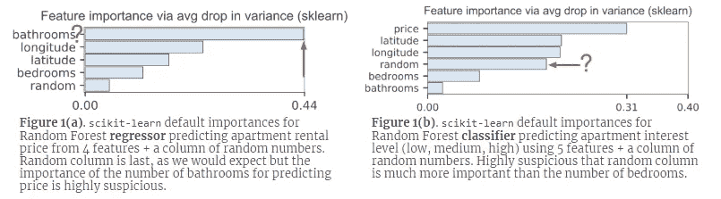
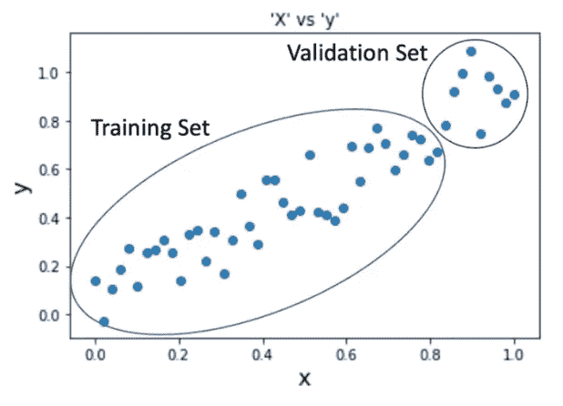
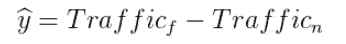

# 基于随机森林的多元时间序列预测

> 原文：<https://towardsdatascience.com/multivariate-time-series-forecasting-using-random-forest-2372f3ecbad1?source=collection_archive---------0----------------------->


[A Pocket Watch](https://www.wallpaperup.com/401772/pocket_watch_time_clock_bokeh.html). It looks cool doesn’t it. Very hipster-ish.

# 介绍

在我之前的帖子([了解实体嵌入及其应用](/understanding-entity-embeddings-and-its-application-69e37ae1501d) ) [1]中，我谈到了使用实体嵌入来解决预测问题——基本上是使用表示为向量的表格数据，并将其作为基于神经网络的模型的输入来解决预测问题。

不过这一次，我将通过一种叫做随机森林的不同技术来做同样的事情。

由于我不打算让这篇文章成为关于 Random Forest 的教程，任何热衷于深入研究这个问题的感兴趣的读者可以在[这里](https://mlbook.explained.ai/intro.html#sec:2.2)【2】正在编写的优秀机器学习书籍中了解更多信息。如果你以某种方式幻想自己是机器学习的完全初学者，并想了解决策树及其与随机森林的关系，请查看泰坦尼克号数据集上的教程。[3]

不过，我将谈论的是我如何使用随机森林建立一个多元预测模型，以及随之而来的一些考虑因素。

为了将事情放入背景中，我的新任务要求我建立一个模型，能够预测我们未来几个月的网络流量，使用多个变量，这些变量可能对预测有任何影响，也可能没有任何影响。虽然我不能透露正在使用的变量(出于明显的原因)，但它本质上是一个 web 流量时间序列数据，包含流量、用户行为、人口统计和一些外部特征等常见特征。

## **为什么随机森林？**

我选择使用随机森林(RF)主要是因为我必须处理的任务要求我能够解释模型并提供预测。因为典型的神经网络几乎是一个黑箱(我不确定注意力机制是否能给出特征重要性..可能是我看的论文还不够多…)，我决定这次不用了。

在现有的各种统计机器学习技术中，我选择了 RF，因为它比其他技术更健壮，更容易训练。

但是，在依赖 scikit-learn 随机森林特征重要性时需要谨慎。在[8]中，作者声称由于计算方式的不同，结果中可能会出现偏差。为了让我们对此有所了解，考虑一下他们使用 Kaggle 的 [Two 适马连接:租赁列表查询](https://www.kaggle.com/c/two-sigma-connect-rental-listing-inquiries)中的数据构建分类器的例子



Image from [8]. Figure 1(a) depicts feature importance from a model that predicts rent prices, while Figure1(b) is a model that predicts interest level.

上图描述了基于两种不同模型的特性重要性图表。左图来自一个试图预测租金价格的模型，右图来自一个预测利率水平的模型。与此同时，使用随机数生成器生成`random`变量，以描述随机性并指出任何不重要的特征(直觉是任何排名低于`random`的特征都应被视为垃圾)。

正如我们在图 1(a)中看到的，`random`是排名最低的——这是有道理的。虽然浴室的数量是最重要的特征看起来很奇怪，但我们现在暂时不考虑它(也许他们真的关心卫生和其他)。对于我们这些实际上已经购买或租赁过房产的人来说，通常的直觉是，位置是决定房价的最重要的因素。

在图 2(a)中，我们可以看到`random`在某种程度上高于`bedrooms`和`bathrooms`。所以不知何故，我们随机产生的数字被认为具有预测能力。奇怪…(这就结束了我演示 RF 特性重要性如何产生偏差的简短尝试)。

有关上述示例和建议解决方案的更多详细信息，请参见[【8】](https://explained.ai/rf-importance/index.html)。他们也有一些优点，说明为什么线性模型可能不是通过回归系数提供特征重要性的最佳方法。

> 我们建议对所有模型使用排列重要性，包括线性模型，因为我们可以在很大程度上避免模型参数解释的任何问题。解释回归系数需要极大的细心和专业知识；地雷包括没有标准化输入数据，在使用 Lasso 或 Ridge 正则化时正确解释系数，以及避免高度相关的变量(如 country 和 country_name)。要了解更多关于解释回归系数的困难，请参阅 Leo brei man(Random Forests 的创始人之一)的[统计建模:两种文化](https://projecteuclid.org/euclid.ss/1009213726) (2001)。

因此另一个+ve 用于使用随机森林。

## **为什么不是 ARIMA？**

我确实考虑过使用 ARIMA，而且事实上已经就这个问题进行了一个简短的研究，以考虑它是否适合这项任务。然而，最终我认识到，它主要适用于建立单变量(单变量)模型。

如果这个问题是单变量的，我可能会使用脸书的 Prophet [4]软件包来帮助我。用我们的流量数据进行测试一点也不困难，而且在添加年度、季度和月度季节性模式方面做了一些调整——它已经能够给出一个非常不错的结果。

Hyndman 在 R 中的包也是一个选择。但是我决定不这么做，因为在这个例子中我尽量不使用 R。

## 其他方法

在探索解决这个问题的可能选项时，我遇到了一些值得一提的方法:

1.  向量自回归模型(VAR)。它基本上是一个多元线性时间序列模型，旨在捕捉多个时间序列之间的动态变化。更多细节，请查看[5]和[6]
2.  AWS Deep AR 我只是在工作的后期才发现这一点。它基本上是一个监督学习模型，旨在用于单变量数据。但是，它也允许多变量时间序列输入。更多细节见[7]。

由于严格的截止日期要求，我无法探究上述算法——因此我不得不放弃它们。

# 构建预测模型

在这一节中，我将介绍一些我认为在使用基于树的方法构建预测模型时非常重要(尤其独特)的活动。

## 随机森林不能预测 t+1 以上的时间对吗？

这是真的——我们不能像使用线性模型那样，使用随机森林预测超过 1 个值或无限期预测未来。这意味着，当我试图预测未来 6 个月时，我需要实际使用过去 6 个月的数据作为输入。

举个例子，如果我的模型能够预测未来 6 个月；为了预测 2019 年 7 月 1 日的流量，我需要使用 2019 年 1 月 1 日的数据点(为了简化，我假设所有月份都有 30 天)。为了预测 2019 年 7 月 2 日，我将使用 2019 年 1 月 2 日。以此类推，直到 2019 年 6 月 30 日，这给了我 2019 年 12 月 30 日的预测。

使用这种方法的缺点是无法使用更接近现在的数据(即使用 2019 年 6 月 30 日的数据进行 2019 年 7 月 1 日的预测，如上例所示)。在我们的场景中，我们真正感兴趣的是未来 6 个月的流量，这仍然是可以接受的。

为什么是 6 个月？因为知道流量会如何(好或坏)会让我们有时间做出必要的改变来尝试改变它。较短的时间框架有助于仓促决策和执行。

但是，如果您的用例需要对明天或下周发生的事情进行真正准确的预测(例如股票交易)，那么使用最近的数据会更好。

## 添加基于时间的变量

我们使用 fastai 库[9]的`add_datepart` 方法引入了额外的基于日期的变量。这样做使我们能够从数据集中捕捉趋势、季节性或周期性模式。这是一个非常有用的方法，尤其是当我们需要处理大量的时间序列数据时。

```
def add_datepart(df, fldname, **drop=True**):
    fld = df[fldname]
    if not np.issubdtype(fld.dtype, np.datetime64):
        df[fldname] = fld = pd.to_datetime(fld, 
                                     infer_datetime_format=True)
    targ_pre = re.sub('[Dd]ate$', '', fldname)
    for n in ('Year', 'Month', 'Week', 'Day', 'Dayofweek', 
            'Dayofyear', 'Is_month_end', 'Is_month_start', 
            'Is_quarter_end', 'Is_quarter_start', 'Is_year_end', 
            'Is_year_start'):
        df[targ_pre+n] = **getattr**(fld.dt,n.lower())df[targ_pre+'Elapsed'] = fld.astype(np.int64) // 10**9
    if drop: df.drop(fldname, axis=1, inplace=True)
```

运行该方法会给我们提供以下变量。

*   月
*   年
*   周
*   一天
*   星期几
*   一年一天
*   是 _ 月 _ 末
*   是 _ 月 _ 开始
*   是季度末
*   是 _ 季度 _ 开始
*   是 _ 年 _ 末
*   是 _ 年 _ 开始
*   消逝

然而，我们不一定需要使用它们。例如，在我的用例中，我的数据点是基于每周的——因此我真的不需要`Day`变量。

## 缩放/标准化您的数据

由于趋势可以在时间序列图中上下波动，为了确保我们的算法可以在测试集上更好地概括，最好首先将我们的数据归一化到一些较小的尺度。Box Cox、Log 或 StandardScaler(当然还有其他方法..我的列表决不是详尽的)可以用来修正我们的数据到一个更合适的。

记住，一旦你完成了你的预测，就把它们按比例缩小。

## 移除输入变量的趋势

确保数据的稳定性非常重要，因为这将使我们能够对未来做出准确的预测。为了强调为什么这是一个问题，考虑下图。



The y values in the validation set doesn’t appear in the training set. [10]

上面演示了通常如何将数据分成时间序列问题的训练集和验证集。请注意，由于拆分，定型集将无法捕获验证集的 y 值。

> 随机森林不太适合处理时间序列分析时经常遇到的上升或下降趋势，例如季节性[10]

为了补救这一点，我们需要从根本上“拉平”趋势，使其变得“稳定”。最简单的方法是使用数据的斜率或简单地扣除变量在时间 *t* 的滞后值在时间 *t-1* 。

## 添加滞后变量

由于随机森林评估数据点时不会将过去的信息带到现在(与线性模型或递归神经网络不同)，因此定义滞后变量有助于从过去获得要在现在评估的模式。我们应该选择回到多远，很大程度上取决于数据本身的周期性。理想情况下，我们希望能够捕获至少一个周期的数据。

## 使用 delta 作为目标

类似于前面提出的观点，我们甚至对我们的目标变量也这样做(添加滞后变量)，因为它是基于时间的。然而，由于我们不能直接获得 t-1 的数据，我们使用当前的交通。因此，预测交通量的公式如下。



where traffic(f) is traffic 6 month into the future and traffic(n) is current traffic.

有时在某处记下公式会有所帮助，因为我们需要在模型预测前后应用它。

## 建立基准

不言而喻，有一个比较基准是很重要的，这样我们就可以有一个参照点来比较我们的模型。在我的例子中，我使用了两种类型的基准；(I)使用当前流量，以及(ii)使用 6 个月的平均流量。

就模型的度量标准而言，我选择了 RMSPE(均方根百分比误差),这样我就可以评估从 0 到 100 的误差值(也便于与利益相关者沟通)。

## 维度的诅咒

这一点实际上并不是时间序列独有的。但是，在从滞后数据中创建了几百个额外的变量之后，由于我们引入了大量的变量，同时仍然只依赖于有限数量的数据点，我们的模型很容易过度拟合。

为了解决这个问题，我有意识地决定将使用的变量数量限制在前 N 位，这里 N 小于数据点的总数。

## 回溯测试策略

最初，我只是使用通常的训练有效性测试数据分割来检查我的模型的有效性。然而，当我深入这个主题并接近完成时，我终于明白，如果我不对它进行严格的基于时间的测试，我永远无法真正确定这个模型的性能。

事实证明，优步[11]在时间序列这个话题上有很多很好的参考。


Two major approaches to test forecasting models. Sliding window (left) and expanding window (right). Image taken from [11]

在我的场景中，我采用了扩展窗口的方法——在每次迭代中，我的训练数据都会变大，而保持测试/验证窗口间隔不变。测试窗口保持不变，这样我们就可以随着时间的推移比较它的性能和稳定性。

理想情况下，正如[11]中提到的，一旦我们的数据足够大，我们应该将测试方法从扩展窗口切换到滑动窗口。

在[12]中还可以找到关于该主题的更深入的文章。

## 再训练模型和预测

除了在训练模型之前使数据稳定之外，这是我从做这个练习中得到的最大的教训之一。

> 你不能只是部署一个静态模型并对其评分，模型服务的概念对时间序列预测没有意义。相反，您需要确保训练和模型选择可以在生产中即时完成，并且您必须确保您的整个训练集可以在生产中存储和处理。[13]

我对如何部署 ML 模型的通常理解一直是，模型在需要重新培训(如果有的话)之前服务大约 3-6 个月，并且可能监控在此期间性能下降的任何迹象。

可以说,[13]中提出的即时再训练和预测确实让我大吃一惊。然而，由于时间序列模型的可靠性在很大程度上取决于数据的更新程度(例如，假设我们试图预测时间 *t+1* 的交通流量；那么使用的最佳预测器将是时间 *t、*的流量，在每个预测时间重新训练模型毕竟不是一个荒谬的想法。

当然，如果历史数据的结构足够稳定；也许可以以较低的频率间隔安排再训练，或者也许只有当检测到变化点[15]事件时才进行再训练。

# 结论

上面的文章主要基于我在这个用例中的学习笔记。当我第一次开始研究它的时候，我从来没有想到我会学到这么多——有点期待它来自时间序列分析，而不是模型构建。

然而，让我颇感惊讶的是，寻找关于这个主题的信息是如此的不直接。虽然可以说，也许没有多少数据科学家喜欢使用基于树的方法来建立他们的预测模型。

最后，我的最终模型不是随机森林。我用使用 LightGBM 构建的模型替换了它，以获得更好的准确性和能够生成预测间隔的额外好处(通过分位数回归)。尽管使用梯度增强方法时需要仔细考虑，因为很容易建立一个过度拟合数据的模型。就我而言，LightGBM [14]的文档给了我一些如何克服这个问题的想法。

最后，特别感谢我的同事们，他们一直是我的跳板，帮助我在这么短的时间内弄清楚了这个问题。

更新(2019 年 3 月 4 日):增加额外章节*随机森林不能预测超过 t+1 对吗？*和*根据读者的反馈缩放/标准化您的数据*。(感谢侯赛因。)

# 参考

1.  [理解实体嵌入及其应用](/understanding-entity-embeddings-and-its-application-69e37ae1501d)
2.  [随机森林回归变量](https://mlbook.explained.ai/intro.html#sec:2.2)，作者特伦斯·帕尔和[杰瑞米·霍华德](https://medium.com/u/34ab754f8c5e?source=post_page-----2372f3ecbad1--------------------------------)
3.  《泰坦尼克号:从 R 开始》，作者特雷弗·斯蒂芬斯。*(老实说，我只是为这篇教程添加了一个插件，因为这是我在 2015 年开始学习数据科学时学习的第一篇文章。目前，你可以找到更多关于决策树/媒体 RF 等的文章，但早在那时，这篇文章是仅有的几篇之一。是的，我最初是从 r 开始的，是的，我对此很伤感。Lol。)*
4.  [先知，脸书](https://facebook.github.io/prophet/)
5.  [向量自回归(VAR)简介](https://www.youtube.com/watch?v=CCinpWc2nXA)，IMF
6.  [使用递归神经网络和向量自回归模型进行时间序列预测:何时和如何](https://www.youtube.com/watch?v=i40Road82No)，刘镇伟
7.  [DeepAR 预测算法](https://docs.aws.amazon.com/sagemaker/latest/dg/deepar.html)，AWS
8.  [小心默认随机森林重要性](https://explained.ai/rf-importance/index.html)，作者特伦斯·帕尔和[杰瑞米·霍华德](https://medium.com/u/34ab754f8c5e?source=post_page-----2372f3ecbad1--------------------------------)
9.  该方法不再作为最新库的一部分提供。尽管如此，你仍然可以在罗斯曼的笔记本上找到。
10.  [为什么随机森林不能预测趋势，如何克服这个问题？](https://medium.com/datadriveninvestor/why-wont-time-series-data-and-random-forests-work-very-well-together-3c9f7b271631)，作者[阿曼·阿罗拉](https://medium.com/u/16e431a392f6?source=post_page-----2372f3ecbad1--------------------------------)
11.  优步的《优步的天气预报:简介》
12.  [时间序列嵌套交叉验证](/time-series-nested-cross-validation-76adba623eb9)，作者 [Courtney Cochrane](https://medium.com/u/36f80f7270a4?source=post_page-----2372f3ecbad1--------------------------------)
13.  [3 个让经验丰富的机器学习实践者惊讶的时间序列预测事实](/3-facts-about-time-series-forecasting-that-surprise-experienced-machine-learning-practitioners-69c18ee89387)，作者[斯坎达·汉纳奇博士](https://medium.com/u/9938e98db973?source=post_page-----2372f3ecbad1--------------------------------)
14.  [参数调谐](https://lightgbm.readthedocs.io/en/latest/Parameters-Tuning.html)，LightGBM
15.  [变化检测](https://en.wikipedia.org/wiki/Change_detection)，由维基百科提供