# 基于随机梯度下降的音乐艺术家推荐系统(七)

> 原文：<https://towardsdatascience.com/music-artist-recommender-system-using-stochastic-gradient-descent-machine-learning-from-scratch-5f2f1aae972c?source=collection_archive---------6----------------------->

## 了解如何通过从零开始实现随机梯度下降来为音乐艺术家构建推荐系统


> *TL；DR 从头开始用 Python 构建一个推荐系统。从 last.fm 数据集创建评级矩阵并预处理数据。使用随机梯度下降(SGD)训练模型，并使用它来推荐音乐艺术家。*

随着“互联网”上的信息量呈指数级增长，推荐系统变得越来越重要:

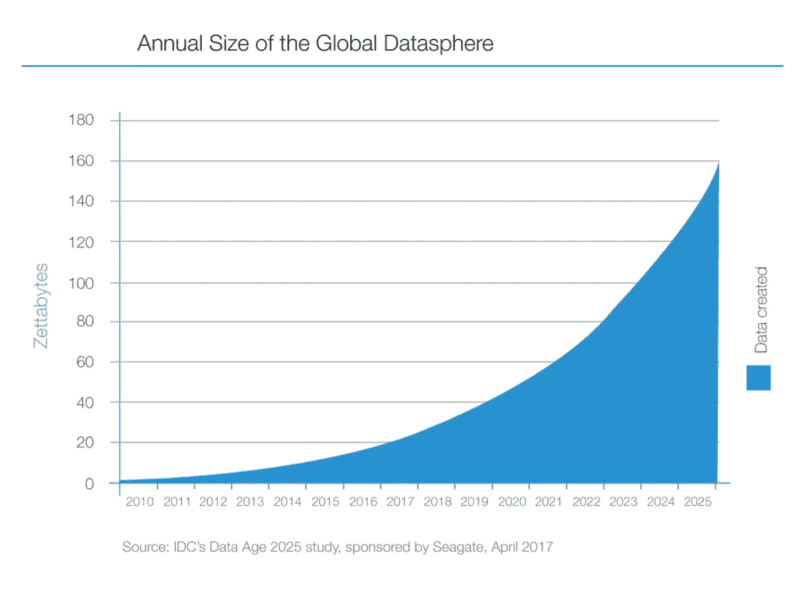

从书籍、电影、游戏中找到你可能喜欢的东西，以及在 Instagram 上关注谁，变得越来越困难。此外，我们(用户)需要与我们日常使用的产品进行更快的交互，所以我们不会觉得我们在浪费时间(即使我们比人类历史上任何时候都更浪费时间)。随着数据量的增加，您的计算资源可能很难产生足够快的结果。

在这里，我们将看看一个推荐系统的简洁实现，它既是许多现实世界实现的基础，又易于理解。我强烈推荐你通读一下:)

[谷歌合作笔记本中的完整源代码](https://colab.research.google.com/drive/1_WxDPLGkJY3qJ-PK0J1YjATaZz35efmk)

# 用户评级

传统上，推荐系统是围绕给定的一组项目的用户评级建立的，例如 IMDB 上的电影评级。这里，我们将看看如何使用另一个指标来提出建议。

我们的数据来自 GroupLens 主持的 [last.fm](https://www.last.fm/) (从[这里](https://grouplens.org/datasets/hetrec-2011/)下载)。它包含以下内容:

*   **user_artists.dat** — userID，artistID，weight —用户播放的艺人。
*   **artists.dat** — id，名称，网址，图片网址
*   **tags.dat** — tagID，tagValue
*   **user _ tagged artists . dat**—userID，artistID，tagID，日，月，年
*   **user _ tagged artists-timestamps . dat**—userID，artistID，tagID，时间戳
*   **user _ friends . dat**—userID，friendID。用户/朋友关系。

我们将关注 **user_artists.dat** 和 **artists.dat** ，因为它们包含向用户推荐新音乐艺术家所需的所有数据。我们将使用每个艺术家的用户播放计数，而不是评级。

## 加载数据

让我们将数据加载到熊猫数据框中:

## 数据争论

在处理数据之前，您需要进行一些争论:

我们合并艺术家和用户播放，并将权重列重命名为*播放计数*。让我们根据用户播放的次数对艺术家进行排名:

并将结果与先前的数据帧合并:

以下是部分数据:

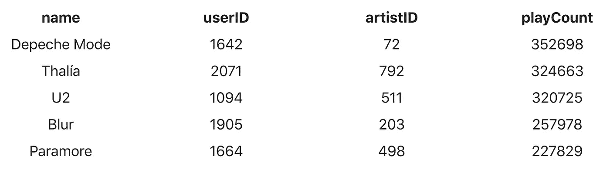

# 探测

我们来看看每个艺人被用户玩了多少:

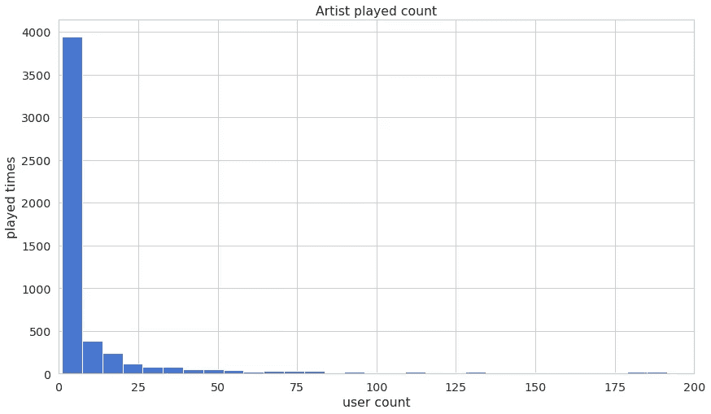

以及被播放次数最多的艺术家的名字:

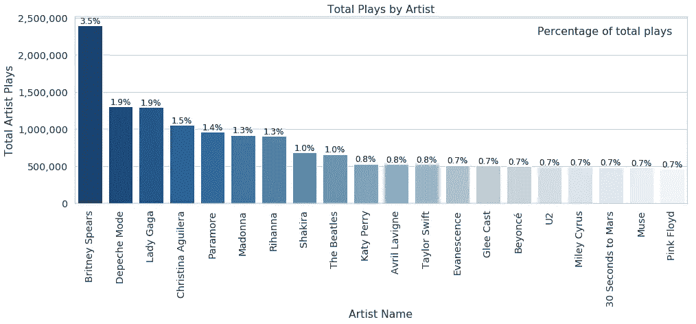

有多少用户扮演艺术家:

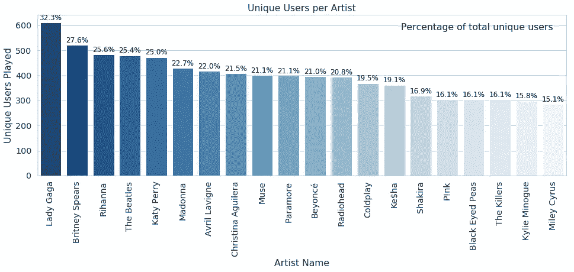

这是对艺术家受欢迎程度的另一种看法:

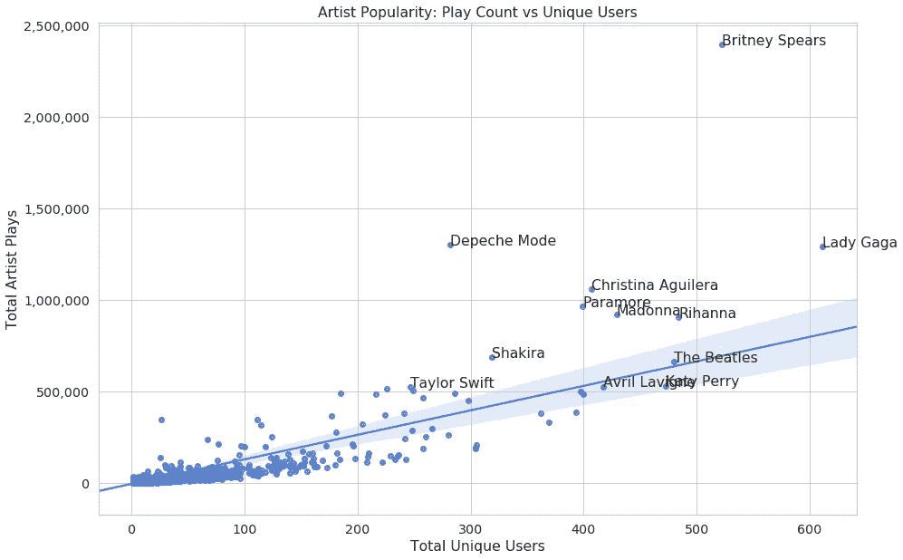

这并不奇怪，受欢迎的艺术家正在承担大部分的戏剧。不过，好在“披头士”仍然很强:)

# 推荐系统

推荐系统(RS)几乎被用在你有一系列商品可供选择的任何地方。他们通过提出建议来帮助你做出更好/更快的选择。

你可能认为你是一片特殊的雪花，但是 RS 利用用户(你和其他人)之间共享的行为模式。例如，你和你的朋友可能对某些东西有相似的口味。RS 试图在其他用户中寻找“朋友”,并推荐你没有尝试过的东西。

两种最常用的过滤方式是基于内容的过滤和协同过滤。协同过滤基于用户对项目偏好的知识来产生推荐，即它使用“群体的智慧”来推荐项目。相比之下，基于内容的推荐系统专注于项目的属性，并根据项目之间的相似性向您提供推荐。

## 协同过滤(CF)

协同过滤(CF)是推荐引擎的主力。该算法的好处是它能够进行特征学习的特性，这允许它开始学习使用哪些特征。CF 可以分为*基于记忆的协同过滤*和*基于模型的协同过滤*。

## 基于记忆的协同过滤

基于内存的 CF 方法可以分为两部分:用户-项目过滤和项目-项目过滤。区别在于:

*   项目-项目协同过滤:“喜欢这个项目的用户也喜欢……”
*   用户项目协同过滤:“与你相似的用户(有点像你从来不知道你有双胞胎)也喜欢……”

这两种方法都需要包含用户 u *u* 对项目 i *i* 的评分的用户项目矩阵。由此，您可以计算相似性矩阵。

项目-项目协同过滤中的相似性值是通过考虑对一对项目进行了评价的所有用户来计算的。

对于用户-项目协同过滤，通过观察由一对用户评价的所有项目来计算相似性值。

## 基于模型的协同过滤

基于模型的 CF 方法基于[矩阵分解(MF)](https://en.wikipedia.org/wiki/Matrix_factorization_(recommender_systems)) 。MF 方法是一种无监督的学习方法，用于潜在变量分解和降维。与基于内存的 CF 相比，它们可以更好地处理可伸缩性和稀疏性问题。

MF 的目标是从已知的评分中学习潜在的用户偏好和项目属性。然后使用这些变量通过用户和项目的潜在特征的点积来预测未知的评级。

矩阵分解将用户项矩阵重构为低秩矩阵。可以用两个低秩矩阵相乘来表示，其中的行包含潜在变量的向量。通过将低秩矩阵相乘，您希望这个矩阵尽可能接近原始矩阵。这样，您可以预测原始矩阵中缺少的条目。

## 奇异值分解

协同过滤可以通过使用奇异值分解(SVD)来近似矩阵 *X* 来公式化。在 [Netflix 有奖竞赛](https://medium.com/netflix-techblog/netflix-recommendations-beyond-the-5-stars-part-1-55838468f429)中获胜的团队使用 SVD 矩阵分解模型赢得了奖品。SVD 可以表示为:

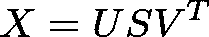

给定 *m* × *n* 矩阵 *X* :

*   *U* 是( *m* × *r* )正交矩阵
*   *S* 是对角线上有非负实数的( *r* × *r* )对角矩阵
*   *VT* 是( *r* × *n* )正交矩阵

其中 *U* 代表用户的特征向量， *V* 代表项目的特征向量， *S* 对角线上的元素称为*奇异值*。

可以通过取 *U* 、 *S* 和 *VT* 的点积进行预测。下面是如何用 Python 实现 SVD 的一个简单例子:

# 推荐音乐艺术家

虽然大多数关于“互联网”的教程都专注于基于内存的方法，但它们似乎并没有在实践中使用。尽管它们产生了良好的结果，但是它们不能很好地扩展，并且受到[“冷启动”](https://en.wikipedia.org/wiki/Cold_start_(computing))问题的困扰。

另一方面，应用 SVD 需要对用户项目矩阵进行因式分解，当矩阵非常稀疏时(许多用户项目评级丢失)，这可能是昂贵的。此外，经常使用输入缺失值，因为当数据缺失时 SVD 不起作用。这可以显著增加算法的数据量和运行时性能。

最近的方法集中于通过最小化关于潜在用户特征矩阵 *P* 和潜在项目特征矩阵 *Q* 的正则化平方误差来预测评级:

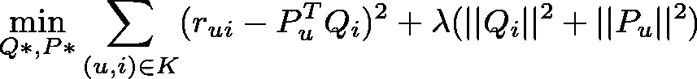

其中 *K* 为一组( *u* ， *i* )对， *r* ( *u* ， *i* )为用户 *u* 对 *i* 的评分， *λ* 为正则项(用于避免过拟合)。我们模型的训练包括最小化正则化的平方误差。在获得对 *P* 和 *Q* 的估计后，您可以通过对用户和项目的潜在特征进行点积来预测未知的评级。

我们可以应用[随机梯度下降(SGD)](https://en.wikipedia.org/wiki/Stochastic_gradient_descent) 或[交替最小二乘法(ALS)](https://www.quora.com/What-is-the-Alternating-Least-Squares-method-in-recommendation-systems-And-why-does-this-algorithm-work-intuition-behind-this) 来最小化损失函数。这两种方法都可以用于随着新评级的到来逐步更新我们的模型(在线学习)。

在这里，我们将实现 SGD，因为它似乎一般比 ALS 更快和更准确(除了在高度稀疏和隐式数据的情况下)。作为一个额外的奖励，SGDis 广泛用于训练深度神经网络(我们将在后面讨论)。因此，这种算法有许多高质量的实现。

# 预处理

为了应用 CF 算法，我们需要将数据集转换成用户-艺术家播放计数矩阵。让我们先完成数据缩放后再做:

这将压缩[0–1]范围内的播放计数，并在我们的数据框中添加一个新列。让我们构建我们的“评级”数据框架:

我们使用 Pandas [pivot](https://pandas.pydata.org/pandas-docs/stable/reference/api/pandas.DataFrame.pivot.html) 方法创建索引/列数据帧，并用 *0* 填充缺失的播放计数。

让我们看看我们的数据框有多稀疏:

```
0.28%
```

我们的数据集看起来很稀疏。接下来，让我们将数据分成训练和验证数据集:

这里，我们对`train_test_split`函数的定义略有不同:

好吧，这和你想象的大相径庭。我们通过用零替换用户的一些现有播放计数来删除它们。

## 测量误差

用于评估推荐系统的准确性的最流行的度量之一是均方根误差(RMSE)，定义为:

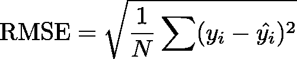

其中 *yi* 是项目*t5 I 的真实值， *yi* ^是预测值， *N* 是训练集的大小。*

[关于更多评估指标的讨论可在此处找到](https://www.microsoft.com/en-us/research/publication/evaluating-recommender-systems/)

下面是 Python 中的 *RMSE* :

## 培养

让我们用 SGD 来训练我们的推荐器:

我们首先为用户和评级的潜在特征创建 2 个矩阵。对于每个用户、项目对，我们计算误差(注意，我们使用现有和预测评级的简单差异)。然后，我们使用梯度下降更新 *P* 和 *Q* 。

在每个训练时期之后，我们计算训练和验证误差，并存储它们的值以供以后分析。下面是`predictions`方法的实现:

正如我们之前讨论的，我们通过取转置的 *P* 矩阵与 *Q* 的点积来获得预测。

# 估价

让我们通过查看培训和验证 RMSE 来快速了解一下培训流程:

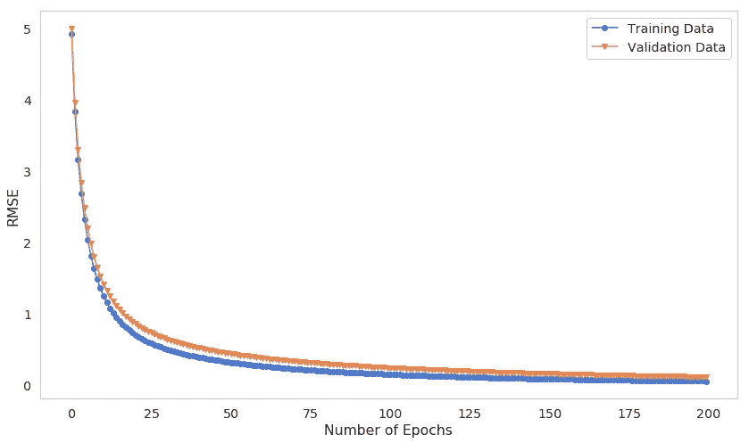

我们的模型似乎是逐渐训练的，两个误差都随着时期数的增加而减小。请注意，您可能想要花更多的时间来训练您的模型，因为它可能会变得更好。

# 提出建议

最后，我们准备为用户提供一些建议。下面是`predict`方法的实现:

首先，我们获得具有所有预测播放计数的矩阵。第二，我们获取所有未知播放计数的索引，并仅返回这些索引作为预测。让我们为特定用户提供一些建议:

在查看推荐列表之前，我们先来看看这个用户目前的偏好是什么:

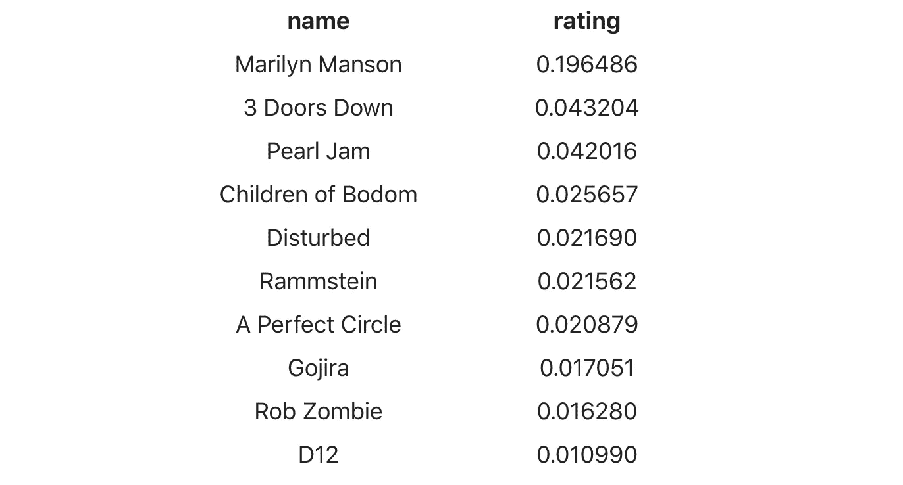

以下是我们的模型给出的建议:

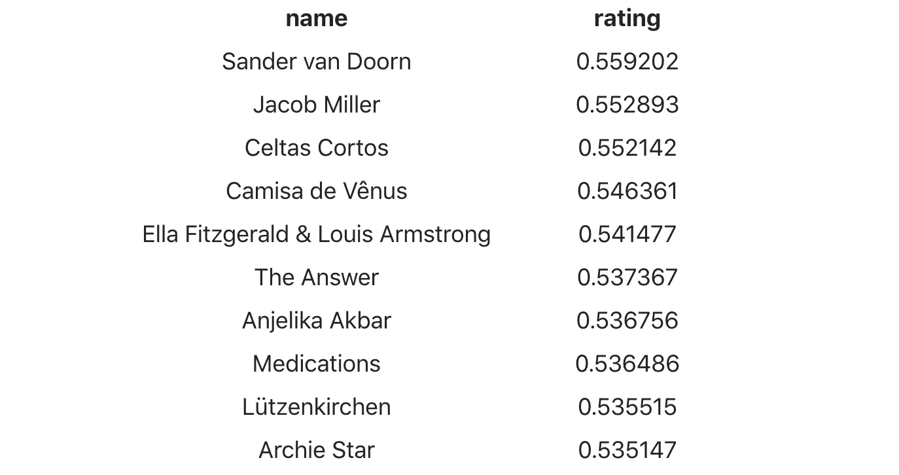

现在可能是去 YouTube 或 Spotify 上试试这些艺术家的好时机！

# 结论

恭喜你从零开始构建了一个高性能的推荐系统！您已经学会了如何:

*   为提出建议准备原始数据
*   从头开始实现简单的随机梯度下降
*   用这个模型来预测你可能真正喜欢的新艺人！

[谷歌协作笔记本](https://colab.research.google.com/drive/1_WxDPLGkJY3qJ-PK0J1YjATaZz35efmk)中的完整源代码

您能在数据集上应用同样的模型吗？在下面的评论里告诉我进展如何！

*最初发表于*[*https://www.curiousily.com*](https://www.curiousily.com/posts/music-artist-recommender-system-using-stochastic-gradient-descent/)*。*

喜欢你读的吗？你想了解更多关于机器学习的知识吗？提升你对 ML 的理解:

[](https://leanpub.com/hmls) [## 从零开始实践机器学习

### “我不能创造的，我不理解”——理查德·费曼这本书将引导你走向更深的…

leanpub.com](https://leanpub.com/hmls)