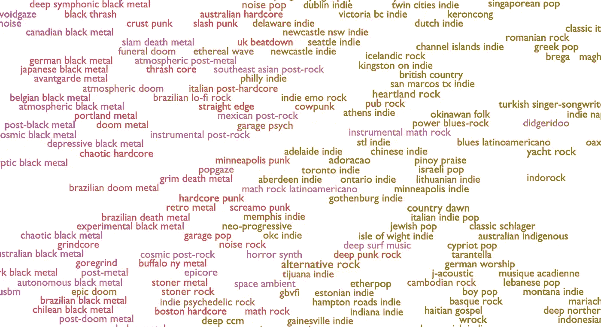
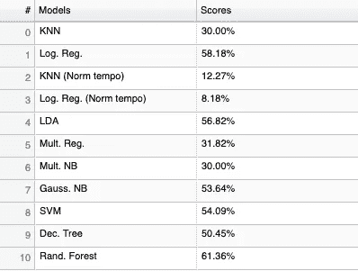

# 说出那种类型

> 原文：<https://towardsdatascience.com/music-genre-prediction-with-spotifys-audio-features-8a2c81f1a22e?source=collection_archive---------19----------------------->

## 用算法确定流派需要什么？

任何行业的流派都是主观的。定义会随着时间的推移而改变，你越想得到具体的定义，越多的人会愤怒地告诉你你错了。但是基本的类型将会有几个主要的方面，使它们更容易被识别。

在很大程度上，流派是由它们唤起的体验和共同的 T2 元素定义的。恐怖电影用可怕的怪物和令人不安的情节吓你，动作片用快速的汽车和没有情节把你放在座位的边缘。

It works really well though. (Source: [giphy.com](https://giphy.com))

那么我们能通过算法预测流派吗？理想的过程应该是确定*一个娱乐媒体的所有*代表性特征，找出如何从原始资料中解读这些特征的价值，抓取一堆数据，将其投入一个分类算法，然后嘣，流派！

在尝试为音乐做这件事时，我中途遇到了 Spotify 的音频功能。他们在收集代表不同音乐流派目标体验的特征方面做得很好，比如可跳性或效价(一首歌有多“快乐”)，以及节奏或调等结构元素。

**数据:**11 个流派各 100 首歌曲，全部来自 Spotify:蓝调、古典、乡村、迪斯科、hiphop、爵士、金属、流行、雷鬼、摇滚、电子。我为第一次运行保持了广泛的东西；我们不需要在流派数量上有太多的颗粒度，就能找到我们需要知道的东西。

[everynoise.com](http://everynoise.com/) has a ton of different, unique genres, and Spotify playlists for all of them.

**工具:** [Spotipy](https://spotipy.readthedocs.io/en/latest/) 对于使用 Python 中的 Spotify API 来说是一个非常有用的库。我用它来收集这个项目的数据。 [Sk-learn](https://scikit-learn.org/stable/) 非常适合构建和测试不同的模型，而 [Pandas](https://pandas.pydata.org/) 非常适合存储数据。我还用 Flask 帮忙做了 app。

作为使用 Spotipy 的一个例子，我用来获取这 1100 首曲目数据的代码如下。我后来得到的数据帧也显示出来了。

**方法:**分类。名义上的目标类和对可解释模型的访问使它非常适合。我尝试了几个不同的模型，最后我用了一个[随机森林](https://scikit-learn.org/stable/modules/generated/sklearn.ensemble.RandomForestClassifier.html)，因为它给了我最好的精确度。我使用的特征是:可舞性、声音、语速、能量、响度、乐器性、效价、节奏、活力、基调和调式。

这一步是关于模型的。我将我的数据分为训练集和测试集，使用这些集训练所有这些模型，并基于以下方面做出我的决定…

**公制:**准确度。对于这个问题，最重要的是要知道预测的流派是否正确，所以唯一重要的统计数据是训练好的模型正确预测流派的频率。

Random Forest had the best accuracy of all the models I tried.

我收集了 1100 首歌曲的上述特征，将其分为训练集和测试集，在这些集上拟合各种模型，并制作了一个应用程序，让你可以在 Spotify 上搜索任何歌曲的预测流派。(警告:它有 63.64%的准确率，所以如果你认为它预测错了，你可能是对的:)

[Check out my app here!](https://name-that-genre.herokuapp.com/)

Spotify 的音频功能相当不错，但仅凭这些似乎不足以每次正确预测一个流派。我尝试了一些优化方法来获得更好的准确性分数，比如使用网格因子分解来尝试和优化模型超参数。我还标准化了速度的值，努力使它们与大多数其他值相比具有相似的尺度。然而，这些方法并没有产生非常重要的结果。接下来的步骤将包括 Spotify 的片段和节拍数据，他们按照歌曲结构的片段来划分歌曲，如合唱、桥段等。，并以均匀的时间间隔。我还会收集更多歌曲的数据。

按照我在开始时描述的理想过程，我们应该能够达到接近 100%的准确率。虽然很难确定具体的子类型，但是任何媒体的主要类型都是相当明确的。大多数体裁都有经常出现的比喻，这些比喻几乎总是一种或多种成分的特定风格。流派本身通常根据它们试图传达的体验来分类。真正的困难在于量化一种媒体的组成元素，使之有可能识别这些比喻。然而，一旦它们都被量化，预测流派就变得容易多了。这是另一个有趣的问题，但不幸的是，我将不得不把它留给另一篇文章。现在，享受预测一些流派吧！

*附录*

[Github](https://github.com/Ydu/genre_prediction) 、 [Linkedin](https://linkedin.com/in/yash-dua/) 、 [App](https://name-that-genre.herokuapp.com)