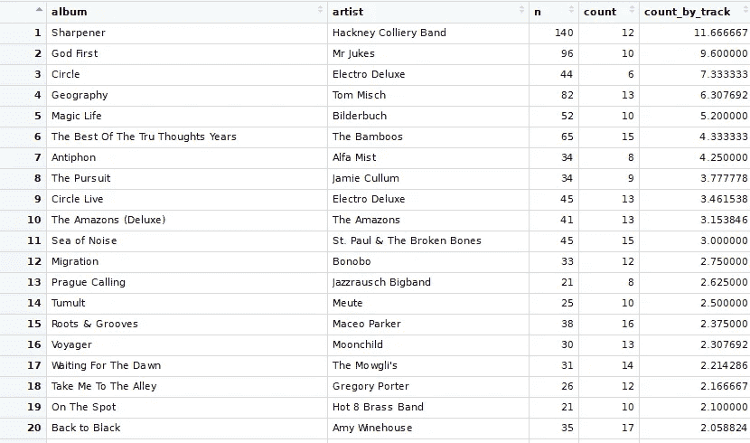
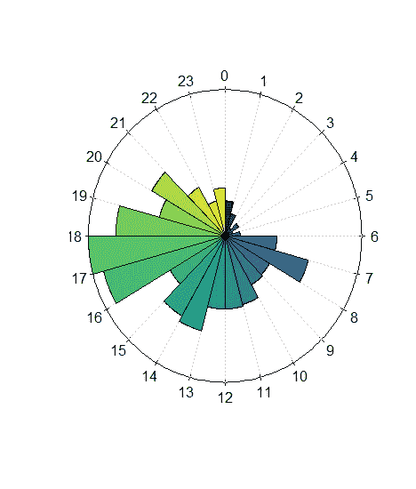
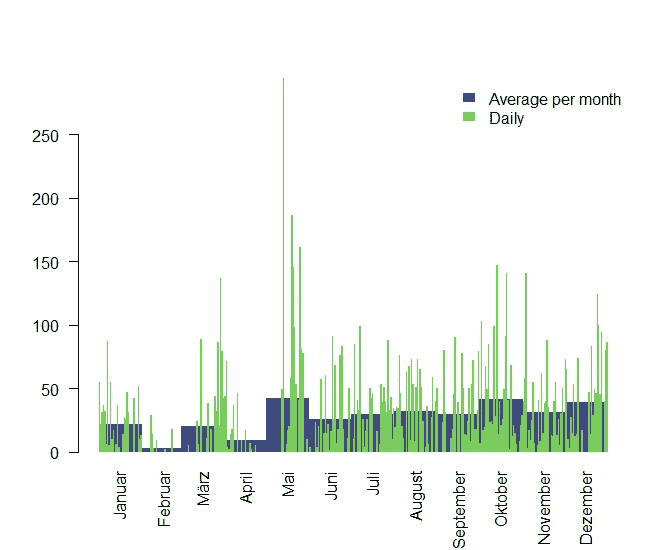
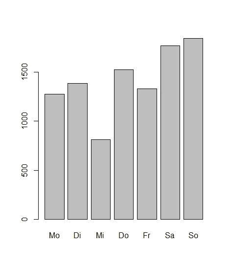
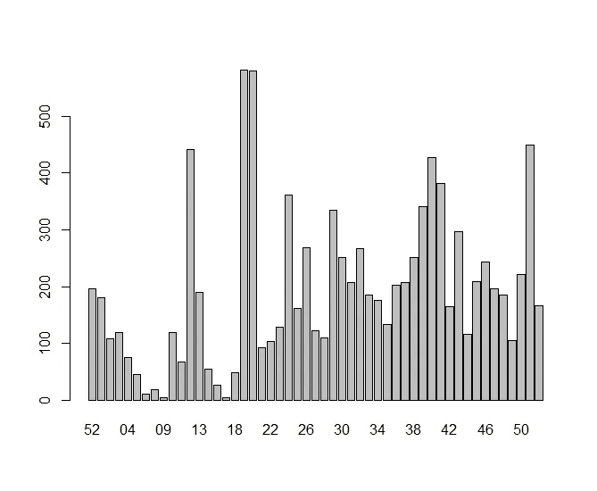

# 音乐听众统计:last.fm 的 last.year 作为 R 包

> 原文：<https://towardsdatascience.com/music-listener-statistics-last-fms-last-year-as-an-r-package-c21ac7eee102?source=collection_archive---------29----------------------->

当开始用 last.week 和 last.year 函数分析last . FMscrobbbles 时，我总是缺少一些图表或纯数据表。这就是为什么我开发了包" [analyzelastfm](https://github.com/zappingseb/analyze_last_fm) "作为一个简单的 R6 实现。我想有不同的专辑统计数据，例如，每张专辑的播放次数，除以专辑中的曲目数。这一点现已落实。要获得音乐收听统计数据，您可以从以下内容开始:

```
# If you don't have it, install devtools
# install.packages("devtools")
devtools::install_github("zappingseb/analyze_last_fm")
library(analyzelastfm)
```

首先，它允许您通过使用 last.fm REST API 导入您的 [last.year](https://www.last.fm/user/zappingseb/listening-report/year) 数据。因此，您需要有一个 last.fm API 密钥。这个只要去 [last.fm API 网站](https://www.last.fm/api/account/create)就可以推导出来。从那里你将得到 32 个字符长的密钥。收到密钥后，我通过以下方式获得了 last.fm 数据:

```
api_key <- "PLEASE ENTER YOUR KEY HERE"
data <- UserData$new("zappingseb",api_key,2018)
```

数据对象现在包含函数`albumstats`,它允许我获得我想要的特定信息。我会把艺术家“死德雷”排除在外？？?"因为这是一个来自德国的儿童侦探故事，我听了很多，它的专辑被分成 1 分钟的曲目，这真的打乱了我的统计。

```
View(data$albumstats(
  sort_by="by_album_count", # album track plays / nr tracks on album
  exclude_artist="Die drei ???", # exclude my audio book favorite
  exclude_album=c(""), # exclude tracks without album name
  min_tracks=5) # have minimum 5 tracks on the album (NO EPs)
)
```

结果看起来是这样的:



Album statistics of 2018 of zappingseb

统计数据显示了`n`播放次数、`count`专辑曲目数和`count_by_track=n/count`。

你可以在这里找到前 5 张专辑:

*   [哈克尼学院乐队——卷笔刀](https://www.amazon.de/gp/product/B0762Y3T14/ref=as_li_tl?ie=UTF8&tag=zappingseb-21&camp=1638&creative=6742&linkCode=as2&creativeASIN=B0762Y3T14&linkId=c2e12707d54eee718e3b30b91a967fed)
*   [朱克斯先生——上帝第一](https://www.amazon.de/gp/product/B06XS8TTS4/ref=as_li_tl?ie=UTF8&tag=zappingseb-21&camp=1638&creative=6742&linkCode=as2&creativeASIN=B06XS8TTS4&linkId=f712ea96a435a93e069b778990d66645)
*   [电动豪华圈](https://www.amazon.de/gp/product/B01M24YCCH/ref=as_li_tl?ie=UTF8&tag=zappingseb-21&camp=1638&creative=6742&linkCode=as2&creativeASIN=B01M24YCCH&linkId=8f3115b23d7953db404d1710a6cb797d)
*   [汤姆·米施——地理](https://www.amazon.de/gp/product/B07BS3SFDC/ref=as_li_tl?ie=UTF8&tag=zappingseb-21&camp=1638&creative=6742&linkCode=as2&creativeASIN=B07BS3SFDC&linkId=32d00c3201b0dc902a9c830a459ed266)
*   [彼尔德布赫——神奇的生活](https://www.amazon.de/gp/product/B01M0G01UU/ref=as_li_tl?ie=UTF8&camp=1638&creative=6742&creativeASIN=B01M0G01UU&linkCode=as2&tag=zappingseb-21&linkId=abf7103142c4e6c2895766cd1c2d3dcc)

除了这些计算，我还对我听音乐的时间感兴趣。因此我在包里添加了一些情节。第一个是监听时钟:

```
data$clock.plot()
```



Clock plot for my music history

我通常在早上 7 点到 8 点和下午 5 点到 6 点骑车上班的路上听音乐。我最重要的统计数据是我一年中听音乐的时间。我最感兴趣的是一些特定的日子和一个平均的游戏/月，这可以告诉我当时的心情。因此我创建了函数`daily_month_plot`。它将每月平均播放次数和每日播放次数绘制在一个图中。每月的平均播放量可以在每日峰值后看到。这里你可以看到二月对我来说是一个非常平静的月份。

```
data$daily_month_plot()
```



对于一些简单的统计数据，我还包含了一个名为`barplots`的聚合绘图函数。它可以按工作日、周、月或日绘制聚合图。该函数的数据由函数`bar_data`提供。

```
data$barplots("weekdays")
```



每周(从 2017 年第 52 周开始):

```
data$barplots(“week”)
```



我可以清楚地看到，在今年年初，我并没有真正听很多音乐，到第 18 周，我的听力活动急剧增加。

这篇文章有点超出了我的范围，主要是关于 [R 包对制药](/interesting-packages-taken-from-r-pharma-e89639788180)有用的包。但我真的很喜欢音乐，认为音乐和数据科学是很好的结合。声音在一起很棒！

请在[https://github.com/zappingseb/analyze_last_fm](https://github.com/zappingseb/analyze_last_fm)找到 R 包——开始行动永远不晚；)