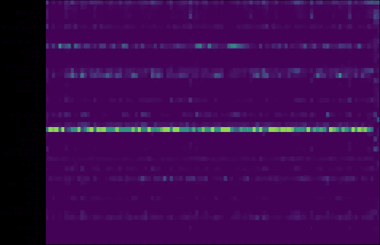
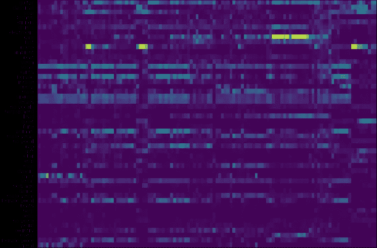

# musicnn:一个开源的、基于深度学习的音乐标记器

> 原文：<https://towardsdatascience.com/musicnn-5d1a5883989b?source=collection_archive---------29----------------------->

[musicnn](https://github.com/jordipons/musicnn) 库(读作“音乐家”)采用深度卷积神经网络对歌曲进行自动标记，被收录的模型在公开评测基准中达到[最好成绩](https://arxiv.org/abs/1711.02520)。这些最先进的模型已经作为开源库发布，可以很容易地安装和使用。例如，你可以使用 [musicnn](https://github.com/jordipons/musicnn) 来标记这首来自 Muddy Waters 的标志性歌曲——它将主要将其标记为布鲁斯！

有意思的是，虽然 [musicnn](https://github.com/jordipons/musicnn) 对自己的蓝调预测相当有信心，但它也考虑到了(决心较小！)歌曲的某些部分可以被标记为爵士乐、灵魂乐、摇滚甚至乡村音乐——这些都是密切相关的音乐流派。请看上面这首歌的标签图(标签概率随时间的演变):

**Taggram representation: Muddy Waters** — see the evolution of the tags across time.
Vertical axis: tags. Horizontal axis: time. Model employed: MTT_musicnn

这个项目是由巴塞罗那的一个音乐和音频研究实验室开发的，是多年研究的成果。这个研究机构,[Pompeu Fabra](https://www.upf.edu/web/mtg/)大学音乐技术小组以其对音乐和音频技术的研究而闻名。例如:他们贡献了开创性的歌唱语音合成引擎，如 [Vocaloid](https://en.wikipedia.org/wiki/Vocaloid) ，或者他们维护开源项目，如 [Freesound](http://www.freesound.org) 。

这些研究人员开源了 musicnn，你只需安装它就可以使用:

> *pip 安装音乐*

安装后，你只需要在终端运行这个一行程序，给你的歌曲加上 [musicnn](https://github.com/jordipons/musicnn) 标签——但是在他们的[文档](https://github.com/jordipons/musicnn/blob/master/DOCUMENTATION.md)中你会找到更多选项，比如[如何在 jupyter 笔记本上使用它](https://github.com/jordipons/musicnn/blob/master/musicnn_example.ipynb):

> *python-m musicnn . tagger your _ song . MP3–print*

既然你知道如何使用它，你可以试着自动标记《皇后乐队》的《波西米亚狂想曲》——看看你是否同意 [musicnn](https://github.com/jordipons/musicnn) 的预测(附后):

**Taggram representation: Queen** **(Bohemian Rhapsody)**— see the evolution of the tags across time.
Vertical axis: tags. Horizontal axis: time. Model employed: MTT_musicnn

请注意，合唱前奏被很好地检测到，以及钢琴和摇滚部分。一个特别有趣的困惑是[佛莱迪·摩克瑞](https://en.wikipedia.org/wiki/Freddie_Mercury)的声音被标记为女声！此外，该模型与其预测非常一致(无论是否是“合理的”混淆)。直到人们可以在标记图中清楚地识别歌曲的不同部分。例如，可以为具有相同结构的部分找到“重复模式”，或者该模型在检测歌声是否存在时相当成功。

要了解更多关于 [musicnn](https://github.com/jordipons/musicnn) 的信息，可以咨询作者们将在 ISMIR 2019 上发表的[最新突破/演示文章](https://arxiv.org/abs/1909.06654)或他们的 [ISMIR 2018 文章](https://arxiv.org/abs/1711.02520)(获得了这个国际科学场馆的最佳学生论文奖)。

