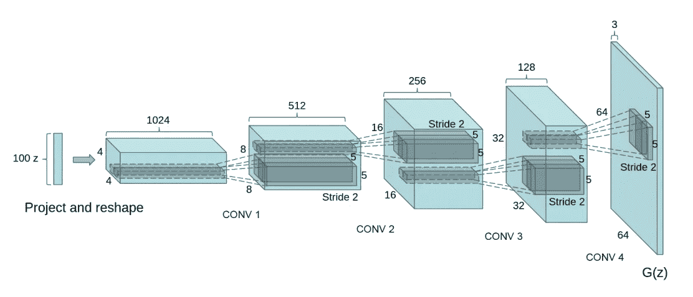
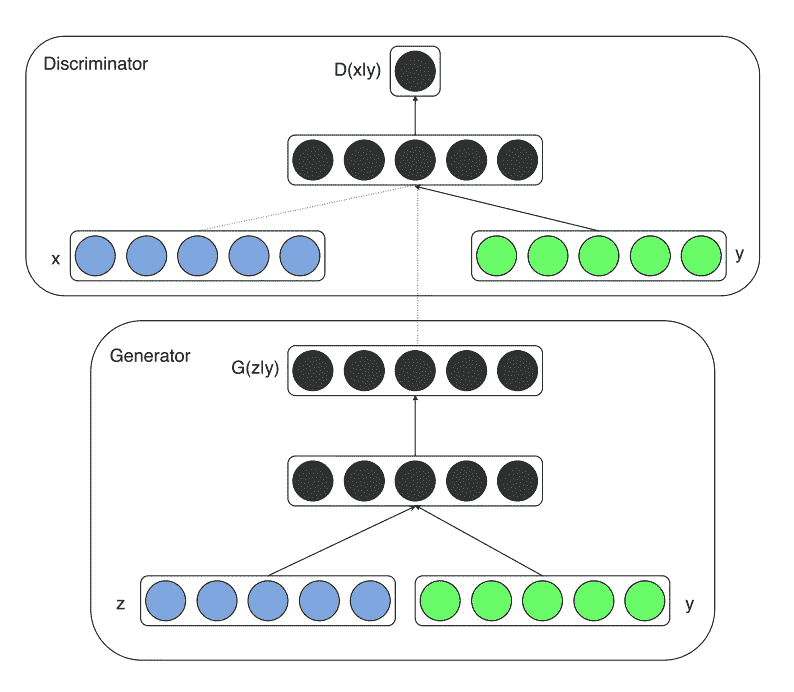
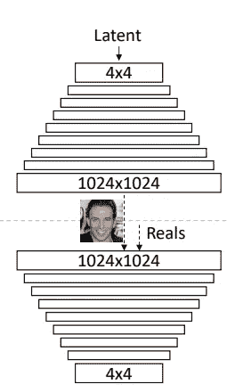
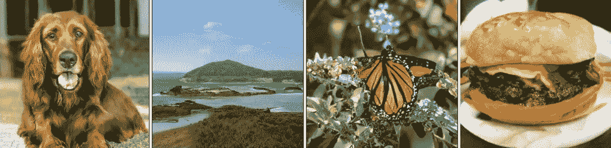
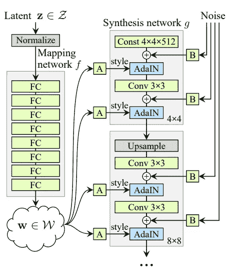
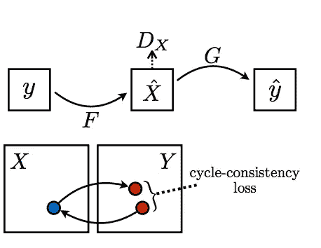
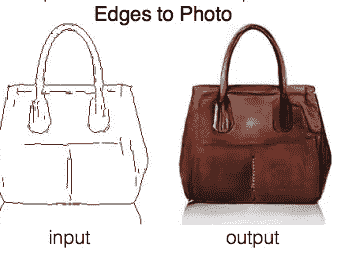
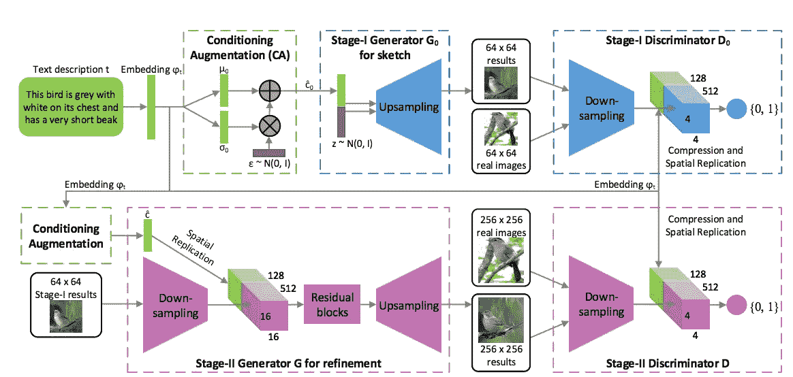

# 关于 GANs 的必读论文

> 原文：<https://towardsdatascience.com/must-read-papers-on-gans-b665bbae3317?source=collection_archive---------10----------------------->

生成对抗网络是深度学习最有趣和最流行的应用之一。本文将列出 10 篇关于 GAN 的论文，它们将为您提供关于 GAN 的精彩介绍以及理解最新技术水平的基础。让我们来看看这份列表吧！

如果你对阅读每篇论文的描述不感兴趣，这里有一个快速列表:

1—dcgan

2 —训练 GANs 的改进技术

3—有条件的 GANs

4 —逐渐增长的天然气水合物

5 —比根

6 — StyleGAN

7 — CycleGAN

8 像素 2 像素

9 —堆栈根

10 —生成性敌对网络

# 拉德福德等人(2015 年)

我建议您从 DCGAN 白皮书开始您的 GAN 之旅。本文展示了如何将卷积层用于 GANs，并为此提供了一系列额外的架构指南。论文还讨论了诸如 GAN 特征可视化、潜在空间插值、使用鉴别器特征训练分类器以及结果评估等主题。所有这些额外的主题一定会出现在你的 GAN 研究中。总之，DCGAN 论文是一篇必须阅读的 GAN 论文，因为它以如此清晰的方式定义了架构，以至于很容易从一些代码开始，并开始开发 GAN 的直觉。

DCGAN model — generator architecture with upsampling convolutional layers

 [## 深度卷积生成对抗网络的无监督表示学习

### 近年来，卷积网络的监督学习(CNN)在计算机视觉领域得到了广泛应用…

arxiv.org](https://arxiv.org/abs/1511.06434) 

# 训练 GANs 的改进技术——Salimans 等人(2016 年)

这篇文章(作者包括 Ian Goodfellow)提供了一系列建议，用于在上面的 DCGAN 文章中列出的体系结构指南的基础上进行构建。本文将帮助你理解 GAN 不稳定性的最佳假设。此外，本文还提供了许多旨在稳定 DCGANs 训练的附加技术。这些包括特征匹配、小批量鉴别、历史平均、单侧标签平滑和虚拟批量标准化。使用这些建议构建一个简单的 DCGANs 实现是学习更多关于 gan 的一个很好的练习。

 [## 训练 GANs 的改进技术

### 我们提出了各种新的建筑特点和培训程序，我们适用于生成性对抗…

arxiv.org](https://arxiv.org/abs/1606.03498) 

# 有条件的 GANs — Mirza 和 Osindero (2014 年)

这是一篇很棒的论文，可以快速阅读。有条件的 GANs 是最先进的 GANs 的核心主题。本文展示了集成数据的类别标签如何产生更稳定的 GAN 训练。这种用先验信息调节 GAN 的概念在 GAN 研究的未来工作中是一个反复出现的主题，对于专注于图像到图像或文本到图像的论文尤其重要。

Architecture of the Conditional GANs, in addition to the random noise vector z, the class label y is concatenated together as input to the network

 [## 条件生成对抗网

### 生成对抗网[8]是最近引入的一种训练生成模型的新方法。在这项工作中，我们…

arxiv.org](https://arxiv.org/abs/1411.1784) 

# 逐步种植 gan 以提高质量、稳定性和变化性——Karras 等人(2017 年)

由于其令人印象深刻的结果和解决 GAN 问题的创造性方法，日益增长的 GAN 架构是必读的。本文使用多尺度架构，其中 GAN 的分辨率从 4 到 8，最高可达 1024。GAN 不稳定性相对于目标图像分辨率大小大大增加，本文给出了解决该问题的方法。

This image depicts the multi-scale architecture of the Progressively Growing GAN architecture. The model goes from 4² progressively up to 1024²

 [## 为了提高质量、稳定性和多样性而逐步种植甘蔗

### 我们描述了一种新的生成式对抗网络的训练方法。关键的想法是增长发电机…

arxiv.org](https://arxiv.org/abs/1710.10196) 

# 比根-布洛克等人(2019 年)

BigGAN 模型是 ImageNet 生成的最新技术。这个模型很难在本地机器上实现，该架构有许多组件，如自关注、光谱归一化和带投影鉴别器的 cGAN，这些组件在各自的论文中有更好的解释。然而，这篇文章提供了一个很好的概述，包括当前最先进的基础论文的思想。

Unbelievable samples from the BigGAN state-of-the-art model

 [## 用于高保真自然图像合成的大规模 GAN 训练

### 尽管最近在生成图像建模方面取得了进展，但成功地从图像生成高分辨率、多样化的样本…

arxiv.org](https://arxiv.org/abs/1809.11096) 

# StyleGAN-Karras 等人(2019 年)

StyleGAN 模型可以说是最先进的，尤其是在潜在空间控制方面。这个模型借用了一种被称为自适应实例规范化(AdaIN)的神经风格转移机制，来控制潜在空间向量 z，这与之前的任何东西都不同。映射网络和 AdaIN 调节在整个生成器模型中的分布相结合，使得自己实现起来相当困难，但它仍然是一个很好的读物，包含许多有趣的想法。

StyleGAN architecture that allows for state-of-the-art latent space control

 [## 一种基于风格的生成对抗网络生成器体系结构

### 我们借鉴风格转移理论，提出了一种新的生成对抗网络生成器结构

arxiv.org](https://arxiv.org/abs/1812.04948) 

# CycleGAN —朱等(2017)

CycleGAN 的论文不同于前面提到的 6 篇论文，因为它讨论的是图像到图像的转换问题，而不是从随机向量合成图像。CycleGAN 更具体地处理图像到图像转换的情况，其中没有成对的训练样本。然而，这是一篇值得一读的好文章，仅仅是因为周期一致性损失公式的优雅和这如何稳定 GAN 训练的直觉。CycleGAN 还可以用于许多很酷的应用，如超分辨率、风格转换和马到斑马。

Central Idea behind the Cycle Consistency Loss, a sentence translated from French to English and back to French should be the same sentence

 [## 使用循环一致对抗网络的不成对图像到图像翻译

### 图像到图像的翻译是一类视觉和图形问题，其目标是学习图像和图形之间的映射

arxiv.org](https://arxiv.org/abs/1703.10593) 

# Pix2Pix — Isola 等人(2016 年)

Pix2Pix 是另一种图像到图像转换 GAN 模型。该框架使用成对的训练样本，并在 GAN 模型中用许多不同的配置进行研究。在阅读这篇论文时，我最感兴趣的事情之一是关于 PatchGAN 的讨论。PatchGAN 查看图像的 70 x 70 个区域来确定它们是真的还是假的，而不是查看整个图像。这个模型还展示了一个有趣的 U-Net 风格的生成器架构，以及在生成器模型中使用 ResNet 风格的跳过连接。这有许多很酷的应用，如边缘映射到照片般逼真的图像。

Image-to-Image translation with paired training samples

 [## 基于条件对抗网络的图像到图像翻译

### 我们研究条件对抗网络作为图像到图像翻译问题的通用解决方案…

arxiv.org](https://arxiv.org/abs/1611.07004) 

# StackGAN —张等(2017)

StackGAN 的论文与列表中的前几篇论文非常不同。它非常类似于有条件的 gan 和渐进增长的 gan。StackGAN 模型的工作原理类似于渐进式增长的 GAN，因为它适用于多种规模。StackGAN 首先输出分辨率为 64 的图像，然后将其作为先验信息来生成分辨率为 256 的图像。StackGAN 与其他论文非常不同，因为它是从自然语言文本到图像的。这是通过改变文本嵌入来实现的，以便它捕获视觉特征。这是一篇非常有趣的论文，如果能看到 StyleGAN 中展示的潜在空间控制与 StackGAN 中定义的自然语言接口相结合，那将是令人惊讶的。

Idea behind the StackGAN multi-scale architecture conditioned on a text embedding

 [## StackGAN:利用堆叠生成式对抗网络进行文本到照片的真实感图像合成

### 从文本描述中合成高质量的图像是计算机视觉中一个具有挑战性的问题，有许多应用前景

arxiv.org](https://arxiv.org/abs/1612.03242) 

# 生成性对抗网络——good fellow 等人(2014 年)

Ian Goodfellow 的原始论文是任何研究 GANs 的人的必读之作。本文定义了 GAN 框架并讨论了“非饱和”损失函数。本文还给出了最佳鉴别器的推导，这一证明在最近的 GAN 论文中经常出现。本文还在 MNIST、TFD 和 CIFAR-10 图像数据集上验证了 GAN 的有效性。

 [## 生成对抗网络

### 我们提出了一个新的框架，通过一个对抗的过程来估计生成模型，在这个过程中，我们同时…

arxiv.org](https://arxiv.org/abs/1406.2661) 

感谢阅读！我提供了许多发表在 TowardsDataScience 上的这些论文的博文摘要，如下所列:

 [## 深度卷积生成对抗网络

### 生成对抗网络最有趣的部分之一是生成网络的设计。的…

towardsdatascience.com](/dcgans-deep-convolutional-generative-adversarial-networks-c7f392c2c8f8)  [## 深入到 DCGANs

### 进一步探索 GAN 过拟合、GAN 特征可视化和潜在空间插值等主题。

towardsdatascience.com](/deeper-into-dcgans-2556dbd0baac)  [## 用 DCGANs 生成篮球鞋

### 在 Keras 中实现 DCGANs 以生成 45x45 篮球鞋图像的代码、结果和分析。

medium.com](https://medium.com/@connorshorten300/generating-basketball-shoes-with-dcgans-6cd72d521c01)  [## 条件甘斯

### 条件 GAN[1]是 GAN 框架的一个非常有趣的扩展。这种架构扩展了原有的…

medium.com](https://medium.com/@connorshorten300/conditional-gans-639aa3785122)  [## Pix2Pix

### 本文将解释一篇关于图像到图像翻译的流行论文的基本机制

towardsdatascience.com](/pix2pix-869c17900998)  [## 渐进增长的甘斯

### NVIDIA 发布并在 ICLR 2018 上发布的逐步增长的 GAN 架构已经成为主要的…

towardsdatascience.com](/progressively-growing-gans-9cb795caebee)