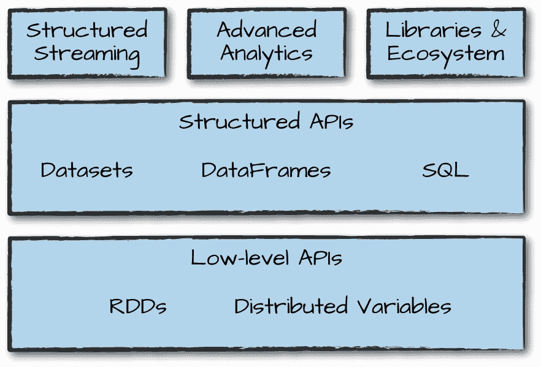
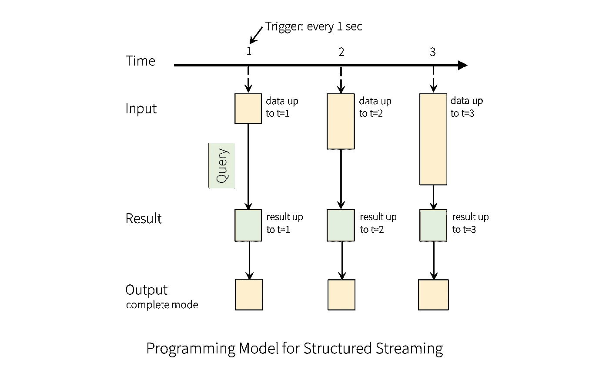

# 获得 Apache Spark 的 Databricks 认证后，我的 10 条建议

> 原文：<https://towardsdatascience.com/my-10-recommendations-after-getting-the-databricks-certification-for-apache-spark-53cd3690073?source=collection_archive---------2----------------------->


Databricks Certified Developer Badget

几个月前，我开始准备获得 Apache Spark 的 [Databricks 认证。这并不容易，因为没有太多关于它的信息，所以为了促进自我准备，我将分享 10 个有用的建议。](https://academy.databricks.com/category/certifications)

# 建议 1:在开始准备之前安排好考试

这是唯一的非技术性建议，但也是所有 9 个建议中有用的。当你有了参加考试的期限，你就有了更多学习的理由和压力。在这种情况下，对于考试来说，**5-7 周的准备**会让你为成功的结果做好准备，尤其是如果你有使用 [Apache Spark](https://spark.apache.org/) 的工作经验。在[网页](https://www.webassessor.com/databricks)上注册，你将花费**300 美元**，如果你第一次尝试失败，你将获得 1 次**额外机会**(我的建议是在接下来的 2 周内重新安排第二次尝试的最大次数)。你需要在 **3 小时**内回答 **40 个多项选择问题**的最低分数 **65%** 并且你可以参加 Python 或 Scala 的**考试。**

Basic exam information


Scheduling the exam makes you focus on practicing

# 推荐 2:无论是 PySpark 还是 Spark Scala API 对于考试来说都差不多

如果你发现自己在 Spark 语言 API 使用 Python 还是 Scala 的问题上左右为难，我的建议是不要太担心，因为这个问题不需要对这些编程语言有深入的了解。例如，您可以找到这种类型的问题，其中代码片段(Python 或 Scala)提供给您，您需要确定哪一个是不正确的。

```
*//Scala*
**val** df **=** spark.read.format("parquet").load("/data/sales/june")
df.createOrReplaceTempView("table")*#Python*
df = spark.read.orc().load("/data/bikes/june")
df.createGlobalTempView("table")*#Python* **from** **pyspark.sql** **import** Row
myRow = Row(3.14156, "Chicago", 7)**import** **org.apache.spark.sql.functions.lit**
df.select(lit("7.5"), lit("11.47")).show(2)
```

> 你能找到不正确的代码吗？

所以面对这种问题**记住 Spark data frame(***20%-25%的问题*** )、RDDs、SQL、Streaming 和 Graphframes 中的结构和主要选项**。例如，这些是 Spark 数据帧中的写和读核心结构。

```
#Read
DataFrameReader.format(...).option("key","value").schema(...).load()
#Read modes: permissive (default), dropMalformed and failFast.#Write
DataFrameWriter.format(...).option(...).partitionBy(...).bucketBy(...).sortBy(...).save()
#Save modes: append, overwrite, errorIfExists (default) and ignore.
```

# 建议 3:在头脑中用 Spark 数据帧和 SQL 练习“执行”代码

如果你想得到上面代码的输出，你做得很好，因为在测试期间，你不允许检查任何文档，甚至没有纸来做笔记，所以你会发现另一种问题，你需要确定正确的选择(可能不止一个)，产生基于一个或多个表显示的输出。

```
#Table
+---------+---------+
|     Name|      Age| 
+---------+---------+
|    David|       71|
| Angelica|       22|
|   Martin|        7|
|      Sol|       12|
+---------+---------+#Output needed
# Quantity of people greater than 21df = spark.read.format("csv")\
  .option("header", "true")\
  .option("inferSchema", "true")\
  .load("/names/*.csv")
df.where(col("Age")>21).count()df = spark.read.parquet("/names/*.parquet")\
  .option("inferSchema", "true")\
df.where("Age > 21").count()logic = "Age > 21"
df = spark.read.("/names/*.parquet")\
  .option("inferSchema", "true")\
df.where(logic).count()df =spark.read.format("json").option("mode", "FAILFAST")\
  .option("inferSchema", "true")\
  .load("names.json")
df.where("Age > 21").count()
```

> 你能找到正确的代码吗？提示:存在不止一个。

这种问题不仅是关于数据帧的，在 RDD 问题中也会用到，所以要仔细研究一些函数，如 map、reduce、flatmap、groupby 等。我的推荐是查看[书学习火花](https://amzn.to/376KhqF)尤其是第三章[和第四章](https://learning.oreilly.com/library/view/learning-spark/9781449359034/ch04.html)。

# 建议 4:理解基本的 Spark 架构


Do you feel familiar with these components? [[Spark documentation](https://spark.apache.org/docs/latest/cluster-overview.html)]

了解 Spark 架构 ***(占考试的 15%】***意味着不仅要阅读[官方文档](https://spark.apache.org/docs/latest/cluster-overview.html)并了解模块，还要发现:

*   Spark 中简单或复杂的查询是如何执行的？
*   Spark 的不同集群管理器
*   “懒惰评估”、“动作”、“转换”是什么意思？
*   Spark 应用程序的层次结构
*   集群部署选择
*   Spark 工具集的基本知识



Spark’s toolset [[Spark: The Definitive Guide](https://amzn.to/33Q96VR)]

Spark Architecture 尝试的问题是，检查一个概念或定义是否正确。

```
What means RDDs? What part of Spark are?Resilent Distributed Dataframes. Streaming API
Resilent Distributed Datasets. Structured APIs
Resilent Distributed Datasets. Low lever APIs
```

为了在建筑方面更进一步，我推荐阅读《Spark:权威指南》一书的第 2、3、15 和 16 章。

# 建议 5:识别 Spark 结构化流中的输入、接收和输出

大约 ***10%的问题*** 是关于 Spark 结构化流*主要是尝试让您识别出不会产生错误的正确代码，以达到您需要清楚本模块中的基本组件和定义。

在这种情况下，该代码从 Github 上的[官方 Spark 文档报告中获得，并显示了从套接字获取数据、应用一些基本逻辑并将结果写入控制台并完成*输出模式的基本字数。*](https://github.com/apache/spark/blob/v2.4.3/examples/src/main/python/sql/streaming/structured_network_wordcount.py)

```
*# Start running the query that prints the running counts to the console* **from** **pyspark.sql** **import** SparkSession
**from** **pyspark.sql.functions** **import** explode
**from** **pyspark.sql.functions** **import** split

spark = SparkSession \
    .builder \
    .appName("StructuredNetworkWordCount") \
    .getOrCreate()lines = spark \
    .readStream \
    .format("socket") \
    .option("host", "localhost") \
    .option("port", 9999) \
    .load()

*# Split the lines into words*
words = lines.select(
   explode(
       split(lines.value, " ")
   ).alias("word")
)

*# Generate running word count*
wordCounts = words.groupBy("word").count()query = wordCounts \
    .writeStream \
    .outputMode("complete") \
    .format("console") \
    .start()

query.awaitTermination()
```



[[Spark documentation](https://spark.apache.org/docs/latest/structured-streaming-programming-guide.html)]

本模块的问题将要求您识别正确或不正确的代码。它将组合不同的输入源(Apache Kafka、文件、套接字等)和/或接收器(输出)，例如 Apache Kafka、任何文件格式、控制台、内存等。以及输出模式:追加、更新和完成。为了练习这个问题，请阅读《火花:权威指南》一书的第 21 章。

*我知道存在数据流，但它是低级 API，不太可能出现在考试中。

# 建议 6:练习火花图算法

像建议 5 一样，你需要识别的图形算法很少，所以我的建议是首先检查图形和[图形框架](https://github.com/graphframes/graphframes)*(**5%–10%的问题**)的概念，然后练习这些算法:

*   PageRank
*   入度和出度度量
*   广度优先搜索
*   连接的组件

例如，在这里，我们基于两个数据帧创建一个 GraphFrame，如果您想进行更多的练习，您可以在 Databricks 上的 [GraphFrame 用户指南中找到此代码和完整的笔记本](https://docs.databricks.com/_static/notebooks/graphframes-user-guide-py.html)

```
**from** functools **import** reduce
**from** pyspark.sql.functions **import** col, lit, when
**from** graphframes **import** *vertices = sqlContext.createDataFrame([
  ("a", "Alice", 34),
  ("b", "Bob", 36),
  ("c", "Charlie", 30),
  ("d", "David", 29),
  ("e", "Esther", 32),
  ("f", "Fanny", 36),
  ("g", "Gabby", 60)], ["id", "name", "age"])edges = sqlContext.createDataFrame([
  ("a", "b", "friend"),
  ("b", "c", "follow"),
  ("c", "b", "follow"),
  ("f", "c", "follow"),
  ("e", "f", "follow"),
  ("e", "d", "friend"),
  ("d", "a", "friend"),
  ("a", "e", "friend")
], ["src", "dst", "relationship"])g = GraphFrame(vertices, edges)
print(g)
```

*在 Graphframes 出现之前也有 GraphX(现在仍然存在)，但对于第一个，现在使用得更多。

# 建议 7:理解构建 Spark ML 管道的步骤

Spark ML* ( ***10%考试*** )是捆绑了很多机器学习算法的模块，用于分类、回归、聚类或者用于基础统计、调优、模型选择和流水线。

在这里，您需要重点了解一些必须知道的概念，如构建、训练和应用训练模型的步骤。例如，强制所有算法只有数字变量，所以如果你有一个字符串列，你需要使用一个`**StringIndexer**`方法一个`**OneHotEncoder**`编码器，所有的变量都需要在一个向量中，所以我们需要使用类`**VectorAssembler**`来最终将所有的转换分组在一个`**Pipeline**`中

```
**from** **pyspark.ml.feature** **import** StringIndexer
indexer = StringIndexer()\
  .setInputCol("month")\
  .setOutputCol("month_index")**from** **pyspark.ml.feature** **import** OneHotEncoder
encoder = OneHotEncoder()\
  .setInputCol("month_index")\
  .setOutputCol("month_encoded")**from** **pyspark.ml.feature** **import** VectorAssembler
vectorAssembler = VectorAssembler()\
  .setInputCols(["Sales", "month_encoded"])\
  .setOutputCol("features")**from** **pyspark.ml** **import** Pipeline
transfPipeline = Pipeline()\
  .setStages([indexer, encoder, vectorAssembler])fitPipeline = transfPipeline.fit(trainDataFrame)
```

*Spark MLlib 是一个基于 RDD 的 API，从 Spark 2.0 开始进入维护模式，因此 Spark ML 是主要的 ML API，并且是基于数据帧的。

# 建议 8:认可火花转化、行动等等

回到 Spark RDDs ( ***15%的问题*** )一个问题可能类似于“选择所有变换(宽/窄)或动作的备选项”，所以你需要确保你认识到它们中的大多数。你在 [Spark 文档](https://spark.apache.org/docs/latest/rdd-programming-guide.html#transformations)里有很好的解释。

另一个重要的主题是很好地理解这些主题:

*   广播变量

```
broadcastVar = sc.broadcast([1, 2, 3])
broadcastVar.value
```

*   累加器
*   RDD 持久性
*   将功能传递给 Spark
*   合并，重新分配

```
What is the method of persistence cache()?MEMORY_ONLY
MEMORY_AND_DISK
DISK_ONLY
OFF_HEAP
```

# 建议 9:不要浪费时间构建 Spark 环境或获取培训数据

是啊！我知道你想学习 Medium 上的许多精彩的[教程](https://medium.com/@GalarnykMichael/install-spark-on-windows-pyspark-4498a5d8d66c),但是为了准备这次考试，我强烈建议你选择其中一个选项，让你专注于内容而不是配置。我更喜欢 **Databricks** ，因为你得到一个配置好的小型 Spark 集群，可以免费开始练习。

 [## 数据块-登录

### 编辑描述

community.cloud.databricks.com](https://community.cloud.databricks.com/login.html) [](https://colab.research.google.com/notebooks/welcome.ipynb) [## 谷歌联合实验室

### 编辑描述

colab.research.google.com](https://colab.research.google.com/notebooks/welcome.ipynb)  [## 微软 Azure 笔记本电脑

### 提供对运行在微软 Azure 云上的 Jupyter 笔记本的免费在线访问。

notebooks.azure.com](https://notebooks.azure.com/)  [## 内核| Kaggle

### 编辑描述

www.kaggle.com](https://www.kaggle.com/kernels) 

如果你需要一些数据来练习，我推荐这个 [Github 仓库](https://github.com/databricks/Spark-The-Definitive-Guide/tree/master/data)，在那里你可以有 CSV，JSONs，Parquet，ORC 文件。

# 建议 10:如果你是 Spark 的新手，可以考虑阅读这些书籍

您在这条路上了解 Apache Spark 的朋友有:

*   [火花:权威指南](https://amzn.to/33Q96VR)
*   [学习火花](https://amzn.to/32RDBt0)
*   [火花文件](http://spark.apache.org/docs/latest/quick-start.html)
*   [破解 Databricks Apache Spark 认证的 5 个小技巧](https://www.linkedin.com/pulse/5-tips-cracking-databricks-apache-spark-certification-vivek-bombatkar)。

现在，您已经准备好成为一名认证的 Apache Spark 开发人员:)


Always keep learning

PS 如果你有任何问题，或者想要澄清一些事情，你可以在 [Twitter](https://twitter.com/thony_ac77) 和 [LinkedIn 上找到我。](https://www.linkedin.com/in/antoniocachuan/)另外，如果你想探索云认证，我最近发表了一篇关于**谷歌云认证挑战**的文章。

[](/how-i-could-achieve-the-google-cloud-certification-challenge-6f07a2993197) [## 我如何完成谷歌云认证挑战？

### 在按照谷歌推荐的 12 周准备后，我通过了云工程师助理考试，在这里…

towardsdatascience.com](/how-i-could-achieve-the-google-cloud-certification-challenge-6f07a2993197) 

**更新:**该认证将于 10 月 19 日截止，现在面向 Apache Spark 2.4 的 Databricks 认证助理开发人员提供相同的主题(重点关注 Spark 架构、SQL 和数据框架)

**更新 2(2021 年初)** : Databricks 现在还提供 Apache Spark 3.0 考试的 Databricks 认证助理开发人员。与 Spark 2.4 考试相比，Spark 3.0 考试还询问了 Spark 3.0 中的新功能，如自适应查询执行。我强烈推荐这些优秀的 Databricks 认证开发人员准备 Spark 3.0 实践考试[链接:【https://bit.ly/sparkpracticeexams】T2]。模拟考试包括解释和文档的静态 PDF，类似于真实考试中的内容。