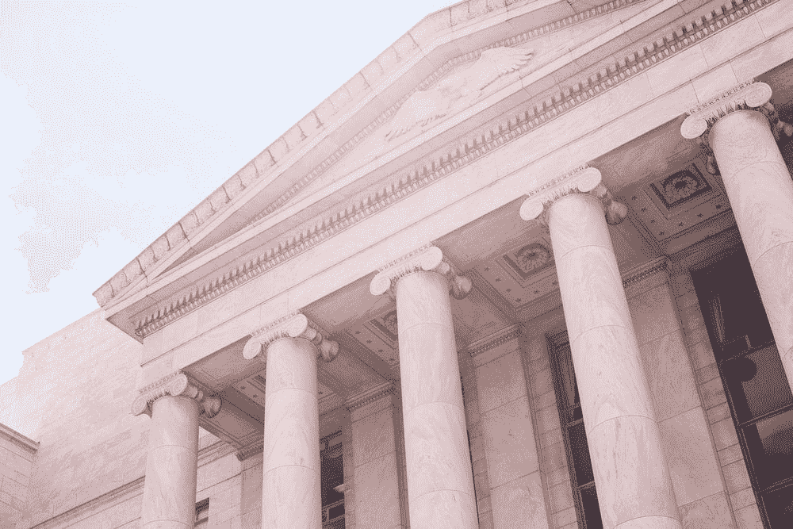

# 我对 50 多篇关于最大似然法在信贷中应用的论文的分析

> 原文：<https://towardsdatascience.com/my-analysis-from-50-papers-on-the-application-of-ml-in-credit-lending-b9b810a3f38?source=collection_archive---------6----------------------->

Photo by [Katie Moum](https://unsplash.com/@katiemoum?utm_source=unsplash&utm_medium=referral&utm_content=creditCopyText) on [Unsplash](https://unsplash.com/s/photos/government?utm_source=unsplash&utm_medium=referral&utm_content=creditCopyText)

信用贷款是一个有 200 多年历史的行业，也是银行的主要职责。这些年来，它一直在经历逐渐的改进，但是，随着机器学习和大数据的兴起，整个贷款过程可能会发生根本性的变化。

梯度推进和神经网络等强大算法的使用显示了提高信用分析师执行任务的效率、速度和准确性的巨大潜力。此外，众多数据生成来源(如社交媒体、移动和网络活动)的兴起为以独特的方式承保贷款提供了可能性。

然而，释放机器学习的全部潜力用于信用贷款仍然面临多重挑战。

我决定通过 50 多篇研究论文和 20 多份商业报告来详细探讨这个话题。我的研究来源各不相同，从 NIPS 和 ICML(两个最大的 ML 会议)发表的论文到麦肯锡公司的报告。我把我的观察总结如下。

# 机器学习对信用风险评估的影响

机器学习可以通过两种方式使信贷行业受益:*提高运营效率*和*利用新的数据源预测信用评分*。

## 提高运营效率

在最近的[主题演讲](https://www.youtube.com/watch?v=j2nGxw8sKYU&t=515s)中，吴恩达明智地说道:

> 自动化任务，而不是作业。

在确定信用度的过程中有几十项任务(包括公司和消费者)。其中一些已经可以完全自动化:

*   使用电子表格；
*   文件分析；
*   电话；
*   从客户和公司收集数据；

例如，ICDAR 是一个完全致力于文档分析和识别领域研究的会议。2019 年表现最好的算法已经达到了 95%以上的准确率，非常接近类似人类的表现。

## 利用新的数据源预测信用评分

当应用于来自替代和非常规来源的数据时，ML 算法的潜力被进一步释放。基于成千上万个数据点中的潜在模式，这些算法可以预测一个人的信用评分。

两个基本条件允许上述内容实际应用:

1.  在当今世界，无论是在线还是离线(通过各种设备)，人类都会产生大量数据。
2.  目前确定信用度的方法主要依赖于消费者的信用记录。然而，许多来自发展中国家(中国、印度和非洲)的人一生都没有得到足够的银行服务。但是，他们中的大多数人每天都通过智能手机设备生成有价值的数据。

初创公司 [Branch](https://branch.co/) 利用这个机会，为发展中国家的人们引入了一个贷款系统，该系统依赖于手机数据，如短信日志、联系人列表、GPS 等。

*最大似然法在信用贷款行业的第二个应用将是本文的主要焦点。*

# 最有效的最大似然算法

在我的研究中，我遇到了各种以不同和独特的方式使用的算法。然而，表现最好的不一定是最新发明的或最复杂的。我发现的两个报告成功地对表现最好的模型进行了批判性的比较。

2018 年的第一份报告比较了六种算法(其中 3 种是基于深度学习的)，表明基于深度学习的算法并不比其他算法表现得更好。结论是梯度推进算法最适合于确定信用度。

另一方面，2019 年的另一份报告称，“发现先进的方法在人工神经网络等信用评分数据集上表现极佳”。对 2009 年以后的 40 多篇研究论文进行了研究。

## 结果

在信用评分问题上表现最好的分类算法因具体数据集、特征选择等而异。但是，以下内容往往比其他任何内容都更受青睐:

*   支持向量机(SVM)；
*   梯度推进；
*   基于树的算法(例如随机森林)；
*   深度神经网络(DNN)；

有趣的是，DNNs 并没有产生明显更好的结果，这使我们怀疑他们的使用。由于法规限制(见下一节)，与其他 ML 算法相比，神经网络可能更具挑战性。

# 行业采用面临的挑战

应用 ML 算法来确定信用评分的主要限制与算法的性能差或缺乏复杂性无关。相反，最大的障碍与构建这个算法/模型之外的一切都相关联。

*   **有偏数据** —所有有监督的最大似然算法都假设未来会遵循与过去相似的模式。其结果是，模型可以根据与个人还贷能力无关的潜在人类特征做出预测，这也被称为“对群体或阶层的偏见”。银行正在寻找应对这一挑战的方法，如“人口统计盲”(选择不相关的特征集)、“等概率”(为每个类别选择相同数量的真阳性和假阳性)等。
*   **可解释性** —由于无法理解个体决策背后的推理，机器学习算法被认为是“黑箱”。1974 年，国会颁布了“平等信贷机会法案(ECOA)”，禁止债权人基于敏感特征做出决定。将模型视为“黑盒”并不符合这些规则，并且可能会阻止高质量和强大的算法在实践中使用。
*   **法规** —除了 ECOA，国会还通过了“公平信用报告法案(FCRA)”，旨在维护信用报告的公平性，并通过保护或使用某些信息来确保消费者的隐私。然而，人们认为需要数千个数据点的深度学习算法不太可能符合 FCRA。依靠大数据做出决策的债权人通常会拒绝透露任何模型的规格，声称它们是“商业秘密”，从而规避这些监管。这不是一个可持续的解决方案，企业和研究人员都在探索替代方案。
*   **可扩展性** —一旦一个模型被证明表现良好，并且不干扰任何监管要求，就需要克服扩大规模的挑战。减少培训时间，将模型集成到现有产品中，以及提供持续的数据流，只是每个组织在体验 ML 的全部潜力之前所面临的一些问题。

# 资源

*   [稳健的金融风险分类](https://arxiv.org/abs/1811.11079)；
*   [信用评分的全球解释](https://arxiv.org/abs/1811.07698)；
*   [带有反事实解释的可解释信贷申请](https://arxiv.org/abs/1811.05245)；
*   [使用 GANs](https://arxiv.org/abs/1906.10244) 生成用户友好的贷款拒绝；
*   [对信贷风险有全球一致解释的可解释模型](https://arxiv.org/abs/1811.12615)；
*   [基于深度学习的特征选择方法信用评分](https://www.matec-conferences.org/articles/matecconf/abs/2016/17/matecconf_mimt2016_05004/matecconf_mimt2016_05004.html)；
*   [抵押风险深度学习](https://arxiv.org/pdf/1607.02470.pdf)；
*   使用堆叠自动编码器和长短期记忆的金融时间序列的深度学习框架。
*   [基于替代移动数据的金融普惠信用评分模型](https://pdfs.semanticscholar.org/e4dd/fdd95aafb0042abf6c839d8a688cdf07c780.pdf)；
*   [【报告】银行风险管理中的机器学习](https://res.mdpi.com/risks/risks-07-00029/article_deploy/risks-07-00029-v2.pdf?filename=&attachment=1)；
*   [【报告】使用机器和深度学习模型的信用风险分析](https://www.mdpi.com/2227-9091/6/2/38)；
*   [【报告】FinTech 在金融普惠机器学习评估信用风险中的应用](https://www.imf.org/en/Publications/WP/Issues/2019/05/17/FinTech-in-Financial-Inclusion-Machine-Learning-Applications-in-Assessing-Credit-Risk-46883)；
*   [【报告】大数据时代的信用评分](https://digitalcommons.law.yale.edu/cgi/viewcontent.cgi?article=1122&context=yjolt)；
*   [【报告】关于金融行业的人工智能，我们学到了什么？](https://www.bis.org/review/r181114g.pdf)；
*   [【麦肯锡&公司报告】衍生机器学习和人工智能](https://www.mckinsey.com/business-functions/risk/our-insights/derisking-machine-learning-and-artificial-intelligence)；
*   [【麦肯锡&公司报告】AI 能为你的企业做什么，还不能做什么](https://www.mckinsey.com/business-functions/mckinsey-analytics/our-insights/what-ai-can-and-cant-do-yet-for-your-business)；
*   [【麦肯锡&公司报告】扫描金融科技格局:10 种颠覆性模式](https://www.mckinsey.com/industries/financial-services/our-insights/banking-matters/scanning-the-fintech-landscape)；
*   +更多。

# 感谢您的阅读。希望你喜欢这篇文章。❤️