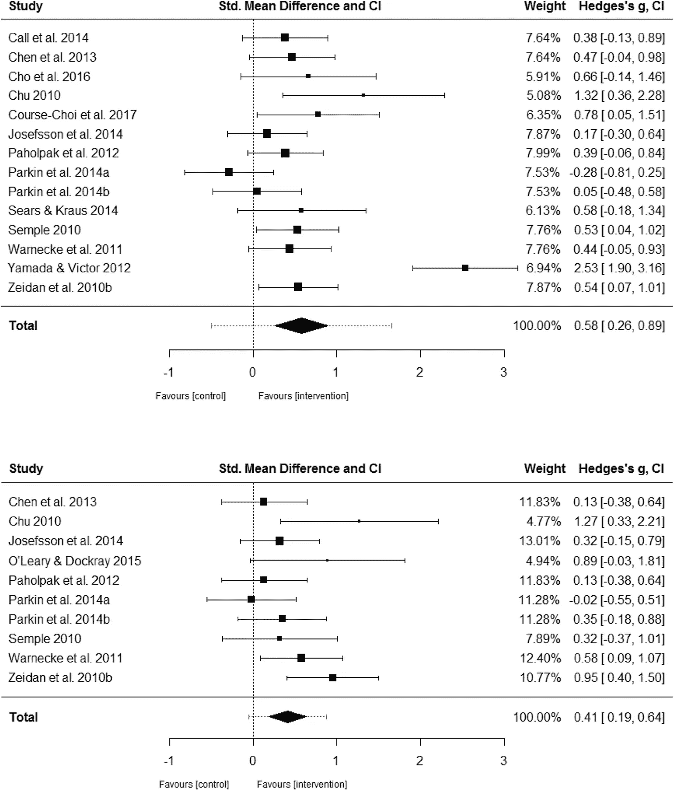
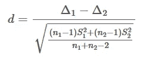
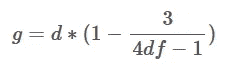

# 我在《R:第 1 部分》中复制元分析的尝试

> 原文：<https://towardsdatascience.com/my-attempt-at-replicating-a-meta-analysis-in-r-part-1-eec2a0e900e6?source=collection_archive---------32----------------------->

## 请随意跳到[第 2 部分](/my-attempt-at-replicating-a-meta-analysis-in-r-part-2-910a94a36d31)的森林图。

## 我把这篇文章分成两部分，因为我不想让我的第一篇文章有几千字长！

# 学习无处不在

我倾向于通读荟萃分析以获得感兴趣领域的信息。例如，我可能想知道，在没有搜索数百项研究的情况下，一种特定类型的心理疗法对特定的精神疾病是否有效。荟萃分析非常适合提供这些信息的摘要。然后我想，好吧，我们如何在 R 中做这些分析，并渲染一个看起来很漂亮的森林图。

我从 Blanck 等人(2018)最近发表的元分析中选择了下面的森林图。有趣的是，他们研究了独立的正念练习(SAMs)对抑郁和焦虑症状的影响，而不是结合正念的治疗模式。人们对精神病理学治疗中基于正念的干预，以及普遍支持积极健康的干预有着浓厚的兴趣。只需在谷歌上搜索*正念研究几十年*的图片，你就会发现一些显著的图表，显示出关于正念的科学研究的显著增长。

尽管如此，这是该研究发表的森林图，分别测量对焦虑和抑郁症状的影响。森林图是总结多项独立研究估计结果的好方法。在这个例子中，我们可以看到，与对照组相比，单独的正念练习对焦虑和抑郁症状有显著的影响。



Figure 1\. Forest plot on the effects of standalone mindfulness exercises on anxiety and depressive symptoms. Reprinted from “Effects of mindfulness exercises as stand-alone intervention on symptoms of
anxiety and depression: Systematic review and meta-analysis” by Blanck, P., Perleth, S., Heidenreich, T., Kröger, P., Ditzen, B., Bents, H., & Mander, J. (2018). *Behaviour research and therapy*, *102*, 25–35\. Copyright [2018] Blanck et al. (2018)

# 嗯，荟萃分析？

不是统计学家，迫使我去弄清楚任何统计技术的基础。基础优先对吗？

因此，荟萃分析是一种统计方法，用于综合多个科学研究的特定结果。目的是估计特定研究领域的总体效果。从本质上讲，荟萃分析的定量结果被用来总结一个研究机构(Egger & Smith，1997)。例如，可能有多个关于认知行为疗法(CBT)对抑郁症的有效性的独立研究。可以完成一个荟萃分析来提供一个量化的回顾，以巩固 CBT 的结果。这些研究可以通过使用的结果测量进行总结。

我将使用 Blanck 等人(2018)发表的元分析来练习如何在 r 中复制一个元分析。另外，这是一篇关于正念练习的有趣评论。以下是纳入焦虑症状荟萃分析的研究列表(所有研究都列在参考列表中):

*Call，Miron，&Orcutt(2014)；陈，杨，王，&张(2013)；Cho，Ryu，Noh，&Lee(2016)；楚(2010)；课程-崔，萨维尔，&德拉克山(2017)；约瑟夫松，林德沃尔，&布罗伯格(2014)；Paholpak 等人(2012 年)；帕金等人(2014 年)；西尔斯&克劳斯(2009)；森普尔(2010 年)；沃内克，奎因，奥格登，陶勒，&尼尔森(2011)；山田&维克多(2012)；泽丹，约翰逊，戈登，&古尔卡辛(2010)*

# 整理所有的统计数据

这很乏味，但我浏览了所有 14 项关于焦虑症状总结的研究，并在 Excel 中记录了必要的统计数据(例如，平均前测和后测分数、群体样本大小、标准偏差)。这是来自 Excel 的数据集，包含所有 14 项研究，Blanck 等人(2018 年)报告了对冲的 g 统计数据，以及这些研究报告的治疗组和对照组的平均分数和标准偏差。

```
# before reading data, we need to create a function for Cohen's d
# Blanck et al. (2018) used a controlled pre/post effect size calculation
# smd = standardised mean difference

# read in Excel studies data file
anxiety_studies_df <- readxl::read_excel("./data/replicating-meta-analysis-studies.xlsx",
                                         col_names = TRUE,
                                         sheet = "anxiety_es")

# take a look at the data
tibble::glimpse(anxiety_studies_df)
## Observations: 20
## Variables: 22
## $ study_name           <chr> "Call et al. (2014)", "Call et al. (2014)...
## $ treatment_cond       <chr> "Body Scan", "Body Scan", "Meditation", "...
## $ control              <chr> "Waiting List", "Hatha Yoga", "No Interve...
## $ inactive_control_ind <chr> "Y", "N", "Y", "Y", "N", "Y", "Y", "Y", "...
## $ outcome_measure      <chr> "DASS-21 - Anxiety", "DASS-21 - Anxiety",...
## $ notes                <chr> NA, NA, NA, NA, NA, NA, NA, NA, "This stu...
## $ year                 <dbl> 2014, 2014, 2013, 2016, 2016, 2010, 2017,...
## $ blanck_hedge_g       <dbl> 0.38, 0.38, 0.47, 0.66, 0.66, 1.32, 0.78,...
## $ treatment_n          <dbl> 27, 29, 30, 12, 12, 10, 15, 38, 30, 20, 2...
## $ treatment_pre        <dbl> 1.47, 1.88, 46.60, 49.75, 50.58, 1.04, 40...
## $ treatment_pre_sd     <dbl> 0.48, 0.73, 11.60, 5.71, 6.26, 0.90, 10.0...
## $ treatment_post       <dbl> 1.34, 1.41, 41.40, 38.58, 41.17, 0.33, 35...
## $ treatment_post_sd    <dbl> 0.43, 0.42, 10.40, 10.04, 8.94, 0.34, 8.3...
## $ treatment_sd_diff    <dbl> -0.05, -0.31, -1.20, 4.33, 2.68, -0.56, -...
## $ treatment_diff       <dbl> -0.13, -0.47, -5.20, -11.17, -9.41, -0.71...
## $ control_n            <dbl> 35, 35, 30, 12, 12, 10, 15, 30, 28, 20, 2...
## $ control_pre          <dbl> 1.66, 1.66, 46.20, 47.92, 47.92, 1.51, 35...
## $ control_pre_sd       <dbl> 0.56, 0.56, 11.50, 7.74, 7.74, 0.92, 10.2...
## $ control_post         <dbl> 1.78, 1.78, 46.30, 43.33, 43.33, 1.63, 37...
## $ control_post_sd      <dbl> 0.77, 0.77, 11.80, 8.49, 8.49, 0.80, 10.0...
## $ control_sd_diff      <dbl> 0.21, 0.21, 0.30, 0.75, 0.75, -0.12, -0.1...
## $ control_diff         <dbl> 0.12, 0.12, 0.10, -4.59, -4.59, 0.12, 1.7...

# take a different look at the data
head(anxiety_studies_df, 5) %>% 
  knitr::kable() %>% 
  kableExtra::kable_styling(c("bordered", "condensed"), full_width = T, position = "l") %>% 
  scroll_box(width = "100%", height = "400px")
```

太好了。我们已经存储了数据，并准备好进行进一步的分析，但现在我们需要使用这些统计数据来计算影响大小。幸运的是，Blanck 等人(2018 年)在他们的论文中提供了如何估计 Cohen 的 d 和 Hedge 的 *h* 的等式。让我的生活轻松多了！

我们可以使用一个标准的函数来计算效果的大小，例如，`esc`包中的`esc_mean_gain()`。稍后，我可能会使用用户定义的函数和软件包提供的函数来比较估计值的差异。

# 计算效果大小

# 采用方程式

在 Blanck 等人(2018 年)中，是时候为科恩的 d 方程和对冲的 g 方程创建一个函数了。这两个方程都用于估计受控的前/后效应大小。首先，我将定义一个函数，该函数将接受等式的这些参数并计算科恩的 d。此外，我将定义一个单独的函数，该函数将科恩的 d 转换为对冲的 g。我们将分别调用函数`cohen_d_calc()`和`convert_d_g()`。作为参考，下面是计算前/后控制效果大小的公式(Blanck et al .，2018):



其中δ1 是指治疗前后的平均分数/值之间的差异，δ2 是指治疗前后的平均分数/值之间的差异。S1 和 S2 分别指治疗和对照*后*得分的标准差。n1 和 n2 分别指完整的前/后观察的治疗组和对照组的样本量。

Morris (2008 年)(见等式[8–10])和 Lakens (2013 年)(见等式[1])报告的上述等式略有不同。这些方程的数学解释远远超出了我的知识范围，所以我要避开它。

将 Cohen 的 d 转换为 Hedge 的 g 的公式如下:



其中 d 是根据 Cohen 的 d 估计的前/后控制效果大小，df 是指自由度。现在让我们把它放入 R 中的函数中，这样我们就可以相应地估计以后每项研究的影响大小。

```
# create function for calculating Cohen's d as per the Blanck et al. (2018) provided equation
cohen_d_calc <- function(

  # specify all the arguments, i.e. pre/post means, pre/post sd etc
  treatment_pre_mean,
  treatment_post_mean,
  treatment_post_sd, 
  control_pre_mean, 
  control_post_mean,
  control_post_sd,
  treatment_n, 
  control_n) {

  # numerator: mean differences for pre MINUS mean differences for post
  ( ( treatment_pre_mean - treatment_post_mean ) - ( control_pre_mean - control_post_mean ) ) / 

    # denominator: pooled standard deviation
    (
      sqrt
      (
        # numerator
        ( ( ( treatment_n - 1 ) * ( treatment_post_sd ^ 2 ) ) + ( ( control_n - 1 ) * ( control_post_sd ^ 2 ) ) ) /

          # denominator
          ( treatment_n + control_n - 2 )
      )
    )
}

# conversion from Cohen's d to Hedge's g
convert_d_g <- function(d, treatment_n, control_n) {

  # Cohen's d multipled by conversion factor
  d * ( 1 - ( 3 / ( ( 4 * ( treatment_n + control_n ) ) ) ) )

}

# create a function for pooled standard deviations
pooled_sd <- function(

  # specify all the arguments, i.e. pre/post means, pre/post sd etc
  treatment_post_sd, 
  control_post_sd,
  treatment_n, 
  control_n

) {

  sqrt
  (
    # numerator
    ( ( ( treatment_n - 1 ) * ( treatment_post_sd ^ 2 ) ) + ( ( control_n - 1 ) * ( control_post_sd ^ 2 ) ) ) /

      # denominator
      ( treatment_n + control_n - 2 )
  )
} 
```

我们有这些函数形式的方程，但它真的有效吗？让我们在 forest plot 中报告的第一项关于焦虑症状的研究中进行测试，即 Call 等人(2014 年)。

```
# calculate Cohen's d first
call_d <- cohen_d_calc(treatment_pre_mean = 1.47,
                       treatment_post_mean = 1.34,
                       treatment_post_sd = 0.43, 
                       control_pre_mean = 1.66, 
                       control_post_mean = 1.78,
                       control_post_sd = 0.77,
                       treatment_n = 27, 
                       control_n = 35) 
call_d
## [1] 0.387562

# then convert to Hedge's g
call_h <- convert_d_g(d = call_d,
                      treatment_n = 27,
                      control_n = 35)
round(call_h, 2)
## [1] 0.38

# exact result as per Blanck et al. (2018) reported result
# h = 0.38
```

好吧，这看起来很有希望，因为我计算的对冲的 g 值与 Call 等人(2014 年)公布的 g 值相同。真正的测试是将这个函数应用到剩余的研究中。

上面的代码并不完全清晰，但我真的很想看看我是否可以开始元分析，特别是在以前没有进行元分析的经验的情况下。在这篇文章的第二部分，我将描述我是如何成功复制 Blanck 等人(2018)发表的森林地块的。

敬请期待！

# 参考

Blanck，p .，Perleth，s .，Heidenreich，t .，krger，p .，Ditzen，b .，Bents，h .，和 Mander，J. (2018 年)。正念练习作为独立干预对焦虑和抑郁症状的影响:系统综述和荟萃分析。*行为研究与治疗*， *102* ，25–35。

科尔博士、米隆博士和奥克特博士(2014 年)。短期正念技术在减轻焦虑和压力症状中的有效性。*正念*， *5* (6)，658–668。

陈，杨，谢，王，李，张，谢(2013)。短期正念冥想对中国护理专业学生焦虑症状和收缩压影响的随机对照试验。*今日护士教育*， *33* (10)，1166–1172。

Cho，h .，Ryu，s .，Noh，j .，& Lee，J. (2016 年)。日常正念呼吸练习对学生考试焦虑的影响。 *PloS One* ， *11* (10)，e0164822。

朱立成(2010)。冥想对情商、感知压力和消极心理健康的益处。*压力与健康:国际压力调查学会杂志*， *26* (2)，169–180。

Course-Choi，j .，Saville，h .，& Derakshan，N. (2017)。适应性工作记忆训练和正念冥想训练对高焦虑者加工效率和焦虑的影响。*行为研究与治疗*， *89* ，1–13。

德尔西蒙尼安和莱尔德(1986 年)。临床试验中的荟萃分析。*对照临床试验*， *7* (3)，177–188。

艾格博士和史密斯博士(1997 年)。荟萃分析:潜力和希望。 *Bmj* ， *315* (7119)，1371–1374。

赫奇斯，L. V. (1983 年)。效应大小的随机效应模型。*心理通报*， *93* (2)，388。

Hofmann，S. G .，Sawyer，A. T .，Witt，A. A .，& Oh，D. (2010)。正念疗法对焦虑和抑郁的影响:一项荟萃分析综述。*《咨询与临床心理学杂志》*， *78* (2)，169。

Hofmann，S. G .，Wu，J. Q .，，Boettcher，H. (2014)。认知行为疗法对焦虑症患者生活质量的影响:一项荟萃分析。*咨询与临床心理学杂志*， *82 期* (3)，375 页。

t .约瑟夫松、m .林德沃尔和 A. G .布罗伯格(2014 年)。短期正念干预对自我报告的正念、偏离中心、执行注意力、心理健康和应对方式的影响:检查独特的正念效果和中介。*正念*， *5* (1)，18–35。

拉肯斯博士(2013 年)。计算和报告效应大小以促进累积科学:t 检验和 anovas 实用入门。*心理学前沿*， *4* ，863。

莫里斯，S. B. (2008 年)。根据前测-后测-控制组设计估计效应大小。*组织研究方法*、 *11* (2)、364–386。

Paholpak，s .，Piyavhatkul，n .，Rangseekajee，p .，Krisanaprakornkit，t .，Arunpongpaisal，s .，Pajanasoontorn，n .，其他。(2012).孔卡恩大学医学生的呼吸冥想:对精神症状、记忆、智力和学术成就的影响。*泰国医学会杂志*， *95* (3)，461 页。

帕金、摩根、罗塞利、霍华德、谢泼德、埃文斯和其他人。(2014).探索正念和心觉的关系。*正念*， *5* (3)，298–313。

罗森塔尔，R. (1986 年)。社会科学研究的元分析程序 sage 出版物:贝弗利山，1984 年，148 页。*教育研究者*， *15* (8)，18–20。

西尔斯和克劳斯(2009 年)。因此我认为 om:认知扭曲和应对方式是正念冥想对焦虑、积极和消极情感以及希望的影响的中介。*临床心理学杂志*， *65* (6)，561–573。

森普尔，R. J. (2010)。正念冥想会增强注意力吗？随机对照试验。*正念*， *1* (2)，121–130。

Shim，S. R .，& Kim，S.-J. (2019 年)。干预荟萃分析:r 软件的应用与实践。*流行病学与健康*， *41* 。

西维耶希鲍尔(未标明)。metafor 包。从 http://www.metafor-project.org/doku.php/analyses:morris2008[取回](http://www.metafor-project.org/doku.php/analyses:morris2008)

沃内克，e .，奎因，s .，奥格登，k .，陶勒，n .，，纳尔逊，M. R. (2011)。一项关于正念练习对医学生压力水平影响的随机对照试验。*医学教育*， *45* (4)，381–388。

山田和维克多(2012 年)。正念意识实践对大学生健康、幸福和学习能力的影响:一项初步研究。*心理学学习&教学*， *11* (2)，139–145。

Zeidan，s . k . Johnson，N. S .、Gordon 和 Goolkasian，P. (2010 年)。短暂和虚假的正念冥想对情绪和心血管变量的影响。*《替代与补充医学杂志*， *16* (8)，867–873。