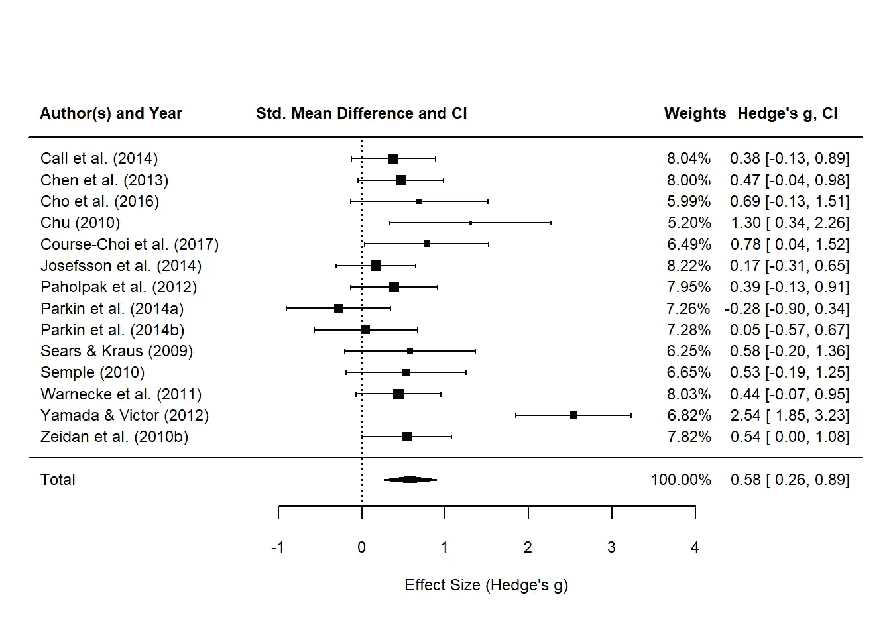
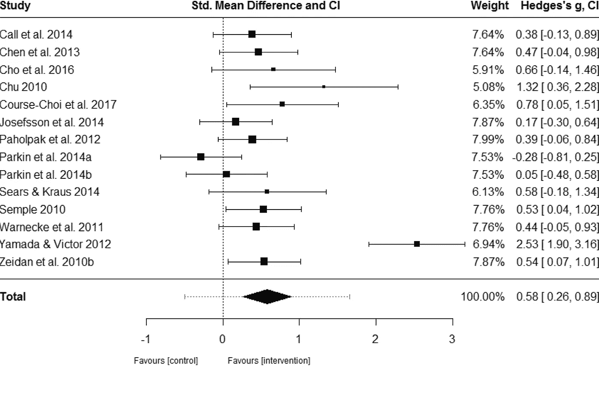

# 我在《R:第 2 部分》中复制元分析的尝试

> 原文：<https://towardsdatascience.com/my-attempt-at-replicating-a-meta-analysis-in-r-part-2-910a94a36d31?source=collection_archive---------23----------------------->

## 背景信息和功能见[第 1 部分](/my-attempt-at-replicating-a-meta-analysis-in-r-part-1-eec2a0e900e6)。

## 最后，让我们创建一个漂亮的森林图。

在[第一部分](/my-attempt-at-replicating-a-meta-analysis-in-r-part-1-eec2a0e900e6)中已经涵盖了创建手动计算效果大小的函数的所有细节。让我们直入主题，看看我们如何从这个艰苦的过程中创造一个森林情节！

# 将函数应用于所有研究

请记住，我们已经将每个病历报告的所有统计数据导入到 Excel 数据文件中。接下来的问题是创建一个新的列，它(1)计算 Cohen 的 d；然后(2)将 d 转换为 Hedge 的 g。我们将过滤数据框，以便根据`filter(inactive_control_ind == "Y")`行仅包含具有无效对照比较的研究。由此，我们使用我们的函数来计算 d，即`cohen_d_calc()`函数，然后将其转换为 g。让我们继续创建一些列，使用我们的自定义函数来估计影响大小。

```
# create a new variable that provides both d and g
anxiety_studies_eff_df <- anxiety_studies_df %>% 
  filter(inactive_control_ind == "Y") %>% 
  mutate(cohen_d_val = cohen_d_calc(treatment_pre_mean = treatment_pre,
                                    treatment_post_mean = treatment_post,
                                    treatment_post_sd = treatment_post_sd,
                                    control_pre_mean = control_pre,
                                    control_post_mean = control_post,
                                    control_post_sd = control_post_sd,
                                    treatment_n = treatment_n,
                                    control_n = control_n),
         study_pooled_sd = pooled_sd(treatment_post_sd = treatment_post_sd, 
                                     control_post_sd = control_post_sd,
                                     treatment_n = treatment_n, 
                                     control_n = control_n)) %>% 
  mutate(hedge_g_val = convert_d_g(cohen_d_val, treatment_n, control_n),
         hedge_g_rounded = round(hedge_g_val, 2)) %>% 
  dplyr::select(study_name, year, blanck_hedge_g, hedge_g_rounded, cohen_d_val, hedge_g_val, everything())
```

我们现在应该有一个数据框，其中包含 Blanck 等人(2018)发布的效应大小和我们的函数估计的效应大小。下面来看看吧:

```
# take a different look at the data
anxiety_studies_eff_df %>% 
  knitr::kable() %>% 
  kableExtra::kable_styling(c("bordered", "condensed"), full_width = T, position = "l") %>% 
  scroll_box(width = "100%", height = "400px")
```

然而，我遗漏了另一个必需的转换。事实上，有两项研究使用了多种治疗条件，并将它们与不活跃的对照组进行了比较，即 Parkin 等人(2014 年)和 Yamada & Victor (2012 年)。我们已经估计了这些研究的影响大小，但是还没有将它们结合起来代表整个研究。

我决定计算这些研究的*加权平均效应大小*，我假设 Blanck 等人(2018 年，第 28 页)的作者也是这样做的:

> 如果研究提供了焦虑或抑郁的一个以上合格结果测量的数据，我们压缩数据以确保获得的 ESs 的独立性。以类似的方式，使用多种合格的治疗条件(例如，采用不同正念练习的条件)将数据结合起来进行研究。

加权估计量的等式可以在 Hedges (1983)中找到。下面是:


其中 x(带有上划线)是加权平均效果大小的计算值。

在我们的案例中，*权重* w(i)是指给定研究(I)的总样本量，包括治疗组和对照组。g(i)是指为研究(I)估计的效应大小。好的，让我们通过计算加权平均效应大小来关注这些研究，然后将其与报道的效应大小进行比较。

如果研究中的效应大小无法计算，我们将采用荟萃分析中 Hedge 的 g 值。此外，Zeidan 等人(2010 年)只报告了两种焦虑量表中一种的前测和波特测试分数。鉴于信息不足，我们将用公布的值代替我们的估计 g 值。

```
# calculate weighted mean effect size and compare with Blanck et al. (2018)
anxiety_wgt_eff_df <- anxiety_studies_eff_df %>% 
  mutate(total_n = treatment_n + control_n,
         weight = total_n * hedge_g_val) %>% 
  group_by(study_name) %>% 
  summarise(weighted_g_val = round(sum(weight) / sum(total_n), 2)) %>% 
  dplyr::left_join(x = .,
                   y = anxiety_studies_eff_df %>% 
                     distinct(study_name, blanck_hedge_g, treatment_n, control_n),
                   by = "study_name") %>% 
  mutate(weighted_g_val = ifelse(is.na(weighted_g_val) |
                                   study_name == "Zeidan et al. (2010b)", blanck_hedge_g, weighted_g_val))
anxiety_wgt_eff_df
## # A tibble: 14 x 5
##    study_name           weighted_g_val blanck_hedge_g treatment_n control_n
##    <chr>                         <dbl>          <dbl>       <dbl>     <dbl>
##  1 Call et al. (2014)            0.38           0.38           27        35
##  2 Chen et al. (2013)            0.47           0.47           30        30
##  3 Cho et al. (2016)             0.69           0.66           12        12
##  4 Chu (2010)                    1.3            1.32           10        10
##  5 Course-Choi et al. ~          0.78           0.78           15        15
##  6 Josefsson et al. (2~          0.17           0.17           38        30
##  7 Paholpak et al. (20~          0.39           0.39           30        28
##  8 Parkin et al. (2014~         -0.28          -0.28           20        20
##  9 Parkin et al. (2014~          0.05           0.05           20        20
## 10 Sears & Kraus (2009)          0.580          0.580          19        10
## 11 Semple (2010)                 0.53           0.53           15        16
## 12 Warnecke et al. (20~          0.44           0.44           31        30
## 13 Yamada & Victor (20~          2.54           2.53           37        23
## 14 Zeidan et al. (2010~          0.54           0.54           29        26
```

进展顺利。现在我们可以容忍一些小的差异(特别是考虑到这对我来说是新的)。所以，我们有了效果尺寸。现在缺少什么？研究中血腥的抽样差异。

# 前测-后测相关性

不幸的是，没有一项关于焦虑症状的荟萃分析研究包括前测和后测结果之间的相关性。该方法还包括如何确定相关系数的任何信息。这些是计算`metafor::rma`包中的*采样方差* `vi`所必需的。

先前关于正念及其对焦虑和抑郁的影响的元分析遇到了同样的问题(Hofmann，Sawyer，Witt & Oh，2010；Hofmann，Wu 和 Boettcher，2014)。为了解决这个问题，作者根据 Rosenthal (1986)的建议，使用了保守的估计值 r = .7。类似地，我将使用. 7 并测试森林图。

# 只见树木不见森林

在我可以复制森林图之前，我需要设置前后测试相关系数`ri`。由于我们已经估计了效应大小，我们可以使用 Morris (2008)的方法来确定运行随机效应模型所需的抽样方差`vi`。是的，非常混乱。请参阅 Viechtbauer(未注明)，因为该网页包含更多关于使用混合标准差的 R 语法的信息，以使用 Morris (2008)中描述的方法计算抽样方差。

因此，让我们使用 r = .7 进行预测试和后测相关，并根据`metafor::rma()`函数中的`vi`将其输入到采样方差的计算中。

```
# use .7 for pre/post correlation to calculate the sampling variance
# see http://www.metafor-project.org/doku.php/analyses:morris2008 for more information
r = 0.7
anxiety_ri_vi_df <- anxiety_wgt_eff_df %>% 
  mutate(ri = r,
         vi = 2*(1-ri) * 
           (1/treatment_n + 1/control_n) + 
           weighted_g_val^2 / (2*(treatment_n + control_n)))
anxiety_ri_vi_df
## # A tibble: 14 x 7
##    study_name weighted_g_val blanck_hedge_g treatment_n control_n    ri
##    <chr>               <dbl>          <dbl>       <dbl>     <dbl> <dbl>
##  1 Call et a~          0.38           0.38           27        35   0.7
##  2 Chen et a~          0.47           0.47           30        30   0.7
##  3 Cho et al~          0.69           0.66           12        12   0.7
##  4 Chu (2010)          1.3            1.32           10        10   0.7
##  5 Course-Ch~          0.78           0.78           15        15   0.7
##  6 Josefsson~          0.17           0.17           38        30   0.7
##  7 Paholpak ~          0.39           0.39           30        28   0.7
##  8 Parkin et~         -0.28          -0.28           20        20   0.7
##  9 Parkin et~          0.05           0.05           20        20   0.7
## 10 Sears & K~          0.580          0.580          19        10   0.7
## 11 Semple (2~          0.53           0.53           15        16   0.7
## 12 Warnecke ~          0.44           0.44           31        30   0.7
## 13 Yamada & ~          2.54           2.53           37        23   0.7
## 14 Zeidan et~          0.54           0.54           29        26   0.7
## # ... with 1 more variable: vi <dbl>
```

在所有这些麻烦之后，我们终于有了完整的统计数据插入到随机效应模型函数中。在这一点上，我将使用`metafor::rma()`函数，该函数将聚合所有效应大小，以生成 SAMs 对焦虑症状的汇总效应大小。好消息是，我们知道 Blanck 等人(2018)使用了 DerSimonian & Laird (1986)的逆方差随机效应模型。您可以通过在`rma()`功能中指定`method = "DL"`来选择该型号。见下文。

```
# random effects model with r = .7
# fit the re model
res <- metafor::rma(data = anxiety_ri_vi_df,
                    yi = weighted_g_val, # effect size
                    vi = vi, # sampling
                    method = "DL",
                    slab = study_name)
res
## 
## Random-Effects Model (k = 14; tau^2 estimator: DL)
## 
## tau^2 (estimated amount of total heterogeneity): 0.2412 (SE = 0.1238)
## tau (square root of estimated tau^2 value):      0.4911
## I^2 (total heterogeneity / total variability):   80.19%
## H^2 (total variability / sampling variability):  5.05
## 
## Test for Heterogeneity:
## Q(df = 13) = 65.6255, p-val < .0001
## 
## Model Results:
## 
## estimate      se    zval    pval   ci.lb   ci.ub 
##   0.5771  0.1487  3.8811  0.0001  0.2857  0.8686  *** 
## 
## ---
## Signif. codes:  0 '***' 0.001 '**' 0.01 '*' 0.05 '.' 0.1 ' ' 1

# finally plot the damn thing!
metafor::forest(res,
                showweights = TRUE,
                xlim = c(-4,6),
                xlab = "Effect Size (Hedge's g)",
                # digits = c(2,3p),
                mlab = "Total",
                cex = 0.75,
                cex.lab = 0.75)

# switch to bold
par(font = 2)

# add column headings to the plot
text(x = -3, y = 17, labels = "Author(s) and Year", cex = 0.75, pos = 1)
text(x = 0, y = 17, labels = "Std. Mean Difference and CI", cex = 0.75, pos = 1)
text(x = 4, y = 17, labels = "Weights", cex = 0.75, pos = 1)
text(x = 5.1, y = 17, labels = "Hedge's g, CI", cex = 0.75, pos = 1)

# add x axis label
text(x = -1, y = -2, labels = "Favours [control]", cex = 0.75, pos=1)
```


Figure 1\. First forest plot of effect size of SAMs on anxiety symptoms using pretest-posttest correlation of r = .7.

终于有情节了！

然而，每项研究效应大小的置信区间与荟萃分析中报道的相差甚远。经过反复试验，我假设 r = .5 可能比罗森塔尔(1986 年)采用的值更保守。没有关于 Blanck 等人(2018 年)使用的相关系数的信息。

一气呵成:

```
# use .5 for pre/post correlation to calculate the sampling variance
# see http://www.metafor-project.org/doku.php/analyses:morris2008 for more information
r = 0.5
anxiety_ri_vi_df <- anxiety_wgt_eff_df %>% 
  mutate(ri = r,
         vi = 2*(1-ri) * 
           (1/treatment_n + 1/control_n) + 
           weighted_g_val^2 / (2*(treatment_n + control_n)))
anxiety_ri_vi_df
## # A tibble: 14 x 7
##    study_name weighted_g_val blanck_hedge_g treatment_n control_n    ri
##    <chr>               <dbl>          <dbl>       <dbl>     <dbl> <dbl>
##  1 Call et a~          0.38           0.38           27        35   0.5
##  2 Chen et a~          0.47           0.47           30        30   0.5
##  3 Cho et al~          0.69           0.66           12        12   0.5
##  4 Chu (2010)          1.3            1.32           10        10   0.5
##  5 Course-Ch~          0.78           0.78           15        15   0.5
##  6 Josefsson~          0.17           0.17           38        30   0.5
##  7 Paholpak ~          0.39           0.39           30        28   0.5
##  8 Parkin et~         -0.28          -0.28           20        20   0.5
##  9 Parkin et~          0.05           0.05           20        20   0.5
## 10 Sears & K~          0.580          0.580          19        10   0.5
## 11 Semple (2~          0.53           0.53           15        16   0.5
## 12 Warnecke ~          0.44           0.44           31        30   0.5
## 13 Yamada & ~          2.54           2.53           37        23   0.5
## 14 Zeidan et~          0.54           0.54           29        26   0.5
## # ... with 1 more variable: vi <dbl>

# random effects model with r = .5
# fit the re model
res <- metafor::rma(data = anxiety_ri_vi_df,
                    yi = weighted_g_val, # effect size
                    vi = vi, # sampling
                    method = "DL",
                    slab = study_name)
res
## 
## Random-Effects Model (k = 14; tau^2 estimator: DL)
## 
## tau^2 (estimated amount of total heterogeneity): 0.2536 (SE = 0.1422)
## tau (square root of estimated tau^2 value):      0.5036
## I^2 (total heterogeneity / total variability):   72.49%
## H^2 (total variability / sampling variability):  3.64
## 
## Test for Heterogeneity:
## Q(df = 13) = 47.2558, p-val < .0001
## 
## Model Results:
## 
## estimate      se    zval    pval   ci.lb   ci.ub 
##   0.5781  0.1605  3.6020  0.0003  0.2635  0.8927  *** 
## 
## ---
## Signif. codes:  0 '***' 0.001 '**' 0.01 '*' 0.05 '.' 0.1 ' ' 1

# finally plot the damn thing!
metafor::forest(res,
                showweights = TRUE,
                xlim = c(-4,6),
                xlab = "Effect Size (Hedge's g)",
                # digits = c(2,3p),
                mlab = "Total",
                cex = 0.75,
                cex.lab = 0.75)

# switch to bold
par(font = 2)

# add column headings to the plot
text(x = -3, y = 17, labels = "Author(s) and Year", cex = 0.75, pos = 1)
text(x = 0, y = 17, labels = "Std. Mean Difference and CI", cex = 0.75, pos = 1)
text(x = 4, y = 17, labels = "Weights", cex = 0.75, pos = 1)
text(x = 5.1, y = 17, labels = "Hedge's g, CI", cex = 0.75, pos = 1)

# add x axis label
text(x = -1, y = -2, labels = "Favours [control]", cex = 0.75, pos=1)
```



Figure 2\. Second forest plot of effect size of SAMs on anxiety symptoms using pretest-posttest correlation of r = .5.



Figure 3\. Forest plot on the effects of standalone mindfulness exercises on anxiety symptoms. Reprinted from “Effects of mindfulness exercises as stand-alone intervention on symptoms of anxiety and depression: Systematic review and meta-analysis” by Blanck, P., Perleth, S., Heidenreich, T., Kröger, P., Ditzen, B., Bents, H., & Mander, J. (2018). *Behaviour research and therapy*, *102*, 25–35\. Copyright [2018] Blanck et al. (2018)

对冲的 g 值与 Blanck 等人(2018 年)的荟萃分析中报告的结果非常接近。根据 Blanck 等人(2018 年)的森林图，随机效应模型得出 SAMs 对焦虑症状的相同汇总效应大小(和置信区间)，即 SMD=0.58。然而，我们的模型报告的重量与文章中公布的不匹配。我承认现阶段无法解释这个。

尽管如此，我认为这是在完成元分析的基础上的一次不错的尝试。这并没有涵盖运行元分析所涉及的所有过程，我推荐 Shim & Kim (2019)的一篇相关的最新文章，该文章提供了在 r 中整理干预元分析的额外示例。作者还提供了一个关于元分析过程要点的漂亮图表。

我可能会写另一篇关于如何直接使用这些包来自动执行手动效果大小计算的文章。

# 关键要点

*   首先，短暂的独立正念练习似乎对减少焦虑症状有积极的作用。这包括各种练习(和模式)，如身体扫描、呼吸冥想等。此外，很高兴在 Blanck 等人(2018 年)和 Hofmann 等人(2010 年)中看到类似的疗效(一项关于基于正念的治疗而不是单独的正念练习的荟萃分析)。这就提出了一个问题:什么时候不使用其他治疗成分进行简单的正念练习是合适的(或许更具成本效益),以及适用于哪个群体。
*   并非所有的研究都会报告所需的统计数据，作为您计算效应大小的输入。这使得元分析过程具有挑战性，尤其是当你需要关键的统计数据时，如前测和后测的平均分数、标准差和前/后相关性。有些研究可能只包括数字，而没有数据点的相关值，这让您的生活更加困难。
*   一个反直觉的结论是，手动计算效果尺寸比使用软件包中预定义的函数更能提供信息，例如`esc`、`effsize`、`psych`、`meta`、`metafor`。这些软件包是绝对强大的，但我发现它有利于手动计算效果大小的螺母和螺栓，而上述软件包无论如何都可以做到。这只是我。
*   我不羡慕统计学家！

# 参考

Blanck，p .，Perleth，s .，Heidenreich，t .，krger，p .，Ditzen，b .，Bents，h .，和 Mander，J. (2018 年)。正念练习作为独立干预对焦虑和抑郁症状的影响:系统综述和荟萃分析。*行为研究与治疗*， *102* ，25–35。

科尔博士、米隆博士和奥克特博士(2014 年)。短期正念技术在减轻焦虑和压力症状中的有效性。*正念*， *5* (6)，658–668。

陈，杨，谢，王，李，张，谢(2013)。短期正念冥想对中国护理专业学生焦虑症状和收缩压影响的随机对照试验。*今日护士教育*， *33* (10)，1166–1172。

Cho，h .，Ryu，s .，Noh，j .，& Lee，J. (2016 年)。日常正念呼吸练习对学生考试焦虑的影响。 *PloS One* ， *11* (10)，e0164822。

朱立成(2010)。冥想对情商、感知压力和消极心理健康的益处。*压力与健康:国际压力调查学会杂志*， *26* (2)，169–180。

Course-Choi，j .，Saville，h .，& Derakshan，N. (2017)。适应性工作记忆训练和正念冥想训练对高焦虑者加工效率和焦虑的影响。*行为研究与治疗*， *89* ，1–13。

德尔西蒙尼安和莱尔德(1986 年)。临床试验中的荟萃分析。*对照临床试验*， *7* (3)，177–188。

艾格博士和史密斯博士(1997 年)。荟萃分析:潜力和希望。 *Bmj* ， *315* (7119)，1371–1374。

赫奇斯，L. V. (1983 年)。效应大小的随机效应模型。*心理通报*， *93* (2)，388。

Hofmann，S. G .，Sawyer，A. T .，Witt，A. A .，& Oh，D. (2010)。正念疗法对焦虑和抑郁的影响:一项荟萃分析综述。*咨询与临床心理学杂志*， *78* (2)，169。

Hofmann，S. G .，Wu，J. Q .，，Boettcher，H. (2014)。认知行为疗法对焦虑症患者生活质量的影响:一项荟萃分析。*《咨询与临床心理学杂志》*， *82* (3)，375 页。

t .约瑟夫松、m .林德沃尔和 A. G .布罗伯格(2014 年)。短期正念干预对自我报告的正念、偏离中心、执行注意力、心理健康和应对方式的影响:检查独特的正念效果和中介。*正念*， *5* (1)，18–35。

拉肯斯博士(2013 年)。计算和报告效应大小以促进累积科学:t 检验和 anovas 实用入门。*心理学前沿*， *4* ，863。

莫里斯，S. B. (2008 年)。根据前测-后测-控制组设计估计效应大小。*组织研究方法*， *11* (2)，364–386。

Paholpak，s .，Piyavhatkul，n .，Rangseekajee，p .，Krisanaprakornkit，t .，Arunpongpaisal，s .，Pajanasoontorn，n .，其他。(2012).孔卡恩大学医学生的呼吸冥想:对精神症状、记忆、智力和学术成就的影响。*泰国医学会杂志*， *95* (3)，461 页。

帕金、摩根、罗塞利、霍华德、谢泼德、埃文斯和其他人。(2014).探索正念和心觉的关系。*正念*， *5* (3)，298–313。

罗森塔尔，R. (1986 年)。社会科学研究的元分析程序 sage 出版物:贝弗利山，1984 年，148 页，*教育研究者*， *15* (8)，18–20 页。

西尔斯和克劳斯(2009 年)。因此我认为 om:认知扭曲和应对方式是正念冥想对焦虑、积极和消极情感以及希望的影响的中介。*， *65* (6)，561–573。*

*森普尔，R. J. (2010)。正念冥想会增强注意力吗？随机对照试验。*正念*， *1* (2)，121–130。*

*Shim，S. R .，& Kim，S.-J. (2019 年)。干预荟萃分析:r 软件的应用与实践。*流行病学与健康*， *41* 。*

*西维耶希鲍尔(未标明)。metafor 包。从 http://www.metafor-project.org/doku.php/analyses:morris2008[取回](http://www.metafor-project.org/doku.php/analyses:morris2008)*

*沃内克，e .，奎因，s .，奥格登，k .，陶勒，n .，，纳尔逊，M. R. (2011)。一项关于正念练习对医学生压力水平影响的随机对照试验。*医学教育*， *45* (4)，381–388。*

*山田和维克多(2012 年)。正念意识实践对大学生健康、幸福和学习能力的影响:一项初步研究。*心理学学习&教学*， *11* (2)，139–145。*

*Zeidan，s . k . Johnson，N. S .、Gordon 和 Goolkasian，P. (2010 年)。短暂和虚假的正念冥想对情绪和心血管变量的影响。*《替代与补充医学杂志》*， *16* (8)，867–873。*