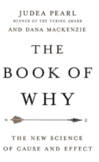
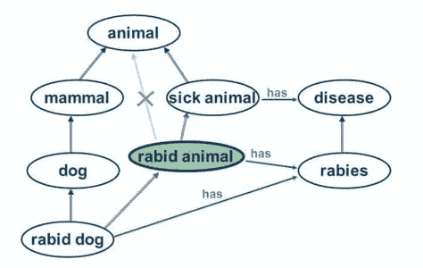

# 我赌因果强化学习

> 原文：<https://towardsdatascience.com/my-bet-on-causal-reinforcement-learning-d94fc9b37466?source=collection_archive---------16----------------------->

## 营销科学的下一个杀手级应用

*Robert Osazuwa Ness，机器学习工程师博士，定期在* [*AltDeep*](https://altdeep.substack.com/) *撰写关于数据和决策科学、机器学习和人工智能的微趋势观察。*

上周，我开始准备给一些数据科学研究生讲授一个特殊的主题— **强化学习中的因果建模**。

反思这个话题，我打个赌:**因果强化学习将是未来十年内的 AI 杀手级营销 app**。

## RL 和因果建模的背景

[强化学习](https://en.wikipedia.org/wiki/Reinforcement_learning)关注的是软件代理应该如何在一个环境中采取行动，以最大化一些累积回报的概念。[因果建模](https://en.wikipedia.org/wiki/Causal_model)是建立可以明确表示和推理因果关系的模型(最近的科普书籍[《为什么的书》](https://amzn.to/2zIfPDM)提供了该主题的通俗易懂的介绍)。

近年来，机器学习研究社区对这两个领域都表现出了越来越大的兴趣。这种对强化学习的兴趣是由结合深度学习和强化学习以创建能够击败人类专家的代理的重大成就推动的。突出的例子包括[古代战略游戏围棋](https://deepmind.com/research/case-studies/alphago-the-story-so-far)和[基于团队的比赛在幻想电脑游戏 Dota 2](https://altdeep.substack.com/p/open-ai-five-dota-2-explained) 。[有人认为](https://venturebeat.com/2018/04/05/whats-hot-in-ai-deep-reinforcement-learning/)深度强化学习是[广义 AI](https://en.m.wikipedia.org/wiki/Artificial_general_intelligence) 的路径。

## 因果建模如何适用

说到玩游戏，人类代理人通过形成其环境的因果模型来“玩”活着的生命的“游戏”。这些是概念模型(“这是一个棒球，那是一扇窗户”)，对象之间有因果关系(“如果我把棒球扔向窗户，它就会粉碎”)。因果模型允许我们将知识转移到新的不熟悉的情况(“我敢打赌，如果我把这个奇怪的新的硬的重的东西扔向那个奇怪的新的脆的玻璃状的东西，它也会碎”)。

当决定做什么和不做什么时，人类用这些模型进行推理。你是否曾经思考过你在特定情况下的行为，并认为，“如果我做的事情不同，事情会变得更好。”那叫做*反事实后悔*，是因果推理的一种形式。你在头脑中使用一个因果模型，在脑海中模拟如果你做出不同的决定，事情会如何发展。反事实后悔是这种模拟的可能结果和实际发生的结果之间的差异。当你基于对过去决策的因果推理做出你认为会避免遗憾结果的决定时，你正在利用强大的认知机制。

一些游戏代理，比如最近在无限注德州扑克中击败人类扑克专家的代理，通过模拟数百万场游戏，做了一个最大限度减少反事实后悔的暴力版本。这比人类玩家依赖更多的经验和计算资源。

## 缺乏实用的工具

我专注于执行。虽然网上有无穷无尽的深度强化编程教程。然而，在编程强化学习中引入因果建模的实际案例研究还很缺乏。有一些研究(例如由 Vicarious AI 开发的[模式网络)，但是我实际上还没有看到任何代码。例如，将因果建模中的编程抽象如](https://www.vicarious.com/2017/08/07/general-game-playing-with-schema-networks/) [Pearl 的 do-operations](https://www.inference.vc/untitled/) 与强化学习中的[动态编程](https://en.wikipedia.org/wiki/Dynamic_programming)相结合的最佳方式是什么？我的希望是，将因果建模的理论和方法应用于编程 RL 可能会导致构建有用的编程抽象，用于构建更好的 RL 代理，特别是那些只需要一些真实或模拟经验就可以处理不熟悉情况的代理，就像我们人类一样。

## 自动化决策科学的赌注

我说我在这个问题上“打赌”,而不是做预测，因为打赌是游戏中有皮肤的预测。当我可以在 deepfakes 或 transformer networks 上工作的时候，我正在解决这个问题(这两个项目都非常值得、有利可图，而且有些令人恐惧)，因为我认为这将会有回报。

我看到了一些套利机会。深度强化学习的商业应用实际上是不存在的，除了向 OpenAI 和 [Deepmind](https://www.bloomberg.com/news/articles/2019-08-07/alphabet-s-deepmind-takes-on-billion-dollar-debt-as-loss-spirals) 投入大量资金，以便他们可以玩视频游戏(这没什么错)。

然而，RL 中的核心理论是为决策科学的各种元素提供动力的相同理论；顺序实验、最优化、决策理论、博弈论、拍卖设计等。将这些理论分支应用于决策问题正是数据科学家影响最大的领域，尤其是在科技领域。

因果建模是连接所有这些领域的线索。它甚至引入了计算认知心理学，在那里人们模拟了人类头脑中的因果模型。这使得人们可以从关于人类行为的数据中模拟人类的非理性，如认知偏差和谬误。在我看来，广告商花了大量时间让人们不理性地花钱。

我认为因果强化学习将是市场营销的圣杯。想象一下，在《黑镜》中，他们可以在数字口袋世界中制造出一个认知克隆体，并进行一百万次模拟，测试你会购买什么样的产品。就像那样。