# 我的顶点项目:伦敦房地产价格和场馆数据分析

> 原文：<https://towardsdatascience.com/my-capstone-project-real-estate-prices-venues-data-analysis-of-london-c936c0bc4b1d?source=collection_archive---------16----------------------->

Photo by [Giammarco](https://unsplash.com/@giamboscaro?utm_source=medium&utm_medium=referral) on [Unsplash](https://unsplash.com?utm_source=medium&utm_medium=referral)

他的文章是为 Coursera 的 IBM 数据科学专业认证的[最终顶点项目的一部分。在这篇文章中，我将分享我所面临的困难以及我实现的一些概念。](https://www.coursera.org/specializations/ibm-data-science-professional-certificate)

本文将包含任何数据科学项目所必需的以下步骤:

1.  问题陈述
2.  数据收集
3.  数据预处理
4.  机器学习
5.  形象化
6.  结果

# **问题陈述**

伦敦是英格兰和英国的首都和最大的城市，拥有欧盟最多的城市人口。伦敦有各种各样的人和文化，该地区有 300 多种语言。其 2016 年年中的城市人口(对应大伦敦)估计为 8，787，892 人，是欧盟人口最多的城市，占英国人口的 13.4%。根据 2011 年的人口普查，伦敦市区拥有 9，787，426 名居民，是欧盟第二大人口密集区，仅次于巴黎。人口密度为每平方英里 14，500 人。[1]

伦敦是一个人口和人口密度都很高的城市。从房地产投资者的角度来看，我们希望投资于房价低、设施完善(商店、餐馆、公园、酒店等)的地方。)和社交场所都在附近。记住以上事情，对于一个人来说，在这样一个大城市找到这样一个地方并收集如此多的信息是非常困难的。

当我们考虑所有这些问题时，我们可以创建一个地图和信息图表，其中房地产指数放在伦敦上，并根据场地密度对每个区进行聚类。

# **数据收集**

考虑到上述问题，数据收集如下:

*   我从维基百科上找到了伦敦地区及其行政区和邮政编码的列表。[2]
*   关于房价，我搜索并找到了一个很棒的网站，上面有最新的伦敦房价和邮政编码。[3]
*   我使用 Forsquare API 获取伦敦特定行政区最常见的场所。[4]
*   我用的氯普图。伦敦 geojson 文件。[5]

# **数据预处理**

首先，从维基百科上搜集的数据必须是干净的。

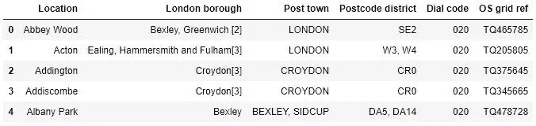

unclean data from Wikipedia

我删除了所有的超链接，有些地方有不止一个邮政编码，所以我只保留了一个邮政编码。

对于下一张平均房价表，数据最初看起来是这样的:

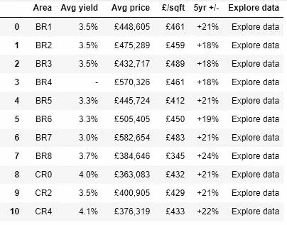

Unclean data of house prices

首先，我删除了所有的空值，然后去掉了不需要的列，只保留了“面积”和“平均价格”列。然后“平均价格”列包含字符串，所以我通过删除英镑符号和逗号将其处理为整数。

在清理了两个表之后，我执行了两个表的内部连接和合并，并从结果表中删除了“拨号代码”和“操作系统网格参考”列，因为它们没有用。然后，通过使用地理编码器库，我找到了该位置的经度和纬度，并在我的数据帧中添加了每一列。

我使用 python**follow**library 来可视化伦敦及其行政区的地理细节，并创建了一张叠加了行政区的伦敦地图。我使用纬度和经度值得到如下的视觉效果:

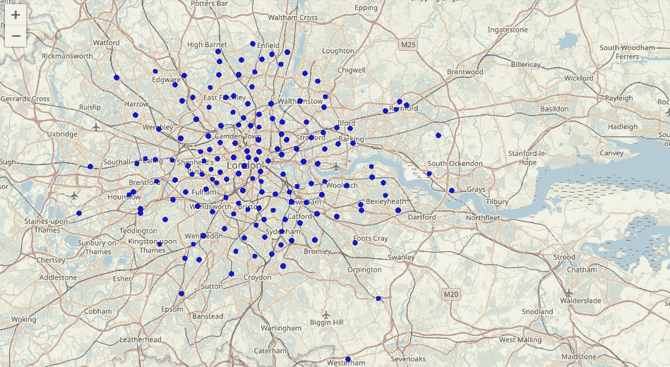

Map of London, with markers of different neighborhoods

我利用 Foursquare API 来探索行政区并对它们进行分段。根据给定的纬度和经度信息，我为每个区设计了 100 个场地和 1400 米半径的限制。这是一个来自 Foursquare API 的场馆名称、类别、经度和纬度信息列表。

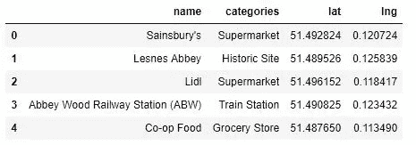

This for the first Location

我对所有位置和每个位置的场地计数等重复该过程。是:

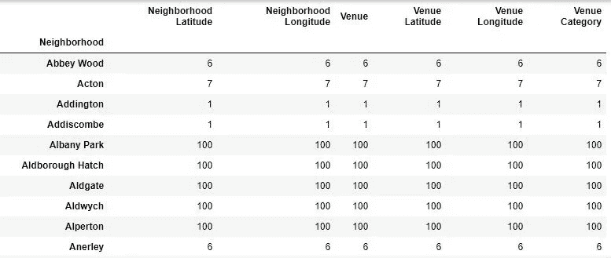

最后，通过结合使用 Foursquare API 和创建的数据集，生成了伦敦街区最常去的场所的表。

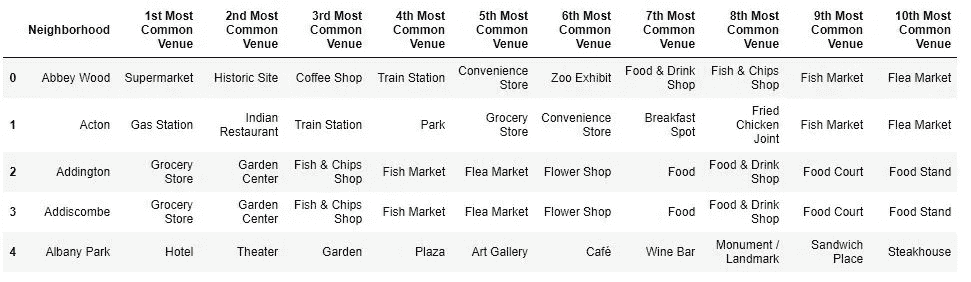

# **机器学习**

我们在行政区有一些共同的场地类别。为此，我使用了无监督学习 K-means 算法来对行政区进行聚类。K-Means 算法是无监督学习中最常用的聚类方法之一。

首先，我将运行 K-Means 来将这些行政区分成 6 个簇，因为当我用 elbow 方法分析 K-Means 时，它确保了 K-Means 的最佳 K 值为 6 度。

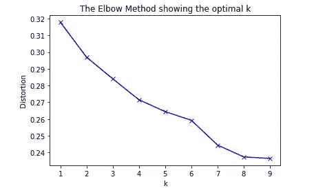

然后我合并了每个区的聚类标签表。在检查每个集群后，我将每个集群标记如下:

1.  混合社交场所
2.  酒店和社交场所
3.  商店和海鲜餐馆
4.  酒吧和历史古迹
5.  运动和田径
6.  餐馆和酒吧

我也想象每个地方的房价:

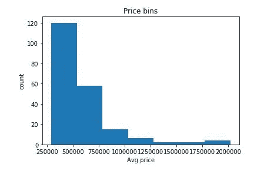

如上图所示，我们可以将范围定义如下:

*   > 500000:“低级别 1”
*   500000–750000:“低级别 2”
*   750000–1000000:“平均级别 1”
*   1000000–1250000:“平均级别 2”
*   1250000–1750000:“高等级 1”
*   < 1750000:"高等级 2 "

结果表:

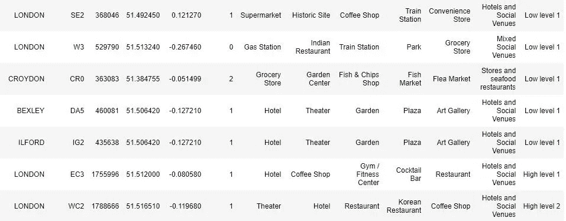

# 形象化

首先，我将集群可视化，您可以看到下面的集群图:

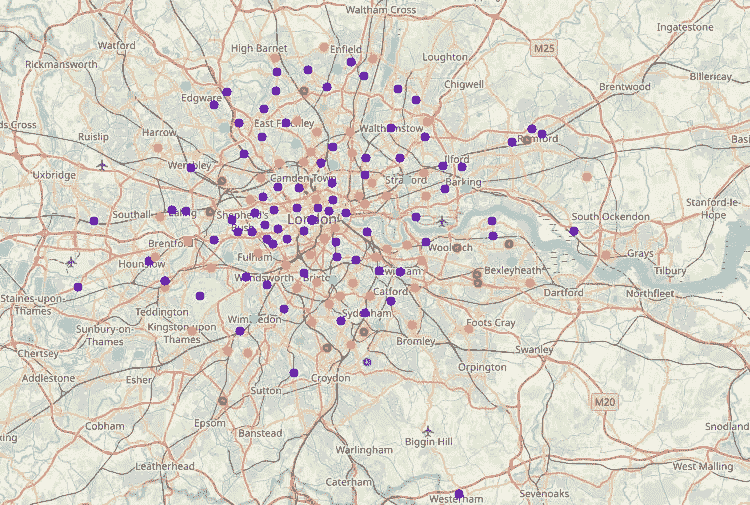

k-means clustering

1.  红色(聚类 0)
2.  紫色(第一组)
3.  蓝色(第 2 组)
4.  青色(第三组)
5.  绿色(第 4 组)
6.  橙色(第 5 组)

接下来，我通过使用叶绿图和顶部的聚类在地图上可视化平均房价。

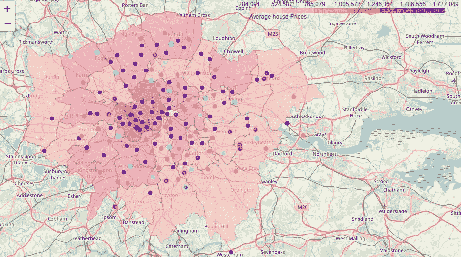

Average house pricing

# 结果

我得出的结论是，市中心以及附近酒店和社交场所的房价非常高，你可以在上面的地图中清楚地看到，而郊区和远离市中心的社区房价较低，但设施也很好。几乎所有的低价社区都靠近餐馆、酒吧、体育设施等。一些行政区如威斯敏斯特、肯辛顿和切尔西的房价非常高。贝克斯利、克罗伊登和萨顿区的房价非常低，但附近有很好的场馆可供参观。

# 结论

随着人们转向大城市创业或工作。由于这个原因，人们可以很容易地解释哪里生活设施齐全，价格便宜。

不仅对于投资者，城市管理者也可以通过使用类似的数据分析类型或平台来更有规律地管理城市。

# 参考

1.  [https://en.wikipedia.org/wiki/London](https://en.wikipedia.org/wiki/London)
2.  https://en.wikipedia.org/wiki/List_of_areas_of_London
3.  【https://propertydata.co.uk/cities/london 
4.  [https://developer.foursquare.com/](https://developer.foursquare.com/)
5.  [https://joshuaboyd 1 . carto . com/tables/London _ boroughs _ proper/public](https://joshuaboyd1.carto.com/tables/london_boroughs_proper/public)

这个项目的代码可以在我的 [github](https://github.com/mtk12/IBM-Data-science-capstone-project/blob/master/Capstone-Project.ipynb) 资源库中找到。谢谢大家！

由于这是我的第一篇关于媒体的文章，也是我的第一个完整的项目，可能会有一些错误。请随时评论我可能犯的任何错误，以便我可以纠正自己并学习。