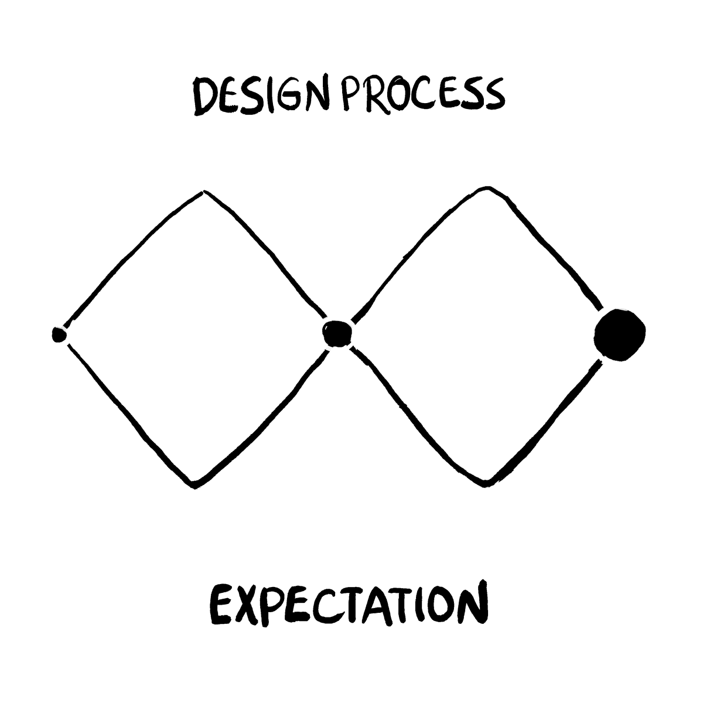

# 我的设计宣言

> 原文：<https://towardsdatascience.com/my-design-manifesto-9ad8f580ef6f?source=collection_archive---------10----------------------->

## 我希望在我的设计中遵循的一套雄心勃勃的原则

这是我在巴克内尔大学埃文·佩克的人机交互课上的反思。在这篇文章中，我将分享我的设计哲学，以及我希望如何解决未来的设计问题。我将从课堂上参加的四次设计冲刺中汲取经验。特别感谢 [Pablo Stanley](https://medium.com/u/7f968435c6b9?source=post_page-----9ad8f580ef6f--------------------------------) 设计的[漫画](https://thedesignteam.io)。

Photo by [Kelly Sikkema](https://unsplash.com/@kellysikkema?utm_source=medium&utm_medium=referral) on [Unsplash](https://unsplash.com?utm_source=medium&utm_medium=referral)

[设计冲刺](https://bucknell-hci-2019.github.io/)的范围从为移动设备重新设计 web 应用程序到创建诱人的可视化效果，从使用 Leap Motion 获得“乐趣”到使用[新兴技术](https://medium.com/googleplaydev/applying-human-centered-design-to-emerging-technologies-6ad7f39d8d30)建设更美好的未来。以下是我四个项目的一些结果。

[Clockwise] (1) [Redesign of the Campus Theatre app](https://medium.com/@gah020/designing-for-visitors-d02eda08c4b3) (2) [Street View Adventure in VR](https://medium.com/@snn003/design-for-the-future-google-street-view-adventure-in-vr-4009498bb68) (3) [Literacy Rate visualization](/visualizing-literacy-rate-disparity-19f375486965) (4) [Slither.io using Leap Motion](https://medium.com/@jeanleong98/design-for-fun-slither-io-fb78dbde3e4c)

在一个充满严格的技术课程的计算机科学课程中，这门关于人机交互的课程对我来说是一种解脱。差不多了。虽然听起来很老套，但我被鼓励以更开阔的思维来处理问题。在我们的项目中，我们采用了双钻石的设计思维过程。

> 在所有的创意过程中，在提炼和缩小到最佳创意(“聚合思维”)之前，会产生许多可能的创意(“发散思维”)，这可以用一个**菱形**来表示。但是双菱形表示这发生了两次——一次是确认问题定义，一次是创建解决方案。—英国设计委员会

实际上，这个过程要复杂得多。用户测试和反馈有许多阶段，每个阶段都可以显著改变项目的发展方向。有时候，你会推出一个有用的产品。在其他时候，一切都是一团糟。

User testing often changes how you approach the problem that you once set out of solve | Credit to [Pablo Stanley](https://thedesignteam.io/designer-first-world-problems-861e53c8ecf7)

# 设计原则

以下是我在这学期中学到的一些经验。

## —将用户放在首位

你不是在为自己设计，所以不要把你的偏好置于用户之上。通过努力理解你的用户，你在识别真正的问题上迈出了一大步。

> 设计师被训练去发现真正的问题。对错误问题的绝妙解决方案可能比根本没有解决方案更糟糕:解决正确的问题。—唐·诺曼，日常用品设计

承认你的用户可能无法清楚地表达他们的问题。正如 Andrew Ko 在[如何理解问题](http://faculty.washington.edu/ajko/books/design-methods/how-to-understand-problems.html)中建议的那样，进行访谈以了解问题。否则，带他们出去吃午饭，*观察*他们努力解决你希望改进的设计。[斯坦福大学设计学院](https://hci.stanford.edu/courses/cs447/docs/NeedFindingCribSheet.pdf)有一个关于观察用户时要记住的事情的指南。

## —在构思过程中不受限制

不要因为担心执行你的想法所必需的工具可能不存在而退缩。想象你拥有世界上所有的资源。鼓励团队内部的参与。

 [## 设计套件

### 设计工具包是 IDEO.org 的平台，学习以人为中心的设计，一种创造性的方法来解决世界上最…

www.designkit.org](http://www.designkit.org/methods/28) 

一旦最初的头脑风暴完成，促进评论和反馈。我不认为所有的想法都是“有用的”或者值得同等程度的考虑。你确实希望最终达成共识，但如果不(尊重地)挑战你认为需要更多思考的想法，就没有任何好处。

Credit to [Pablo Stanley](https://thedesignteam.io/the-brainstorm-session-4eb5fc03eab3)

如果你缺乏想法，环顾四周，看看已经建成了什么。奥斯汀·克莱恩恰如其分地说，“像艺术家一样偷窃。”

As newbies to Adobe XD, my *team* was looking for some carousel inspiration. We found a cool [Starbucks app redesign](https://www.xdguru.com/starbucks-cards-animation-xd/) and tailored it to our needs.

## —让自己熟悉技术

努力理解你的工具的局限性。毫无疑问，知道如何编码会增加团队的价值，然而，并非所有的设计师都需要学习编码。毕竟，他们“仅仅”需要能够估计一项工程任务可能需要的工作量。当然，众所周知，软件开发是不可预测的，这种技能只有在和工程师一起工作一段时间后才能获得。

根据我的经验，在 Leap Motion 和 VR sprints 期间，如果我们都花一些时间来解决技术的限制，我们就可以避免很多令人头疼的沟通问题。这也能让我们更好地相互理解。

## —雄心勃勃

用户重视你所付出的努力。如果你采用第一种解决方案*起作用*，你就剥夺了额外努力带来的快乐。然后你会想这个项目会是什么样的。

Exploring the untrodden paths lead to immense satisfaction and joy. | Credit to Matt R. Trower

在我的 Leap Motion 项目中，我亲身经历了这一点。尽管我们为许多游戏做了《绿野仙踪》测试，我们还是选择了 Slither.io，因为它看起来很容易实现。结果呢？我们没有成就感，如下所示，我们的用户大多反应是“哼”

当你探索无限的可能性时，正如我上面写的，你可以在你的团队中激发能量。在[的未来](https://bucknell-hci-2019.github.io/designs/vr_assn.html)冲刺设计中，我的两个队友为我们的“选择你自己的冒险”游戏想出了一个引人入胜的故事。虽然故事情节太长，无法在两周的冲刺中完全实现，但它让我们所有人都感到兴奋，甚至为实验提供了广度。

A part of the storyline for our [Street View Adventure](http://glossy-koala.glitch.me) Virtual Reality game. Having many options gave up plenty of room to modify the scenes of the adventure on the fly.

## —做让你开心的事

这是前一个原则的后续。在现实世界中，你并不总是能够选择你所从事的工作。但是如果你这样做了，首先贡献给这个项目中最能激励你的东西。*咄！*

有些人喜欢考虑大局，而有些人喜欢解决细节。就我个人而言，我喜欢添加设计术语中所说的*启示*。这是一个暗示如何使用界面元素的线索。

> 一个人如何知道一个界面有哪些启示？这就是意符的概念变得重要的地方。能指是启示存在的任何感官或认知指示器。—安德鲁·柯，用户界面理论

以下是我特别喜欢的两个符号。

*   对于识字率可视化，我使用了适合在地图上显示连续数据的[调色板](https://betterfigures.org/2015/06/23/picking-a-colour-scale-for-scientific-graphics/)。这取代了梯度标度，使观察者更容易区分识字率差异水平。如下图所示，大量的分割与渐变有着相同的问题，所以我们坚持只进行四次分割，并增加一次来表示不可用的数据。

Use a sequential color palette over a gradient scale when your users hope to be able to clearly separate any two levels in your data.

*   在 VR 游戏中，我在一个静态的主屏幕上制作了开始按钮的动画来吸引用户的注意力，让他们更容易进入游戏。

Only after user testing did we realize how much value these **signifiers** added.

## —保持简单

不要过于复杂。功能膨胀是真实存在的，当你忽视用户如何与新功能交互时，它就会发生。

> 如果你的用户不在乎黑暗模式，你的支持者就不能证明在你的设计中增加黑暗模式是正确的。

[Image Source](https://ritholtz.com/2016/05/10-cognitive-biases-that-affect-your-everyday-decisions/the-sunk-cost-fallacy/)

同样，不要成为沉没成本谬论的牺牲品。通常，在投入大量精力之后，继续追求一个潜在的解决方案是很有诱惑力的。然而，如果你知道一种简化现有设计的方法，可以考虑征求专家的意见，甚至是小规模的 [A/B 测试](https://vwo.com/ab-testing/)。

在我们的可视化项目中，我经历了惨痛的教训。我们花了这么多时间使用 [JQVMap](https://www.10bestdesign.com/jqvmap/) 创建一个动画世界地图，即使在得知 Tableau 可以在几分钟内达到类似的效果后，我们仍然坚持我们的原计划。这也是我们没有以正确的方式制作原型的结果。在他的书[勾画用户体验:获得正确的设计和正确的设计](https://www.goodreads.com/book/show/980280.Sketching_User_Experiences) **，**中，比尔·巴克斯顿建议早期的原型应该邀请建议，不应该包含个人偏见或依附。如果我们对变化持开放态度，我们可以节省时间，并利用它来创建一个更引人注目的可视化。

## —区分优先级

一旦你收到用户的反馈，不要根据你的团队做出某个改变(修复)所花费的时间来进行优先排序。在你的待办事项列表中，将最大化用户互动乐趣的任务放在首位。

> 可用性通常与美学分开处理。…由于易用性策略似乎没有带来回报，这让我们陷入了一个奇怪的境地:我们有一些产品，乍看起来很好，但一旦我们开始与它们交互，就会感到沮丧。我们认为重点应该从漂亮的外观转移到漂亮的交互，漂亮的外观是其中的一部分。—摘自[让我们做些有趣的事情](https://link.springer.com/chapter/10.1007/1-4020-2967-5_2)

如果一个改变只需要 10 分钟就能实现，那就想尽一切办法去做吧。如果有更长的时间，停下来分析一下哪些变化会最大程度地提升用户体验。为了指导你的分析，看看 UX 的法律。

 [## 主页| UX 法律

### UX 法则是设计师在构建用户界面时可以考虑的准则和原则的集合。它…

lawsofux.com](https://lawsofux.com/) 

我们优先考虑的一个例子是 VR 游戏中的音效。在用户测试之前，我们知道故事的两个场景之间的过渡可以更平滑。我们的测试人员同意并强调声音需要淡入或淡出来创造一种更加有机的感觉。VR web 框架 [A-Frame](https://aframe.io) 在声音组件上没有很好的文档，但我们坚持下来，并能够实现交叉渐变音频效果。

## —不要试图让每个人都开心🙁

识别你的主要用户是关键。认清取舍，如果需要的话，放过你的二级用户。

> 试图取悦每一个人会带来压力、痛苦、资源损失和挫败感。所以不要怕失去人，要怕失去眼光。—未知

在巴克内尔校园剧院网站的重新设计中，我们的目标是根据宾夕法尼亚州刘易斯堡游客的需求定制应用程序。由于时间有限，我们不得不在“待办事项”屏幕和应用内检票之间做出选择。我们最终选择了前者，因为我们一致认为了解正在进行的活动是游客体验的一个重要方面。

**Things to do** screen of the app. We decided to link the tickets button to the existing [Campus Theatre website](https://www.campustheatre.org/).

# 最后的想法

正如我前面提到的，这些原则是我在进入人机交互领域仅仅一个学期后学到的。我自称没有专业知识，但在这个课程之后，我很高兴我开始形成自己的关于好的设计需要什么的观点。

Credit to Pablo Stanley

设计思维很乱，当然也不直截了当。它涉及的不仅仅是漂亮的用户界面。清晰的愿景和关注产品的用户一样重要。它能让你*真正*理解手头的问题，并做出合理的妥协。一个好的设计不一定包含过度工程化的解决方案。然而，你需要遵循基本原则。获得关于你的低保真度原型的早期反馈，再加上好的(有时是无私的)优先级排序，可以为你的成功做好准备。

在这个课程中，我也学到了很多关于可访问性的知识，这是我以前没有接触过的领域。从不同的角度看问题令人耳目一新，我只希望我们在课堂上有更多的时间讨论这些问题。设计是一个快速发展的领域，所以像我这样的新人感到不知所措是合理的，也是很常见的。从糟糕的设计到好的设计需要努力，不管你选择如何定义它们，但是接受新的挑战会有很大的帮助。

如果你喜欢这个，请看看我的其他[媒体帖子](https://medium.com/@ymittal)和我的[个人博客](http://yashmittal.me/blog)。我一直在寻求提高我的写作水平，所以请在下面写下你的建议。

 [## 人机交互设计组合

### 亚什·米塔尔的个人网站。他是巴克内尔大学计算机科学专业的四年级学生。

yashmittal.me](https://yashmittal.me/hci-portfolio/)