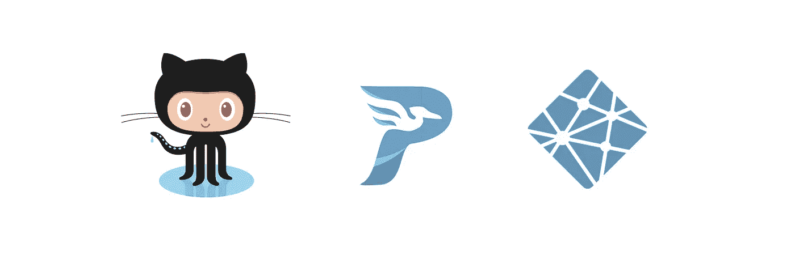
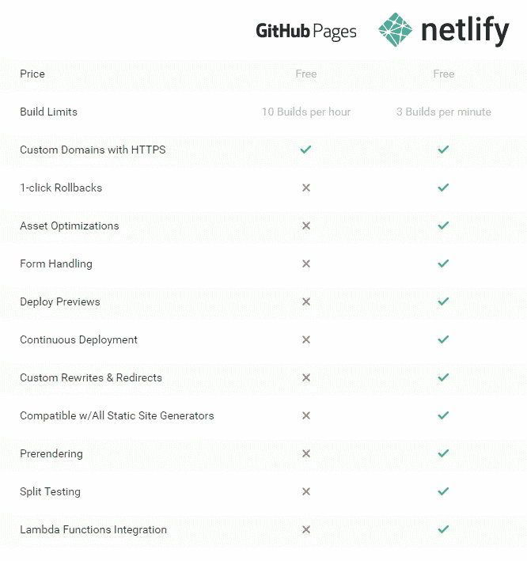
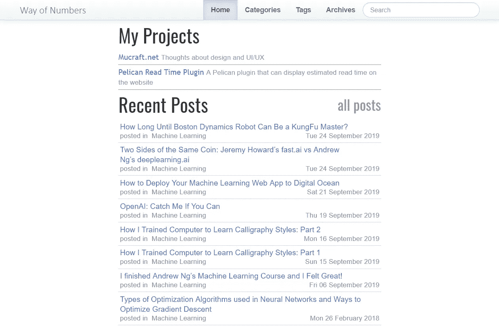

# 我如何将我的博客从 GitHub 页面迁移到 Netlify

> 原文：<https://towardsdatascience.com/my-experience-migrating-my-blog-from-github-pages-to-netlify-92ff6c85fb04?source=collection_archive---------16----------------------->

## 作为数据科学家写博客时需要考虑的事情



Migrating Pelican site from GitHub Pages to Netlify

# 动机

今天我遇到了[瑞秋·托马斯](https://medium.com/u/ee56d0bac1b7?source=post_page-----92ff6c85fb04--------------------------------)的关于“[T5”为什么你(是的，你)应该写博客](https://medium.com/@racheltho/why-you-yes-you-should-blog-7d2544ac1045) 的故事。她提出了一个很好的观点，所有的数据科学家都应该有自己的博客。她进一步解释说，写博客有助于你理清思路，传播知识，获得关注。所有伟大的观点，我全心全意地同意。所以我想分享我最近写博客的经历，并希望它能给我一些启示，告诉我做这件事需要什么，为什么值得。

# 和解

我有自己的博客已经有一段时间了。从我在 WordPress.com 的第一篇博客开始，我在多个平台上跌跌撞撞，试图为我的思想和感情找到一个好的归宿。大约一年前，我决定使用 [Pelican](https://blog.getpelican.com/) (一个基于 Python 的静态站点生成器)来生成我的内容，然后将其托管在 [GitHub 页面](https://pages.github.com/)上。这一切都很好。

Python 是一种易于编写但非常强大的编程语言。同样作为一名数据科学家，你很有可能每天都和 Python 生活在一起。所以在所有[静态站点生成器](https://www.staticgen.com/)中，我挑了鹈鹕，它相当成熟，定期维护。它还支持大量的主题和插件。(我甚至开发了一个 [Pelican 插件](https://github.com/getpelican/pelican-plugins/tree/master/readtime)，它可以像计算媒体一样计算文章阅读时间，并被拉入主分支。).它支持 Jupyter 笔记本电脑，这对于数据科学家来说也是一个优势。

GitHub Pages 是一个非常受欢迎的免费托管服务，由 [GitHub](http://github.com) 慷慨提供。它基于 Ruby 的 Jekyll 框架，但你不必使用它。这个解决方案是完全免费的，而且维护起来有些简单。一旦你设置好了一切，你只需要专注于把内容和运行一个简单的脚本推送到 GitHub，它会自动让它活起来。我用它写了一段时间的博客。一切似乎都很好。

(注:任何人想了解更多关于如何做到这一点，可以查看这篇详细的[博文](https://www.dataquest.io/blog/how-to-setup-a-data-science-blog/)。)

# 斗争

斗争开始了。不知何故，我不知道如何使搜索引擎优化工作。我在 GitHub 和我的博客网站上曝光了“master”分支，谷歌认为这是重复的内容，并给出了相当糟糕的排名。似乎很难获得任何流量。此外，作为 GitHub 提供的一项免费“辅助”服务，GitHub 页面上并没有太多的托管功能。正如 Netlify 在 [this page](https://www.netlify.com/github-pages-vs-netlify/) 中概述的那样，当你开始写博客时，这是可以的，但当你试图更严肃地对待你的工作时，GitHub Pages 就不会满足你。



Image Credit: Netlify.com

# 冲突

所以我决定迁移到 Netlify，它也是免费的，但提供了更多的功能，如果我想在未来扩大规模，那里有很多付费计划。

## 准备好鹈鹕

因为我已经在 GitHub 上准备好了我的 Pelican 站点，所以大部分工作已经完成。(如果你还没有设置鹈鹕站点，可以按照这个[教程](https://docs.getpelican.com/en/stable/quickstart.html)。)我仍然需要对站点进行一些更改，以便 Netlify 可以顺利地连接到我的 GitHub 帐户并拉动站点进行部署。

**依赖关系:**

首先，Netlify 需要设置必要的依赖项，这样它才能构建我的站点。这需要我在 site GitHub repo 下提供一个`requirements.txt`文件。为此，我为它创建了一个 Python 虚拟环境:

```
$ sudo apt update
$ sudo apt install virtualenv  # install virtualenv
$ cd ~/git/wayofnumbers.github.io/
$ virtualenv venv -p python3.6  # create a virtualenv for Python 3.6
$ source venv/bin/activate  # activate the virtual env
```

我还在你的`.gitignore`文件中添加了`venv/`，这样 GitHub 就不会同步它了。一旦虚拟 env 准备就绪，我只安装了必要的包，如下所示:

```
$ pip install -U --force-reinstall pip
$ pip install pelican Markdown typogrify ipython beautifulsoup4 nbconvert
```

现在，依赖项已经全部安装在我的本地虚拟环境中，我使用下面的命令来生成`requirements.txt`:

```
$ pip freeze > requirements.txt
```

**CNAME:**

我在回购的根文件夹下创建了一个 CNAME 文件，其中包含我的自定义域名(“wayofnumbers.com”)。我还在我的`pelicanconf.py`文件中添加了以下几行，以确保 CNAME 文件被复制到了`output`目录的根目录下:

```
STATIC_PATHS = ['../CNAME']
EXTRA_PATH_METADATA = {'../CNAME': {'path': 'CNAME'}}
```

**插件和主题:**

然后是处理插件和主题的时候了。我将我使用的插件和主题(文件夹)复制到 repo 中，并将`pelicanconf.py`文件设置为指向它们，因为在 Netlify 构建时它需要在 repo 中访问它们。

**Runtime.txt:**

Netlify 需要一个`runtime.txt`来决定使用哪个 Python 版本来构建站点。所以我在回购的根目录下创建了一个`runtime.txt`文件，并将`3.7` (Netlify 支持`3.7`或`3.5`)放入其中。

好了，现在鹈鹕已经准备好了，我可以继续设置网络生活了！

## 连接到网络生活

这部分其实挺容易的。我注册了 Netlify 的免费层，并按照[这个分步指南](https://www.netlify.com/blog/2016/09/29/a-step-by-step-guide-deploying-on-netlify/)连接我的 GitHub repo。唯一不同的是在'**步骤 4:配置您的设置'**。因为我使用的是 Pelican，所以我使用的“构建命令”是:

```
pelican content -s publishconf.py
```

由于依赖问题，在一些失败的构建之后，我让一切都工作了。Netlify 自动拉了我的 GitHub repo，安装了依赖项，构建了站点。我用谷歌域名申请了一个自定义域名，并按照这个链接设置:[https://www.netlify.com/docs/custom-domains/#googledomains](https://www.netlify.com/docs/custom-domains/#googledomains)。一年 12 美元，完全值得。

我也打开了 SSL，遵循这个指南。

所以现在我的网站在它的新家开始运行了:



My blog with ‘Elegant’ theme

# 思想

整个迁移过程花了我一天时间。我从中学到了很多新东西。这很有挑战性，但完全可行。我鼓励任何对认真对待你的博客感兴趣的人尝试一下。挺整齐的。有人说数据科学家应该专注于他们的研究和学习，我倾向于不时地走神。在这里学习一些 web 编程技巧，在那里获得一些 DevOps 经验。我发现这种“离题”实际上有点放松，刺激了我大脑的另一部分。这是一种休息和放松的方式。我想玩一个黑客游戏，一路解决问题。了解部署将有助于您更容易、更快速地[将您的模型投入生产](/two-sides-of-the-same-coin-fast-ai-vs-deeplearning-ai-b67e9ec32133)。拥有一个博客就像拥有了另一个与你的同事和志同道合的人交流的场所。不会错的，对吧？

欢迎任何反馈或建设性的批评。你可以在推特 [@ lymenlee](https://twitter.com/lymenlee) 或者我的博客网站【wayofnumbers.com[上找到我。](https://wayofnumbers.com)