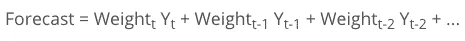
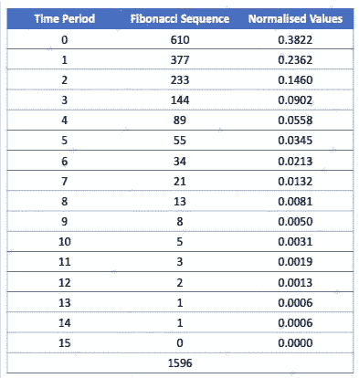
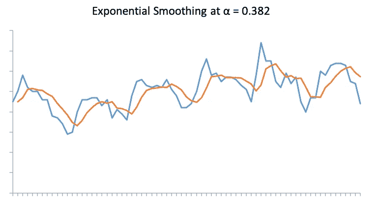
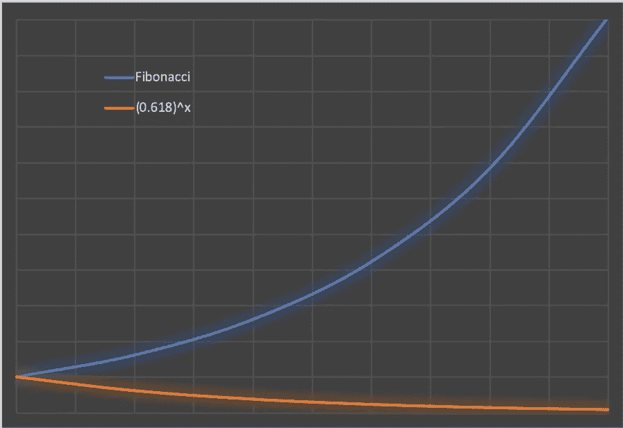

# 我用“自然”数据做的实验！

> 原文：<https://towardsdatascience.com/my-experiments-with-natural-data-45eac01ef34f?source=collection_archive---------17----------------------->

我一直对斐波那契数列很着迷！这个序列在宇宙/自然界中比其他任何序列都多，这个事实几个世纪以来一直吸引着科学家。例子包括像树的分枝、茎上叶子的分布、松果的排列、菠萝的幼果和蜜蜂的家谱、星系的螺旋模式、山脉结构等(阅读“更多有待发现的东西”)。黄金比例(phi)的应用，来源于包括艺术，音乐，设计，统计在内的序列。

Kazimir Malevich — Suprematist Composition (1916), mimics Golden Ratio

所以我开始“研究”斐波那契(原名莱昂纳多·皮萨诺)&他是如何偶然发现这个数列的。

事实证明，这个序列早在公元前 2 世纪就被印度数学家阿查里亚·平加拉(平加拉教授)通过他的 Matra-Meru(我们现在知道的帕斯卡三角形)工作而知晓，但是是莱昂纳多·皮萨诺(斐波那契)在他周游地中海世界后把它带到了西方。达芬奇是一个出生于 12 世纪的意大利人。他游历了西方世界，主要通过他在 1202 年的著作《计算之书》来推广印度-阿拉伯数字系统。但是现在，他是如何发现这个序列的。嗯，他试图解决一个涉及兔子数量增长的问题(是的，我猜他是他那个时代的尤塞恩·博尔特，没关系)。兔子的“一代又一代”产生的顺序(我知道，听起来很多，但兔子的妊娠期大约是一个月，所以假设一只兔子一年可以生 12 次，不开玩笑，它们很快)是这样的:

> 0, 1, 1, 2, 3, 5, 8, 13, 21, 34, 55, 89, 144, 233, 377 ..

这就是我们今天所知道的斐波那契数列。后来人们发现，在自然界中这种序列经常出现，这一事实让科学家们挠头了几个世纪。顺便说一下，**斐波那契**(意为“波纳契之子”)这个名字是由一位法意历史学家在 1838 年创造的。

嗯，就是这样。所以在多年挠头之后，我已经养成了在任何地方使用这个序列的诀窍(是的，我内心的审问者会间歇性地醒来)。

现在，回到题目(实验)。所以昨晚我浏览了时间序列预测模型&偶然发现了一个奇怪的巧合，如果真是这样的话！？！当我开始阅读指数平滑模型时&当观察数据变老时，权重值如何指数下降。以下等式解释了预测方法:

*t =时间段数(t = 0 为最近的时间段，t = 1 为之前的时间段)*

*Y(t) =周期 t 内的实际值*

*重量(t) = α(1-α)^t*

*n =时间段总数*

这里，alpha (α)的值在 0 和 1 之间变化，使得所有权重的总和接近 1。

前面提到的我内心的质疑者想，为什么不取斐波那契数列中的数字，用重量来代替它们。所以我就这么做了&取序列中的前 15 个数字(不包括 0)，并对它们进行归一化。

现在，我在斐波纳契数列中的权重是:

> 0.382, 0.236, 0.146, 0.09, 0.0558, 0.0345, 0.0213, 0.013, 0.0081, 0.005 ..

根据这些标准化值，t=0 时的第一个权重为 0.3822。现在，我用上述指数平滑权重等式中的第一个权重替换该值，以便在 t=0 时α = 0.3822。现在让我们在指数平滑的权重等式中替换这个α值:

在 t = 0 时，w(0)= 0.3822 *(1–0.3822)⁰= 0.382

当 t = 1 时，W(1)= 0.3822 *(1–0.3822)= 0.236

在 t = 2 时，W(2)= 0.3822 *(1–0.3822)= 0.1458

在 t = 3 时，W(3)= 0.3822 *(1–0.3822)= 0.0901

在 t = 4 时，w(4)= 0.3822 *(1–0.3822)⁴= 0.055

在 t = 5 时，w(5)= 0.3822 *(1–0.3822)⁵= 0.0344)

明白我的意思了吗？是的，权重与斐波纳契数列的标准化版本完全相同，这意味着在特定的α值下，指数平滑权重模拟了自然！？！取序列中前 50 个数后的α值为:

# α = 0.3819966011

这是一个 alpha 值为 0.38199 的预测指数平滑模型示例

# **精神食粮..**

*   现在，我只是想知道这可能只是一个巧合，或者这可能是第一个提出这个模型的人罗伯特·古德尔·布朗先生设计的？
*   有了这个 alpha，我们能得到最好的预测模型吗？不，不是所有的时间。
*   这个方程(近似的)可以进一步应用于时间或后续层的模式吗？

~ 0.38199 * [(0.618)^t ]

现在，在 0 和 1 之间，这些是满足以下等式的值的唯一组合(0.38199 和 0.618):

α = (1-α)它变成α -3α+1=0(这个二次方程的另一个根是 2.618)还有，α -3α+1=0 是α -α-1=0(黄金比例方程)在 y=1 处的镜像！！

所以，上面的等式可以写成

~ (0.618) * (0.618)^t

~ (0.618)^(t+2)

现在我们还知道，0.618 的乘法倒数是 1.618，这是黄金分割比率，因此现在该等式可以归结为:

~ (1/φ)^(t+2)

*   这种模式可能是微观世界的斐波那契模式的另一个自我吗？

> 1, 0.6180, 0.3819, 0.236, 0.145, 0.09, 0.055, 0.0344, 0.0213, 0.0131 ..

*   神经网络会不会以某种方式模仿这种模式，因为它们是由我们自己的神经系统“启发”的？