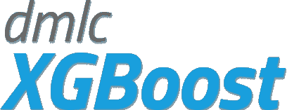
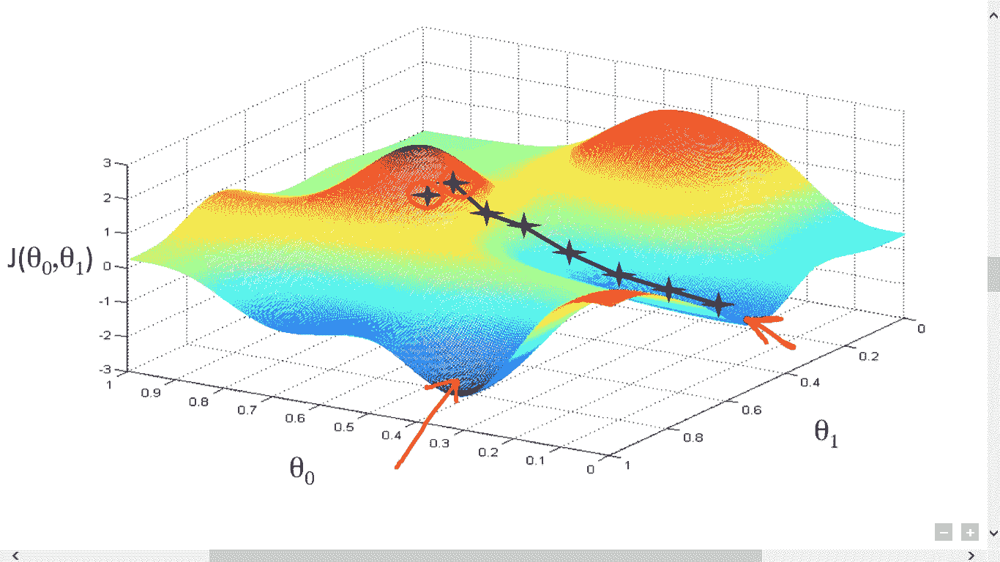

# 我最喜欢的机器学习模型是科学家应该知道的所有数据

> 原文：<https://towardsdatascience.com/my-favorite-machine-learning-models-all-data-scientists-should-know-2ab94b4db62d?source=collection_archive---------12----------------------->


W 随着大量的机器学习模型每天都在增长，将你的技能集中并磨练成正确的模型和算法可能会非常困难。无论你的目标是连续的，明确的，还是其他的，从模型的湖中找出一条鱼是非常困难的。

虽然有数百万种可供选择，但肯定有一些是我所珍爱的，主观上我真的很喜欢的。虽然我绝对不会有偏见(数据科学笑话)，但我承认，不给这些神奇的模型优惠待遇真的很难！

# 多项式朴素贝叶斯


```
from sklearn.naive_bayes import MultinomialNB
```

多项式朴素贝叶斯(MultinomialNB)模型是用于分类规范的目标的奇妙模型。MultinomialNB 因其在谷歌、微软和雅虎等公司的大数据管道中的应用而闻名。以我的经验来看，这个模型是可以用于带有标记化文本的布尔值的最好的模型之一，这使得 MultinomialNB 的任何涉及 NLP 分类的东西都很出名。无论你是在猜测谁最有可能说出一句名言，还是在确定文本是否是垃圾邮件，MultinomialNB 绝对是数据科学家研究[烧瓶 HTTP 管道](/constructing-http-data-pipelines-with-flask-27fba04fbeed)和对用户文本查询进行排序的算法的基本模型。

# `Regression Tree`


```
from sklearn.tree import DecisionTreeRegressor
```

回归树是决策树和线性回归的产物。回归树通常使用相关系数来确定要拟合的充分模型，以提高准确性。该模型非常适合具有陡峭曲线和高方差的连续数据。回归树类似于保序回归，主要区别是使用相关系数而不是保序权重。

# 回归器/分类器

```
from xgboost import XGBRegressor
from xgboost import XGBClassifier
```



XGBoost 梯度是非常好的模型，因为它们可以提高传统统计或条件模型的准确性，并且可以很好地应用于两种主要类型的目标。当您需要对您的标准模型进行最终的精度提升时，XGBoost 可能是一个有用的工具。虽然不总是非常有效，但是在大多数情况下，将模型切换到 XGBoost 可以节省 10%到 15%的准确性。

# 随机森林分类器

```
from sklearn.ensemble import RandomForestClassifier
```


随机森林分类器绝对是我最喜欢使用的算法之一。随机森林模型本质上是一棵决策树(因此得名。)随机森林分类器有着非常有趣和丰富的历史，最初是由统计学家田金浩发现的。早期版本的随机森林分类器使用随机子空间算法。

这个新模型非常有趣，并且在某种程度上改变了游戏规则，因为它通常将随机辨别的思想引入机器学习世界。在随机森林模型之前，所有的分类算法都是基于相关性、贝叶斯或基于偶然的概率分布，例如二项式分布。


# 最近邻居

```
from sklearn.neighbors import KNeighborsClassifier
from sklearn.neighbors import KNeighborsRegressor
```

KNearest Neighbor 是一种机器学习算法，用于选择具有最相似特征的最近目标。像 XGBoost 一样，它也是一个分类器或回归器。


k 最近邻因其在搜索和提示功能中的使用而众所周知。特征可以包括属性和类别，例如关于在介质上接下来读什么的建议。不用说，这是为最终用户构建任何 web 工具的绝对必要的工具。从音乐提示器到 Youtube 的自动播放功能，K Nearest neighborhood 无疑在互联网的数据景观上留下了自己的印记。

# 梯度下降



梯度下降是一个广泛的和极其通用的模型。这是几乎所有神经网络的幕后工作模型。有一些贝叶斯模型不一定被认为是梯度下降，但大多数情况下，它们仍然植根于梯度下降。对于人工智能的现在和未来，梯度下降很有可能成为最重要的模型。梯度下降可以做任何事情，从简单的前馈网络一直到深度递归神经网络，甚至更远。

任何时候你看到机器学习被用来处理图像，梯度下降肯定是罪魁祸首。不用说，我们都应该知道梯度下降；不仅超级爽，还超级好玩！

# 结论

这些是我主观上最喜欢的模型，也是我发现自己最常求助的模型。每个工作都有一个工具，就像每个工作都有一个模型，就像每个工作都有自己的特性一样。随着时间的推移，美妙的

> 数据科学超级大国

那就是知道实现哪种模型的最佳方式。一个很好的理解可以来自多种来源，但是作为一个终生学习者，永远不要期望对一个或另一个模型感到太舒服。在某些情况下，我对此有点内疚，因为回到您所知道的东西可能会令人感到安慰，但深入堆栈溢出的黑暗深处可能是您可以获得的关于数据科学的最好教育。在许多其他事情中，机器学习模型的强大知识将很快出现。当你在第一轮测试中获得 92%的准确率时，你肯定会知道你做对了！

我喜欢数据科学可以用一滴信息颠覆你的整个意识形态。某一天你可能正在用梯度下降模型创作绘画，下一件事你知道你正在维基百科上阅读一些晦涩的回归算法。数据科学一直在变化，模型也在变化，所以您喜欢的模型一定会迁移！