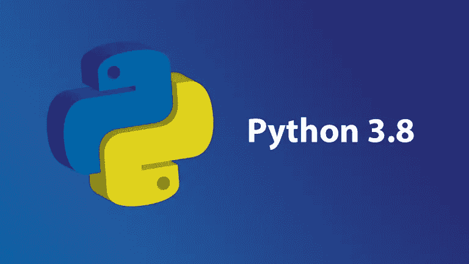

# Python 3.8 中我最喜欢的新特性

> 原文：<https://towardsdatascience.com/my-favorite-new-features-in-python-3-8-a95d7a0a31c9?source=collection_archive---------8----------------------->



Python 3.8 在几周前发布，我没有急于谈论新特性，而是决定熟悉它们并加以利用，我想指出的是，我绝对会使用 Python 3 中实现的一些关键特性。不管这些新特性是否会被使用取决于程序员，但是我认为熟悉这些新特性是很重要的，这样我们就可以阅读 Python 之后的文章。

# 海象操作数


我们将以我最喜欢的新功能开始，

> 海象操作数

为什么这么叫？因为操作数看起来像一头侧翻的海象。这不仅是在 while 循环中使用的好工具，就像 Python 文档中的例子一样:

```
while (line := file.readline()) != "end":
    print(chunk)
```


然而，对我来说更重要的是，Walrus 操作数具有在一行中返回和设置的优势，换句话说，我们可以在统计函数的末尾保存一个返回，例如，在最后一次计算时，只需使用 Walrus 操作数。

```
x  = 5
y = 5
b := y+b
```

# 仅位置参数

不那么花哨，但这也是一个很大的变化，不会影响函数参数的经典性质。要创建一个位置参数，我们只需要在定义函数时在参数的末尾添加一个斜杠。

```
def func(x,y,f=5,/):
```

现在我们可以使用 f 等于σx+σy 的函数，如下所示:

```
result = func(x,y,ournum = sum(x) + sum(y))
```

而在以前，我们必须添加更多的结构来实现这一点。

```
ournum = sum(x) + sum(y)
result = func(x,y,ournum)
```

# 多重处理共享存储器

共享内存归结为在整个 Python 中全局共享数据，而不是手动提取和传输数据，或者将其保存到文件中以供访问，现在可以使用多处理模型在 Python 内部跨位置全局访问数据，这将我们带入下一个添加内容，

# 新的酸洗协议


pickle 是一个压缩和序列化数据和代码以在其他地方使用的出色工具，随着 Pickle 模块 Python 的新增加，您可以 Pickle 的序列化效率更高，通用性更强，这对于数据科学领域的我们来说非常令人兴奋，对于那些在 Flask 和 Django 中工作并且 VPS web 服务器上剩余空间有限的人来说，这绝对是一项值得贡献的事业。

# CPython —改进了！

最后但同样重要的是，Python 吹嘘他们已经改进了 Python 的基于 C 引擎的后端，这是另一个我认为肯定需要注意的特性。作为一名数据科学家，我经常发现自己在处理数据时碰到了 Python 的极限，这很不幸，但确实存在。当仅仅读入数据就使 Jupyter 内核崩溃，并且您正准备尝试为所述数据安装一个管道时，这可能是很可怕的。

好消息是，情况正在好转，并且有望在未来继续好转。当然，我们指的是 C API 中的 Python，而不是 Python 中的 Python，或者只是普通的 Python。当处理绝对庞大的数据集时，在没有配置上述 API 的情况下运行 Python 常常是一场噩梦。

对我们来说更幸运的是，CPython 还做了一些工作来改进其 API 的配置，这是令人兴奋的，因为这将使优化更容易，并且很可能允许新用户使用 Python 中的 C 引擎。

我真的希望 Python 在未来几年继续关注稳定性、速度和效率。这些改进虽然看起来很小，但肯定是一个大胆的方向，并且执行得很好，尤其是我一直很喜欢的东西。这些是我最喜欢的功能，但还增加了一些功能，包括:

*   性能改进(针对原始 Python 本身)
*   可逆词典
*   打字模块返工
*   f 字符串调试支持

这些都是 Python 世界中受欢迎的进步，特别是对于那些处理大型数据集和修改内存限制的人来说。