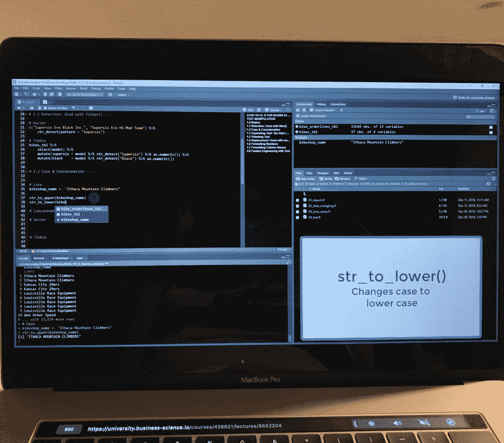

# 我最喜欢的 R 编程课程——数据感动我

> 原文：<https://towardsdatascience.com/my-favorite-r-programming-course-data-moves-me-27055c68aac?source=collection_archive---------18----------------------->

*注意:本文包括附属链接。意思是对你没有成本(实际上，你得到了折扣，得分！)如果你购买课程，我会收到一点佣金。*

我从 2004 年就开始使用 R，远在 Tidyverse 推出之前。我知道完全掌握最新的软件包和功能会让我受益匪浅，所以我最终决定冒险全面更新我的技能。我想要一门涵盖 R 中每个角落的课程。我个人学习 R 的经验是粘贴教程和阅读文档，因为我需要一些东西。我想了解一些现在可能不需要，但将来可能会用到的功能。我想要一切。

我早就知道 Tidyverse 是对使用 base R 功能操作数据的巨大改进。然而，我也知道我以前的学校技能完成了这项工作。我现在明白了。有更好的方法。做出这一举动并不是非常痛苦(尤其是因为我熟悉编程)，商业科学的[“R 商业分析”](https://university.business-science.io/p/ds4b-101-r-business-analysis-r/?coupon=ds4b15&affcode=173166_39urheo0)课程**将在 4 周内带你从 0 到相当危险。**

对于没有 R 经验的人来说，他们不想为了达到一个“严肃 R 用户”的水平而多年碰壁。我强烈推荐这门[商业科学的“带 R 的商业分析”](https://university.business-science.io/p/ds4b-101-r-business-analysis-r/?coupon=ds4b15&affcode=173166_39urheo0)课程。不要让这个名字欺骗了你，这个课程花了 5 个小时使用 parsnip 包来学习机器技术。更重要的是，如何将这些结果传达给利益相关者。

该课程全面、清晰、简洁。

# 课程覆盖范围

## 常规:

本课程将带您从头开始:

*   安装 R
*   设置您的工作环境
*   然后直接进入使用事务数据的相关业务分析

这门课程“牵着你的手”踏上了在 r 中变得自给自足的旅程。我不可能在这篇文章中列出这门课程涵盖的所有内容，那将毫无意义。然而，对我来说改变最大的是:

*   使用 stringr 的正则表达式
*   使用 lubridate 处理日期时间
*   格式化您的可视化

我想要的所有材料都在这里。所有的一切。

## 建模和创建可交付成果:

同样，不要让课程的名称欺骗了你。这门课程非常注重机器学习。花 5 个小时在欧洲防风图书馆(这是 R 的 scikit learn)。

课程包括:

然后教你如何在 R-markdown 中创建可交付物，在 Shiny 中创建交互式图形。一切都在商业背景下，并始终强调你将如何“与业务沟通”。我再怎么强调课程的布置有多细致，涵盖的材料有多少都不为过。这门课程确实很特别。

这些年来，当你在课堂上时，有多少辅导或培训让你觉得一切都很“好”?然后你试着采用这些技能，并把它们应用到个人项目中，在你成功所需的东西上有巨大的缺口。我有很多用头撞墙试图让事情和 r 一起工作的经验。

## 你会喜欢的东西:

*   重复键盘快捷键，这样我就能真正记住它们。
*   立即使用事务性数据进行分析。你不仅仅是在学习 R，你还在学习应用程序以及为什么这些函数是相关的。
*   参考流行的 R 备忘单和文档。你将会明白如何阅读文档和 R cheat sheets——老实说，成为一个优秀的程序员很大一部分是有效的 Google 技能。学习阅读文档相当于班门弄斧。
*   马特有一副好嗓子。好了，我说了。如果你要听几个小时的东西，我觉得这一点很有必要。

## 对于初学者:

*   说明从一开始就开始了，而且说明很清楚。
*   讲座要遵循的代码组织得非常好。商业科学显然以结构为傲。
*   没有必要再去上一门基础课程，在那里你会重复学习一大堆你以前学过的东西。这门课涵盖了你需要的一切。它。是。全面。
*   电子商务/交易数据是一个非常常见的用例。如果您不熟悉事务性数据的工作方式，或者您从未连接过多个表，这对于有抱负的数据科学家来说是一个极好的机会/绝佳的用例。
*   如果您有任何问题，可直接联系 Matt(课程创建者)的松弛渠道。我个人没有使用这个功能，但是作为一个新手，直接访问 Matt 是一个巨大的价值。

老实说，我很嫉妒自己第一次没能学会这种方法，但 Tidyverse 在当时甚至还不存在。这就是生活。

本课程以一个 k-means 示例结束，其中包含一个已经在 R-markdown 中构建的、利益相关方准备好的可交付成果。这门课程实际上是数据科学的非神秘化。

## 总而言之:

也许我太书呆子了。但是看到一个如此好的课程，提供如此多的价值，对我来说是值得投资的。通过学习这门课程，你将会实现令人难以置信的转变。如果在我刚开始学习 R 的时候，这是可行的，我会省去很多挫折。matt Dancho(Business Science 的所有者)好心地给了我一个链接，这样你就可以在课程中享受 15%的折扣。[链接](https://university.business-science.io/p/ds4b-101-r-business-analysis-r/?coupon=ds4b15&affcode=173166_39urheo0)

如果您购买套餐，15%的折扣甚至更划算，但老实说，我还没有选第二道菜。我一定会的！之后我一定会写一篇评论让你知道我的想法。这里是捆绑包的链接:[链接](https://university.business-science.io/p/data-science-for-business-ds4b-101-201-r-bundle/?coupon_code=DS4B15&affcode=173166_39urheo0)

如果你想成为数据科学的摇滚明星，Matt 将推出一个全新的课程，你可以购买 3 门课程的套餐。新课程是“商业预测网络应用与 R Shiny”:[链接](https://university.business-science.io/p/machine-learning-web-apps-level-1-bundle-r-track-courses-101-102-201/?coupon_code=DS4B15&affcode=173166_39urheo0)

如果你参加了这个课程，请告诉我你是否和我一样觉得它很棒。你可以在评论里留下感言或者在 LinkedIn 上联系我。我很想听听你的经历！

*原载于 2019 年 6 月 8 日*[*https://datamovesme.com*](https://datamovesme.com/2019/06/08/my-favorite-r-programming-course/)*。*