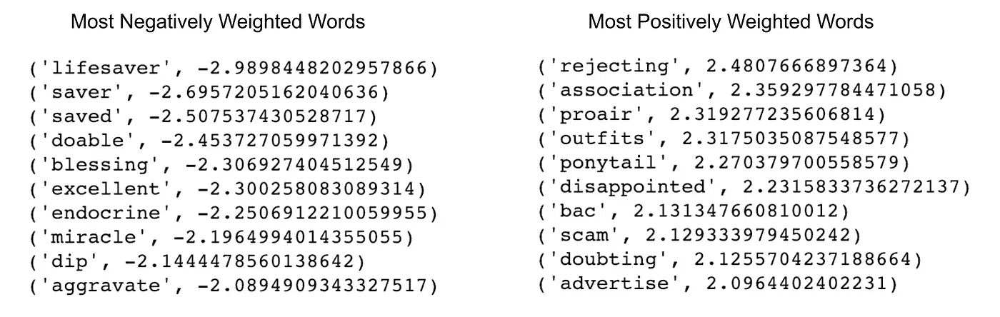
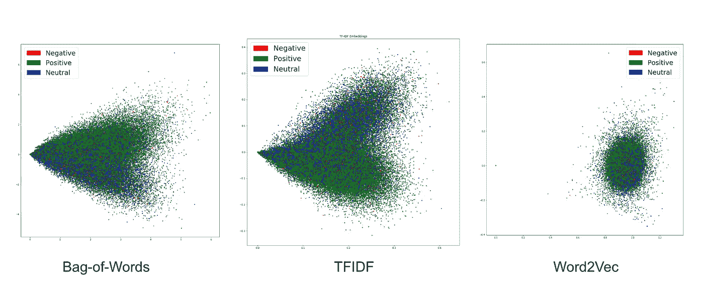
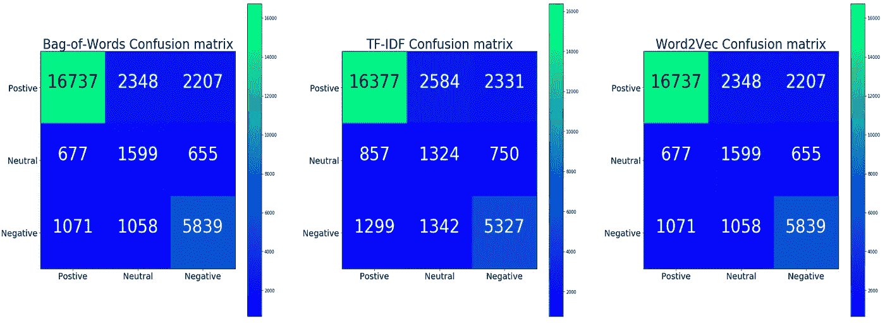
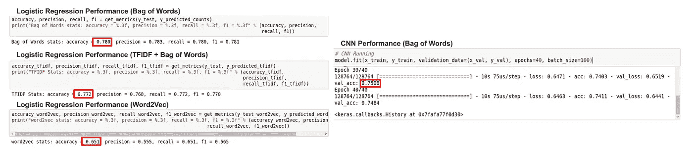
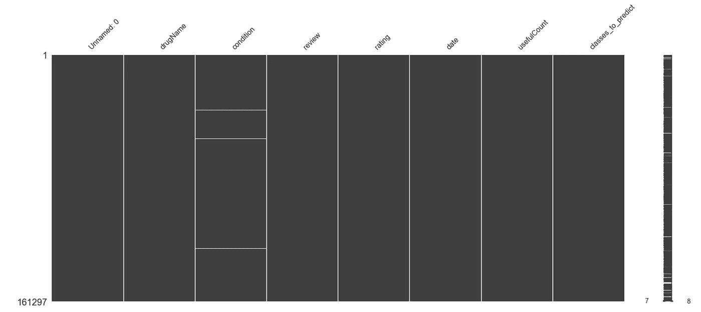
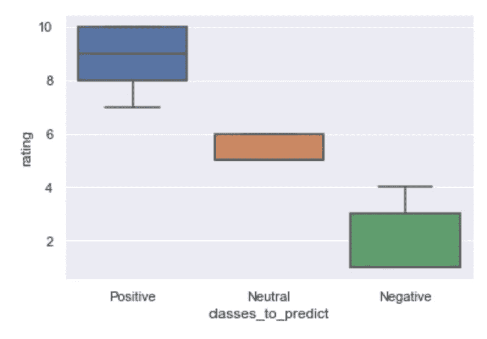
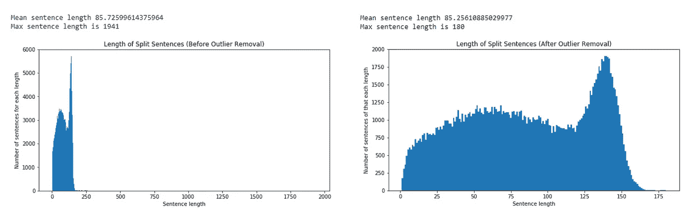
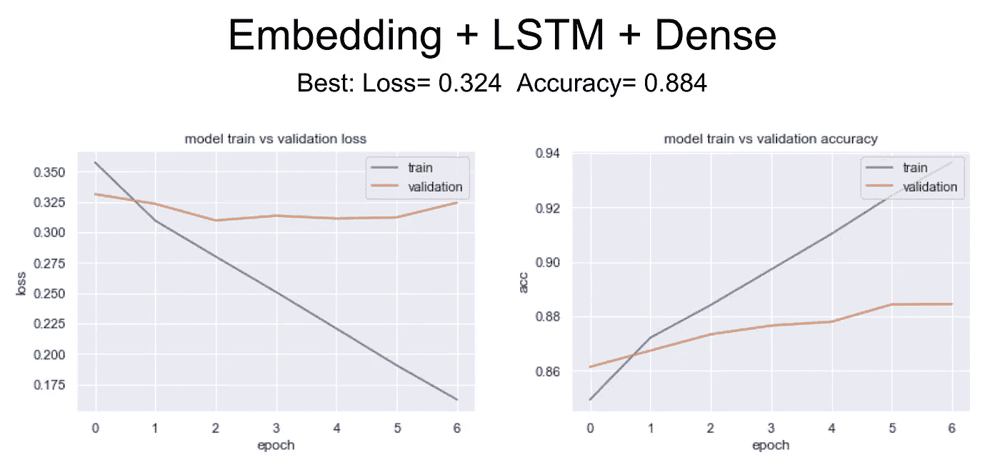
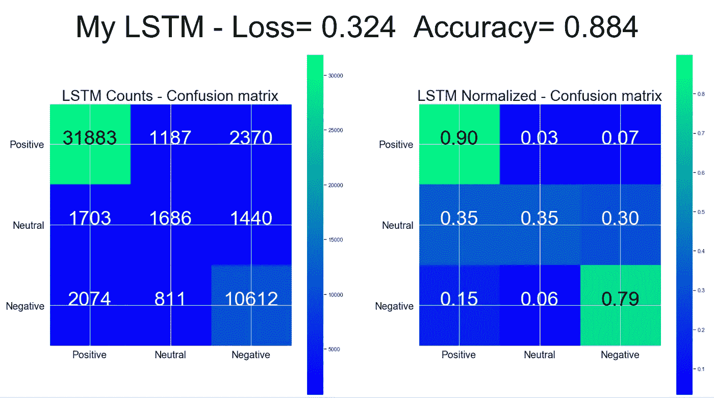

# 我在 NLP 的第一次冒险

> 原文：<https://towardsdatascience.com/my-first-adventures-in-nlp-631faa6aadd4?source=collection_archive---------18----------------------->

## 探索情感分析作为“黑箱”的旅程，并打破它找到见解。

2018 年 11 月 15 日，我开始着手创建一个药品评论情感分析模型。

和大多数想法一样，它开始于**的问题。**

在过去的 24 个月里，我妻子一直在重度抑郁中挣扎。治疗方案把她从一个药物试验(和失败)带到了下一个。每个药物试验需要 8 到 16 周的时间，这取决于滴定、随访预约和逐渐减少。在整个过程中，她经历了所有的副作用。恶心、疲劳、困倦和严重焦虑等等。一些药物对抑郁症有一点帮助。其他人让情况明显变得更糟。糟糕透顶。

在那些时刻，我感到无力去帮助我爱的人。我唯一能做的就是联系医生并留下信息或便条。通常当我从医生那里得到消息时，副作用已经改变了。

我不会因为医生的反应水平而责怪他。考虑到他们在实践中帮助的人数，他们尽可能地进行沟通。但是我经常会想到“为什么还要给他们打电话或发电子邮件呢？他们不可能很快就收到这条消息，并采取任何措施。”

通常我们会等到复诊时才向医生报告。但是当你在现场时，很难记起每天或每周尝试一种新药有多困难。尤其是在使用一种新药 8 周后。这造成了缓慢、不一致和劳动密集型的药物体验反馈循环。

医患沟通中的这些障碍和瓶颈减缓了治疗过程。**如果医生能够立即找到正确的药物，那么患者的治疗效果就会得到改善。**正确的药物搭配意味着更少的随访，这有助于降低患者护理的成本。真实成本&问题*人命*附后。

那么，如果我能创建一个系统，让医疗服务提供者更快地识别有效/无效的药物，会怎么样呢？

# 一种思路:用药体验反馈分析

量化的评论产生干净简单的数据。可以可视化、分析、监控和比较的数据。

通过收集每日患者药物反馈并进行情绪分析，可以:

*   检查患者在试验期间对药物的体验，以跟踪药物需要多长时间开始发挥作用。(或者它到底有没有用)
*   确定患者何时挣扎，并通知医生提供支持。
*   随着时间的推移，对各种患者类型的药物进行评估，以监测非临床表现。
*   在随访期间，为医生提供患者持续体验的图表视图。

但是这个系统的成功取决于一个关键因素。一个可以持续准确预测患者对药品审评情绪的模型。

所以这就是我着手去做的，看看我能不能造出来。

# 走向未知

A bit like wandering down an unfamiliar road.

走进这个项目，除了概念上它能做什么，我对 NLP 和情感分析知之甚少。但是我需要一些高质量的数据来开始。

互联网提供了一些惊人的数据。Felix Gr er&Surya Kallumadi 提供的来自 UCI 机器学习存储库的“[药物评论(Drugs.com)数据集](https://archive.ics.uci.edu/ml/datasets/Drug+Review+Dataset+%28Drugs.com%29)”。

> “该数据集提供了患者对特定药物以及相关病情的评论，以及反映患者总体满意度的 10 星患者评级。这些数据是通过抓取在线药物评论网站获得的。(Drugs.com)"

一个优秀的数据集，包含文本评论，评级，以及条件和药物的类别字段。

我从导入和探索数据集开始。一旦对掌握了数据的结构感到满意，我就开始寻找情感分析的指导。

# 尝试 1——瞎猜

我搜索、阅读了许多资料，并选择了一个简单的入门教程来开始我的 NLP 之旅。我对 NLP 的第一次尝试是从 [*“用 Python 进行情感分析”*](/sentiment-analysis-with-python-part-1-5ce197074184) 教程中提取一段代码，并将其应用于我的数据集。([请点击此处查看我的笔记本](https://github.com/BrittonWinterrose/Drug_Review_NLP/blob/master/01_Drug_Review_Dataset_Exploration.ipynb))我很快认识到，即使是编写得最好的代码也很难适应新的数据集。为清理数据提供的正则表达式是不够的，所以我编写并测试了自己的正则表达式。

在对评论文本进行标准化和矢量化之后，我将评论评级从 11 个类别分成了 3 个类别。“积极”、“消极”和“中立”。然后，我使用 scikit-learn 的逻辑回归训练了一个模型，并检查了模型性能的准确性。

经过少量调整后，该模型的最终准确率为 81.95%。在这一点上，我不确定如何衡量这个模型的性能，也不确定准确性本身是否是一个有效的指标。

但是当我检查前 10 个和后 10 个特征(单词)的权重时，我意识到有一些我无法解释的差异。

Hmm. These negative weighted words seem pretty positive…

我不是那种会放弃的人。因此，我需要学习更多的东西，并寻找更深入的教程。

# 尝试 2——解构黑盒

在向我的一个朋友提问后，他推荐了一篇来自 Insight AI 的 Emmanuel Ameisen 的文章。以那篇文章为指导，以 [Leonardo Apolonio 的“如何解决 NLP”代码](https://github.com/BrittonWinterrose/how-to-solve-NLP)为框架，我带着新检查的数据集开始了我的 NLP 之旅。([我的笔记本在这里。](https://github.com/BrittonWinterrose/Drug_Review_NLP/blob/master/02_Drug_Data_NLP_Analysis1.ipynb))

我首先回顾了使用数据集发表的原始论文。我已经包含了关于该研究中使用的数据收集、预处理、标记化和建模方法的注释。

在我完成教程的过程中，我遵循了一个简单的过程:每当有我不理解的 ML 词汇时，就“停下来学习”。我学习了数据准备中的嵌入、Word2Vec、单词包、语料库、标记化、规范化、非 ASCII 字符、词干、词汇化和矢量化。这个过程很耗时，但很有效。

## 我的想法是:让黑盒工作，然后拆开黑盒

我对这些教程的目标很简单:让它工作，然后获得理解。这个过程对于像我这样可以被描述为“机械倾向”的人来说很有效。它允许我们首先建立对整个系统结构的理解，然后深入了解每个部分的知识。我发现这种方法有助于我记住我所学的东西。我的大脑锁定了对细节的解释，因为它们被视为整体的相关和必要部分。([下面是我对这种方法做的一个简短的介绍。](https://youtu.be/OxGuGzXITcw?t=5448))

> “碰运气，犯错误，搞得乱七八糟！”弗里兹尔女士

这种方法的危险在于没有探测到工作内部。如果模型的机制永远被当作一个黑盒*来对待*用户就会错过学习的机会。

## 但这真的有效吗？

我做了很多工作才让它在我的数据集上干净地工作，但是工作 ***它做到了*** 。本教程在评估模型性能的框架内清晰地阐述了新的概念，包括:

*   通过投影可视化评估各种嵌入的有效性。

*   利用*精度*、*回忆*、 *f1、*和*精度*来评估 Logistic 回归的表现。

*   模型性能可视化的混淆矩阵的使用

*   通过使用重要的单词图来可视化特征检查。
*   使用 Lime，一个黑盒解释器，让 word2vec 检索和检查特性。

## 所有这些工作的结果？

最高性能的嵌入+ logreg 模型是我的词袋模型，准确率为 78%。CNN 最终的准确率为 75%,还有很大的提升空间。

但是最终的特征权重和重要性显著提高。

有了这些小小的成功，我仍然渴望找到并建立一个更好的模型。在第三次尝试中，我做到了。

# 尝试# 3——一次有目的的旅行。

这次尝试与众不同，因为在我之前的尝试中，我一直在阅读和学习 LSTM 的《T1 》,我已经决定用一些新的 LSTM 代码在同一个数据集上试一试。([在这里看我的笔记本](https://github.com/BrittonWinterrose/Drug_Review_NLP/blob/master/03_Drug_LSTM_w_Custom_Stopwords.ipynb))

## 用我的新锦囊妙计准备数据

在我前两次尝试的所有挣扎之后，这次预处理数据很有趣。

这次我使用 MissingNo 检查了我的 NaN 数据。我觉得这个可视化包超级聪明。

Look for NaN’s with MissingNo

然后，我像以前一样将我的值进行分类，并检查图中的分布。

Bin *Test & Training* Data by Rating

我从数据集中删除了长度异常的句子。

Outlier length sentence removal

最后，我应用了正则表达式、词干和停用词删除(包括我定制的药品名称停用词语料库)来进一步清理和减少特征大小，同时保持相关的词。最终结果是更小的特征集，更容易有效地处理。

Word counts across all the reviews in the dataset pre/post stemming and stop word removal.

## 你好，LSTM

我就不详细介绍我是如何通过耗时的反复试验来测试 LSTM 的所有不同组件和评估各种参数的了。但所有这些努力的最终结果是一个比我以前的任何型号都表现更好的型号。

我的简单 LSTM 模型最终达到了 88.4%的准确率。

更令人印象深刻的是，它预测积极情绪的准确率高达 90%。

最令人惊讶的是…这次尝试很有趣。学习预处理的大部分繁重工作已经完成，模型的表现比我预期的好得多。

# 余波

总的来说，这是一次理解情感分析如何加深我对 NLP 理解的旅程。最重要的是，它帮助我看到了我还有多少要学，我期待着在未来回到这个数据集。

## 有可能有效地预测评论的情绪吗？

***是的。绝对的。***

## 我的模型足以以一种有意义的方式做到这一点吗？

这当然比什么都没有好，但远非完美。

完成>完美。

**这篇博文完成了。**

> 读者请注意:在发表这篇文章的时候，由于基因药物测试，我的妻子已经发现她的抑郁症有所缓解。如果你或你所爱的人患有抑郁症，并且对你的药物治疗的有效性感到沮丧，我会强烈推荐它。这应该是每个抑郁症诊断的一部分。