# 我对数据科学的第一个贡献——一个识别尼古拉斯·凯奇图像的卷积神经网络

> 原文：<https://towardsdatascience.com/my-first-contribution-to-data-science-a-convolutional-neural-network-that-recognizes-images-of-fdf9b01c6925?source=collection_archive---------18----------------------->

## 了解卷积神经网络如何应用于分类愚蠢的图像

在完成了吴恩达教授的流行的在线斯坦福机器学习课程后，我知道是时候进行我的第一个机器学习/深度学习项目了。我想创建一个愚蠢的神经网络，可以识别图像中的尼古拉斯凯奇。我们将使用卷积神经网络(CNN)来识别凯奇先生的图像。请记住，这是我的代码和我对机器学习/深度学习概念的理解的细分。如果您想只查看源代码或只查看。ipynb 文件将被链接到 GitHub 上的[这里](https://github.com/DrewScatterday/Nicolas_Cage?files=1)。

第一步将是导入流行的深度学习库 Keras。Keras 将帮助我们训练 CNN 识别图像

我不喜欢使用我不明白它在做什么的东西，我实际上发现机器学习的数学非常有趣。当我第一次学习数学时，看到数年的微积分课程实际上被用来解决一个问题是很酷的。在后面的代码中，我们将分析在使用每个导入时，每个导入在做什么。

*   顺序模型-顺序意味着可以逐层创建模型。顺序意味着只有一个输入和一个输出，就像流水线一样。层是深度学习网络中的一个单元。层包含权重、激活和偏差。

这个图表有助于解释我们的 CNN 模型将会是什么样子。注意:这只是为了帮助形象化，我们在输出层中只有一个节点，而不是 7 个。

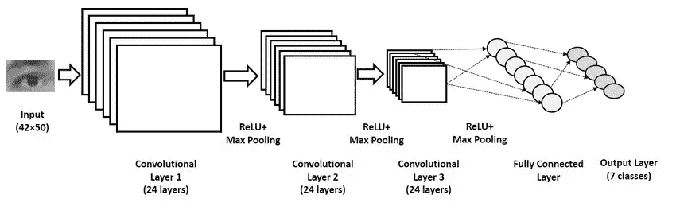

From the paper Real-time Eye Gaze Direction Classification Using Convolutional Neural Network by Anjith George and Aurobinda Routray ([https://arxiv.org/abs/1605.05258](https://arxiv.org/abs/1605.05258))

# Conv2D:

Conv2D 该层对初始输入图像执行卷积。下面的 gif 有助于说明卷积在做什么。卷积基本上是在初始图像矩阵上通过一个小的“过滤器”或“权重”框，并对图像像素值执行矩阵乘法。在训练期间，这允许我们的网络在图像中识别尼古拉斯凯奇的特征。


## Conv2D 参数:

*   在这里的代码中，我们将模型对象创建为顺序 Keras 模型
*   然后我们添加一个卷积层
*   32 意味着我们有 32 个大小为 3x3 的过滤器
*   输入形状意味着它是一个 200x200 的图像，3 意味着它是一个 rbg 彩色图像
*   relu 激活函数是一个用于确保我们的值被缩放到特定范围的函数。

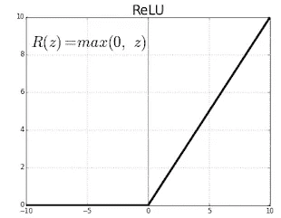

*   因此，如果 relu 的输入是<= 0 it will make the value 0, otherwise, if the input is > 0，那么它将只输出输入
*   激活功能被用来模拟我们大脑神经元的活动方式。当神经网络进行计算时，层中的节点可能输出不在特定范围(如 0 和 1)之间的值。激活功能有助于将我们的数字线强制或“挤压”成我们想要的特定输出范围。

# 最大池:

*   最大池 2d-最大池有时也称为缩减采样。我们从卷积创建的卷积特征矩阵是(初始图像像素矩阵*滤波器矩阵)。池查看该矩阵，并在给定区域中取最大值。下图有助于解释最大池如何对图像进行缩减像素采样。

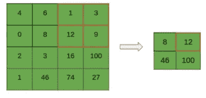

*   在这里，我们初始化我们的池层，我们创建它的大小为 2x2，就像上面的图表一样

# 隐藏层:

*   这段代码增加了两层卷积和最大池，以帮助我们的网络更好地找到我们的图像特征。我最初没有在我们的网络中添加这些额外的隐藏层，我有 89%的测试准确率。我添加了这两层，达到了 91%的测试精度。

# 展平:

*   展平-展平操作采用矩阵或张量，并将其展平为一个很长的 1D 值数组。展平层通常紧跟在最后一个池层之后。展平操作是必要的，因为在我们应用卷积来查找尼古拉斯凯奇的要素后，我们需要将这些值展平到一个长 1D 数组中，并将其馈送到我们完全连接的密集网络层。如果你看看 CNN 图表的末尾，你就会明白我所说的馈入末尾密集层网络的值是什么意思。

# 密集:

*   密集-密集图层是一种线性运算，其中每个输入都通过权重连接到每个输出(因此有 n_inputs * n_outputs 个权重)。如果你看我们的第一个 CNN 概观图的末尾，那是密集层被使用的地方。
*   我们在这里将单位设置为 64。单位是指密集层中的节点数。单位值始终介于输入节点数和输入节点数之间。选择单位数时，建议使用 2 的幂。
*   我们再次使用 relu activation 函数来避免负值，并将我们的值保持在某个范围内。

# 辍学:

*   辍学是深度学习和神经网络中使用的一种正则化技术
*   正则化是一种技术，用于帮助网络不过度适应我们的数据
*   过度拟合是指我们的神经网络在训练数据上表现良好，但在测试数据上表现很差。这意味着网络没有很好地概括，这意味着它对以前没有见过的新图像的分类不正确/很差
*   在正式的[论文](http://jmlr.org/papers/v15/srivastava14a.html)中解释说:“在神经网络中，每个参数接收到的导数告诉它应该如何改变，从而减少最终的损失函数，给定所有其他单元正在做的事情。因此，单位可能会以某种方式改变，以修正其他单位的错误。这可能导致复杂的共同适应。这反过来会导致过度拟合，因为这些共同适应不会推广到看不见的数据。”
*   因此，我们本质上关闭了一层中的一些神经元，以便它们在网络权重的更新(反向传播)期间不学习任何信息。这使得其他活跃的神经元可以更好地学习并减少错误。

# 输出层:

*   这是输出我们预测的最后一层。我们只让它成为一个单位，因为我们希望它输出 0 或 1。1 是包含尼古拉斯·凯奇的图像，0 是不包含尼古拉斯·凯奇的图像
*   这里我们使用一个不同的激活函数，称为 sigmoid。Sigmoid 用于“挤压”0 或 1 之间的最后一个值。下面是一张 sigmoid 函数的图片，上面有它的方程式。
*   它将我们的输出浓缩成 0 或 1。非常负的输入接近 0，非常正的输入接近 1。

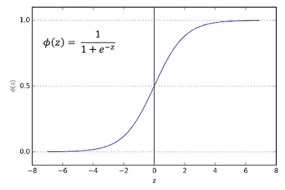

# 编译我们的模型:

*   这里我们编译我们的模型。我们将会遇到一点数学难题，所以抓紧你的帽子。

## 梯度下降:

让我们首先分解什么是基本梯度下降。梯度下降是一个最小化损失函数的过程:

1.  我们从损失函数曲线上的一点开始
2.  我们选择一个学习率，它将决定下降多少步
3.  然后我们在这一点上求导，也称为“下降”或梯度
4.  我们将下降乘以学习率值
5.  我们将初始点移动到曲线上的这个新的(下降*学习率)值
6.  我们重复这一过程，直到达到指定的迭代次数或其他停止条件，如收敛于局部最小值
7.  下面是一个梯度下降的 gif，有助于可视化的过程:

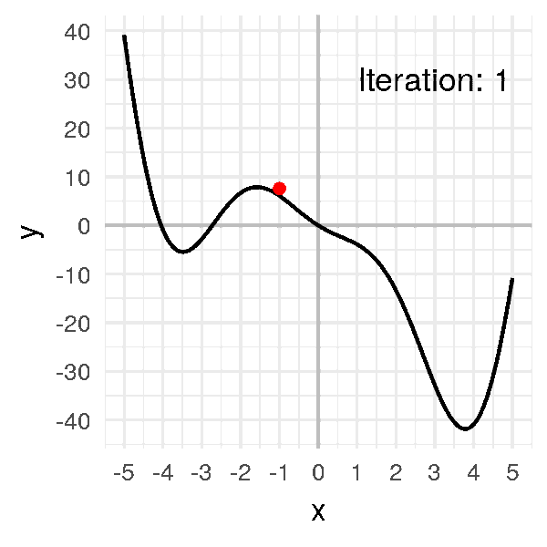

## 随机梯度下降(SGD):

*   这里，我们选择使用随机梯度下降优化算法来最小化我们的损失函数。
*   SGD 是常规梯度下降的增强版本。让我们看看数学。

常规梯度下降(有时称为批量梯度下降)对于大型数据集来说效率非常低，因为它会查看所有训练示例。下面是批量梯度下降的数学方程。

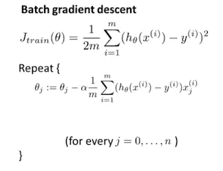

*   Jtrain 是成本或损失函数。这个例子摘自吴恩达在斯坦福大学的机器学习课程。他使用平方误差作为损失函数，我们将使用对数损失函数，因此我们的示例略有不同。
*   然后，我们对每个训练样本进行重复，并计算损失函数的偏导数。

## SGD 的数学原理:

*   SGD 与批量梯度下降非常相似，但是它在循环过程中计算相对于**一个**训练样本的梯度，而不是相对于**所有**训练样本的梯度。
*   因此，如果我们有 20，000 个样本，批量梯度下降将扫描所有 20，000 个样本，然后在每次循环 20，000 个样本后改变我们神经网络的参数。
*   而 SGD 在我们遍历每个例子时会一点一点地调整梯度。所以 SGD 查看单个示例，然后在遍历每个示例时调整我们的参数。以下是新加坡元的数学公式:

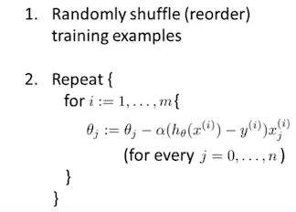

## 二元交叉熵:

*   通过随时间降低损失函数来训练神经网络。
*   损失函数衡量我们的模型与实际发生的情况相比表现有多差。
*   在机器学习/深度学习中，有两种类型的损失函数——一种用于分类，一种用于回归。因为我们正在对图像进行分类，所以我们想要使用分类损失函数。
*   我们选择二元交叉熵或有时称为对数损失作为我们的损失函数，因为我们希望输出在 0 或 1 之间。
*   交叉熵的方程式如下图所示

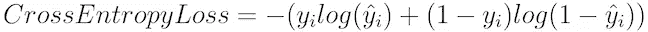

这篇[文章](/common-loss-functions-in-machine-learning-46af0ffc4d23)解释了我们为什么使用交叉熵:

*   注意，当实际标签为 1 (y(i) = 1)时，函数的后半部分消失，而当实际标签为 0 (y(i) = 0)时，函数的前半部分消失。简而言之，我们只是将实际预测概率的对数乘以地面真实类。一个重要的方面是，交叉熵损失严重惩罚了那些有信心但却是错误的预测。”
*   因此，换句话说，交叉熵损失随着预测概率偏离实际标签而增加。因此，当实际观察值为 1 时，预测 0.010 的概率将是糟糕的，并导致高损失值。完美的模型的对数损失为 0。
*   下图是交叉熵损失函数的样子:


*   因此，为了用方程阐明我们的上述直觉，请注意，随着预测概率在图上接近 1，对数损失缓慢下降。随着预测概率接近 0，测井曲线损失迅速增加。日志丢失严重惩罚了自信和错误的预测。

## 指标:

*   我们将参数度量作为“准确性”传递，因为我们使用准确性作为度量来衡量模型的性能。

# 创建我们的数据:

## 尼古拉斯·凯奇:

*   我找不到尼古拉斯·凯奇的现有图像数据集，所以我创建了自己的数据集，使用包 [google-images-download](https://github.com/hardikvasa/google-images-download) 批量下载尼古拉斯·凯奇的图像。为了避免重复，我在 500 个图片搜索中指定了两个不同的日期。
*   上面的代码循环遍历我们的数据，并用一个数字和一个 Nicolas cage 的标签标记所有图像。
*   在手动删除了包含其他人的图片或不正确的图片后，我收集了 207 张尼古拉斯·凯奇的图片。

## 不是尼古拉斯·凯奇:

*   从这个项目开始，我想我可以做一个单类分类神经网络。我只会有一类尼古拉斯凯奇的图像，并把它提供给网络。我想在训练期间，网络会学习尼古拉斯凯奇的特征，并能够在照片中认出他。
*   我最终了解到，网络需要“负面”的例子来帮助它了解 Nic 框架映像和非 Nic 框架映像的样子。因此，我们需要收集随机图像的图像数据集，这些图像不是尼古拉斯·凯奇的。
*   我用这个 python 代码和 picsum 网站生成并保存了 207 张非尼古拉斯·凯奇的随机图像。
*   下一步是创建我们的训练集和测试集目录。

# 训练和测试设备:

*   因为我有少量的数据，所以我决定只手动创建和组织图像的测试和训练集。在一个有成千上万张图片的项目中，使用 python 来创建目录并使用 for 循环来组织数据会更现实。
*   我决定对我们的数据使用 70/30 分割，因为我们没有大量的数据。所以 70%的数据作为训练数据，30%作为测试数据。
*   因此，我们的训练数据将有 145 张尼古拉斯·凯奇的图像，而我们的测试数据将有 62 张尼古拉斯·凯奇的图像。
*   我在我们的 train 和 test 目录中创建了两个子文件夹，分别名为“class0”和“class1”。类 1 包含我们的尼古拉斯凯奇的图像，类 0 包含我们的随机图像。
*   Keras flow_from_directory 按字母数字顺序读取我们的 train 和 test 目录中的文件夹。我花了一段时间才弄明白这一点，因为起初，我的网络将尼古拉斯·凯奇的照片标记为“0”类。这是因为我有两个文件夹:“尼古拉斯凯奇”和“非尼古拉斯”。当时是把“Nicolas_Cage”读成了 0 类。然后我解决了这个问题，看到了我的网络的巨大成果。

# 图像数据生成器:

这段代码的打印语句和输出为我们提供了:

```
Found 290 images belonging to 2 classes.
Found 124 images belonging to 2 classes.
{'class0': 0, 'class1': 1}
```

在这里，我们希望预处理我们的图像，使它们准备好输入神经网络。我们在 Keras 内部使用 ImageDataGenerator 类。该类接收一批图像，并对图像进行缩放和剪切等增强操作。然后，它将增强的数据传递给神经网络。

## 什么是数据增强？：

*   根据超级有用的网站 [pyimagesearch](https://www.pyimagesearch.com/2019/07/08/keras-imagedatagenerator-and-data-augmentation/) 的说法，数据增强通过应用随机抖动和扰动(但同时确保数据的类别标签不变)，从原始样本中生成“新的”训练样本。
*   它本质上创建了与原始训练样本略有“不同”的新训练样本。
*   应用数据扩充的目标是提高模型的概化能力。我们使用增强，因为我们有这么少量的图像，这将有助于我们的模型概括尼古拉斯·凯奇的新图像。下面是一张有用的图片，解释了增强的作用:

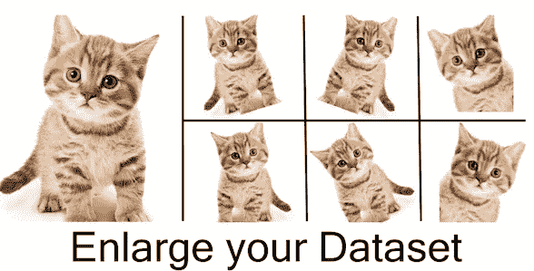

## 参数:

*   重新缩放-我们以 1 的比例缩放图像。/255
*   剪切范围——我们指定图像被剪切或向某个方向移动的范围
*   缩放范围——我们为图像指定一个随机放大的范围
*   horizontal _ flip 水平随机翻转输入
*   目标尺寸——是我们输入图像的尺寸，每个图像的尺寸都将调整为 200x200
*   batch _ size——我们分批循环我们的图像，因此我们使我们的批量大小为 32 的图像变大
*   class _ mode——我们将其设置为“二进制”,因为我们只有两个类来预测尼古拉斯·凯奇是否出现在图像中

# 拟合模型:

```
Epoch 1/25
1000/1000 [==============================] - 913s 913ms/step - loss: 0.3476 - acc: 0.8502 - val_loss: 2.2280 - val_acc: 0.5000
Epoch 2/25
1000/1000 [==============================] - 907s 907ms/step - loss: 0.1354 - acc: 0.9564 - val_loss: 0.5738 - val_acc: 0.8629
Epoch 3/25
1000/1000 [==============================] - 904s 904ms/step - loss: 0.0675 - acc: 0.9825 - val_loss: 0.6880 - val_acc: 0.8710
Epoch 4/25
1000/1000 [==============================] - 910s 910ms/step - loss: 0.0170 - acc: 0.9956 - val_loss: 0.7560 - val_acc: 0.8710
Epoch 5/25
1000/1000 [==============================] - 952s 952ms/step - loss: 0.0454 - acc: 0.9893 - val_loss: 0.7865 - val_acc: 0.8710
Epoch 6/25
1000/1000 [==============================] - 908s 908ms/step - loss: 0.0158 - acc: 0.9959 - val_loss: 0.7694 - val_acc: 0.8952
Epoch 7/25
1000/1000 [==============================] - 908s 908ms/step - loss: 0.0833 - acc: 0.9851 - val_loss: 0.7052 - val_acc: 0.8790
Epoch 8/25
1000/1000 [==============================] - 914s 914ms/step - loss: 0.0103 - acc: 0.9977 - val_loss: 0.7506 - val_acc: 0.8952
Epoch 9/25
1000/1000 [==============================] - 909s 909ms/step - loss: 0.0043 - acc: 0.9989 - val_loss: 0.7203 - val_acc: 0.9032
Epoch 10/25
1000/1000 [==============================] - 905s 905ms/step - loss: 0.0035 - acc: 0.9992 - val_loss: 0.7409 - val_acc: 0.8952
Epoch 11/25
1000/1000 [==============================] - 934s 934ms/step - loss: 0.0050 - acc: 0.9992 - val_loss: 0.8968 - val_acc: 0.8952
Epoch 12/25
1000/1000 [==============================] - 1193s 1s/step - loss: 0.0017 - acc: 0.9998 - val_loss: 0.7880 - val_acc: 0.9032
Epoch 13/25
1000/1000 [==============================] - 1189s 1s/step - loss: 0.0017 - acc: 0.9996 - val_loss: 0.7822 - val_acc: 0.9113
Epoch 14/25
1000/1000 [==============================] - 1194s 1s/step - loss: 0.0014 - acc: 0.9996 - val_loss: 0.7832 - val_acc: 0.9032
Epoch 15/25
1000/1000 [==============================] - 1196s 1s/step - loss: 0.0011 - acc: 0.9998 - val_loss: 0.7775 - val_acc: 0.9032
Epoch 16/25
1000/1000 [==============================] - 1195s 1s/step - loss: 8.3008e-04 - acc: 0.9998 - val_loss: 0.8340 - val_acc: 0.9032
Epoch 17/25
1000/1000 [==============================] - 1198s 1s/step - loss: 0.0072 - acc: 0.9988 - val_loss: 0.7819 - val_acc: 0.8952
Epoch 18/25
1000/1000 [==============================] - 1201s 1s/step - loss: 0.0020 - acc: 0.9997 - val_loss: 0.7950 - val_acc: 0.9113
Epoch 19/25
1000/1000 [==============================] - 1202s 1s/step - loss: 0.0011 - acc: 0.9997 - val_loss: 0.7827 - val_acc: 0.9113
Epoch 20/25
1000/1000 [==============================] - 1170s 1s/step - loss: 0.0015 - acc: 0.9996 - val_loss: 0.8283 - val_acc: 0.9032
Epoch 21/25
1000/1000 [==============================] - 906s 906ms/step - loss: 0.0015 - acc: 0.9997 - val_loss: 0.8592 - val_acc: 0.8952
Epoch 22/25
1000/1000 [==============================] - 905s 905ms/step - loss: 0.0010 - acc: 0.9997 - val_loss: 0.8227 - val_acc: 0.9032
Epoch 23/25
1000/1000 [==============================] - 907s 907ms/step - loss: 8.1553e-04 - acc: 0.9997 - val_loss: 0.8221 - val_acc: 0.9113
Epoch 24/25
1000/1000 [==============================] - 934s 934ms/step - loss: 0.0010 - acc: 0.9998 - val_loss: 0.8540 - val_acc: 0.9032
Epoch 25/25
1000/1000 [==============================] - 1189s 1s/step - loss: 7.6795e-04 - acc: 0.9998 - val_loss: 0.8570 - val_acc: 0.9113
```

*   这段代码使我们的模型能够对尼古拉斯·凯奇的图像进行分类。如你所见，在第 25 个纪元结束时，我们能够达到 99%的测试准确度和 91%的测试准确度。
*   由于我们在训练期间对数据进行扩充，因此我们使用 classifier.fit_generator 函数。classifier.fit 在这里不起作用，因为我们正在对数据进行扩充。

## 参数:

*   training_set —我们传入训练集 ImageDataGenerator，以在训练过程中扩充我们的训练图像
*   steps_per_epoch —我们的 fit_generator 无限循环，所以我们指定我们希望它循环多少次
*   次数-定义学习算法在整个训练数据集中工作的次数
*   test _ set——我们传递测试集 ImageDataGenerator 来增加训练期间的测试图像
*   val _ steps——在每个时期结束时停止之前，测试数据生成器产生的总步骤数(样本批次)

# “学习”:

神经网络通过称为反向传播的过程进行学习。喀拉山脉。fit 函数为我们自动执行这个过程，所以我们不必手动编写代码，但是到底什么是反向传播呢？对我理解这一点帮助最大的视频是[神经网络揭秘](https://youtu.be/UJwK6jAStmg?t=130)和 [3Blue1Brown 的背部道具视频](https://youtu.be/Ilg3gGewQ5U)

## 正向传播:

*   神经网络接受输入并执行一个称为前向传播的过程。为了理解反向传播，我们首先需要理解正向传播的过程。
*   神经网络中连接每个神经元的每一条细线都被称为突触，每一条都有一个“权重”值。下图有助于展示小型网络的可视化示例。

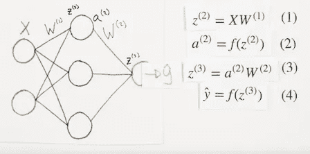

这显然是一个非常简单的神经网络，仅包含一个具有 3 个节点的隐藏层，但是前向传播在更大和更复杂的神经网络上同样有效。它本质上是每次向前馈送前一层输入值，并在我们的输入和权重矩阵加上我们的偏差之间应用矩阵乘法。然后，它应用一个激活函数将我们的值“挤压”到期望的范围内。开始向前传播将输出可怕的预测值。在我们的培训中，您可以看到一个这样的例子，因为我们在第一个时期的测试准确率为 50%。Back prop 将帮助调整我们网络中的权重值，以帮助我们的网络实际学习。

## 反向传播:

*   神经网络通过最小化“成本”或“损失”函数来学习。当神经网络在前向传播后输出预测时，我们通过查看成本函数来查看该预测有多错误。我们的成本函数是对数损失函数。所以我们用梯度下降来最小化这个函数。
*   在梯度下降过程中，我们对曲线上的点求导。这个导数告诉我们切线的斜率。我们想把损失曲线上的点移到负斜率方向。基本上，我们希望将损失曲线上的点导向负斜率，因为我们希望最小化成本函数。但是我们如何得到这个导数呢？

在令人惊叹的 3Blue1Brown 反向传播视频中解释道，在高层次上，反向传播是确定对我们网络中的权重和偏差进行哪些改变或微小“推动”的过程，这些改变或微小“推动”将导致基于单个训练示例的成本函数最有效、最快速地降低。反向传播是递归的，这意味着输出图层斜率取决于前一图层斜率，而前一图层斜率又取决于整个网络中的前一图层斜率，依此类推。让我们用微积分来看看这意味着什么:

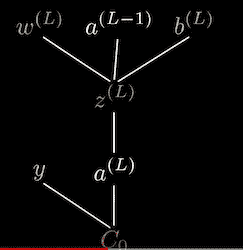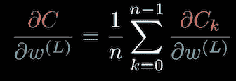

## 将所有这些放在一起:

*   上述方程被简化为在简单网络的每一层中具有一个神经元。这是计算反向传播中导数的更高级的综合方程。

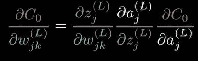

这基本上与之前的等式相同，但在处理每层中有不止一个神经元的网络时稍微先进了一点，这就是 **jk** 可迭代索引的来源。

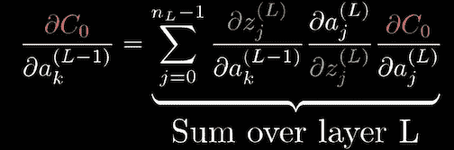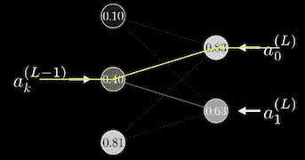

为了让我们的网络运行良好，有必要理解看起来很粗糙的微积分吗？谢天谢地没有，因为 Keras 自动为我们做这个过程，但我认为这是有趣的数学兔子洞。反向传播非常令人困惑，老实说，当我看所有的微积分时，我有时还是会迷路。很多时候，我仍然不得不去回顾它，观看有用的 youtube 视频，试图完善我的理解。

# 准确度和损耗:


Accuracy

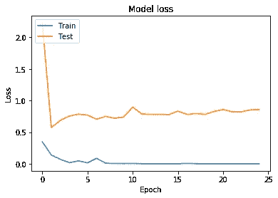

Loss

*   这段代码让我们可以可视化我们的模型准确性和模型损失。代码来自 Keras 文档中解释的[这里的](https://keras.io/visualization/)。
*   正如我们所看到的，我们的测试和训练精度非常接近第 25 个纪元，我们的模型损失也是如此！
*   我们以 91%的测试准确率和 99%的训练准确率结束了我们的训练，这已经很不错了。

# 做出预测:

*   正如你所看到的，我们的模特认出了尼古拉斯·凯奇的这些美丽而绝对鼓舞人心的照片。
*   我们的模型也能识别出不是尼古拉斯凯奇的图像，比如岩石的图片或者天空的图片。
*   我对我们网络的结果非常满意。我们的网络甚至能够识别尼古拉斯·凯奇的愚蠢的迷因图片，比如他的脸被编辑到比尔·克林顿的脸上。

# 结论:

*   在做这个项目的过程中，我学到了很多关于深度学习的知识，并且在创建它的过程中获得了很多乐趣。我在斯坦福上的课是吴恩达教授的很受欢迎的机器学习课。这门课程给了我一个很好的机器学习概念的基础，并向我介绍了神经网络、反向传播、线性回归，甚至支持向量机等概念。但是我知道最重要的学习来自于钻研和创造一个项目。
*   我想我也许可以收集更多尼古拉斯·凯奇的数据，以获得更高的测试准确性，但不管怎样，我对结果很满意，因为模型能够很好地识别我们的模因。
*   如果我将二进制分类应用于不同的数据集，如分类星系和黑洞图像，甚至太空中的星座，这个项目可能会更有趣，但神经网络识别尼古拉斯·凯奇图像的想法似乎太有趣了，太好了，不能错过。

## 联系人:

*   如果你有问题、担忧、建设性的批评，或者想看到更多未来的项目，请查看我的 [github](https://github.com/DrewScatterday) 和我的 [linkedin](https://www.linkedin.com/in/drew-scatterday-415146147/) 。感谢阅读！

# 资源:

*   [https://ml-cheatsheet.readthedocs.io/en/latest/](https://ml-cheatsheet.readthedocs.io/en/latest/)
*   [https://becoming human . ai/building-an-image-classifier-using-deep-learning-in-python-total-from-a-初学者视角-be8dbaf22dd8](https://becominghuman.ai/building-an-image-classifier-using-deep-learning-in-python-totally-from-a-beginners-perspective-be8dbaf22dd8)
*   [https://www . pyimagesearch . com/2018/12/31/keras-conv2d-and-卷积-层/](https://www.pyimagesearch.com/2018/12/31/keras-conv2d-and-convolutional-layers/)
*   [https://towards data science . com/common-loss-functions-in-machine-learning-46 af 0 ffc 4d 23](/common-loss-functions-in-machine-learning-46af0ffc4d23)
*   [https://github . com/fchollet/deep-learning-with-python-notebooks/blob/master/5.2-using-conv nets-with-small-datasets . ipynb](https://github.com/fchollet/deep-learning-with-python-notebooks/blob/master/5.2-using-convnets-with-small-datasets.ipynb)
*   [https://medium . com/Octavian-ai/which-optimizer-and-learning-rate-I-use-for-deep-learning-5a CB 418 F9 b 2](https://medium.com/octavian-ai/which-optimizer-and-learning-rate-should-i-use-for-deep-learning-5acb418f9b2)
*   [https://www.charlesbordet.com/en/gradient-descent/#](https://www.charlesbordet.com/en/gradient-descent/#)
*   [https://keras.io](https://keras.io/)
*   sendex YouTube—[https://www.youtube.com/channel/UCfzlCWGWYyIQ0aLC5w48gBQ](https://www.youtube.com/channel/UCfzlCWGWYyIQ0aLC5w48gBQ)
*   siraj Raval YouTube—[https://www.youtube.com/channel/UCWN3xxRkmTPmbKwht9FuE5A](https://www.youtube.com/channel/UCWN3xxRkmTPmbKwht9FuE5A)