# 我的第一个数据科学项目——伦敦的家庭友好型社区

> 原文：<https://towardsdatascience.com/my-first-data-science-project-family-friendly-neighborhoods-in-london-fe5ea51e48f5?source=collection_archive---------18----------------------->

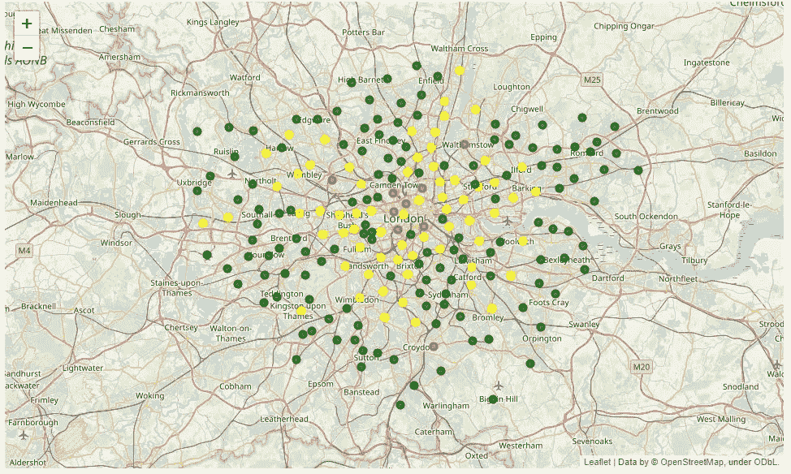

在过去的两年里，我的生活发生了很多变化。我已经决定从神经科学背景转向数据科学，我从美国搬到了英国伦敦。我搬到伦敦是这个项目的灵感来源，因为我很少知道哪些社区被认为是好的，哪些被认为是坏的。所以当我和我丈夫试图找一个地方和我们的两个小男孩住在一起的时候，我们完全没有头绪。我试着用谷歌搜索伦敦的好社区，有不少网站列出了他们对最佳社区的看法。但是所有这些列表的问题是它们看起来像是意见，而不是基于实际数据。来自科学背景的我需要数据来支持这些列表。我们最后做了最好的猜测，我们相当幸运地在一个好的地区结束。

将来，我想避免这种未知，更好地了解伦敦哪些社区是家庭友好型的。好了，我说完了我对这个项目的灵感，让我们开门见山吧。

* **注意**这篇文章将**而不是**代码繁多，如果你想了解更多关于所用代码的细节，你可以在 Github [上查看笔记本，点击这里](https://github.com/kristy1620/Coursera_Capstone/blob/master/Family%20Friendly%20Neighbourhoods%20in%20London.ipynb)。(看不到叶子地图，但如果你想看地图，可以在 [nbviewer](https://nbviewer.jupyter.org/) 上粘贴 Github 链接)

# **数据**

对于这个项目，我们从 [**大都会警察局犯罪仪表板**](https://www.met.police.uk/sd/stats-and-data/met/crime-data-dashboard/) 获取伦敦犯罪数据，并使用犯罪数据集**中的纬度&经度从 **Foursquare API** 获取场地数据。**

**犯罪数据**

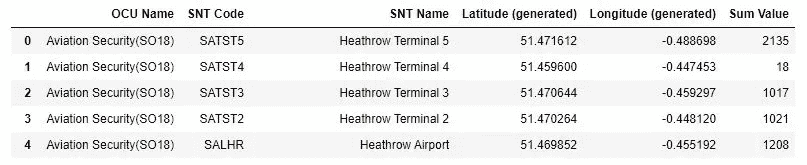

Original Crime Dataset

我们首先需要通过删除不必要的行和重命名列来清理犯罪数据。

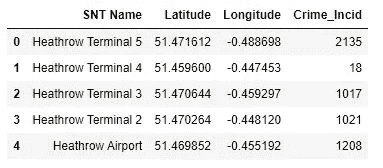

Clean Crime Dataset

现在我们有了一个干净的数据集，我们可以通过 Geopy 的反向地理编码运行纬度和经度，并找到相应的邮政编码，我们将*将它追加到一个新的 postal_code 列。*

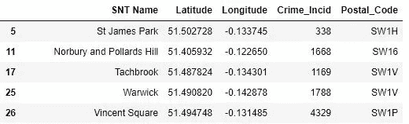

Example of the dataset with Postal Codes

不幸的是，反向地理编码并不像我们希望的那样清晰。缺少超过前缀的数据点和邮政编码(例如:Index 5 Postal_Code 读作“SW1 ***H*** ”)，我们将手动清理每个邮政编码，并使用以下代码输入缺少的邮政编码:

Snippet of Code to edit Postal_Code Column

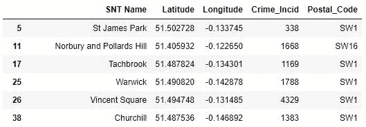

Subset of Dataframe after fixing Postal_Code column

然后我们按照邮政编码将犯罪事件加在一起。这将是我们最终的犯罪数据集，总共有 212 行和 4 列。

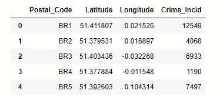

Final Crime Dataset

**犯罪数据可视化**

为了确定伦敦的犯罪分布情况，我们将把数据绘制成箱线图。

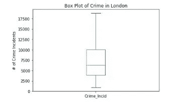

Box plot of Crime in London

我们将“正常”的犯罪数量定义为落在方框内的所有值，低犯罪数量定义为低于方框的点，高犯罪数量定义为高于方框的点。

我们现在使用**叶子**在伦敦地图上绘制点。我们对这些点进行如下颜色编码:

*   高犯罪率= "红色"
*   普通犯罪= "黄色"
*   低犯罪率=“绿色”

Crime Map of London

太好了，我们现在对不同邮政编码(街区)的犯罪有了很好的了解。但在寻找家庭友好型社区时，犯罪并不是唯一要考虑的因素。我们还需要考虑儿童友好型活动。为此，我们使用 Foursquare API。

**场馆数据**

对于这个项目，我们决定重点关注以下几个类别:

*   **公园** ( Foursquare 类别 Id: '4bf58dd8d48988d163941735 ')
*   **库** (Foursquare 类别 Id: '4bf58dd8d48988d12f941735 ')
*   **Lidos(Pools)**(four square 类别 Id: '4bf58dd8d48988d15e941735 ')
*   **游乐场** (Foursquare 类别 Id: '4bf58dd8d48988d1e7941735 ')
*   **电影院**(四方分类 Id: '4bf58dd8d48988d180941735 ')

我们创建一个函数来标识场馆，并将该类别的场馆总数附加到当前数据帧的新列中。下面是函数:

Function for identifying the total number of venues in each category

这是最终的数据集:

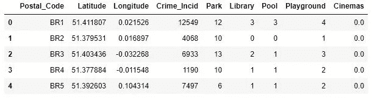

Final Dataset

# k 均值聚类

最后，我们使用机器学习技术 K-Means。选择这种技术有两个主要原因:

1.  我们没有标签数据
2.  我们知道我们想要多少个集群(3:不友好型、友好型和谨慎型)

对于 K-Means，我们选择希望算法使用的功能，这意味着选择“Crime_Incid”、“Park”、“Library”、“Pool”、“Playground”和“Cinemas”列:

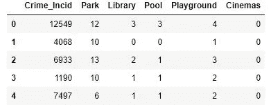

在运行 K-Means 之后，我们*将聚类标签*插入到原始数据集中，然后使用 Folium 绘制数据以可视化不同的聚类。

Final Map of Family-Friendly Neighborhoods

很快，我们可以看到很多红色变成了黄色，现在地图上有了更多的绿色点。这是个好消息，因为不像大多数人认为的那样，在大城市有家庭友好型社区。

只是为了确保没有隐藏的集群，我们运行肘方法，以确保我们有最佳数量的集群。

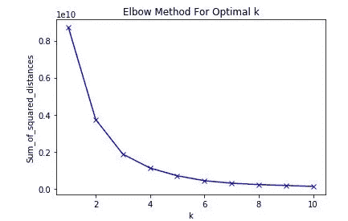

Optimal k = 3

我们可以看到，3 是集群的最佳数量。耶！

# 结果和讨论

这是一个好消息，看到在伦敦有更多的家庭友好型社区，而不是要避免的社区。事实上，有 136 个街区可供选择。下面是一个简单的分类:

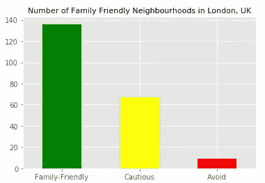

因此，对于任何像我自己一样在英国伦敦寻找最佳家庭友好型社区的家庭来说。我建议你从这 10 个开始:

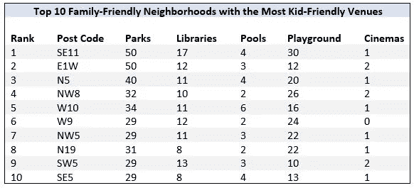

Top 10 family-Friendly neighborhoods

他们的犯罪率并不是最低的，但他们的犯罪率仍然很低&有很多适合孩子的活动。

但是如果你在寻找最安全的社区，那么就从这些开始吧:

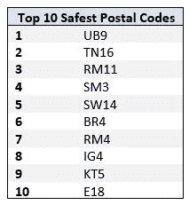

Neighborhoods with the lowest crime Incidents

但是我给你一个合理的警告，一些邮政编码没有很好的儿童友好活动。但这可能会引起企业、城市规划者和开发商的兴趣，他们可能想建造这些适合儿童的场馆。

现在，对于我们的警察局长、专员和其他安全人员来说，了解哪些社区可以利用更多的资源来降低这些地区的犯罪率将会使你们受益。对于家庭来说，这些是你应该避免居住的地方。

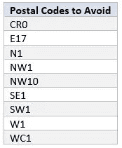

**进一步分析&改进思路**

没有哪个数据科学项目是真正完整的。总有优化的空间，因此我列出了一些改进结果的想法

**1。添加更多适合儿童的分析场所。**

*   公园、操场、图书馆、游泳池和电影院并不是仅有的适合孩子的活动。

**2。为每个邮政编码添加边界**

*   目前仅使用 1 英里半径来定义邮政编码分配的纬度和经度的边界。这可能会在搜索地点时导致一些不必要的邮政编码区重叠。这也将允许绘制 choropleth 地图。

**3。根据邮政编码内的人口标准化犯罪事件。**

*   注意，许多要避免的邮政编码位于中心，那里的人口密度很可能大于远离中心的邮政编码。这可能导致犯罪率表面上看起来很高。

**4。按预算进一步过滤结果**

*   这将有助于更好地迎合各种预算的家庭。伦敦是一个生活成本很高的城市，尤其是在住房方面。根据 Business Insider 的数据，伦敦两居室公寓的平均租金为 2338 美元(1875 英镑)，是世界上第六大租金市场。根据平均房价，伦敦在全球最贵的地方排名第八。

# 结论

很高兴看到大城市可以对孩子友好。很高兴看到我们最终选择的社区被认为是适合孩子的！

孩子是我们的未来，大城市是可以找到机会的地方。因此，重要的是让大城市变得对孩子更加友好。家庭不应该觉得为了抚养孩子他们不得不逃离大城市。

我希望你喜欢阅读这个项目，就像我喜欢为它工作一样。因为这是我的第一个项目，我会喜欢你的反馈，所以请随时与我联系！完整的笔记本可以在 Github [*这里*](https://github.com/kristy1620/Coursera_Capstone/blob/master/Family%20Friendly%20Neighbourhoods%20in%20London.ipynb) *找到，报告可以在* [*这里*](https://github.com/kristy1620/Coursera_Capstone/blob/master/London_Data_Report.pdf) *。*