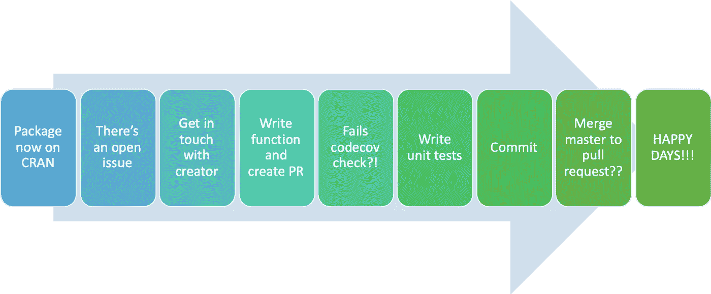
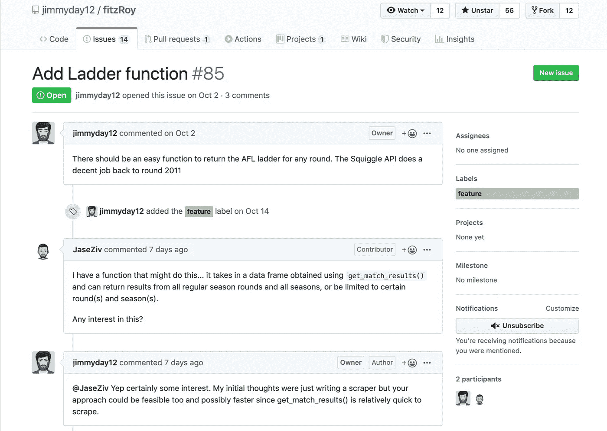
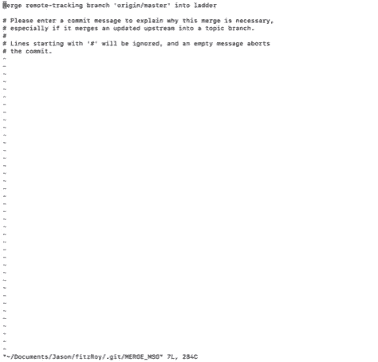

# 我第一次开源贡献的痛苦和狂喜

> 原文：<https://towardsdatascience.com/my-first-open-source-contribution-7698950895a9?source=collection_archive---------21----------------------->

## 我的第一个开源贡献并不是一帆风顺的，但它肯定是完全值得的

在过去一年左右的时间里，我一直渴望为一个开源 R 包做贡献，但是像许多人一样，我发现处理这个任务的想法令人害怕。

虽然我每天都在一个非常动态和紧密的团队中工作，并且在远程存储库(Git)的世界中，我对这些远程存储库中的协作工作的接触非常有限…我们更倾向于在很大程度上独立完成项目，所以拉请求(PRs)、合并、分叉的概念…嗯，这都有点令人生畏。

以下是旅程中的一瞥，将在本帖中解释:

The journey I took

这篇文章不会是一个详尽的每个接触点的一步一步的指南，而是一个中高层次的总结。

> 我的孩子，生活本不该是轻松的；但是鼓起勇气:这可能是令人愉快的。——乔治·萧伯纳

记着乔治的话，我想是时候让自己跳进去了。

浏览 Twitter(就像护理新生儿一样)，我看到一条关于我在*上的一些分析中使用的一个包的推文，不要责怪数据*说这个包现在在 CRAN 上直播(一个伟大的成就)。

The tweet that started everything

这很自然地把我带到了 [Github](https://github.com/jimmyday12/fitzRoy) 上的仓库，在那里我注意到有一些公开的“问题”，其中之一是为任何回合创建一个梯子的函数。

## 菲茨罗伊套餐

由 [James Day](https://github.com/jimmyday12) 开发的 fitzRoy 软件包是一个旨在帮助 R 用户提取和分析澳大利亚足球联盟(AFL)男女比赛数据的软件包:

> fitzRoy 的目标是提供一套功能，使用户能够方便地访问来自 afltables.com 和 footywire.com 的 AFL 数据。还有一些工具可以处理和清理这些数据。

虽然我肯定没有在这一点上做任何广泛的分析，但我猜想所有 AFL 数据分析项目的大部分都是在这个软件包的帮助下完成的。

## 直接跳进来

所以，与其考虑做出贡献有多好，为什么不直接联系詹姆斯，主动提出解决这个公开的问题呢…

詹姆斯非常容易相处，而且他很乐于助人(对这个笨手笨脚的傻瓜很有耐心)。

然后是写函数的时候了。就像写函数一样。幸运的是，我已经为一个线性回归模型编写了这个函数，这个模型是我为预测 AFL 主客场比赛的上座率而构建的[这里是](https://www.dontblamethedata.com/blog/building-a-linear-regression-model-in-r-to-predict-afl-crowds/)。这个函数被恰当地命名为`return_ladder()` …我是数据科学家，不是诗人。

这个函数做了一些修改，利用包中的`get_match_results()`函数返回`return_ladder`的起始数据帧。在编写这个函数的时候，我想解决这个需求，即梯子可以在任何回合返回，并且可以在 2011 赛季之前返回，这是另一个 API 已经提供的。

记住这一点，编写的函数接受三个参数，所有参数都可以选择为空，也可以指定:

*   `match_results_df` -使用`get_match_results()`提取的数据帧，
*   `season_round` -用户想要梯子的季节周期，
*   `season` -需要梯子的季节。

如果这些都留空，该函数将返回自 1897 赛季以来每个赛季每轮的阶梯。

编写函数是一回事，它还需要 roxygen 注释，这些注释在函数的帮助文档中返回给用户。哈德利的《R 包》一书很好地解释了这些。

## 我准备好成为一名贡献者

我已经编写了函数、帮助文档，并使用`devtools::check()`检查了包，以确保我没有犯任何会导致包构建失败的错误……没有什么看起来令人担忧(嗯，有一些关于*没有全局变量*的可见绑定之类的警告，但我确信没有什么可担心的)，但对我来说一切都很好。

我的本地更改已提交，公关也已完成，我准备好成为一名贡献者，然后嘭！**codecov 失败**！！那是什么？！给詹姆斯发了一封电子邮件，我被告知这是因为没有写测试。好的，我会写一些测试…什么是测试？！我如何编写这些测试？！我发现这个[帖子](https://katherinemwood.github.io/post/testthat/)真的很有帮助，还有哈德利在 R Packages 书中的测试。

一旦这些测试被编写，我提交我的更改，我准备好成为一名贡献者，然后砰！我已经对我的 PR 中没有的母版进行了更改…好的，所以我需要将母版合并到我的 PR 中——很容易(对于某些人来说，我可能不知道)。谷歌一下，看起来很容易，但是在输入`git merge origin/master`之后，我在终端中弹出了这个编辑器:

我最初的想法？这是什么？！

有点谷歌，好吧，这是一个 VIM 编辑器。简单。写一个提交消息，然后一切都会好的…等等？！我如何离开这个屏幕？！再谷歌一下，输入`:WQ`之后，我们就可以开始摇滚了。

## 什么？我是。一.在做什么？！！

好吧，事情看起来不错。我提交了我的修改，所有的检查都通过了，快乐的日子。

你知道我之前写的关于*的那一行吗？有一些关于‘全局变量没有可见绑定’之类的警告，但是我确信没有什么好担心的。？好吧，这一直困扰着我，因为正如詹姆斯建议的那样，当试图包含 CRAN 的更新时，这些会引起问题。所以我修改了那些，也更新了男士的小插图。在这一点上，我对自己做了什么有点模糊，但我所知道的是，我一定是把自己织进了一张 Git 网…*

我的分叉回购的`Master`比我的分支`Ladder`晚两次提交，比`Origin/Master`早五次提交。什么？我是。一.在做什么？！试错，试错。

## 成功！

在经历了很多心痛之后(我不能强调有多心痛)，最终，我把自己整理好了，创造了另一个公关和…成功！！！

最后，我可以说我已经成功地为一个开源项目做出了我的第一份贡献。我希望这个软件包的用户会发现这个功能很有用，并且像其他任何东西一样，可以找到改进的地方，使它变得更好。

***本帖原创，发布在不怪数据博客***[***https://www.dontblamethedata.com***](https://www.dontblamethedata.com/)***。去那里看看一些正在使用的新功能的例子。***