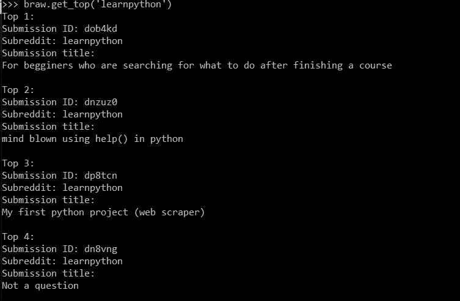
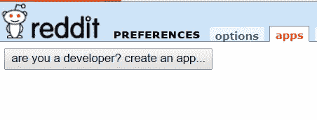
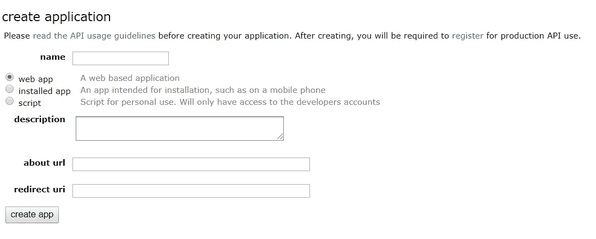
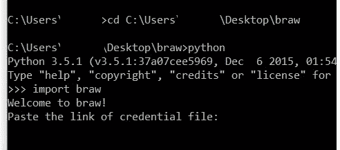
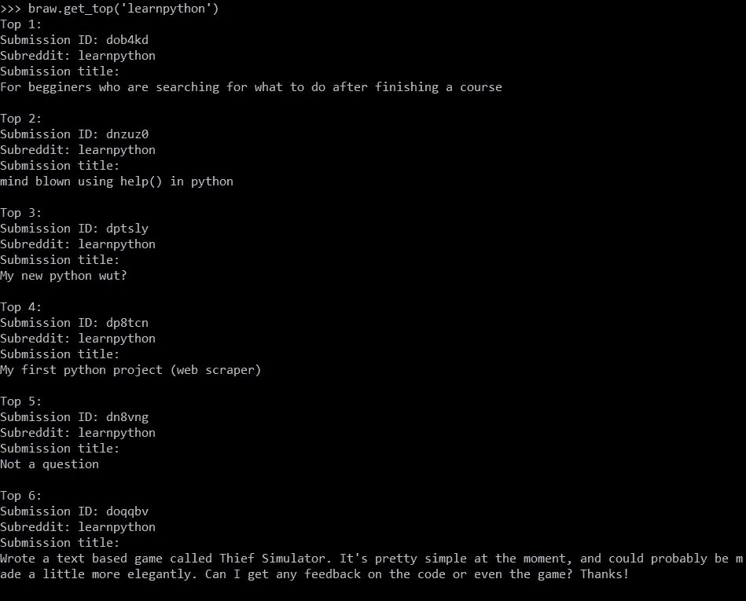
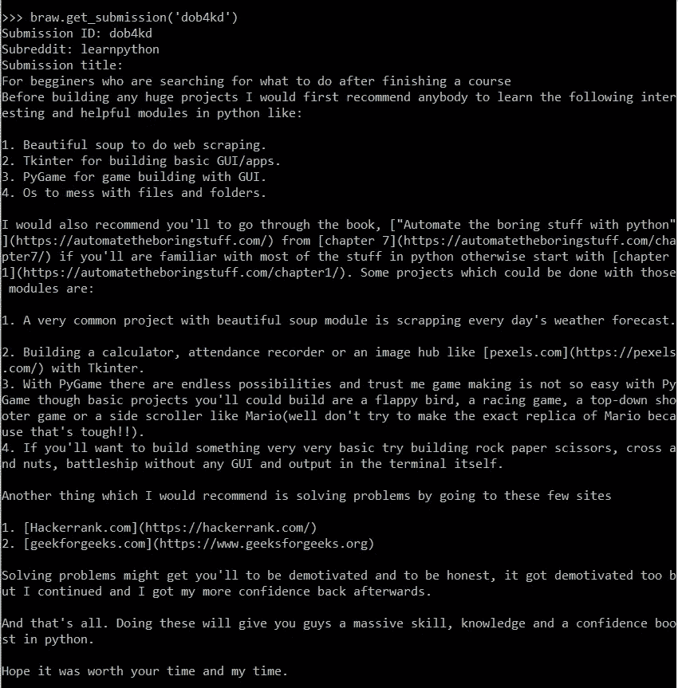
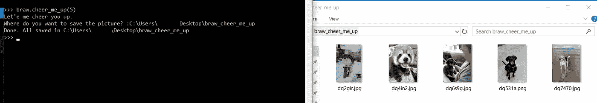

# 我的第一个 Python 小项目，用于在 office 中安全浏览 Reddit

> 原文：<https://towardsdatascience.com/my-first-small-project-in-python-for-browsing-reddit-in-office-safely-4d1d6985163a?source=collection_archive---------22----------------------->

TL；DR:你可以用这个包在命令提示符下浏览 Reddit，假装你在办公室工作。



What you can see in your command prompt when you browse subreddit ‘learnpython’ using braw

人们总是说用有趣的方式学习比用无聊的方式学习更有效。而我相信编程也是如此。这就是为什么当我现在学习如何在 Python 上构建一个项目时，我总是寻找一些有趣的项目来给我工作的热情。几天后，我的第一个小项目完成了，我把它叫做 braw(在工作中浏览 Reddit)。此时，该包只允许阅读文章，但不允许创建新文章或发表评论。这将是我这个小项目的第二部分。

完整的代码在这里:[https://github.com/wyfok/braw](https://github.com/wyfok/braw)

1.  [准备](#e925)
2.  [可用功能](#c003)
3.  [结尾](#614a)

## 准备

Python Reddit API 包装器(praw)是一个用于包装 Reddit 的 Python 包。在我的包中，我将使用它来访问 Reddit 并包装内容。有关 praw 的更多信息，请访问 https://praw.readthedocs.io/en/latest/index.html

为了使用这个 braw 包，首先你需要有一个 Reddit 帐户。你还需要从 Reddit 偏好设置->应用程序([https://www.reddit.com/prefs/apps/](https://www.reddit.com/prefs/apps/))获取你的个人客户端 ID 和客户端密码



名称:给出一个名称

选择脚本

描述:空白

关于 url:空白

重定向网址:[http://www.example.com/unused/redirect/uri](http://www.example.com/unused/redirect/uri)(脚本中不会用到，只是填充用)

然后在下一页，您将获得您的客户端 Id 和客户端密码


此时，创建一个以 JSON 格式存储这些信息的文本文件并保存它。

```
{
"user_agent":"user_agent",
"client_id":"the string below personal use script",
"client_secret":"secret"
}
```

由于这个包需要 praw，所以需要先安装 praw。你可以这样做

```
pip install praw
```

下载 braw 包后，打开命令提示符，将目录更改到该文件夹。然后运行 Python，导入 braw。



此时，系统会要求您粘贴该文本文件的路径。如果没有错误信息，这意味着您成功连接 Reddit。但是，如果您看到打印结果显示无法连接到 Reddit，这表示您的客户端信息不正确，或者在连接过程中出现问题。

## 可用功能

以下是您目前可以使用的功能

1.  get_top(s_reddit='all '，time='week '，how_many=10)
2.  get_hot(s_reddit='all '，how_many=10)
3.  get_new(s_reddit='all '，how_many=10)

如果你是 Redditor，那么你应该熟悉前三个。如果你不是，你可以使用每一个来获得热门、热门或新的 Reddit 帖子。您可以选择所有子编辑“all”或选择特定的子编辑，如“learnpython”。然后，您将获得 id 为的各个帖子的标题列表。



4.获取提交(发布标识)

5.获取评论(帖子标识)

使用带有提交 ID 的“get_submission”函数，可以阅读文章的正文。



您还可以使用带有提交 ID 的“get_comment”函数来检查评论。

6.til(多少=10)

有一个著名的教育性的子栏目叫做“今日学习”，里面有很多有趣的事实。该函数将显示该子编辑中的热门帖子。

7.振作起来(多少=10)

我们都知道工作时会非常沮丧。为什么不休息一下，看一些加油的图片呢？“cheer_me_up”将从子编辑“aww”、“dogpictures”和“catpictures”下载图像，并存储在您指定的本地文件夹中。



(PS:我在这里没有任何侵犯任何版权的意图。我尊重所有人的版权。你也应该。所以成功给你加油后请删除所有照片。)

## 结局

我真不敢相信在设计这个包的时候里面有这么多的乐趣和刺激。我意识到，在 Python 中，我需要做的事情比我想象的要多得多。我希望你喜欢我的第一个小项目，并发现这个包很有用。不仅在办公室，你还可以在公共场所使用这个包，这样别人就不会知道你在浏览 Reddit。如果你发现任何问题或者你想加入其他功能，请在这里或者 GitHub 中留下你的评论。本帖到此结束，下次再见。