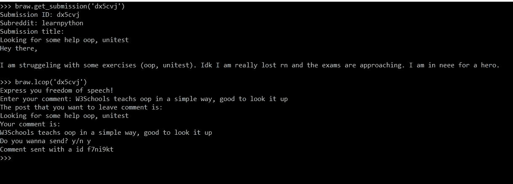
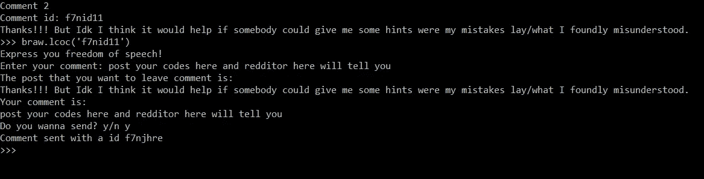
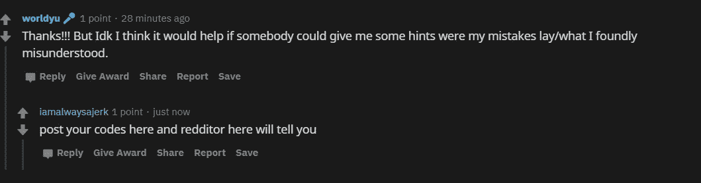

# 我的第一个 Python 小项目，用于在 office 中安全地浏览 Reddit(第 2 部分)

> 原文：<https://towardsdatascience.com/my-first-small-project-in-python-for-browsing-reddit-in-office-safely-part-2-278b56790635?source=collection_archive---------42----------------------->

TL；DR:你可以用这个包在命令提示符下浏览 Reddit **(并留下你的评论)**，假装你在办公室工作。

如果你没有看过我之前关于 braw 的帖子(在工作中浏览 Reddit)，请先看看，这样你就可以对我的第一个小项目有个概念。

 [## 我的第一个 Python 小项目，用于在 office 中安全浏览 Reddit

### TL；DR:你可以用这个包在命令提示符下浏览 Reddit，假装你在办公室工作。

towardsdatascience.com](/my-first-small-project-in-python-for-browsing-reddit-in-office-safely-4d1d6985163a) 

正如上一篇文章所说，在一篇文章上留下评论将是这个小项目的第二阶段。现在就在这里。

(PS: W3Schools is a really good place to learn Python, recommended)

完整的代码在这里:【https://github.com/wyfok/braw】T2

新增功能:

## 1.lcop(在帖子上发表评论)

参数:submission_id

lcop 允许您对提交内容发表评论。您需要提供的只是帖子的提交 id。

由于发表评论需要登录，因此在进行任何操作之前，将首先自动检查用户是否登录。如果用户没有登录，那么程序将询问用户是否想要登录。

有时帖子已经被锁定，不允许任何新的评论。在这种情况下，来自 praw 的 APIException 错误将被引发，因此使用 try exception 来处理。

## 2.lcoc(在评论上留下评论)

除了在帖子上发表评论，你现在还可以在评论上发表评论。与 lcop 类似，您需要提供评论 id 来引用您想要留下评论的评论。

## 次要更新

**包含函数的文档字符串。**

在之前的版本中，我没有包含任何 docstring，后来我意识到这对于一个项目来说是一个非常不好的习惯。所以现在我加了回来

**隐藏内部功能**

对于一些函数，比如打印标题和正文，用户不需要知道，所以我通过用下划线作为前缀重命名函数名来隐藏它。

## 结局

这个项目将不断更新以添加一些新功能，例如，下一阶段将把帖子和评论复制到 word 文件中，这样你甚至不需要在命令提示符下阅读它。如果你有一些想法或想法，欢迎在这个帖子或我的 GitHub 中发表评论。