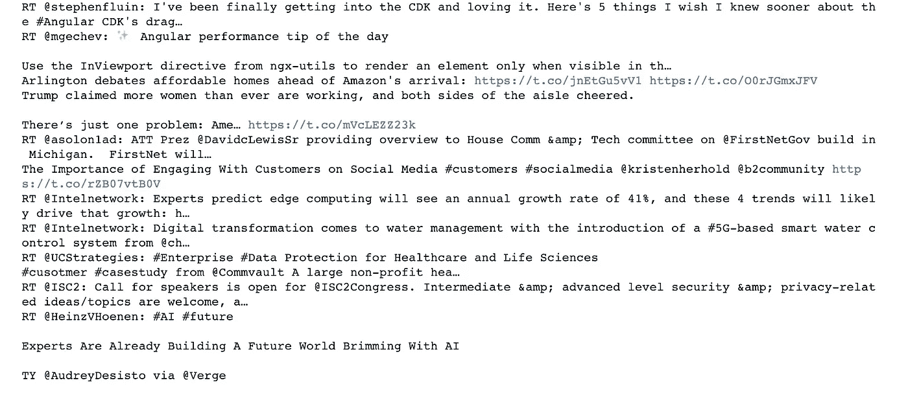
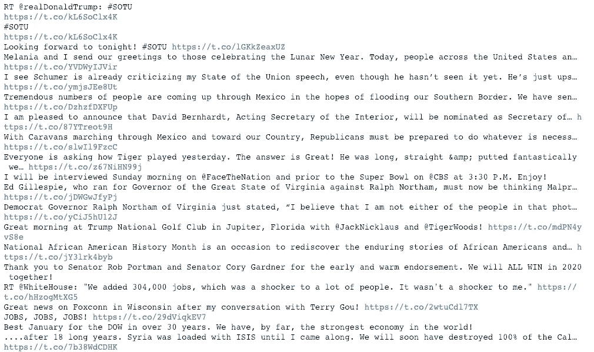
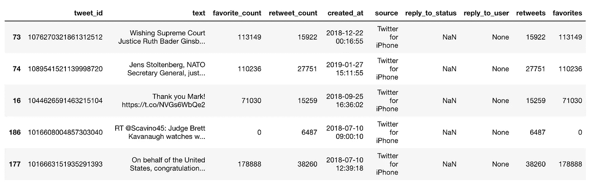
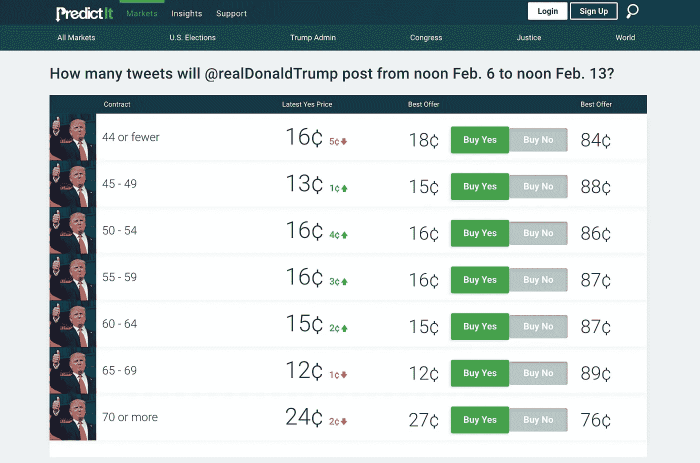

# 青少年初学者指南

> 原文：<https://towardsdatascience.com/my-first-twitter-app-1115a327349e?source=collection_archive---------9----------------------->

## 如何使用 Python 和 Tweepy 创建自己的 Twitter 数据集

Photo by [Elena Koycheva](https://unsplash.com/photos/yJwbvWmJs5M?utm_source=unsplash&utm_medium=referral&utm_content=creditCopyText) on [Unsplash](https://unsplash.com/search/photos/hashtag?utm_source=unsplash&utm_medium=referral&utm_content=creditCopyText)

分析数据的第一步是找到要分析的数据。Twitter 是一个寻找数据的好地方。

Twitter 的 API 是出了名的有据可查，这使得它成为开始创建你自己的数据集的好地方。

在本教程中，我们将涵盖:

*   创建 twitter 应用程序
*   用 [Tweepy](https://tweepy.readthedocs.io/en/3.7.0/getting_started.html) 获取推文
*   提取 tweet 属性

## 创建一个 Twitter 开发者账户和应用

1.  在这里申请一个[账号。](https://developer.twitter.com/)
2.  创建新应用程序。填写必填字段。(如果你没有网站，你可以使用占位符。)
3.  单击“密钥和令牌”选项卡。创建访问令牌和访问令牌密钥。(消费者和消费者密钥应该已经可见。)

## 安装 Tweepy

要安装 pip，只需在终端中键入`pip install tweepy`。

## 证明

现在说说好东西。

Tweepy 确实使 OAuth 几乎没有痛苦——但是我不打算撒谎，我几个小时都无法让它工作……然后我终于意识到我的访问令牌末尾有一个空格。🤦‍♀

现在，为了确保它能正常工作，让我们打印我的流中最近的推文:

成功！我们有一堆随机的推文！但是，这真的不是很有帮助，除非你试图分析你关注的人的推文。

## 获取用户的推文

Tweepy 有一个有用的方法，可以返回指定用户最近发布的状态。

让我们用这个来看看唐纳德·特朗普今天在推特上发了什么:

现在我们有进展了！我们有 tweet 文本，但这仍然不是非常有用。它只是看起来像一堆随机的文本。

`user_timeline`函数返回一个 tweet 对象。从 Twitter 的文档中我们可以看到每个 tweet 对象都有一个很长的属性列表，包括我们上面使用的文本属性。

我们可以编写一个函数来提取我们感兴趣的属性，并创建一个数据帧:

现在我们有进展了。在我们的数据框架中有了一些感兴趣的属性后，我们可以继续进行分析。

Twitter 数据的一些流行用途包括主题建模和情感分析。

更有趣的事情，也许是一个现实世界的应用，可能是试图预测特朗普一周会发布多少条推文。

Predictit.com market for Donald Trump tweets

## 结论

虽然这是数据挖掘的一个很好的开始，但我们仅仅触及了表面。Twitter 的 API 有更多我们可以探索的方法，更不用说互联网的其他部分了！

期待看到你挖出什么有趣的数据！