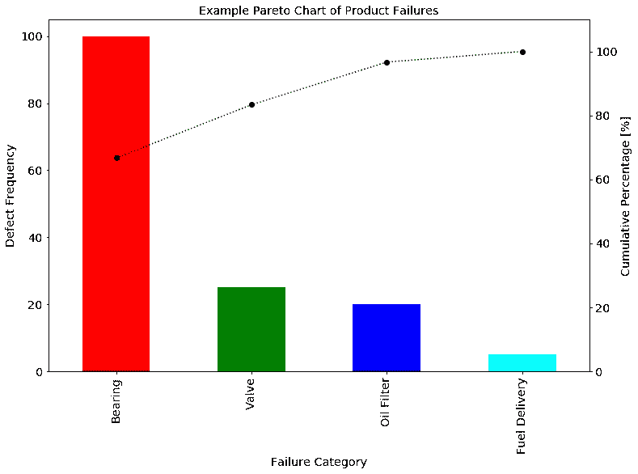
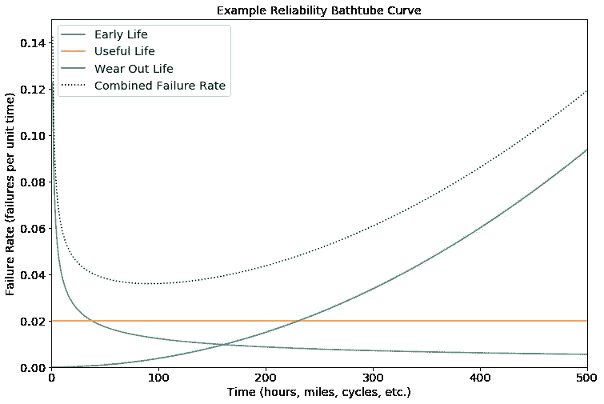
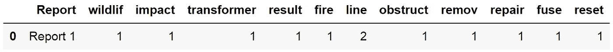

# 我第一次在工业界使用自然语言处理(NLP)

> 原文：<https://towardsdatascience.com/my-first-usage-of-natural-language-processing-nlp-in-industry-c20842b37cad?source=collection_archive---------12----------------------->

人们经常听说 NLP 有多棒，但是对于很多人来说，很难看到它是如何应用于商业环境的。带着这个目的，我想我会分享我第一次尝试使用 NLP 来解决一个商业问题。

Photo by [Jason Leung](https://unsplash.com/@ninjason?utm_source=medium&utm_medium=referral) on [Unsplash](https://unsplash.com?utm_source=medium&utm_medium=referral)

# 商业问题

发布新产品对企业来说可能是一个令人担忧的时期，产品的成功和公司的形象依赖于产品的广告表现。其中一个最大的影响是产品的可靠性，它需要像客户期望的那样工作。为此，监控投诉和退货非常重要。对于汽车或大型已安装设备，更有可能的情况是工程师会被派去维修，而不是产品被退回进行更换。

然后，质量工程师可以处理和阅读这些工程师报告，以便对是否存在真正的故障以及故障类型进行分类。然后，可以对这些结果进行汇编，以生成故障的[帕累托图](https://en.wikipedia.org/wiki/Pareto_chart)，甚至开始在其他可能的可靠性统计数据中构建可靠性[浴盆](https://www.weibull.com/hotwire/issue21/hottopics21.htm)曲线。

值得花点时间来解释帕累托曲线和浴缸曲线，让你对可靠性工程有个粗略的了解。

# 帕累托图

您收到了大量关于产品不同类型故障的报告，您如何确定哪些故障需要优先解决？一个有用的工具是制作一个[帕累托图](https://en.wikipedia.org/wiki/Pareto_chart)，这是一个图表，显示了每种故障类型的故障数量，并结合了一个组合百分比，这样你就可以看到每种故障占总数的多少和百分比。下面我举了一个例子。

Example of a Pareto chart of failures

如你所见，Pareto 非常清楚地表明“轴承”是最常见的故障类型，占所见故障的 60%以上。因此，这将是调查和解决降低总失败率的主要候选方法，在观察期间内用于制定帕累托图。

但这只是特定时间段的快照。通常，主要的故障类型会随着产品寿命而改变，包括制造缺陷(冷焊点、断线等)。)发生在产品寿命早期和接近寿命末期的故障往往由运动部件磨损(如轴承、金属疲劳等)所主导。).

为了考察产品寿命期间的总体可靠性，绘制浴盆曲线是有用的。

# 可靠性浴盆曲线

设备中的故障通常有三种不同类型:

*   “早期寿命”——如果这些故障会发生，它们会在设备使用的早期出现，并且随着时间的推移可能性会降低。例如制造缺陷(如冷焊点)或安装错误。故障率随着时间的推移而降低。
*   “有效寿命”——这些故障可能发生在产品寿命的任何时间点。无论一个产品设计得多好，总有一些会不可避免地随机失败。故障率始终保持不变。
*   “磨损寿命”——随着设备年龄的增长，这些故障的可能性也会增加。这类故障的一个例子通常与磨损的运动部件有关，如轴承或电机。故障率随着时间的推移而增加。

当这三者加在一起时，得到的故障率图看起来有点像浴缸，示例如下所示:

An example Bathtub Curve showing how three different failure types to give bathtub shape

值得一提的是，浴缸的形状是一个广义的形状，不同的产品往往看起来不同。

最明显的极端是计算机电子产品，它往往表现出尖锐的早期寿命和非常长的使用寿命，磨损几乎可以忽略不计。这是因为一旦避免了任何制造或组装缺陷，部件的大部分固态使它们具有非常可靠的工作寿命。

另一个极端是电动马达系统，它的寿命很早，使用寿命很短或可以忽略不计，磨损更明显。这意味着它看起来更像“V”形而不是浴缸形。

## 为什么这些很重要？

了解产品的浴缸曲线可以让你做出重要的商业决策。例如，如果您知道您的产品的大多数故障都发生在产品生命周期的早期阶段，那么它的可靠性非常好，您可以做一些叫做[“老化”](https://en.wikipedia.org/wiki/Burn-in)的事情。这是设备运行一段时间的地方，直到它们通过包装和销售之前的早期生命阶段。这意味着客户获得了更可靠的产品，保修成本也降低了，但代价是设备总寿命的损失。事实上，这种做法在电子领域经常发生，在这种领域，故障对最终用户来说是昂贵的，并且是购买设备时的一个主要关注点。

相反地，例如，如果你有一辆由于同步带磨损故障的汽车，你可以预测更换同步带的最佳里程数，这样你就不会过早地更换同步带，扔掉还有很长寿命的产品。这与过晚更换皮带的成本相平衡，因为过晚更换皮带会导致故障和发动机损坏维修次数过多。

这里的关键点是，组成产品的不同组件通常会表现出不同类型的故障率。通过准确地记录失败的类型和来源，企业可以首先利用他们的资源瞄准最大的改进领域。他们还可以设计最佳的维护和保修期，最大限度地降低企业成本，并增强购买者的信心。

Photo by [Franki Chamaki](https://unsplash.com/@franki?utm_source=medium&utm_medium=referral) on [Unsplash](https://unsplash.com?utm_source=medium&utm_medium=referral)

# NLP 在这里如何变得相关？

在我们快速进入可靠性工程领域后，我们知道准确了解什么产品出现故障非常重要，以便准确了解设备的行为以及它们是否按预期运行(如果您需要能够检测到可能需要安全召回的问题，这一点非常重要)。

此信息的主要来源之一是服务工程师报告。他们会记下他们正在修理的设备的年代，并徒手输入完成的工作。这些以及被替换的零件将被交给[质量工程师](https://en.wikipedia.org/wiki/Quality_engineering)进行编译，并要求他们阅读工程师报告文本(其中可能充满缩写、拼写错误，内容长度可能从冗长到突兀)，解释问题是什么，然后分配正确的故障标签(或复杂故障中的标签)，以便可以正确地用于构建帕累托图和浴缸图。

查看这些报告很快会成为一个巨大的时间池，因为大量的客户群会生成大量的报告，涵盖制造商可能生产的几十种产品。这通常意味着必须对最重要的报告进行优先排序，以便首先处理，留下大量根本不使用的报告，或者在报告出现后需要很长时间才能处理的报告。

有没有一种方法可以减轻质量工程师解释报告的负担，既降低完成这项任务的成本，又增加可靠性统计可用的信息量？答案是使用自然语言处理(NLP)。

Photo by [Markus Spiske](https://unsplash.com/@markusspiske?utm_source=medium&utm_medium=referral) on [Unsplash](https://unsplash.com?utm_source=medium&utm_medium=referral)

# NLP 如何增加可用数据

业务问题现在被定义为有太多的服务工程师报告(内容长度和质量不一)需要阅读和分类。这是一个 NLP 实际上完美设计的问题。

通过收集质量工程师之前处理过的大量带有专业标签的报告，我们现在已经为每份报告分配了故障标签。该数据可用于训练机器学习模型，该模型可被馈送来自报告的文本，并给出服务工程师正在描述的故障的预测。这开启了巨大的新功能，因为这意味着可以密切监控更多的产品，因为预先标记的报告可以交给质量工程师进行抽查，并验证机器学习算法仍然很好地完成工作。这还可能意味着，那些根本没有足够资源来处理的大量积压报告现在可以自动处理、使用和完成，而不必大幅度扩大质量和可靠性部门来执行。这是令人兴奋的东西！

# 模型的基本过程

仅仅将原始文本注入机器学习模型并期望获得很好的结果通常不是一个好主意。通常需要大量的清洁和处理。这些通常概括为:

*   拼写检查
*   (可选)行业缩写转换
*   删除停用词
*   删除标点符号
*   [词干化或词汇化](https://nlp.stanford.edu/IR-book/html/htmledition/stemming-and-lemmatization-1.html)
*   符号化和转换成数字

为了提供帮助，我将提供一段示例文本:

> 变压器上的 WI 导致线路上的 fure。障碍已排除，线路已修复，保险丝已复位。

**注意:**这些步骤并不总是适用于所有基于文本的问题，事实上可能会使问题变得更难(例如，你试图预测一个丢失的单词)，但对于我们的问题，我们试图获取文本的几个句子，并让算法将其总结为一个失败标签。对于这种问题，这些步骤是可以接受的，并提高了所得模型的准确性，最大限度地减少了对异常值或特定工程师(例如，总是有相同错别字的工程师)的过度拟合。

## 拼写检查

如果你曾经读过你的医生的处方笺，它们是仓促而潦草的，并且经常充满拼写错误。服务工程师也是如此，他们的年终业绩是根据修复日常故障设备的情况来判断的，而不是根据撰写伟大的文献来判断的。这意味着这些报告是在离开客户站点之前完成的最后一件事，并且完成得很快，以便他们可以重新上路。这很有可能会出现拼写错误。

因为我们的机器学习算法不知道英语，如果它看到单词“fire”和“fure”，它会将它们视为单独的单词(但人类会知道这是一个打字错误)。获得太多这样的拼写，你会在文本中失去算法可以使用的信号，并且它还会开始过度适应那些很少发生的独特拼写错误的边缘情况(这是我们不希望的)。因此，必须通过拼写检查来运行文本，以帮助纠正这些问题，因为我们希望人类阅读的文本同样被我们的算法摄取。

在这一点上，纠正行业可能使用的任何缩写也可能是有用的(例如，WI 表示野生动物影响)。你会发现，人们有时会使用缩写，有时会使用完整的单词，所以将文本合并成一种形式(全部是缩写或全部是完整的措辞)在这里很有用，可以最大限度地提高算法训练的信号。

该报告现在写道:

> “野生动物对变压器的影响导致线路着火。障碍物已移除，线路已修复，保险丝已重置。”

## 删除[停止字](https://en.wikipedia.org/wiki/Stop_words)

英语中充满了单词，这些单词虽然有助于创造可读的句子，但提供的信息却很少。在这种应用中，这些是像“a”、“the”等这样的词。这将来自我们的包装(见下文),作为高度使用的词，但在试图获得故障分类时几乎没有什么意义。

确实存在停用词列表，但有时需要调整，因为并非所有停用词在不同的应用中都是停用词。最终的结果是句子现在读作:

> “野生动物冲击变压器导致火线。障碍物已移除，线路已修复，保险丝已重置。”

**注意:**虽然对我们人类来说阅读起来越来越难，但我们正试图将报告提炼为传达算法学习信息的关键词。

## 删除标点符号

作为人类，标点符号有助于我们阅读，但对于算法来说，它只会被它混淆，因为它会将不同大写的单词(“世界”和“世界”对它来说是不同的)和标点符号视为关键部分。所有的单词都用小写字母表示，并且去掉了标点符号。

> “野生动物冲击变压器导致火线阻塞，移除线路，修复保险丝重置”

**注意:**删除标点符号和停用词都将减少机器学习算法必须接受的输入大小，从而减少它需要处理来训练、预测等的数据量。当您开始使用大量文本数据来构建模型时，这些都是非常好的好处。

## 词干或引理满足

在英语中，单词可以以不同的形式书写，但仍然具有相同的意思。比如“结果”、“结果”、“结果”。所有这些我们可以解释为意思相同，但对于我们的算法来说，它会将它们视为不同的单词，并且必须了解这三个东西的意思相同。我们可以通过选择词汇化或词干化来使生活变得更容易。

[词条满足](https://en.wikipedia.org/wiki/Lemmatisation)试图将单词返回到词典术语或“词条”(如果是动词、名词等，则由指示确切形式。)，但是使用的一种更常见和更简单的方法是词干法。

词干处理的目的是以一种基于规则和系统的方式砍掉单词的结尾，这样同一个单词的不同形式都返回到一个共同的基本形式(不一定是你将看到的那种形式)，最常见的算法是[、【雪球】和【波特】](https://en.wikipedia.org/wiki/Stemming)。

我们将一个雪球词干分析器应用于我们的句子，并得到最终的句子:

> “wildlif 冲击变压器导致火线阻塞移除线路维修保险丝重置”

你会注意到，我们保留了单词“transformer ”,因为它是一个在公用事业(它是一件设备)中具有特定含义的单词，我们希望算法将它识别为一个不同于“transform”或“transforming”的单词。这就是获得特定领域的经验非常有用的地方，因此可以确定这样的决定来帮助保存文本中的宝贵信息，否则您可能会意外破坏这些信息。

## 符号化和转换为数字(单词包)

现在，我们已经为报告中的文本建立了一个清晰和标准化的格式，我们现在需要将其转换为机器学习算法可以解释的形式。我们通过将句子分解成[【记号】](https://en.wikipedia.org/wiki/Lexical_analysis#Tokenization)(或[分词](https://en.wikipedia.org/wiki/Text_segmentation#Word_segmentation))来做到这一点，以便这些可以被转换成算法可以摄取的格式。为此，我们用空格将单词分开，然后统计特定单词在报告中出现的次数。这给了我们一个[单词袋模型](https://en.wikipedia.org/wiki/Bag-of-words_model)，它忽略了语法和词序，但保留了单词数。这会产生一个表格，其中每行是每个报告中文本的结果，每列代表报告中出现的唯一单词之一。

这是为训练数据集中的每个报告完成的，当发现新的唯一单词时，添加新的列。

正是这个结果表可以输入到模型中对其进行训练，为了进行预测，只需对数据进行类似的格式化，并将该报告的行输入到模型中。

对于我们的报告示例，单词包表如下所示:

Example of Bag-of-words

**注意:**单词袋模型是以算法可以接收的形式表示文本的更简单的方法之一，但也存在其他类型，如“术语频率-逆文档频率”( [TF_IDF](https://en.wikipedia.org/wiki/Tf%E2%80%93idf) )，它根据单词相对于所有文档对特定文档类型的重要性来加权数量计数。这意味着，如果单词“line”被频繁使用，它的权重会大大降低，而“wildlif”不会被降低，因为它只出现在野生动物引发的故障报告中，而不会出现在其余的报告中。

# 训练模型

我们现在可以使用我们已经处理成单词袋模型的带标签的服务工程师报告来训练我们的模型。常用的经典算法有[朴素贝叶斯](https://en.wikipedia.org/wiki/Naive_Bayes_classifier)的支持向量机( [SVM](https://en.wikipedia.org/wiki/Support-vector_machine) )。然后，可以将训练好的模型用于剩余的已标记报告，以验证其工作正常(抑制测试集)，并且被认为非常好，因此用于未标记服务工程师报告的大型存储库

# 结果呢？

Photo by [bruce mars](https://unsplash.com/@brucemars?utm_source=medium&utm_medium=referral) on [Unsplash](https://unsplash.com?utm_source=medium&utm_medium=referral)

成功！人们发现，即使这种非常简单的文本处理也会产生非常显著的结果，所得到的模型对于包含足够多关键字的报告来说非常好。甚至可以通过重新标记一些训练集，然后重新训练模型，将一个类别分成三个类别。这为企业节省了大量时间，同时也允许将大量数据汇集到更准确的业务决策中。然后，质量工程师可以重新专注于其他更重要的任务，只是对标签进行抽查，以验证模型仍在充分执行其任务。

可以说，商业案例得到了满足，人们对可能发生的事情印象深刻。下一步是调整模型，使其预先标记所有报告，以帮助仍在手工处理报告的质量工程师(这在更多的业务和安全关键领域中进行)。

# 摘要

只有使用最经典的 NLP 方法，企业才能够释放巨大的数据存储库，并减轻现有资源的负担，使其他任务(NLP 无法解决)得以完成。