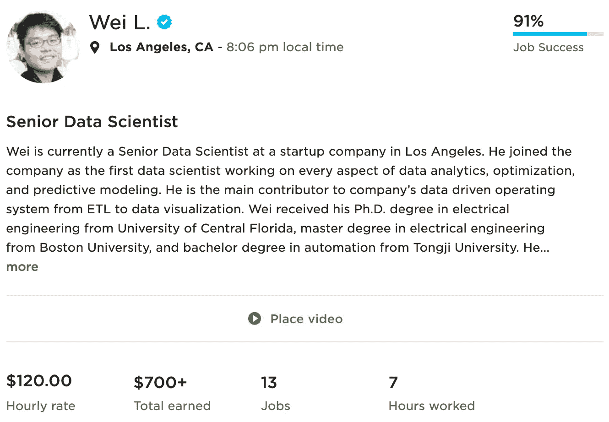
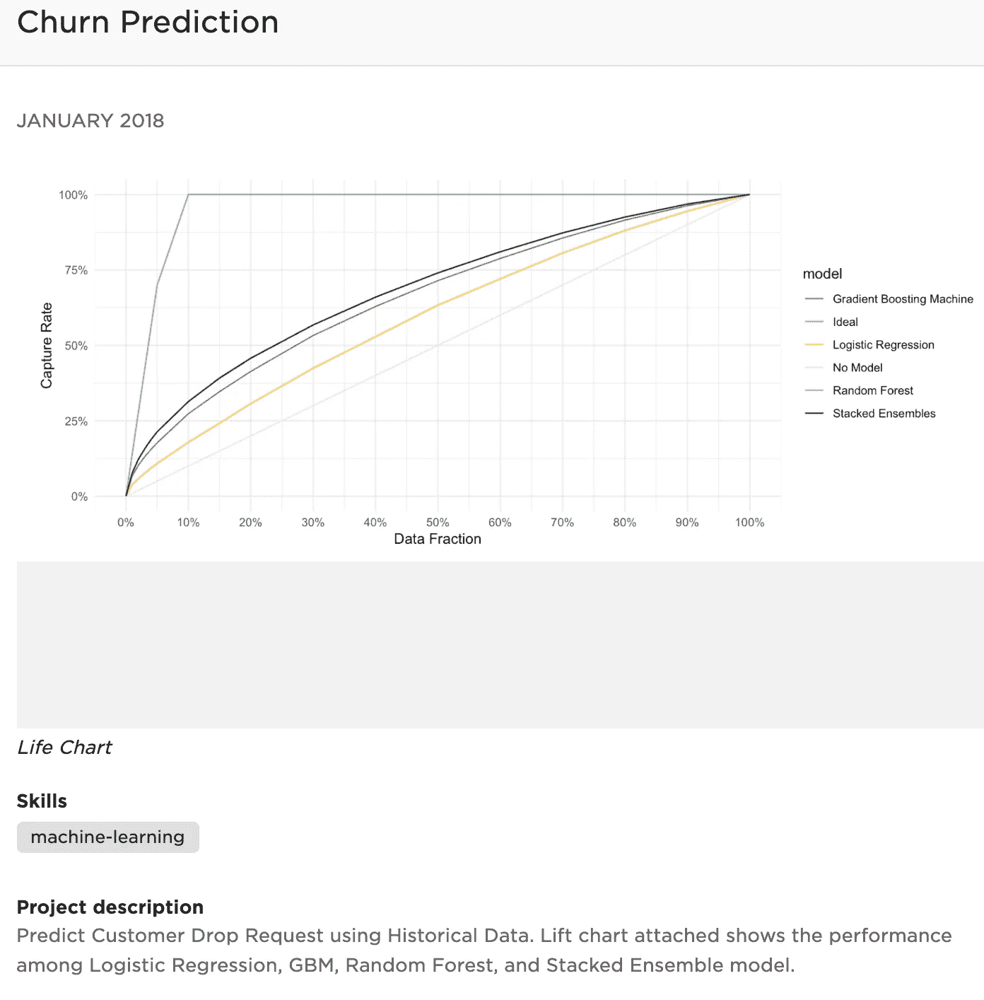
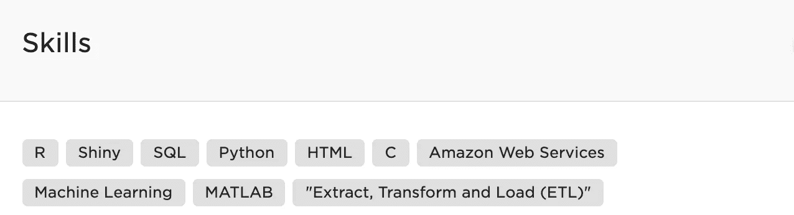
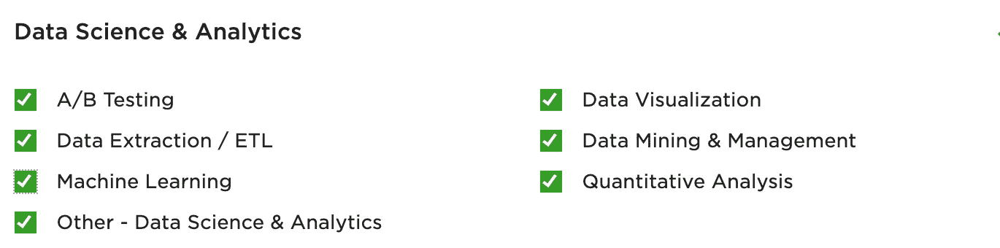
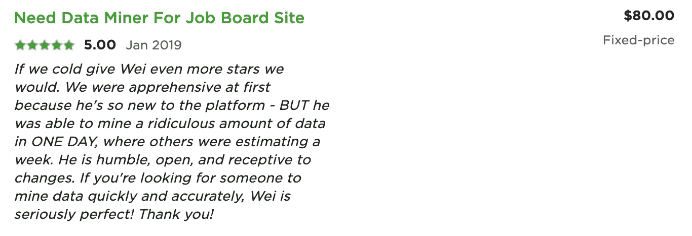
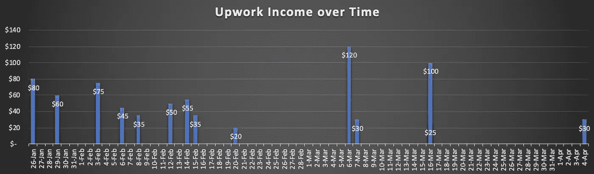

# 我成为了一名自由职业的数据科学家

> 原文：<https://towardsdatascience.com/my-freelancing-experience-on-upwork-after-two-months-5b7e10b0477a?source=collection_archive---------3----------------------->

Photo by [Goran Ivos](https://unsplash.com/@goran_ivos?utm_source=medium&utm_medium=referral) on [Unsplash](https://unsplash.com?utm_source=medium&utm_medium=referral)

2019 年初，我开始从事一些数据相关项目的自由职业工作，目的是(a)加强我的数据科学技能,( b)看看除了日常工作外，我还能赚多少额外收入。整个过程耗时约 2 个月，从 2019 年 1 月到 2019 年 3 月。我想和你分享我的自由职业经历，以及两个月后我最终赚了多少钱。

# 平台选择

我选择 Upwork 作为自由职业平台，这是最大和最有信誉的在线自由职业平台。在这个平台上有大量的机会，它提供了成功交付项目所需的所有工具，例如公共档案、与客户的实时聊天、安全功能、时间表、分析，以及最重要的管理资金和所得税的工具。

# **设置个人资料**

由于完美主义😅，在开始竞标项目之前，我花了一些时间建立了一个全面的平台简介。这是展示我的真实性、专业性和技能的好方法。概要文件通常由以下部分组成:

*   **传记**:这里你可以对自己做一个简单的介绍。如果你已经完成了平台上的项目，工作和收入统计也将显示在这一部分。

*   作品集:这是你展示自己项目的地方。更吸引人的是，你可以上传情节或截图，并为每个项目添加细节，以便更好地说明。作为一名自由职业的数据科学家，展示数据可视化的作品肯定会有所帮助。我的投资组合中的一个项目如下所示:

*   **技能**:描述我专长的关键词。

# **使用连接发送提议**

在我建立了令人惊叹的个人资料后，我准备好开始竞标世界各地的项目。如果你持有免费会员账户，Upwork 每月会给你 60 次“连接”。你发出的每一个提议/出价都需要 2 次“连接”。所以，我每个月有 30 次免费投标的机会，这对于我来说已经足够了。此外，我后来发现，来自回访客户的项目成了我工作量的稳定来源，这不需要任何连接，因为我们已经连接上了。

# **获得我的第一个项目**

Upwork 上的项目数量惊人，尤其是与技术相关的项目。作为一名自由职业的数据科学家，我的默认过滤器是“数据科学和分析”下的每个类别。

在发出 10 多份建议后，我在 2019 年 1 月 21 日完成了我的第一个项目，从公共工作板上收集数据。在与客户讨论了项目的细节、确定了可交付成果并接受了最终合同后，我在周末花了几个小时成功地完成了工作。交货 3 天后我拿到了工资。我工作的速度和质量给我的客户留下了深刻的印象。工作完成后，客户给了我一个五星的好评，如下所示。

A 5-star Review from my First Client

作为跟进，同一个客户又给了我几个任务来继续工作，如果你通过高质量的作品来展示你的价值，这在自由职业者的世界里是非常常见的。通过这个项目，我不仅将我的知识和技能货币化，还通过额外的研究学到了新技术。这坚实的第一步成就了我的一周😆。

# **两个月总收入**

我在业余时间做了大约两个月的自由职业项目。这是一次很好的学习经历，但我应该说，平衡自由职业者的工作和日常工作对我来说真的真的很难。我主要在周末工作，由于更重要的家庭事务，我不得不跳过它(那时我已经结婚，有一个 3 岁的孩子和一个新生儿)。如果你真的想在不放弃主要收入来源的情况下把它作为第二收入来源，你应该做好充分准备，可能需要降低期望值。事后看来，我总共交付了 14 个项目，总收入为 760 美元。如下所示，早期项目之间的时间间隔比后期项目要紧得多，因为几周后我就跟不上早期的进度了。

这些项目可以简单地细分如下:

*   数据抓取:10 个项目共 510 美元，每个项目 51 美元。每个项目平均需要 2 到 3 个小时。
*   数据科学教学:3 个项目共 215 美元，也就是每个项目 70 美元。每个项目平均耗时约 1 小时。
*   数据工程:1 个项目共 35 美元，也就是每个项目 35 美元左右。那个单个项目用了不到 1 个小时。

数据抓取对平台有很大的需求。难怪成了我的大源类型。对我来说，教书的时薪最高。我认为这符合人们的期望，因为一小时的教学或辅导需要事先做一些额外的准备。

# **结论&最终想法**

作为一名自由职业的数据科学家，这真的是一次非常棒的经历！到今天为止，我已经离开自由职业 4 个月了。即使我没有订婚，来自个人的项目邀请也不断地冲击着我的收件箱，不幸的是，我没有时间为此而工作。如果你还没有做数据科学家，我强烈建议你尝试一下自由职业，这不仅是为了赚取一些额外收入，也是加强你的数据科学技能的一种方式。没有什么比做真正的项目更好的了！