# 我的朋友给了我他们的 Tinder 数据…

> 原文：<https://towardsdatascience.com/my-friends-gave-me-their-tinder-data-7fcd2621c140?source=collection_archive---------2----------------------->

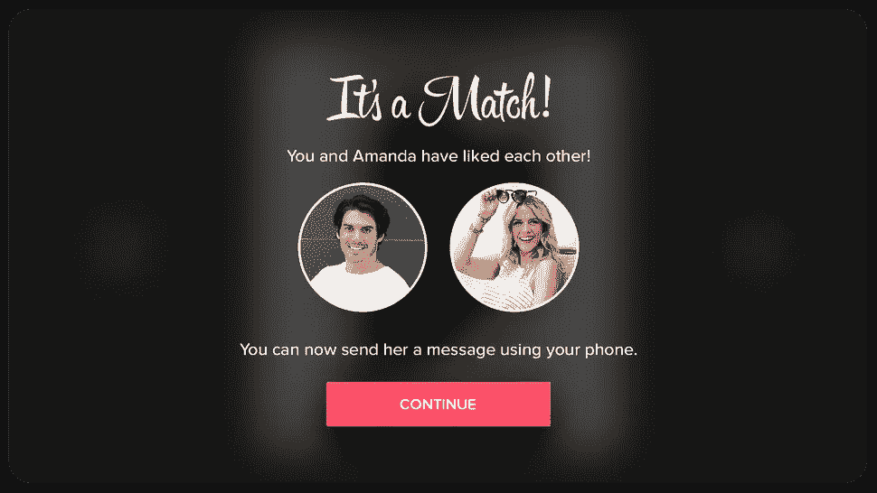

那是 2018 年 10 月 3 日星期三，我坐在联大数据科学课程的后排。我的导师刚刚提到，每个学生必须为数据科学项目提出两个想法，其中一个我必须在课程结束时向全班展示。我的大脑一片空白，这是一种被给予如此自由支配选择几乎任何东西的感觉。接下来的几天，我集中精力想出一个好的/有趣的项目。我为一个投资经理工作，所以我的第一个想法是去做一些与投资经理相关的事情，但后来我想到我每天花 9 个多小时在工作上，所以我不想我神圣的空闲时间也被工作相关的事情占用。

几天后，我在我的 WhatsApp 群组聊天中收到了以下消息:

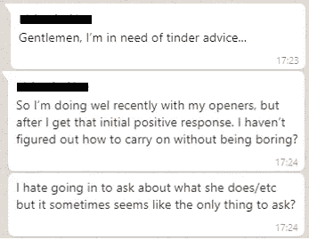

这引发了一个想法。如果我可以利用在课程中学到的数据科学和机器学习技能来增加 Tinder 上任何特定对话“成功”的可能性，会怎么样？于是，我的项目思路就形成了。下一步？告诉我女朋友…

Tinder 自己公布的一些 Tinder 事实:

*   该应用拥有约 5000 万用户，其中 1000 万人每天都在使用该应用
*   自 2012 年以来，Tinder 上已有超过 200 亿场比赛
*   该应用每天总共发生 16 亿次刷卡
*   普通用户每天花 35 分钟在这个应用上
*   由于这款应用，每周约有 150 万次约会

**问题 1:获取数据**

但是我如何得到数据来分析呢？出于显而易见的原因，用户的 Tinder 对话和比赛历史等。被安全地编码，因此除了用户之外没有人能看到它们。在谷歌搜索了一下之后，我看到了这篇文章:

 [## 我向 Tinder 要了我的数据。它寄给我 800 页我最深最黑暗的秘密

### 约会应用比我更了解我，但这些大量的隐私信息只是冰山一角。什么…

www.theguardian.com](https://www.theguardian.com/technology/2017/sep/26/tinder-personal-data-dating-app-messages-hacked-sold) 

这让我意识到，作为《信息自由法案》的一部分，Tinder 现在被迫建立一项服务，你可以从他们那里请求你自己的数据。提示,“下载数据”按钮:

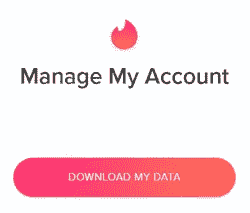

点击之后，你必须等待 2-3 个工作日，Tinder 才会给你发送一个下载数据文件的链接。我急切地等待着这封邮件，在我现在的关系之前，我已经是 Tinder 的狂热用户大约一年半了。我不知道我会有什么感觉，回头浏览这么多最终(或最终没有)失败的对话。

感觉过了一段时间后，电子邮件来了。数据(谢天谢地)是 JSON 格式的，所以快速下载并上传到 python 和 bosh，就可以访问我的整个网上约会历史。

**数据**

数据文件分为 7 个不同的部分:

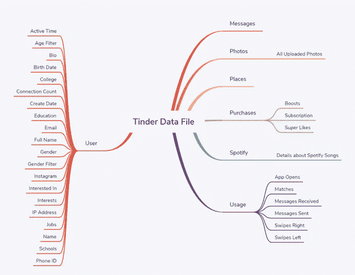

其中，只有两个对我真正有趣/有用:

*   信息
*   使用

进一步分析，“使用”文件包含关于“应用程序打开”、“匹配”、“收到的消息”、“发送的消息”、“向右滑动”和“向左滑动”的数据，而“消息文件”包含用户发送的所有消息，带有时间/日期戳，以及消息接收人的 ID。我敢肯定你可以想象，这导致一些相当有趣的阅读…

**问题 2:获取更多数据**

没错，我有自己的 Tinder 数据，但是为了让我得到的任何结果在统计上不完全无足轻重/严重偏颇，我需要得到其他人的数据。但是我该怎么做呢…

暗示一笔不小的乞讨金额。

奇迹般地，我设法说服了我的 8 个朋友给我他们的数据。他们从经验丰富的用户到偶尔“无聊时使用”的用户，这给了我一个合理的用户类型的横截面。最大的成功？我女朋友也给了我她的数据。

另一件棘手的事情是定义“成功”。我决定要么从另一方获得一个号码，要么两个用户去约会。然后，通过提问和分析，我将每一次对话分为成功或失败。

**问题 3:现在怎么办？**

是的，我已经得到了**更多的**数据，但是现在呢？数据科学课程侧重于 **Python** 中的数据科学和机器学习，因此将它导入 Python(我使用了 anaconda/Jupyter 笔记本)并清理它似乎是合乎逻辑的下一步。与任何一位数据科学家交谈，他们都会告诉你，清理数据是 a)他们工作中最乏味的部分，b)占据他们 80%时间的部分。清理是枯燥的，但对于从数据中提取有意义的结果也是至关重要的。

我创建了一个文件夹，将所有 9 个数据文件放入其中，然后编写一个小脚本循环遍历这些文件，将它们导入到环境中，并将每个 JSON 文件添加到一个字典中，关键字是每个人的名字。我还将“用法”数据和消息数据分成两个独立的字典，以便更容易对每个数据集分别进行分析。

**问题 4:不同的邮件地址导致不同的数据集**

当你注册 Tinder 时，绝大多数人使用他们的脸书账户登录，但更谨慎的人只使用他们的电子邮件地址。唉，我的数据集中有一个这样的人，这意味着我为他们准备了两套文件。这有点痛苦，但总的来说并不太难处理。

将数据导入字典后，我遍历 JSON 文件，将每个相关数据点提取到 pandas 数据帧中，如下所示:

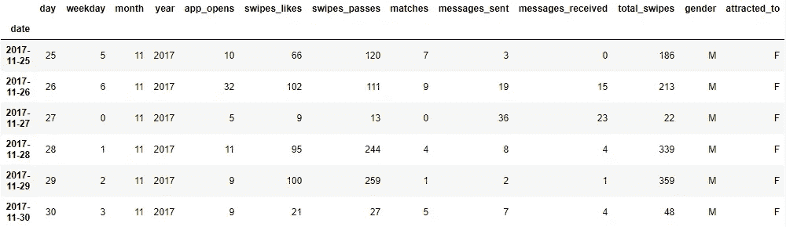

Usage Data with names removed

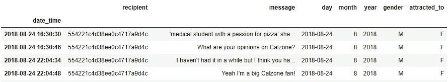

Message Data with names removed

在有人担心在上面的数据框架中包含 id 之前，Tinder 发表了这篇文章，指出除非你与用户匹配，否则不可能查找用户:

[https://www . help . Tinder . com/HC/en-us/articles/115003359366-Can-I-search-for-a-specific-person-on-Tinder-](https://www.help.tinder.com/hc/en-us/articles/115003359366-Can-I-search-for-a-specific-person-on-Tinder-)

既然数据的格式很好，我设法生成了一些高级汇总统计数据。数据集包含:

*   **2** 女孩
*   **7** 伙计们
*   **9** 参与者
*   **502** 一条消息对话
*   **1330** 独特的对话
*   6344 个匹配
*   收到 6750 条消息
*   发送了 8755 条消息
*   **34233**app 打开
*   **94027**右刷卡
*   **403149**左刷卡

太好了，我有大量的数据，但我还没有真正花时间去思考最终产品会是什么样子。最后，我决定最终产品将是一份如何提高网上约会成功率的建议清单。

因此，有了格式良好的数据，探索就可以开始了！

**探险**

我开始查看“使用”数据，一次一个人，纯粹是出于好奇。为此，我绘制了一些图表，从简单的汇总指标图开始，如下所示:

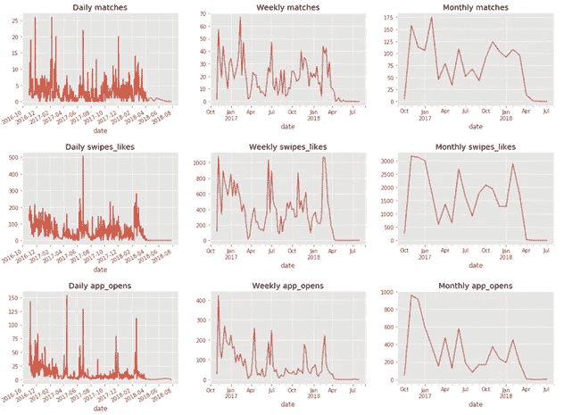

到更复杂的衍生指标图，如名副其实的“忠诚度图”，如下所示:

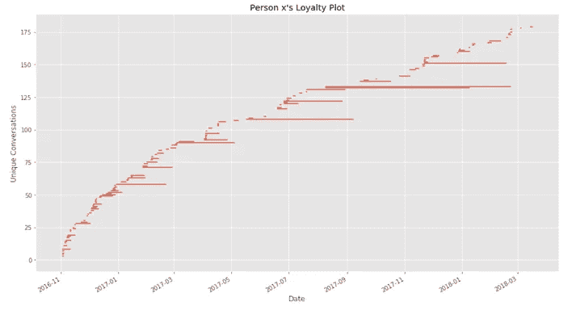

第一个图表是相当自明的，但第二个可能需要一些解释。实际上，每一行/水平线代表一个唯一的会话，每行的开始日期是会话中发送的第一条消息的日期，结束日期是会话中发送的最后一条消息的日期。这个计划的想法是试图了解人们如何使用该应用程序同时给多个人发送消息。

虽然有趣，但我真的没有看到任何明显的趋势或模式，我可以进一步询问，所以我转向聚合“使用”数据。我最初开始查看按用户划分的各种指标，试图确定任何高级趋势:

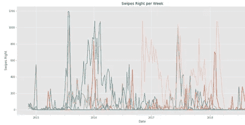

但是没有什么立即引起注意。

然后，我决定更深入地研究消息数据，如前所述，这些数据带有一个方便的时间戳。按照一周中的每一天和一天中的每一个小时来合计邮件数量后，我意识到我偶然发现了我的第一个推荐。

# **第一个推荐:**

周日晚上 9 点是“打火”的最佳时间，下面显示的是我的样本中发送邮件量最大的时间/日期。

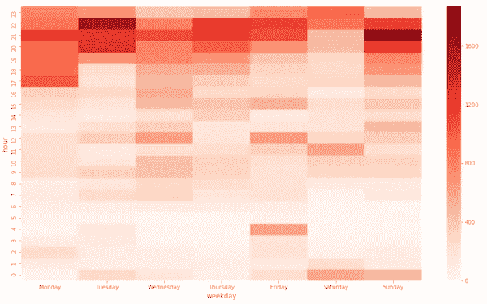

在这里，我用发送的消息量来代表每次在线用户的数量，所以这次的“Tindering”将确保你拥有最大的受众。

然后，我开始从单词和字母的角度来看信息的长度，以及每次对话的信息数量。最初，你可以在下面看到没有太多突出的东西……(这里“成功”是红色的)

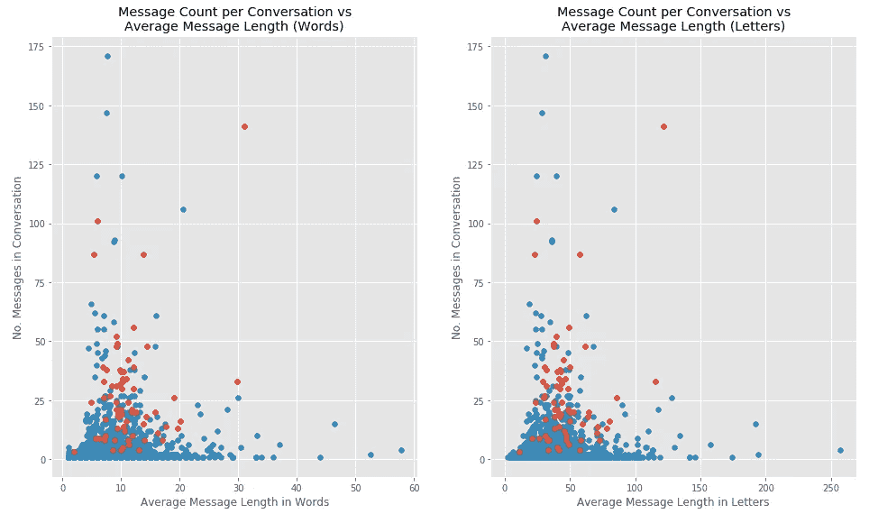

但是一旦你开始挖掘，有几个明显的趋势:

*   较长的信息更有可能获得成功(在一定程度上)
*   发现“成功”的平均对话消息数为 27 条，中位数为 21 条。

这些观察导致我的第**第二**和第**第三个建议**。

# **第二个推荐:**

花更多的时间来构建你的信息，看在上帝的份上，不要用短信……一般来说，越长的单词越好。这里需要注意的是，数据包含了链接**，这些链接被算作长单词，所以这可能会扭曲结果。**

# ****第三个推荐:****

**当试图得到一个数字时，不要太匆忙。**“嘿，你好，你的号码是多少”**就你的机会而言，这可能是你能说的最糟糕的话。同样的，不要放太久。你的第 20 到第 30 条信息是最好的。**

**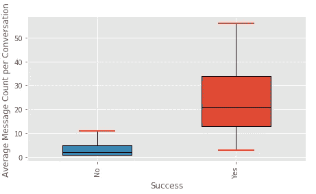**

**Average message count of successful vs un-successful conversations**

**在广泛研究了单词/信息/对话的长度之后，我决定研究情绪。但是我完全不知道该怎么做。在这个过程中，我们已经涉及了一些自然语言处理(单词包，一个热编码，所有需要的预处理等)。以及各种分类算法)，但没有涉及情感。我花了一些时间研究这个话题，发现**nltk sensitivity . Vader sentimentintensitiyanalyzer**会是一个很好的口号。**

**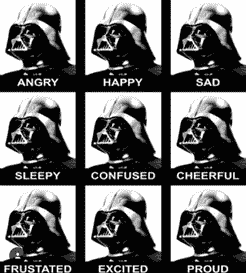**

**这通过给用户四个分数来实现，基于输入文本的百分比:**

*   **积极的**
*   **中立的**
*   **否定的；消极的；负面的；负的**
*   **三者的结合**

**幸运的是，它还处理诸如单词上下文、俚语甚至表情符号之类的东西。当我查看情感时，没有做任何预处理(小写，删除标点符号等)。)以便不移除任何隐藏的上下文。**

**我通过将每个完整的对话输入分析器来开始这一分析，但很快意识到这并不真正有效，因为在最初的几条消息后，对话情绪很快倾向于 1，我很难相信 100 条消息的对话在整个时间中都是 100%有信心的。**

**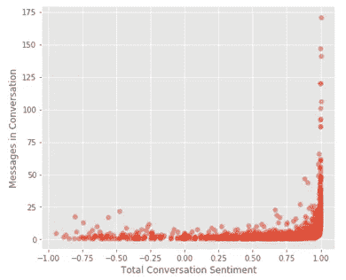**

**然后，我将这些对话分解成组成它们的信息，一次输入一条，将分数平均到对话水平。在我看来，这产生了一个更加现实的结果:**

**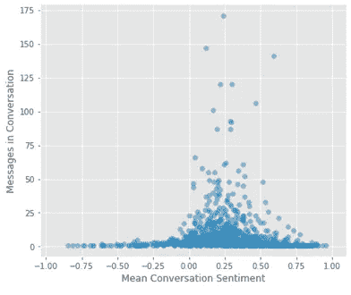**

**将这些数据分为“成功”或“不成功”，我很快发现了一个模式:**

**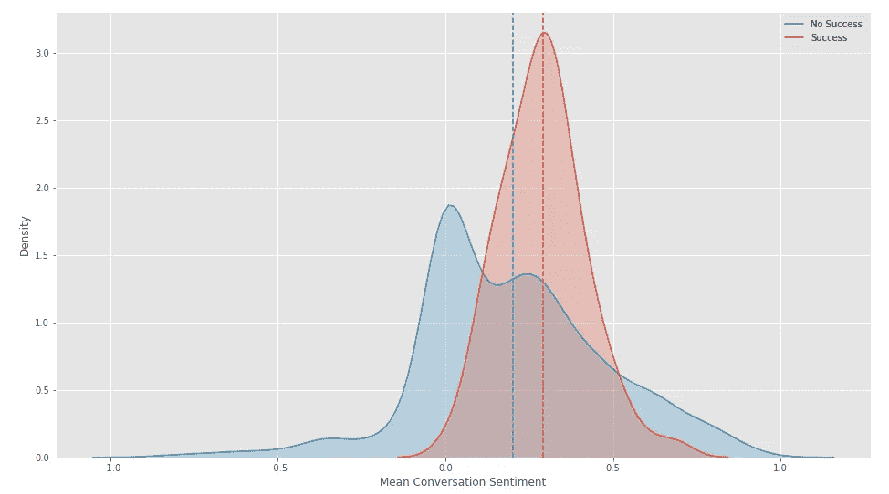**

**这个球座提升了我的第四个推荐。**

# ****第四个推荐:****

**要积极，但不要太积极。**

****

**成功对话的平均情绪是 0.31，而不成功对话的平均情绪是 0.20。话虽如此，过于积极几乎和过于消极一样糟糕。**

**我探索的最后一个问题是关于第一条信息的各种细节对对话成功的影响。对可能产生影响的事情的最初想法是:**

*   **长度**
*   **是否使用了名称**
*   **感情**
*   **表情符号的存在**
*   **明确的内容**

**正如所料，第一条信息越长，对话继续“成功”的可能性就越大。作为延伸，你不仅仅使用一个单词开头，例如不仅仅说“嘿”、“嗨”或“daayyuumm”(真实的例子)，你成功的概率会加倍。**

**更令人惊讶的是，在第一条消息中使用一个**名字**对“成功率”几乎没有影响。**

**第一条信息**情绪**结果是“成功的”对话比“不成功的”对话高大约 0.09，这并不令人惊讶……如果你在第一条信息中侮辱某人，直觉上他们不太可能回复。**

**分析**表情符号**是一项我没有真正想过的任务，可能会很棘手。幸运的是，有一个名为“表情符号”的包，它可以自动识别文本中的表情符号。不幸的是，令我沮丧的是，在第一条信息中使用表情符号似乎增加了一个人获得“成功”的可能性。**

****

**现在到**显式内容** …另一个可能相当棘手的问题，因为没有内置的库可以使用脏话等。(据我所知)。幸运的是我偶然发现了这个:**

**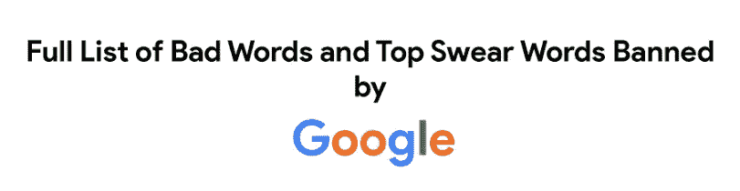**

**我可以向你保证，里面有一些绝对的饼干。**

**然后，我查看哪些第一条消息包含这个列表中的单词，其中 40 条包含。像往常一样，我发现了一些有趣的边缘案例:**

**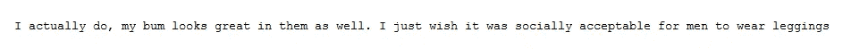**

**仅供参考，这是一个家伙在谈论他的划船紧身裤…**

**结果？事实证明，包含明确内容的第一条消息没有一条会导致“成功”**

**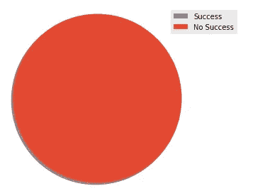**

**这让我想到了我的第五个也是最后一个建议。**

# ****第五个推荐:****

**发送第一条消息时:**

*   **积极**
*   **8 个单词是最佳的**
*   **使用一两个表情符号**
*   **不要太露骨**

# ****所以总结一下****

1.  **在周日晚上 9 点使用 Tinder 可以获得最多的观众**
2.  **花时间构建信息，不要使用短信**
3.  **准备在第 20 条和第 30 条信息之间询问一个数字或日期**
4.  **要积极，但不要太积极**
5.  **发送除了“嘿”之外的其他信息作为第一条信息，目标是大约 8 个单词，也许使用表情符号，不要太露骨**

# ****数据的几个陷阱:****

1.  **我的数据集是一个非常非常小的样本，这使得大部分见解变得毫无用处**
2.  **该数据集偏向于我所知道的那类人，也偏向于男性**
3.  **数据集只包含对话的一方**
4.  **由于用户卸载和重新安装应用程序，消息和使用统计数据不一定一致**
5.  **由于人们说话方式的讽刺/变化，没有一种自然语言处理技术是完美的**

# ****对未来工作的几点想法:****

*   **收集更多数据**
*   **做更多的工作来确定具有统计意义的结果和观察结果**
*   **根据话题进行对话分析——什么类型的信息构成了好的和坏的情绪**
*   **试着调查讽刺**
*   **调查其他应用程序(Bumble、Hinge 等)。)**
*   **如果有更多的数据的话，可以进行一些分类分析，因为我们只有大约 70 次成功**
*   **如果包含更多的数据，请更多地研究性别差异**

# ****来自数据的一些有趣的仿真陈述:****

*   **单人单日最多刷卡次数:8096 次**
*   **男人更有可能在发送第二条信息之前离开很长时间(大约 7 天)**
*   **在第一条信息中提问实际上会降低你成功的几率**
*   **女性平均有 1%的时间向右滑动，而男性大约有 50%的时间向右滑动**
*   **每打开一个应用，女性刷卡次数是男性的 3 倍**

# ****延伸阅读:****

*   **一篇名为“Tinder 用户活动初步观察”的论文发表了**
*   **有一个 **Tinder API** ，但不幸的是，它只针对使用该应用的人，而不是提供某种数据库的访问权限。无论如何，用它来测试某些假设会很有趣。**
*   ****Tinderbox** 是一款软件，可以通过降维来了解你被谁吸引。如果你真的想自动化这个过程，它还有一个内置的聊天机器人…**

**感谢您的阅读，对未来工作的任何想法都将不胜感激！**