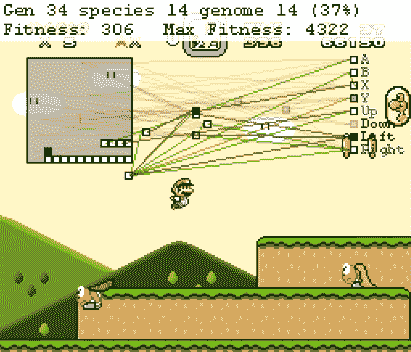

# 我的手是人工智能

> 原文：<https://towardsdatascience.com/my-hand-is-pretty-cool-48373b5dc37a?source=collection_archive---------26----------------------->

## 这也是一手相当酷的牌。

看看这个:

My hand!

是我的手。很漂亮的手，不是吗？

现在看看后面:

Don’t be fooled, it’s the same hand, it’s just that it’s been turned around.

很酷吧。

这是一个非常简单的工具:它由五个手指组成，其中一个是拇指。然而，这是一个非常有用的工具。我可以用它做各种事情！

我可以用手弹吉他。

我可以用手拿着一杯啤酒。

我能用我的手写文章。

My hand pretending to write a note.

我能用手烹饪食物。

我能用手开车。

我可以用手玩电子游戏。

My hand picking the best stage in Super Smash Bros.

只要由我的大脑提供动力，我的手就可以用来做各种各样的事情。因此，我的手是一个通用算法的例子，或者，正如行话 biz 中的人们喜欢称之为“通用 AI”。

Told you my hand was cool.

“人工智能”这个术语有无数种定义。对人工智能进行分类的许多方法之一是通过术语“通用人工智能”和“模块化人工智能”。通用人工智能是一种能够执行非常广泛的任务的工具，而模块化人工智能是为一个非常特定的目的而制造的。例如，你可能在好莱坞电影中看到的大多数人工智能都是一般人工智能的例子:无论是终结者*、*中的人工智能还是 *I 中的机器人，机器人。他们通常看起来或行动起来像人类，并且能够做人类能够做的大多数事情，通常更强、更好、更快。***

*好吧。所以艾将军还是挺利索的。*

*我们应该把它放在电脑里。*

**

*My hand, inside of a computer. Tricked ya! It’s not actually inside of the computer, it’s just a photo of my hand displayed on a computer screen.*

*没人知道怎么做。*

**

*How do we get Jacob’s cool hand inside of a computer?*

*关于艾将军的书不计其数。许多演讲者、许多播客和许多出版物已经讨论并继续讨论这种形式的人工智能，以及它不仅对企业，而且对整个社会的影响，然而人造的通用人工智能实际上并不存在。*

*嗯。*

*那我的手是怎么创造出来的？*

# *进化>我的手>人类算法*

*我的手，顺便说一下，还有我的其余部分，是由进化创造的。你可能以前没想过，进化其实就是一种算法。它是世界上运行时间最长的已知算法，并且运行在最强大的系统上:我们的星球。就像软件在电脑上运行，我的手在大脑上运行一样，进化在地球上运行。*

*进化论也是机器学习(AI 的一个子类)的五个主要流派之一，其他四个分别是符号主义者(逻辑学家)、连接主义者(神经科学家)、贝叶斯主义者(统计学家)和类比主义者(相似性理论家)。*

**

*我们已经知道如何模仿进化。例如，我们可以将进化论应用于经典视频游戏《超级马里奥兄弟》。在这款游戏中，玩家控制着马里奥，试图尽可能地靠近屏幕右侧，克服途中的各种障碍。如果你要训练一个人工智能尽可能有效地击败超级马里奥兄弟，进化论将是一个可以采用的完美算法。产生 100 个不同的马里欧，每个都有一些不同的变量(统计)，看看谁能做到最右边。获胜者可以再生育 100 个 Mario——第二代——每一个都继承了获胜者略微改变的 DNA，直到你创造出完美的 Mario。在计算机中使用进化的另一个更实际的例子是垃圾邮件过滤器的创建。许多垃圾邮件过滤器使用基于进化论的算法，其中表示垃圾邮件的单词被配对以产生子术语。*

**

*AI learning to play Super Mario Bros. The current generation is listed in the upper left corner. Made by [SethBling](https://twitter.com/sethbling), reported through [Max Plenke](https://www.mic.com/articles/120657/this-computer-learned-super-mario-from-scratch-and-now-it-can-kick-your-ass).*

*不管怎样，回到超级马里奥兄弟的例子，我们创造的完美马里奥仍然是模块化人工智能的一个例子。他唯一擅长的就是玩超级马里奥兄弟，他唯一的技能就是能够从左往右走而不被障碍物绊倒。*

*然而，至少在理论上，进化*可以被用来创造一种通用算法，就像机器学习的其他四个学派一样。但是它非常复杂。这需要大量的训练，以及明确定义的程序和流程。更重要的是:它需要一个实际的商业案例。**

# *我手里的公文包*

*人工智能是个时髦词。它可能意味着任何事情。但是当你看到今天存在的声称使用“人工智能技术”的实际应用时，他们总是使用某种形式的模块化人工智能。它们是为一个非常特殊的目的而建造的。这就像一只专门为弹钢琴而造的手。*

*不仅仅是一般的 AI 很难建立，而且也很难证明它的商业价值。在创建人工智能解决方案时，通常最好先制作滑板，然后是踏板车，接下来是自行车，然后是摩托车，然后是汽车，而不是直接制作复杂汽车的各种组件。同样，创造一只擅长做一件事的手有更强的商业理由。您可以看到更清晰的投资回报，并且在销售解决方案时，您有更强的说服力。客户不想要一个庞大的、全面的、难以消化的解决方案，他们想要一个解决他们眼前具体问题的方案。*

**

*One of the reasons why my hand hasn’t been put in a computer, is that the business case for hands made for a specific purpose simply has a stronger business case than a hand that can do everything. Photo by [Helloquence](https://unsplash.com/@helloquence?utm_source=unsplash&utm_medium=referral&utm_content=creditCopyText).*

*然而，许多伟大的思想家和工程师正在讨论和构建与我的手非常相似的通用人工智能。一些人认为通用算法会非常复杂，可能会有数百万行代码。其他人则持相反的观点，认为通用算法实际上只需要几百行代码。*

*我的手就是一个很好的例子。如果数据模型和数据足够强大，强大的算法可能会变得异常简单。*

*就像我冰凉的手。*

**

*Wait… You guys have hands too? Photo by [William White](https://unsplash.com/@wrwhite3?utm_source=unsplash&utm_medium=referral&utm_content=creditCopyText).*

**对人工智能感兴趣？这里还有一些你可能会喜欢的文章。**

* [## 谁是终结者？

### Deepfakes 将成为人类的巨大威胁，AI 创造 deepfakes 和 AI 检测 deepfakes 的竞赛…

medium.com](https://medium.com/swlh/who-is-the-terminator-c5135890651b)  [## 人工智能如何让你成为总统

### 对于那些想要获得更高权力的政治家来说，理解人为的…

towardsdatascience.com](/how-ai-can-make-you-the-president-4756f6b1c0c0)*